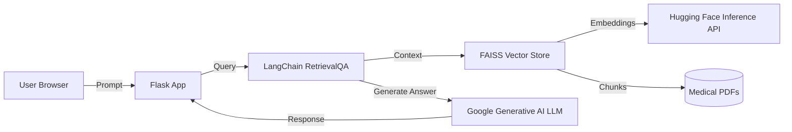

# Medical RAG Chatbot

A production-ready Retrieval Augmented Generation (RAG) assistant that answers medical questions from a curated PDF knowledge base. The project combines a lightweight Flask UI, LangChain orchestration, FAISS vector search, and Google Generative AI to deliver grounded, concise responses that remain faithful to the supplied documents.

> **Credits:** Adapted from [data-guru0/RAG-MEDICAL-CHATBOT](https://github.com/data-guru0/RAG-MEDICAL-CHATBOT) and extended with infrastructure, deployment, and observability improvements.

## ✨ Standout Capabilities
- **Retrieval-Augmented Responses:** Documents are chunked, embedded with Hugging Face Inference API, and indexed in FAISS to ensure medically grounded answers.
- **Google Generative AI LLM:** Uses `ChatGoogleGenerativeAI` with a custom prompt that constrains output to 2–3 lines per answer.
- **Production-Grade Guardrails:** Prompt templates, output length controls, and defensive exception handling keep responses safe and auditable.
- **Automated Data Pipeline:** `data_loader.py` ingests PDFs, generates embeddings, and persists the vector store for fast retrieval.
- **Platform Integrations:** Docker, Kubernetes, and Jenkins artifacts make the solution plug-and-play inside enterprise delivery pipelines.

## 🧠 System Architecture


## 🗂️ Project Structure
```
Medical-RAG-Chatbot/
├── data/                         # Drop your medical PDFs here
├── src/
│   └── app/
│       ├── application.py        # Flask entry point
│       ├── components/           # RAG pipeline building blocks
│       ├── common/               # Logging & exception helpers
│       ├── config/               # Global configuration
│       └── templates/            # Web UI templates
├── docker-entrypoint.sh          # Container startup script (ingest + serve)
├── Dockerfile                    # Production-ready Python 3.10 image
├── k8s.yaml                      # Kubernetes Deployment & Service
├── Jenkinsfile                   # Declarative CI/CD pipeline
├── pyproject.toml                # Packaging metadata
└── requirements.txt              # Python dependencies
```

## 🧩 End-to-End MLOps Blueprint
The repository demonstrates how to productionize a domain-specific RAG assistant under regulated conditions. Highlights include:

| Lifecycle Stage | Capabilities | Tooling & Artifacts |
| --- | --- | --- |
| **Data Management** | Automated ingestion of curated PDFs, deterministic chunking, semantic versioning of vector stores via artifact hashes. | `data_loader.py`, `src/app/config/vectorstore`, GitHub Releases/registry of embeddings. |
| **Feature & Model Tracking** | Prompt templates, embedding configs, and retrieval parameters stored alongside code for reproducibility. Future-ready for MLflow/W&B integration. | `src/app/config`, `.env` secrets, Jenkins environment promotion variables. |
| **CI/CD Automation** | Jenkins pipeline builds, runs unit/integration tests, bakes Docker images, and pushes manifests to artifact registries. | `Jenkinsfile`, `Dockerfile`, `docker-entrypoint.sh`. |
| **Continuous Delivery** | Kubernetes manifest with readiness probes, resource limits, and secret mounting ensures consistent rollouts across environments. | `k8s.yaml`, Helm/ArgoCD friendly structure. |
| **Observability** | Structured logging, configurable log retention, hooks for OpenTelemetry exporters, and health endpoints for SLO tracking. | `src/app/common/logger.py`, `MLops-Common` package. |
| **Responsible AI** | Guardrails limit hallucinations, track provenance, and restrict outputs to curated content—critical for medical compliance. | Prompt design, retrieval constraints, auditing hooks. |

## 🔄 Model & Data Operations
- **Embedding Refresh Workflow:** Schedule the ingestion script as a Jenkins job or Airflow DAG. Emit checksums so downstream services can detect drift before promoting a new index.
- **Blue/Green Vector Stores:** Store the previous FAISS index in object storage. During deployments, mount the new index as `green` while `blue` remains active. Flip the traffic switch only after automated regression tests pass.
- **Prompt & Retrieval Experiments:** Parameterize `k` (top chunks), temperature, and prompt scaffolding through environment variables or feature flags. Capture results in an experiment tracker to inform promotion decisions.
- **Document Lineage:** Tag each PDF with metadata (publish date, specialty, approval owner). Log lineage for each response to provide patient-safe justification trails.

## 🤖 Testing & Evaluation Strategy
- **Unit & Contract Tests:** Extend the Jenkins pipeline with pytest suites that validate ingestion, embedding shape, and retriever outputs against golden samples.
- **Automated RAG Benchmarks:** Introduce evaluation notebooks that run question-answer sets through the pipeline, scoring factuality, completeness, and citation accuracy. Publish the metrics as build artifacts.
- **Shadow Deployments:** Mirror production traffic to a staging environment to evaluate new embeddings or prompts without end-user exposure. Compare responses using diff tooling and guardrail heuristics.

## 🪝 Observability & Incident Response
- **Telemetry Stack:** Ship application logs and structured inference traces to a centralized platform (ELK, OpenSearch, or Stackdriver). Leverage the `MLops-Common` helpers for consistent log formats.
- **Proactive Monitoring:** Define SLOs for latency, retrieval hit-rate, and medical compliance (e.g., percentage of responses citing the knowledge base). Hook alerts into PagerDuty/Slack when thresholds are breached.
- **Incident Playbooks:** Version controlled runbooks describe how to rollback to the last known-good vector store, rotate API keys, and triage hallucination reports.

## 🧭 Governance & Compliance
- **Access Controls:** Secrets are injected via Kubernetes secrets or vault integrations. Enforce IAM policies so only approved operators can trigger retraining or deploy new indexes.
- **Auditability:** Persist conversation logs (with consent) and attach the serving prompt, embeddings version, and model build to each request for audit trails.
- **Regulatory Alignment:** Align with HIPAA/GDPR by configuring data retention policies, anonymizing logs, and enabling user data deletion workflows.

## 🚀 Scaling the Platform
- **Multi-Region Footprint:** Deploy replicas across regions with shared object storage for vector stores. Use global load balancing to route users to the lowest-latency cluster.
- **Hardware Acceleration:** Swap embedding inference to managed GPU services or quantized models for cost-performance optimization. Document the promotion process and benchmark thresholds in the CI pipeline.
- **Feature Roadmap:** Integrate automated evaluation harnesses, real-time feedback loops, and clinician-in-the-loop review dashboards to continuously raise answer quality.

## 📚 Further Reading
- [LangChain Documentation](https://python.langchain.com)
- [Google Generative AI API](https://ai.google.dev/)
- [Hugging Face Inference Endpoints](https://huggingface.co/inference-endpoints)
- [MLOps Maturity Model (Google Cloud)](https://cloud.google.com/architecture/mlops-continuous-delivery-and-automation-pipelines-in-machine-learning)
- [NIST RMF for AI](https://airc.nist.gov/) for safety & governance guidance

---
This README showcases how the project translates modern MLOps practices—automated ingestion, reproducible retrieval, governed deployments, and responsible monitoring—into a production-ready medical assistant.
