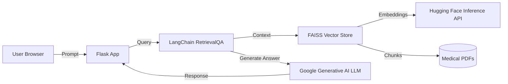

# Medical RAG Chatbot

A production-ready Retrieval Augmented Generation (RAG) assistant that answers medical questions from a curated PDF knowledge base. The project combines a lightweight Flask UI, LangChain orchestration, FAISS vector search, and Google Generative AI to deliver grounded, concise responses that remain faithful to the supplied documents.

> **Credits:** Adapted from [data-guru0/RAG-MEDICAL-CHATBOT](https://github.com/data-guru0/RAG-MEDICAL-CHATBOT) and extended with infrastructure, deployment, and observability improvements.

## ✨ Standout Capabilities
- **Retrieval-Augmented Responses:** Documents are chunked, embedded with Hugging Face Inference API, and indexed in FAISS to ensure medically grounded answers.
- **Google Generative AI LLM:** Uses `ChatGoogleGenerativeAI` with a custom prompt that constrains output to 2–3 lines per answer.
- **Production-Grade Guardrails:** Prompt templates, output length controls, and defensive exception handling keep responses safe and auditable.
- **Automated Data Pipeline:** `data_loader.py` ingests PDFs, generates embeddings, and persists the vector store for fast retrieval.
- **Platform Integrations:** Docker, Kubernetes, and Jenkins artifacts make the solution plug-and-play inside enterprise delivery pipelines.

## 🧠 System Architecture


### Secret creation script (`create-secret.sh`)
```bash
kubectl create namespace medical-rag-chatbot
kubectl create secret generic medical-rag-chatbot-secret \
    --from-literal=GOOGLE_API_KEY="$GOOGLE_API_KEY" \
    --from-literal=HUGGINGFACEHUB_API_TOKEN="$HUGGINGFACEHUB_API_TOKEN" \
    -n medical-rag-chatbot \
    --dry-run=client -o yaml | kubectl apply -f -
```
> The app `Deployment` uses `envFrom.secretRef.name: medical-rag-chatbot-secrets` to load these values.


## 🧩 End-to-End MLOps Blueprint
The repository demonstrates how to productionize a domain-specific RAG assistant under regulated conditions. Highlights include:

| Lifecycle Stage | Capabilities | Tooling & Artifacts |
| --- | --- | --- |
| **Data Management** | Automated ingestion of curated PDFs, deterministic chunking, semantic versioning of vector stores via artifact hashes. | `data_loader.py`, `src/app/config/vectorstore`, GitHub Releases/registry of embeddings. |
| **Feature & Model Tracking** | Prompt templates, embedding configs, and retrieval parameters stored alongside code for reproducibility. Future-ready for MLflow/W&B integration. | `src/app/config`, `.env` secrets, Jenkins environment promotion variables. |
| **CI/CD Automation** | Jenkins pipeline builds, runs unit/integration tests, bakes Docker images, and pushes manifests to artifact registries. | `Jenkinsfile`, `Dockerfile`, `docker-entrypoint.sh`. |
| **Continuous Delivery** | Kubernetes manifest with readiness probes, resource limits, and secret mounting ensures consistent rollouts across environments. | `k8s.yaml`, Helm friendly structure. |
| **Observability** | Structured logging, configurable log retention, hooks for OpenTelemetry exporters, and health endpoints for SLO tracking. | `src/app/common/logger.py`, `MLops-Common` package. |
| **Responsible AI** | Guardrails limit hallucinations, track provenance, and restrict outputs to curated content—critical for medical compliance. | Prompt design, retrieval constraints, auditing hooks. |

## 🔄 Model & Data Operations
- **Embedding Refresh Workflow:** Schedule the ingestion script as a Jenkins job or Airflow DAG. Emit checksums so downstream services can detect drift before promoting a new index.
- **Blue/Green Vector Stores:** Store the previous FAISS index in object storage. During deployments, mount the new index as `green` while `blue` remains active. Flip the traffic switch only after automated regression tests pass.
- **Prompt & Retrieval Experiments:** Parameterize `k` (top chunks), temperature, and prompt scaffolding through environment variables or feature flags. Capture results in an experiment tracker to inform promotion decisions.
- **Document Lineage:** Tag each PDF with metadata (publish date, specialty, approval owner). Log lineage for each response to provide patient-safe justification trails.

---
This README showcases how the project translates modern MLOps practices—automated ingestion, reproducible retrieval, governed deployments, and responsible monitoring—into a production-ready medical assistant.
