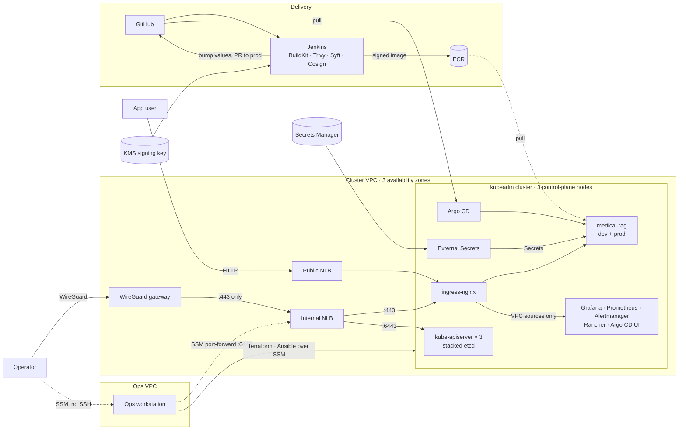

# Medical RAG Chatbot on self-managed Kubernetes

**Highly available Kubernetes on bare EC2: Terraform, Ansible over SSM, GitOps. A RAG chatbot is the workload.**


- **No SSH, no AWS access keys, nothing on the laptop but git, an editor and WireGuard.** Machines are
  reached through SSM Session Manager, act with instance roles, and are operated from a workstation in AWS.
- **Git is the control plane.** After bootstrap, every change inside the cluster is a commit, and every
  admin UI is reachable only over WireGuard.
- **Rebuilt in under 10 minutes, torn down after every session.** About 0.53 USD/hour while it runs.

## By the numbers

- **Empty cluster stack → 3 Ready control planes in [9 m 57 s](docs/evidence/ansible.md#rebuild-from-nothing):**
  84 AWS resources in 3 m 47 s, then the cluster in 6 m 10 s.
- **Idempotent:** [`terraform plan` → No changes](docs/evidence/terraform.md#reproducibility) after apply; a
  second Ansible run → [`changed=0` on every host](docs/evidence/ansible.md#rebuild-from-nothing) in 2 m 56 s.
- **Loses a node, keeps the API:** a control plane stopped mid-session and the Kubernetes API
  [kept answering](docs/evidence/ansible.md#ha-drill); the node rejoined on boot without a playbook run.
- **Infrastructure destroyed in 2 m 15 s.** 0.53 USD/hour while up (cluster + VPN gateway), about 7 USD/month
  kept for the registry, keys, DNS and the stopped workstation ([cost](docs/evidence/terraform.md#cost)).
- **Container 926 → 483 MB (−48%)**, 22 tests, non-root with a read-only filesystem ([local evidence](docs/evidence/local.md)).
- **7,079-chunk index with a content-hashed version**, identical in a container and on the host; an
  unchanged corpus [skips the rebuild in < 1 s](docs/evidence/local.md#index-artifact).

## Architecture


```mermaid
flowchart LR
    USER["App user"]
    OP["Operator"]

    subgraph OPSVPC["Ops VPC"]
        WS["Ops workstation"]
    end

    subgraph VPC["Cluster VPC · 3 availability zones"]
        PNLB["Public NLB"]
        VPN["WireGuard gateway"]
        INLB["Internal NLB"]
        subgraph K8S["kubeadm cluster · 3 control-plane nodes"]
            API["kube-apiserver × 3<br/>stacked etcd"]
            ING["ingress-nginx"]
            APP["medical-rag<br/>dev + prod"]
            UIS["Grafana · Prometheus · Alertmanager<br/>Rancher · Argo CD UI"]
            ARGO["Argo CD"]
            ESO["External Secrets"]
        end
    end

    subgraph DELIVERY["Delivery"]
        GIT["GitHub"]
        JK["Jenkins<br/>BuildKit · Trivy · Syft · Cosign"]
        ECR[("ECR")]
    end

    SM[("Secrets Manager")]
    KMS[("KMS signing key")]

    USER -->|"HTTP"| PNLB --> ING
    OP -->|"WireGuard"| VPN -->|":443 only"| INLB
    OP -.->|"SSM, no SSH"| WS
    INLB -->|":443"| ING
    WS -.->|"SSM port-forward :6443"| INLB
    INLB -->|":6443"| API
    WS -->|"Terraform · Ansible over SSM"| K8S
    ING --> APP
    ING -->|"VPC sources only"| UIS
    GIT --> JK -->|"signed image"| ECR
    JK -->|"bump values, PR to prod"| GIT
    KMS --> JK
    GIT -->|"pull"| ARGO --> APP
    ECR -.->|"pull"| APP
    SM --> ESO -->|"Secrets"| APP
```

Terraform builds the AWS side in three stacks split by lifetime, and Ansible turns three bare Ubuntu
machines into the cluster over SSM. Argo CD installs everything else from Git. A commit becomes a
tested, scanned and signed image that reaches `dev` automatically and `prod` through a reviewed pull
request. Details: [design](docs/selfmanaged-k8s-ops-design.md#3-architecture).

## Stack, and why

| Layer | Choice | Why this, not the obvious alternative |
|---|---|---|
| Cluster | kubeadm on EC2, built by Ansible over SSM | Instead of EKS: etcd, the control plane and upgrades are ours to run and prove. Agentless, second run `changed=0` |
| Access | SSM Session Manager; WireGuard, internal NLB and an ingress allowlist | No SSH keys, no bastion, no inbound ports; no admin UI has a public listener |
| IaC | Terraform, 3 stacks by lifetime, S3 native lock | The cluster is destroyed after each session without touching images, keys or the index; no DynamoDB lock table |
| Pod network | Calico VXLAN | The nodes sit in three subnets, one per zone; VXLAN crosses them unchanged over UDP 4789 |
| Delivery | Argo CD, self-managed app-of-apps | Git is the record, drift is repaired, and Argo CD upgrades itself from a commit |
| Secrets and TLS | External Secrets + Secrets Manager; cert-manager DNS-01 wildcard, backed up | No secret value in Git or state; certificates for private names that survive rebuilds within Let's Encrypt's weekly limit |
| Observability | kube-prometheus-stack, Alertmanager email | Scrapes etcd and the control plane, which a managed service hides |
| Supply chain | Jenkins, rootless BuildKit, Trivy, Syft, Cosign on KMS, Kyverno | Kaniko is archived; the key never leaves KMS; prod admits only signed images ([design](docs/selfmanaged-k8s-ops-design.md#45-ci-pipeline-jenkins-jenkinsfile)) |

**Workload:** Flask on gunicorn, LangChain, FAISS and Gemini. The index is a versioned artifact in S3,
and `/readyz` and `/metrics` feed Kubernetes and Prometheus.

## Found and fixed

- **One node never appeared in SSM** although its status checks were green. Its console output showed
  the agent failing to get instance-role credentials at boot; a reboot registered it.
  [→](docs/evidence/ansible.md#problems-found-and-fixed-during-this-phase)
- **`crictl: not found` on every node.** `kubeadm` no longer depends on `cri-tools`, so the role now
  pins and installs it explicitly. [→](docs/evidence/ansible.md#problems-found-and-fixed-during-this-phase)
- **PyPI crawled inside Docker.** The IPv4 route to the CDN was congested (2.1 MB in 11–20 s vs 0.45 s
  over IPv6), and containers had only ULA IPv6, which glibc ranks below IPv4. Giving Docker a
  non-ULA IPv6 prefix brought it to 0.41 s. [→](docs/evidence/local.md#environment-issue-found-while-verifying-not-a-code-defect)

## Trade-offs, on purpose

- **One NAT gateway**, not three: a cost choice, documented as a single point of failure.
- **Every pod shares its node's instance role.** A self-managed cluster has no IRSA, so each permission is scoped to exact resources.
- **`m7i-flex` nodes**, forced by the AWS Free plan. Their CPU burst runs out silently, so an alert watches sustained CPU.
- **ingress-nginx is retired upstream** and kept knowingly; a maintained controller can take over the same NodePorts.
- **The ops workstation holds admin rights.** It has no inbound ports, requires IMDSv2 and is stopped when idle.

All risks and decisions: [design §10](docs/selfmanaged-k8s-ops-design.md#10-risks) and [§11](docs/selfmanaged-k8s-ops-design.md#11-resolved-decisions).

## Run it

**The app, locally** (Docker with Compose):
```bash
cp .env.example .env        # GOOGLE_API_KEY, HUGGINGFACEHUB_API_TOKEN, FLASK_SECRET_KEY
docker compose up --build   # builds the index once, then serves http://localhost:8000
```

**The cluster, on AWS** (from the ops workstation):
```bash
make shared                 # once: registry, signing key, secrets, DNS zone, budget
make infra                  # network, nodes, load balancers, VPN gateway
make ansible-deps           # once per workstation
make cluster                # HA kubeadm cluster over SSM
make tunnel                 # kubectl through SSM, in a second window
```
Argo CD, the release path and teardown with `make down` are in the **[runbook](docs/runbook.md)**.

## Docs

| Area | Architecture | Step-by-step | Interview Q&A (Vietnamese) |
|---|---|---|---|
| AWS with Terraform | [README](docs/terraform/README.md) | [guide](docs/terraform/guide.md) | [questions](docs/terraform/questions.md) · [answers](docs/terraform/answers.md) |
| Cluster with Ansible | [README](docs/ansible/README.md) | [guide](docs/ansible/guide.md) | [questions](docs/ansible/questions.md) · [answers](docs/ansible/answers.md) |
| Platform with GitOps | [README](docs/gitops/README.md) | [guide](docs/gitops/guide.md) | |
| AWS vs on-premises | | | [questions](docs/aws/questions.md) · [answers](docs/aws/answers.md) |
| The whole project | [design](docs/selfmanaged-k8s-ops-design.md) | [runbook](docs/runbook.md) | [questions](docs/common/questions.md) · [answers](docs/common/answers.md) |

Measured results: [`docs/evidence/`](docs/evidence/). Keys and files on the ops workstation: [`docs/ops-workstation-files.md`](docs/ops-workstation-files.md).

---

Application code adapted from [data-guru0/RAG-MEDICAL-CHATBOT](https://github.com/data-guru0/RAG-MEDICAL-CHATBOT).
