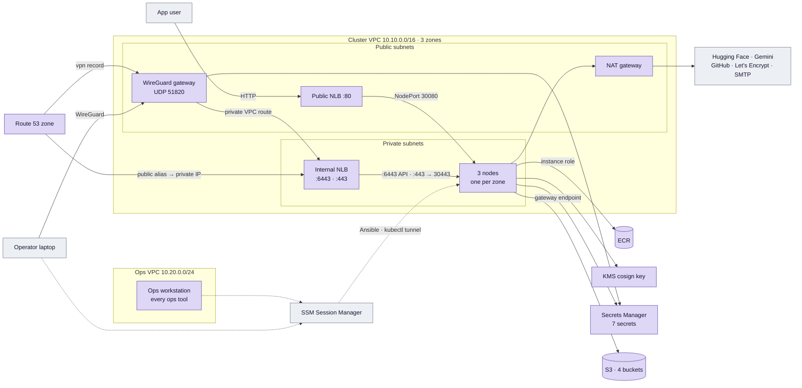
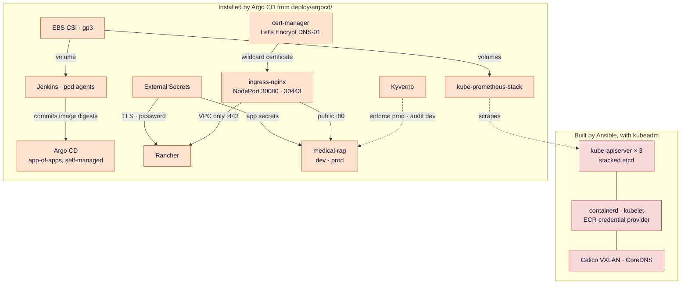

# Medical RAG Chatbot on self-managed Kubernetes

**Highly available Kubernetes on bare EC2: Terraform, Ansible over SSM, GitOps. A RAG chatbot is the workload.**


- **No SSH, no AWS access keys, nothing on the laptop but git, an editor and WireGuard.** Machines are
  reached through SSM Session Manager, act with instance roles, and are operated from a workstation in AWS.
- **Git is the control plane.** After bootstrap, every change inside the cluster is a commit, and every
  admin UI is reachable only over WireGuard.
- **Rebuilt in under 10 minutes, torn down after every session.** About 0.53 USD/hour while it runs.

## By the numbers

- **Empty cluster stack → 3 Ready control planes in [9 m 57 s](docs/evidence/ansible.md#rebuild-from-nothing):**
  84 AWS resources in 3 m 47 s, then the cluster in 6 m 10 s.
- **Idempotent:** [`terraform plan` → No changes](docs/evidence/terraform.md#reproducibility) after apply; a
  second Ansible run → [`changed=0` on every host](docs/evidence/ansible.md#rebuild-from-nothing) in 2 m 56 s.
- **Loses a node, keeps the API:** a control plane stopped mid-session and the Kubernetes API
  [kept answering](docs/evidence/ansible.md#ha-drill); the node rejoined on boot without a playbook run.
- **Infrastructure destroyed in 2 m 15 s.** 0.53 USD/hour while up (cluster + VPN gateway), about 7 USD/month
  kept for the registry, keys, DNS and the stopped workstation ([cost](docs/evidence/terraform.md#cost)).
- **Container 926 → 483 MB (−48%)**, 22 tests, non-root with a read-only filesystem ([local evidence](docs/evidence/local.md)).
- **7,079-chunk index with a content-hashed version**, identical in a container and on the host; an
  unchanged corpus [skips the rebuild in < 1 s](docs/evidence/local.md#index-artifact).

## Architecture

Three pictures: what AWS holds, what runs inside the cluster, and what happens to a commit. The colour
of a box says which tool created it — **Terraform**, **Ansible**, **Argo CD**, **Jenkins** — and grey is
what we did not build.

### 1. On AWS


```mermaid
flowchart LR
    OP["Operator laptop"]
    USER["App user"]
    SSM["SSM Session Manager"]

    subgraph OPSVPC["Ops VPC 10.20.0.0/24"]
        WS["Ops workstation<br/>every ops tool"]
    end

    subgraph VPC["Cluster VPC 10.10.0.0/16 · 3 zones"]
        subgraph PUB["Public subnets"]
            PNLB["Public NLB :80"]
            VPN["WireGuard gateway<br/>UDP 51820"]
            NAT["NAT gateway"]
        end
        subgraph PRIV["Private subnets"]
            NODES["3 nodes<br/>one per zone"]
            INLB["Internal NLB<br/>:6443 · :443"]
        end
    end

    R53["Route 53 zone"]
    ECR[("ECR")]
    KMS["KMS cosign key"]
    SM["Secrets Manager<br/>7 secrets"]
    S3[("S3 · 4 buckets")]
    EXT["Hugging Face · Gemini<br/>GitHub · Let's Encrypt · SMTP"]

    USER -->|"HTTP"| PNLB -->|"NodePort 30080"| NODES
    OP -->|"WireGuard"| VPN -->|"private VPC route"| INLB
    OP -.-> SSM
    WS -.-> SSM -.->|"Ansible · kubectl tunnel"| NODES
    INLB -->|":6443 API · :443 → 30443"| NODES
    NODES --> NAT --> EXT
    NODES -->|"instance role"| ECR
    NODES --> SM
    NODES -->|"gateway endpoint"| S3
    NODES --> KMS
    VPN --> SM
    R53 -->|"public alias → private IP"| INLB
    R53 -->|"vpn record"| VPN

    classDef tf fill:#ded7f5,stroke:#5b43a8,color:#1b1430;
    classDef ext fill:#eceff3,stroke:#6b7684,color:#1b1430;
    class WS,PNLB,INLB,VPN,NAT,NODES,R53,ECR,KMS,SM,S3 tf
    class OP,USER,SSM,EXT ext
```

### 2. Inside the cluster


```mermaid
flowchart TB
    subgraph ANS["Built by Ansible, with kubeadm"]
        CP["kube-apiserver × 3<br/>stacked etcd"]
        RT["containerd · kubelet<br/>ECR credential provider"]
        CNI["Calico VXLAN · CoreDNS"]
    end

    subgraph GIT["Installed by Argo CD from deploy/argocd/"]
        ARGO["Argo CD<br/>app-of-apps, self-managed"]
        ING["ingress-nginx<br/>NodePort 30080 · 30443"]
        CSI["EBS CSI · gp3"]
        ESO["External Secrets"]
        CM["cert-manager<br/>Let's Encrypt DNS-01"]
        MON["kube-prometheus-stack"]
        RAN["Rancher"]
        JK["Jenkins · pod agents"]
        KYV["Kyverno"]
        APP["medical-rag<br/>dev · prod"]
    end

    CP --- RT --- CNI
    ESO -->|"app secrets"| APP
    ESO -->|"TLS · password"| RAN
    CM -->|"wildcard certificate"| ING
    CSI -->|"volumes"| MON
    CSI -->|"volume"| JK
    ING -->|"public :80"| APP
    ING -->|"VPC only :443"| RAN
    KYV -.->|"enforce prod · audit dev"| APP
    MON -.->|"scrapes"| CP
    JK -->|"commits image digests"| ARGO

    classDef ans fill:#f7d9d9,stroke:#a63b3b,color:#1b1430;
    classDef argo fill:#fde3cf,stroke:#c2602a,color:#1b1430;
    class CP,RT,CNI ans
    class ARGO,ING,CSI,ESO,CM,MON,RAN,JK,KYV,APP argo
```

Sync waves run in order: Argo CD, ingress and storage first, then External Secrets and cert-manager,
then the secrets and the restored certificate, then the TLS issuers, Rancher and monitoring.

### 3. What happens to a commit


```mermaid
flowchart LR
    DEV["git push to main"] --> GH["GitHub"]
    GH -->|"polled every 2 min"| JK["Jenkins in the cluster"]
    JK --> GUARD["skip bot commits<br/>and deploy/** changes"]
    GUARD --> T1["ruff · pytest · hadolint"]
    T1 --> T2["BuildKit rootless"]
    T2 --> ECR[("ECR")]
    T2 --> T3["Trivy scan · Syft SBOM"]
    T3 --> T4["Cosign sign and attest<br/>with the KMS key"]
    T4 --> GH2["bump the digest<br/>in deploy/envs/dev"]
    GH2 --> ARGO["Argo CD"]
    GH2 --> PR["pull request for prod"] --> HUMAN["human review"] --> ARGO
    ARGO -->|"PreSync hook"| JOB["index-build Job"]
    JOB --> S3[("S3 · FAISS index")]
    ARGO --> DEVENV["dev"]
    ARGO -->|"Kyverno checks the signature"| PRODENV["prod"]
    S3 --> DEVENV
    S3 --> PRODENV
    PRODENV -->|"embeddings · answers"| API["Hugging Face · Gemini"]

    classDef jk fill:#d7e8f5,stroke:#2f5d8a,color:#1b1430;
    classDef argo fill:#fde3cf,stroke:#c2602a,color:#1b1430;
    classDef tf fill:#ded7f5,stroke:#5b43a8,color:#1b1430;
    classDef ext fill:#eceff3,stroke:#6b7684,color:#1b1430;
    class JK,GUARD,T1,T2,T3,T4,GH2,PR jk
    class ARGO,DEVENV,PRODENV,JOB argo
    class ECR,S3 tf
    class DEV,GH,HUMAN,API ext
```

Details: [design](docs/selfmanaged-k8s-ops-design.md#3-architecture).

## The stack, in the order it was built

Each tool exists because of what the one before it left unsolved. Read the last column of a row and
you have the reason for the next one.

| # | Tool | The problem before it | What it solved | What it did not solve |
|---|---|---|---|---|
| 1 | **Docker, multi-stage** | A 926 MB image carrying the build toolchain, the PDF and `.git` | 483 MB, non-root, read-only filesystem, 22 tests inside the build | Every start still re-embedded the whole corpus before it could answer |
| 2 | **Content-hashed FAISS index** | Re-embedding 7,079 chunks on every start, against a rate-limited API | Build once, store it in S3 under a hash, skip an unchanged corpus in < 1 s | An artifact with no cluster to serve it |
| 3 | **Terraform, 3 stacks by lifetime** | Bash scripts and fixed IPs: nobody could rebuild the same thing twice | 84 resources from nothing — network, nodes, load balancers, VPN gateway — and a clean `plan` after | It stops at the machine: three blank Ubuntu hosts |
| 4 | **SSM Session Manager** | Reaching a machine would mean an SSH key, a bastion and an open port | A shell and file transfer over an outbound connection; no key exists anywhere | Getting in is not the same as configuring what is inside |
| 5 | **Ansible + kubeadm + containerd** | Blank hosts, and no managed control plane to hide etcd or upgrades behind | An HA control plane, and a second run that reports `changed=0` on every host | Pods cannot talk across zones, and the cluster is empty |
| 6 | **Calico VXLAN** | The nodes sit in three different subnets; pod addresses do not route between them | Pod traffic wrapped in node addresses, with no BGP and no route table to edit | Every change inside the cluster is still a manual `kubectl apply` |
| 7 | **Argo CD, self-managed** | Nobody could say what the cluster was running, or put it back | Git is the record; drift is repaired; Argo CD upgrades itself from a commit | Traffic still has no way into the cluster |
| 8 | **ingress-nginx on fixed NodePorts** | No cloud controller, so a `LoadBalancer` Service would stay `Pending` forever | One entry point for every hostname, behind the load balancers Terraform made | A pod that keeps data has nowhere to put it: a claim stays `Pending` |
| 9 | **EBS CSI + gp3 StorageClass** | Anything that kept data would lose it as soon as a pod moved | Encrypted volumes created in the pod's own zone, and deleted with the claim | Passwords and keys still have to come from somewhere outside Git |
| 10 | **External Secrets + Secrets Manager** | Keys and passwords would have to sit in Git or in Terraform state | Values arrive from AWS through the node's role; Git holds only their names | nginx still serves a self-signed certificate, so every UI opens behind a warning |
| 11 | **cert-manager, DNS-01 wildcard** | Private names cannot pass an HTTP challenge, so no public CA would sign them | A trusted `*.recruitai.io.vn`, renewed automatically and backed up for rebuilds | A trusted certificate does not stop the public load balancer answering for those names |
| 12 | **Internal NLB + VPC-only Ingress** | Any UI added to the cluster would answer on the public load balancer, to anyone | Admin names resolve to private addresses, accepted only from inside the VPC, over the VPN | Nothing measures the cluster, and nobody is told when it breaks |
| 13 | **kube-prometheus-stack + Alertmanager** | No metrics from the nodes, the kubelets, etcd or the control plane | Dashboards for all four, alert rules, and email when one of them fires | kubectl is still the only way to look at the cluster |
| 14 | **Rancher, VPN only** | Reading cluster state meant remembering the right kubectl command | A management UI on its private name, with the purchased certificate | Rolling out the app itself is still a hand-written manifest |
| 15 | **Helm chart + Argo CD Applications** | One `k8s.yaml` for every environment, edited by hand for each release | `dev` and `prod` from one chart, with the image digest pinned in Git | Images are built by hand, unscanned and unsigned |
| 16 | **Jenkins, BuildKit, Trivy, Syft, Cosign on KMS** | Whoever could build could ship, and nobody could say what was inside an image | Commit → test → build → scan → SBOM → sign → `dev`; `prod` through a reviewed PR | The cluster would still accept an image that nobody signed |
| 17 | **Kyverno + etcd snapshots** | A signature nothing checks, and a cluster with no way back after a bad day | `prod` admits only signed images; etcd snapshots are copied to S3 on a schedule | The restore drill and the gated upgrade drill, both marked P1 in the design |

**Workload:** Flask on gunicorn, LangChain, FAISS and Gemini. The index is a versioned artifact in S3,
and `/readyz` and `/metrics` feed Kubernetes and Prometheus.

## Found and fixed

- **One node never appeared in SSM** although its status checks were green. Its console output showed
  the agent failing to get instance-role credentials at boot; a reboot registered it.
  [→](docs/evidence/ansible.md#problems-found-and-fixed-during-this-phase)
- **`crictl: not found` on every node.** `kubeadm` no longer depends on `cri-tools`, so the role now
  pins and installs it explicitly. [→](docs/evidence/ansible.md#problems-found-and-fixed-during-this-phase)
- **PyPI crawled inside Docker.** The IPv4 route to the CDN was congested (2.1 MB in 11–20 s vs 0.45 s
  over IPv6), and containers had only ULA IPv6, which glibc ranks below IPv4. Giving Docker a
  non-ULA IPv6 prefix brought it to 0.41 s. [→](docs/evidence/local.md#environment-issue-found-while-verifying-not-a-code-defect)

## Trade-offs, on purpose

- **One NAT gateway**, not three: a cost choice, documented as a single point of failure.
- **Every pod shares its node's instance role.** A self-managed cluster has no IRSA, so each permission is scoped to exact resources.
- **`m7i-flex` nodes**, forced by the AWS Free plan. Their CPU burst runs out silently, so an alert watches sustained CPU.
- **ingress-nginx is retired upstream** and kept knowingly; a maintained controller can take over the same NodePorts.
- **The ops workstation holds admin rights.** It has no inbound ports, requires IMDSv2 and is stopped when idle.

All risks and decisions: [design §10](docs/selfmanaged-k8s-ops-design.md#10-risks) and [§11](docs/selfmanaged-k8s-ops-design.md#11-resolved-decisions).

## Run it

**The app, locally** (Docker with Compose):
```bash
cp .env.example .env        # GOOGLE_API_KEY, HUGGINGFACEHUB_API_TOKEN, FLASK_SECRET_KEY
docker compose up --build   # builds the index once, then serves http://localhost:8000
```

**The cluster, on AWS** (from the ops workstation):
```bash
make shared                 # once: registry, signing key, secrets, DNS zone, budget
make infra                  # network, nodes, load balancers, VPN gateway
make ansible-deps           # once per workstation
make cluster                # HA kubeadm cluster over SSM
make tunnel                 # kubectl through SSM, in a second window
```
Argo CD, the release path and teardown with `make down` are in the **[runbook](docs/runbook.md)**.

## Docs

| Area | Architecture | Step-by-step | Interview Q&A (Vietnamese) |
|---|---|---|---|
| AWS with Terraform | [README](docs/terraform/README.md) | [guide](docs/terraform/guide.md) | [questions](docs/terraform/questions.md) · [answers](docs/terraform/answers.md) |
| Cluster with Ansible | [README](docs/ansible/README.md) | [guide](docs/ansible/guide.md) | [questions](docs/ansible/questions.md) · [answers](docs/ansible/answers.md) |
| Platform with GitOps | [README](docs/gitops/README.md) | [guide](docs/gitops/guide.md) | [questions](docs/gitops/questions.md) · [answers](docs/gitops/answers.md) |
| App on the cluster | [README](docs/app/README.md) | [guide](docs/app/guide.md) | |
| AWS vs on-premises | | | [questions](docs/aws/questions.md) · [answers](docs/aws/answers.md) |
| The whole project | [design](docs/selfmanaged-k8s-ops-design.md) | [runbook](docs/runbook.md) | [questions](docs/common/questions.md) · [answers](docs/common/answers.md) |

Measured results: [`docs/evidence/`](docs/evidence/). Keys and files on the ops workstation: [`docs/ops-workstation-files.md`](docs/ops-workstation-files.md).

---

Application code adapted from [data-guru0/RAG-MEDICAL-CHATBOT](https://github.com/data-guru0/RAG-MEDICAL-CHATBOT).
