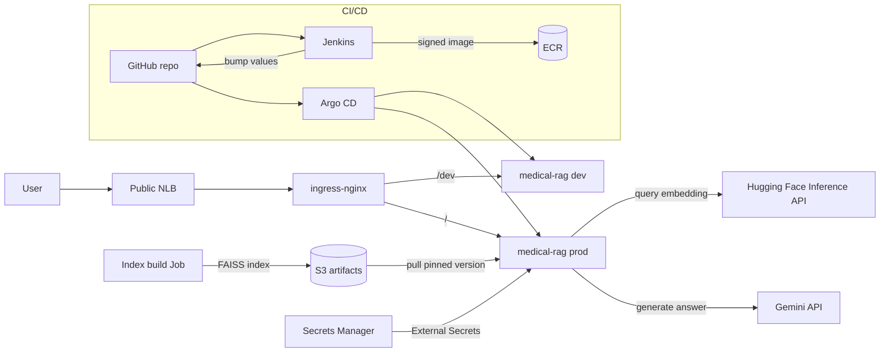

# Medical RAG Chatbot

A Retrieval Augmented Generation (RAG) assistant that answers medical questions from a curated PDF knowledge base. It combines a lightweight Flask UI, LangChain orchestration, FAISS vector search and the Gemini API to give grounded, concise answers. It runs on a **self-managed 3-node kubeadm cluster on EC2** (HA control plane, stacked etcd), delivered through GitOps.

> **Credits:** Adapted from [data-guru0/RAG-MEDICAL-CHATBOT](https://github.com/data-guru0/RAG-MEDICAL-CHATBOT) and extended with infrastructure, deployment, and observability improvements.

## ✨ Standout Capabilities
- **Grounded answers:** documents are chunked, embedded with the Hugging Face Inference API and indexed in FAISS. Gemini answers in 2–3 lines from the retrieved text, or says "I don't know".
- **Versioned index artifact:** the corpus is embedded once (batched, with retry on rate limits) and stored in S3 under a content hash. Pods pull a pinned version instead of re-embedding.
- **Self-managed Kubernetes:** Terraform provisions the AWS resources. Ansible builds a kubeadm cluster with 3 control-plane nodes behind an internal load balancer.
- **GitOps delivery:** Jenkins builds and tests, Argo CD deploys. Every commit reaches `dev` automatically; `prod` changes only through a reviewed pull request.
- **Supply-chain security:** images are scanned with Trivy, get an SBOM, and are signed with Cosign using an AWS KMS key. Kyverno rejects unsigned images in `prod`.
- **Observability:** health probes, Prometheus metrics aggregated across gunicorn workers, and Grafana.

## 🧠 System Architecture

```mermaid
flowchart LR
    U[User] --> NLB[Public NLB] --> ING[ingress-nginx]
    ING -->|"/dev"| DEV[medical-rag dev]
    ING -->|"/"| PROD[medical-rag prod]
    PROD -->|query embedding| HF[Hugging Face Inference API]
    PROD -->|generate answer| GM[Gemini API]
    JOB[Index build Job] -->|FAISS index| S3[(S3 artifacts)]
    S3 -->|pull pinned version| PROD
    SM[Secrets Manager] -->|External Secrets| PROD

    subgraph CICD [CI/CD]
      GIT[GitHub repo] --> JK[Jenkins] -->|signed image| ECR[(ECR)]
      JK -->|bump values| GIT
      GIT --> ARGO[Argo CD]
    end

    ARGO --> DEV
    ARGO --> PROD
```
The 3 EC2 nodes run the control plane and workloads together. The Kubernetes API is reached through an internal NLB, and operators connect with SSM Session Manager (no SSH, no bastion).

## 🐳 Run locally with Docker

```bash
cp .env.example .env        # fill GOOGLE_API_KEY, HUGGINGFACEHUB_API_TOKEN, FLASK_SECRET_KEY
docker compose up --build   # index-build runs once, then the app starts on http://localhost:8000
```

| Endpoint | Purpose |
|---|---|
| `/` | Chat UI |
| `/healthz` | Liveness (process up) |
| `/readyz` | Readiness (index loaded, chain built) |
| `/metrics` | Prometheus metrics (aggregated across gunicorn workers) |

- Lint + tests in Docker: `docker build --target test .`
- Re-running `docker compose up` skips embedding when the corpus, chunking and embedding model are unchanged.
- The bundled PDF is Volume 2 (C–F) of the Gale Encyclopedia of Medicine; questions outside that range get "I don't know".

## ☁️ Deploy to AWS

**Prerequisites:**
- **Tools:** AWS CLI v2 with admin credentials and the Session Manager plugin, Terraform ≥ 1.10, kubectl, Helm 3, Docker, cosign. Ansible runs inside a toolbox container, so it does not need to be installed.
- **Keys:** a Hugging Face token with the *Inference Providers* permission, a Gemini API key, and a GitHub token that can push to this repo and open pull requests.

1. **Create the Terraform state bucket** (once per account):
   ```bash
   terraform -chdir=infra/terraform/bootstrap init
   terraform -chdir=infra/terraform/bootstrap apply
   ```
2. **Set your variables:** region, owner tag and the budget alert email.
   ```bash
   cp infra/terraform/terraform.tfvars.example infra/terraform/terraform.tfvars
   ```
3. **Provision the infrastructure:** VPC, 3 EC2 nodes, load balancers, ECR, S3, KMS, Secrets Manager entries and budget alarms.
   ```bash
   make infra
   ```
4. **Store the keys** in Secrets Manager. External Secrets syncs them into the cluster later.
   ```bash
   aws secretsmanager put-secret-value --secret-id medical-rag/llm \
     --secret-string '{"GOOGLE_API_KEY":"...","HUGGINGFACEHUB_API_TOKEN":"...","FLASK_SECRET_KEY":"..."}'
   aws secretsmanager put-secret-value --secret-id medical-rag/github \
     --secret-string '{"token":"..."}'
   ```
5. **Build the Kubernetes cluster** with Ansible over SSM, then open a tunnel to the API server:
   ```bash
   make cluster
   make tunnel                # SSM port-forward to the internal API; writes the kubeconfig
   kubectl get nodes          # 3 nodes, all Ready
   ```
6. **Bootstrap GitOps.** This installs Argo CD, which then installs everything else: ingress-nginx, External Secrets, monitoring, Jenkins and the app.
   ```bash
   make bootstrap
   kubectl -n argocd get applications   # all Synced / Healthy
   ```
   `make up` runs steps 3, 5 and 6 in one go.
7. **Ship a change.** Push to `main`. Within 2 minutes Jenkins picks it up and:
   1. runs lint and tests
   2. builds the image and pushes it to ECR
   3. scans it with Trivy and generates the SBOM
   4. signs it with Cosign (KMS key)
   5. updates `deploy/envs/dev/values.yaml`, and Argo CD rolls out `dev`
   6. opens a pull request with the same change for `prod`

   Merge the pull request to release to `prod`.
8. **Verify the release:**
   ```bash
   NLB=$(terraform -chdir=infra/terraform output -raw public_nlb_dns)
   curl http://$NLB/readyz            # prod
   curl http://$NLB/dev/readyz        # dev
   IMAGE=$(yq .image.ref deploy/envs/prod/values.yaml)     # repo@sha256:...
   cosign verify --key awskms:///alias/medical-rag-cosign "$IMAGE"
   kubectl -n monitoring port-forward svc/kube-prometheus-stack-grafana 3000:80
   ```
9. **Tear down** when idle (about 0.32 USD/hour while running):
   ```bash
   make cost    # hours up × hourly estimate
   make down    # removes Argo CD apps first, then terraform destroy
   ```

## 🧩 End-to-End MLOps Blueprint

| Lifecycle Stage | Capabilities | Tooling & Artifacts |
| --- | --- | --- |
| **Data Management** | Content-hashed index versions | `python -m app.index`, S3 artifacts bucket |
| **Infrastructure** | Reproducible, idempotent cluster build | `infra/terraform`, `infra/ansible` |
| **CI** | Gated build → signed image | `Jenkinsfile`, BuildKit, Trivy, Syft, Cosign + KMS, ECR |
| **Continuous Delivery** | Git as source of truth, digest-pinned images | `deploy/charts/medical-rag`, `deploy/envs/{dev,prod}`, Argo CD |
| **Security** | Hardened pods, secrets outside Git | Kyverno, NetworkPolicies, External Secrets, Secrets Manager |
| **Observability** | Probes, latency and index metrics | `/healthz`, `/readyz`, `/metrics`, kube-prometheus-stack |

## 🔄 Model & Data Operations
- **Index refresh:** changing the PDF, chunk settings or embedding model produces a new index version. An Argo CD PreSync Job builds it before the pods roll, and skips the build if that version already exists.
- **Index rollback:** revert `index.version` in `deploy/envs/<env>/values.yaml`. Argo CD syncs the previous index back.
- **Retrieval & model tuning:** set `RETRIEVER_K` or `MODEL_NAME` in the env values and promote through `dev` → `prod`. Changing `EMBEDDING_MODEL_NAME` also produces a new `index.version`, so promote both together.
- **Cluster day-2:** etcd is snapshotted to S3 every 6 hours, and Kubernetes is upgraded one node at a time with the Ansible `upgrade.yml` playbook (run through the toolbox container). Step-by-step procedures live in [`docs/runbooks/`](docs/runbooks/).

## 📚 Docs
- Design: [`docs/selfmanaged-k8s-ops-design.md`](docs/selfmanaged-k8s-ops-design.md)
- Measured results: [`docs/evidence/`](docs/evidence/)
