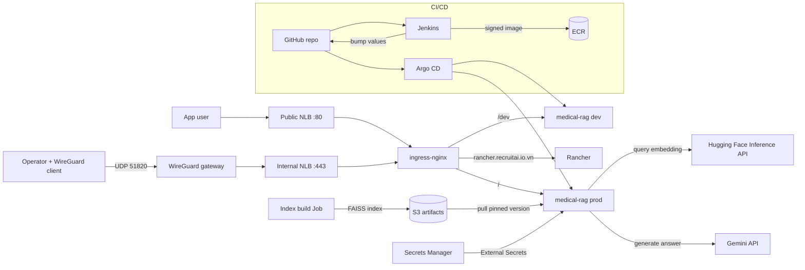

# Medical RAG Chatbot

A Retrieval Augmented Generation (RAG) assistant that answers medical questions from a curated PDF knowledge base. It combines a lightweight Flask UI, LangChain orchestration, FAISS vector search and the Gemini API to give grounded, concise answers. It runs on a **self-managed 3-node kubeadm cluster on EC2** (HA control plane, stacked etcd), delivered through GitOps.

> **Credits:** Adapted from [data-guru0/RAG-MEDICAL-CHATBOT](https://github.com/data-guru0/RAG-MEDICAL-CHATBOT) and extended with infrastructure, deployment, and observability improvements.

## ✨ Standout Capabilities
- **Grounded answers:** documents are chunked, embedded with the Hugging Face Inference API and indexed in FAISS. Gemini answers in 2–3 lines from the retrieved text, or says "I don't know".
- **Versioned index artifact:** the corpus is embedded once (batched, with retry on rate limits) and stored in S3 under a content hash. Pods pull a pinned version instead of re-embedding.
- **Self-managed Kubernetes:** Terraform provisions the AWS resources. Ansible builds a kubeadm cluster with 3 control-plane nodes behind an internal load balancer.
- **GitOps delivery:** Jenkins builds and tests, Argo CD deploys. Every commit reaches `dev` automatically; `prod` changes only through a reviewed pull request.
- **Supply-chain security:** images are scanned with Trivy, get an SBOM, and are signed with Cosign using an AWS KMS key. Kyverno rejects unsigned images in `prod`.
- **Observability:** health probes, Prometheus metrics aggregated across gunicorn workers, and Grafana.
- **Private operations:** Rancher is reachable only through a WireGuard VPN; TLS with a Sectigo certificate ends at ingress-nginx inside the cluster.

## 🧠 System Architecture

```mermaid
flowchart LR
    U[App user] --> NLB[Public NLB :80] --> ING[ingress-nginx]
    ING -->|"/dev"| DEV[medical-rag dev]
    ING -->|"/"| PROD[medical-rag prod]
    OP[Operator + WireGuard client] -->|UDP 51820| VPN[WireGuard gateway]
    VPN --> INLB[Internal NLB :443] --> ING
    ING -->|rancher.recruitai.io.vn| RAN[Rancher]
    PROD -->|query embedding| HF[Hugging Face Inference API]
    PROD -->|generate answer| GM[Gemini API]
    JOB[Index build Job] -->|FAISS index| S3[(S3 artifacts)]
    S3 -->|pull pinned version| PROD
    SM[Secrets Manager] -->|External Secrets| PROD

    subgraph CICD [CI/CD]
      GIT[GitHub repo] --> JK[Jenkins] -->|signed image| ECR[(ECR)]
      JK -->|bump values| GIT
      GIT --> ARGO[Argo CD]
    end

    ARGO --> DEV
    ARGO --> PROD
```
The 3 EC2 nodes run the control plane and workloads together. The Kubernetes API sits behind an
internal NLB, and operators reach the machines with SSM Session Manager (no SSH).

## 🐳 Run locally with Docker

For working on the app itself, on any machine with Docker and the Compose plugin. The AWS deployment
below does not use it.

```bash
cp .env.example .env        # fill GOOGLE_API_KEY, HUGGINGFACEHUB_API_TOKEN, FLASK_SECRET_KEY
docker compose up --build   # index-build runs once, then the app starts on http://localhost:8000
```

| Endpoint | Purpose |
|---|---|
| `/` | Chat UI |
| `/healthz` | Liveness (process up) |
| `/readyz` | Readiness (index loaded, chain built) |
| `/metrics` | Prometheus metrics (aggregated across gunicorn workers) |

- Lint + tests in Docker: `docker build --target test .`
- Re-running `docker compose up` skips embedding when the corpus, chunking and embedding model are unchanged.
- The bundled PDF is Volume 2 (C–F) of the Gale Encyclopedia of Medicine; questions outside that range get "I don't know".

## ☁️ Deploy to AWS

Step-by-step Terraform instructions: [`docs/terraform/guide.md`](docs/terraform/guide.md), with the architecture and file-by-file explanation in [`docs/terraform/README.md`](docs/terraform/README.md).

**Prerequisites:** an AWS account with an admin identity, a browser, git, a WireGuard client, the
`recruitai.io.vn` domain, and a Sectigo certificate order for `rancher.recruitai.io.vn`. You also need
a Hugging Face token with the *Inference Providers* permission, a Gemini API key, and a GitHub token
that can push to this repo and open pull requests. Terraform, Ansible, kubectl, Helm and the AWS CLI
run on the ops workstation in AWS, and application images are built by Jenkins, so the deployment
needs nothing else on the laptop.

1. **Create the state bucket and the ops workstation** (once per account). Open **AWS CloudShell** in the console and run:
   ```bash
   git clone https://github.com/biabeogo147/Medical-RAG-Chatbot && cd Medical-RAG-Chatbot
   ./infra/terraform/bootstrap/install-terraform.sh      # into ~/bin
   terraform -chdir=infra/terraform/bootstrap init
   terraform -chdir=infra/terraform/bootstrap apply
   ```
   The workstation is an EC2 Ubuntu instance with every ops tool preinstalled. Connect to it from **EC2 → Instances → Connect → Session Manager**:
   ```bash
   sudo su - ubuntu
   git clone https://github.com/biabeogo147/Medical-RAG-Chatbot && cd Medical-RAG-Chatbot
   ```
   First finish [Terraform guide step 6](docs/terraform/guide.md) (laptop + CloudShell) to move the
   bootstrap state into S3. Every later step runs on the workstation: edit code on your laptop, push,
   and `git pull` there.
2. **Create the long-lived services:** ECR, the index artifacts bucket, the cosign KMS key, Route 53
   zone, empty secrets and the budget alarm. They are kept when the cluster is destroyed.
   ```bash
   cp infra/terraform/shared/terraform.tfvars.example infra/terraform/shared/terraform.tfvars   # set budget_email
   make shared
   ```
3. **Prepare DNS and TLS.** Before changing nameservers, copy every existing DNS record to
   Route 53. Then delegate the zone, create the Sectigo CSR outside the repo, and store the Rancher
   password and TLS chain in Secrets Manager. Exact commands and checks are in
   [Terraform guide step 17](docs/terraform/guide.md#step-17--migrate-dns-and-store-the-keys).
4. **Create the WireGuard keys, then provision the cluster infrastructure:** VPC, 3 Kubernetes
   nodes, the WireGuard gateway, load balancers, IAM roles and cluster buckets. The keys must be in
   Secrets Manager before `make infra`, because the gateway reads them when it first boots.
   [Terraform guide step 18](docs/terraform/guide.md#step-18--wireguard-and-the-private-rancher-entry-point)
   has the key commands and the laptop's tunnel profile.
   ```bash
   make infra
   ```
5. **Store the application keys.** External Secrets syncs them into the cluster later.
   ```bash
   aws secretsmanager put-secret-value --secret-id medical-rag/llm \
     --secret-string '{"GOOGLE_API_KEY":"...","HUGGINGFACEHUB_API_TOKEN":"...","FLASK_SECRET_KEY":"..."}'
   aws secretsmanager put-secret-value --secret-id medical-rag/github \
     --secret-string '{"token":"..."}'
   ```
6. **Build the Kubernetes cluster** with Ansible over SSM, then open a tunnel to the API server.
   Step-by-step instructions: [`docs/ansible/guide.md`](docs/ansible/guide.md).
   ```bash
   make ansible-deps          # once per workstation
   make cluster               # also writes the kubeconfig to the workstation
   make tunnel                # SSM port-forward to the internal API; keep this window open
   kubectl get nodes          # in a second window: 3 nodes, all Ready
   ```
7. **Connect WireGuard and bootstrap GitOps.** Activate the profile from step 4, confirm a recent
   handshake, then install Argo CD. Argo CD installs ingress-nginx, External Secrets,
   monitoring, Jenkins, Rancher and the app.
   ```bash
   make bootstrap
   kubectl -n argocd get applications   # all Synced / Healthy
   ```
   `https://rancher.recruitai.io.vn` works only while the VPN is connected.
8. **Ship a change.** Push to `main`. Jenkins polls the repository every 2 minutes, then:
   1. runs lint and tests
   2. builds the image and pushes it to ECR
   3. scans it with Trivy and generates the SBOM
   4. signs it with Cosign (KMS key)
   5. updates `deploy/envs/dev/values.yaml`, and Argo CD rolls out `dev`
   6. opens a pull request with the same change for `prod`

   Merge the pull request to release to `prod`.
9. **Verify the release:**
   ```bash
   NLB=$(terraform -chdir=infra/terraform/cluster output -raw public_nlb_dns)
   curl http://$NLB/readyz            # prod
   curl http://$NLB/dev/readyz        # dev
   IMAGE_REPO=$(yq .image.repository deploy/envs/prod/values.yaml)
   IMAGE_TAG=$(yq .image.tag deploy/envs/prod/values.yaml) # tag@sha256:...
   IMAGE="${IMAGE_REPO}:${IMAGE_TAG}"
   cosign verify --key awskms:///alias/medical-rag-cosign "$IMAGE"
   kubectl -n monitoring port-forward svc/kube-prometheus-stack-grafana 3000:80
   ```
10. **Tear down** when idle, then stop the workstation (EC2 → Instances → Instance state → Stop):
    ```bash
    make cost    # hours up × hourly estimate
    make down    # removes Argo CD apps first, then destroys the cluster stack
    ```

## 🧩 End-to-End MLOps Blueprint

| Lifecycle Stage | Capabilities | Tooling & Artifacts |
| --- | --- | --- |
| **Data Management** | Content-hashed index versions | `python -m app.index`, S3 artifacts bucket |
| **Infrastructure** | Reproducible, idempotent cluster build | `infra/terraform/{bootstrap,shared,cluster}`, `infra/ansible` |
| **CI** | Gated build → signed image | `Jenkinsfile`, BuildKit, Trivy, Syft, Cosign + KMS, ECR |
| **Continuous Delivery** | Git as source of truth, digest-pinned images | `deploy/charts/medical-rag`, `deploy/envs/{dev,prod}`, Argo CD |
| **Security** | Hardened pods, secrets outside Git | Kyverno, NetworkPolicies, External Secrets, Secrets Manager |
| **Observability** | Probes, latency and index metrics | `/healthz`, `/readyz`, `/metrics`, kube-prometheus-stack |
| **Operations** | Private cluster UI behind a VPN | Rancher, WireGuard, Route 53, Sectigo TLS |

## 🔄 Model & Data Operations
- **Index refresh:** changing the PDF, chunk settings or embedding model produces a new index version. An Argo CD PreSync Job builds it before the pods roll, and skips the build if that version already exists.
- **Index rollback:** revert `index.version` in `deploy/envs/<env>/values.yaml`. Argo CD syncs the previous index back.
- **Retrieval & model tuning:** set `RETRIEVER_K` or `MODEL_NAME` in the env values and promote through `dev` → `prod`. Changing `EMBEDDING_MODEL_NAME` also produces a new `index.version`, so promote both together.
- **Cluster day-2:** etcd is snapshotted to S3 every 6 hours. Kubernetes is upgraded one node at a
  time, only after the [Rancher compatibility gate](docs/selfmanaged-k8s-ops-design.md#421-rancher-gitops-contract-and-compatibility-gate) passes.

## 📚 Docs
- Design: [`docs/selfmanaged-k8s-ops-design.md`](docs/selfmanaged-k8s-ops-design.md)
- Infrastructure: [`docs/terraform/`](docs/terraform/) — architecture and a step-by-step build guide
- Cluster: [`docs/ansible/`](docs/ansible/) — the same pair for the kubeadm cluster
- Measured results: [`docs/evidence/`](docs/evidence/)
