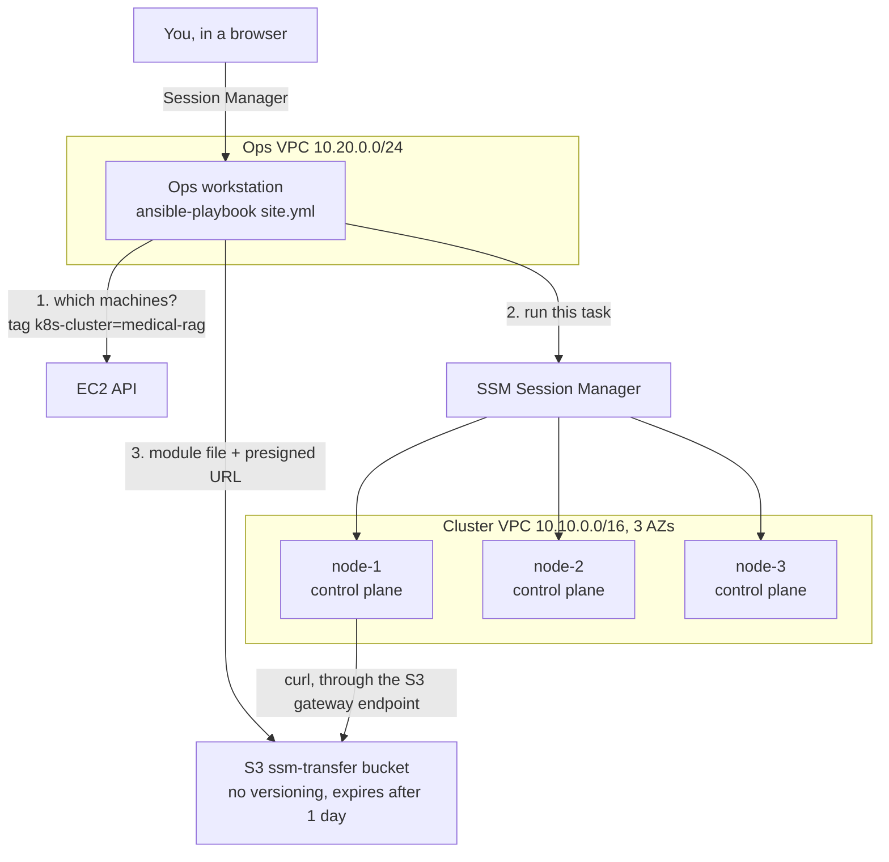
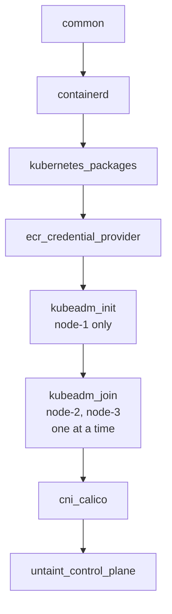
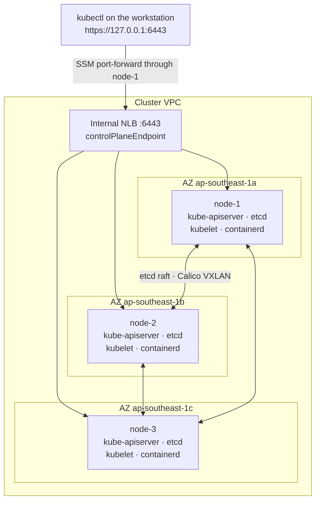
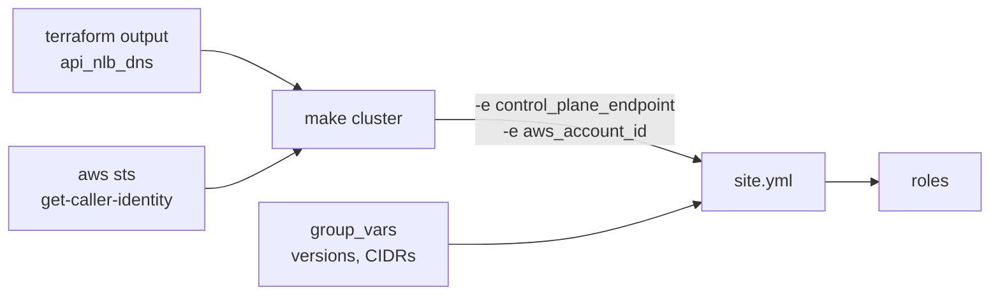

# Ansible architecture and folder structure

What the Ansible code does to the three machines Terraform created, how the files are organised, and
what each role is responsible for. The build instructions are in [`guide.md`](guide.md). Every task
file is commented, so the code itself explains what each task does and why.

Self-check and interview questions (Vietnamese) are in [`questions.md`](questions.md), with answers in
[`answers.md`](answers.md).

## 1. The picture

Terraform stops at the machine. Ansible starts there: it installs the runtime and the Kubernetes
packages, runs `kubeadm`, and hands back a working cluster. Nothing inside the cluster is its job.



Three properties fall out of this picture:

- **No SSH.** No key pair exists, no bastion is running, and the only inbound rules on the nodes come
  from the two load balancers and from the other nodes. A task travels as an SSM command, exactly
  like your own shell session does.
- **No credentials in transit.** The workstation authenticates with its instance role, and the node
  fetches module files from a presigned URL that expires, so the transfer itself carries no
  credentials.
- **No host list.** The inventory is built from the EC2 API on every run. Rebuild the cluster and the
  next run finds the new instances by tag.

## 2. What Ansible owns

| Tool | Owns | Lives in |
|---|---|---|
| Terraform | Network, machines, load balancers, IAM, buckets, registry | `infra/terraform/` |
| **Ansible** | **The operating system, containerd, the Kubernetes packages, `kubeadm`, the pod network** | `infra/ansible/` |
| Argo CD | Everything running in the cluster: ingress, monitoring, Jenkins, the app | `deploy/` |

**What Ansible deliberately does not do**

- It creates no AWS resource. If something is missing, the fix belongs in Terraform.
- It installs no cluster addon beyond the pod network. A cluster without a CNI plugin is not a
  cluster, so Calico is the one exception; everything else arrives through GitOps.
- It commits nothing. The join token and the certificate key never reach Git. They do pass through
  the encrypted `ssm-transfer` bucket and the node's temp directory as part of the Ansible module
  payload, which is why the token lives 15 minutes, the certificate Secret two hours, and the bucket
  expires its objects after a day.

## 3. The roles, in order



| Role | Runs on | What it leaves behind |
|---|---|---|
| `common` | all | The hostname set from the `Name` tag, swap off, `overlay` and `br_netfilter` loaded, bridge and forwarding sysctls, clock in sync |
| `containerd` | all | containerd 2.3.5 from the Docker repository, held, with the systemd cgroup driver |
| `kubernetes_packages` | all | kubelet, kubeadm and kubectl 1.36.4, held, kubelet enabled |
| `ecr_credential_provider` | all | The credential plugin, its configuration, and the kubelet flags in `/etc/default/kubelet` |
| `kubeadm_init` | node-1 | The cluster: etcd, API server, controller manager, scheduler, and `/etc/kubernetes/admin.conf` |
| `kubeadm_join` | node-2, node-3 | Two more control planes and two more etcd members |
| `cni_calico` | node-1 | The Calico operator and an `Installation` using VXLAN on `192.168.0.0/16` |
| `untaint_control_plane` | node-1 | The `NoSchedule` taint removed, so all three machines run workloads |

## 4. What exists when the playbook finishes



One machine per availability zone. Losing one leaves two of three etcd members, which is still a
quorum, so the cluster keeps accepting writes. The load balancer stops sending traffic to the missing
API server after two failed health checks, which at a ten-second interval is about twenty seconds,
and every kubelet keeps talking to the same endpoint throughout.

## 5. Folder structure

```
infra/ansible/
  ansible.cfg                        Inventory path, roles path, three forks
  requirements.yml                   amazon.aws 10.3.2, pinned
  site.yml                           The six plays, in order
  inventory/
    aws_ec2.yml                      Dynamic inventory: nodes found by tag
    group_vars/all.yml               Project, region, all pinned versions, the CIDRs
    group_vars/nodes.yml             The SSM connection settings (nodes only, never localhost)
  roles/
    common/                          tasks, handlers
    containerd/                      tasks, handlers
    kubernetes_packages/             tasks
    ecr_credential_provider/         tasks, files/credential-provider-config.yaml, handlers
    kubeadm_init/                    tasks, templates/kubeadm-config.yaml.j2
    kubeadm_join/                    tasks
    cni_calico/                      tasks, templates/installation.yaml.j2
    untaint_control_plane/           tasks
```

Two details in there are easy to get wrong:

- **The inventory file name must end in `aws_ec2.yml`.** The plugin is selected by the file name.
- **The connection settings are in `nodes.yml`, not `all.yml`.** Variables in `all.yml` apply to
  `localhost` as well, and the last play writes a file on the workstation itself. Setting
  `ansible_connection` globally would send that task through SSM too, to a machine that is not in the
  inventory.

## 6. How values reach Ansible

Nothing in Git contains an address, an account ID or a secret.



| Value | Where it comes from | Used for |
|---|---|---|
| `control_plane_endpoint` | `terraform output -raw api_nlb_dns` | `controlPlaneEndpoint` and the API server certificate |
| `aws_account_id` | `aws sts get-caller-identity` | The name of the SSM transfer bucket |
| Instance IDs | The EC2 API, by tag | Which machines to configure |
| Join token, certificate key | Created on node-1 during the run, valid 15 minutes | Adding the other two control planes |

The first play of `site.yml` asserts that the two extra variables are present, so starting the
playbook by hand fails in a second rather than half-way through a cluster build.

## 7. Idempotency

The rule for this phase is that a second `make cluster` reports `changed=0` on every node. Each role
earns that in its own way:

| Role | What stops it from acting twice |
|---|---|
| `common` | `copy` and `replace` compare content; `modprobe` is marked `changed_when: false`, because loading a module that is already loaded does nothing |
| `containerd` | The generated config is written with `copy`, so the file changes only when its content does; the package is held |
| `kubernetes_packages` | An exact version is installed and then held |
| `ecr_credential_provider` | `get_url` with a checksum re-downloads nothing |
| `kubeadm_init` | Skipped when `/etc/kubernetes/admin.conf` exists |
| `kubeadm_join` | Skipped when `/etc/kubernetes/manifests/etcd.yaml` exists — which also means no token is created. That file appears later in the join than `kubelet.conf`, so a join that died half-way is retried rather than skipped |
| `cni_calico` | Everything is applied server-side, which owns only the fields we send and leaves the operator's own defaults alone |
| `untaint_control_plane` | "taint not found" is treated as the desired state, not an error |

## 8. Pinned versions

| Component | Version | Why this one |
|---|---|---|
| Kubernetes | 1.36.4 (`1.36.4-1.1`) | Initial pin; any minor change must pass the Rancher compatibility gate (design §4.2.1) |
| cri-tools (`crictl`) | 1.36.0 (`1.36.0-1.1`) | Released per Kubernetes minor; installed explicitly because `kubeadm` no longer depends on it |
| containerd | 2.3.5, from the Docker repository | Newer than Ubuntu's, and it has a version string that can be pinned |
| Calico | v3.32.2 | Installed through its operator, configured for VXLAN |
| ecr-credential-provider | v1.37.0 | Published for this Kubernetes generation and speaks the stable v1 credential-provider API |
| `amazon.aws` collection | 10.3.2 | Version 11 needs ansible-core 2.17; Ubuntu 24.04 ships 2.16 |

Every pin sits in `inventory/group_vars/all.yml`. Change the Kubernetes minor only after the Rancher
compatibility gate in [design §4.2.1](../selfmanaged-k8s-ops-design.md#421-rancher-gitops-contract-and-compatibility-gate) passes; otherwise keep `1.36.4`.

## 9. Outside the Ansible boundary

- **`upgrade.yml`** — a later day-2 playbook: one node at a time, drain, `kubeadm upgrade`, uncordon,
  wait for Ready and GitOps health.
- **etcd backups** — a CronJob that snapshots to the `etcd-backups` bucket. It arrives with the Helm
  charts, because it runs inside the cluster.
- **Kyverno and NetworkPolicies** — installed by Argo CD in the GitOps phase.
