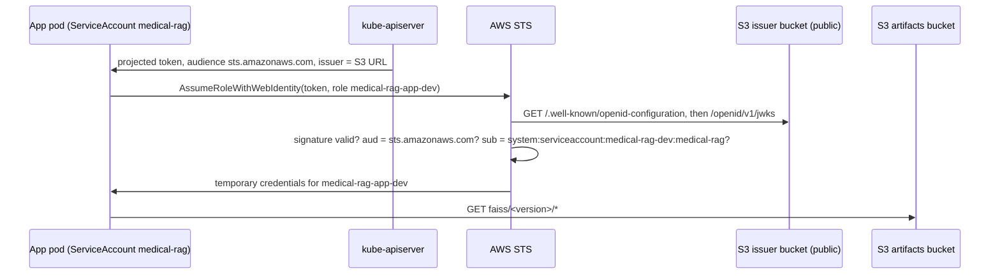
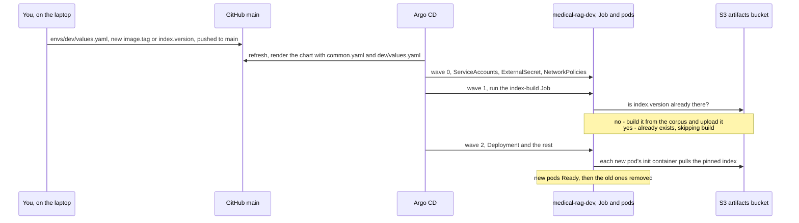
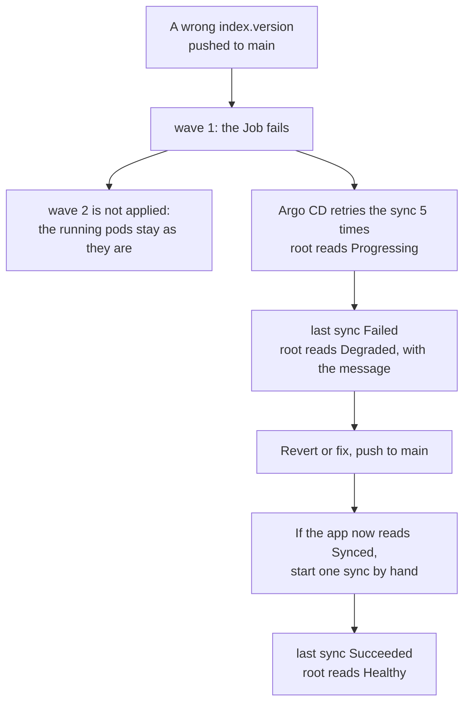

# App phase: architecture and decisions

How the chatbot runs on the cluster. The phase starts where the GitOps phase ended: Argo CD installs
everything from Git, and the platform (ingress, certificates, secrets, monitoring) is in place. The build
instructions are in [`guide.md`](guide.md), and every concept it uses is explained in
[`guide/0-concepts.md`](guide/0-concepts.md). How Argo CD reads these files, when it syncs and what its
statuses mean is drawn in [`../gitops/argocd-explained.md`](../gitops/argocd-explained.md).

This phase adds four things:

1. **An AWS identity for the app's own pods**, so the one workload that takes internet traffic no longer
   holds the node's permissions.
2. **An image and an index**, built once and pinned by digest and by version.
3. **A Helm chart**, deployed by Argo CD as `medical-rag-dev` and `medical-rag-prod`.
4. **The measurements** behind design criteria #6 and #7.

Jenkins comes after, and plugs into the same values files.

## 1. Why the app's pods need their own identity

The cluster runs on EC2 with no AWS cloud integration. Every process on a node, pods included, can ask the
instance metadata service (IMDS, `169.254.169.254`) for the node role's credentials. The node role holds
what the platform needs:

- read eight secrets, one of them the wildcard certificate's private key;
- write the certificate backup;
- change the ACME TXT record;
- read and write several S3 buckets;
- pull from ECR (push and signing moved to the `medical-rag-ci` role in the Jenkins phase, step 18).

The chatbot is the only pod reachable from the internet, and it loads a pickled index. If it were
compromised, all of that would be reachable from it.

A NetworkPolicy can block IMDS, but only for a whole pod. The app's pod has to download the index from S3
when it starts, and it had no other way to get credentials. The design's plan was to block IMDS for the
app namespaces while the pod still needed IMDS, and those two cannot both hold.

## 2. Workload identity without a webhook

This is the mechanism behind EKS's IRSA, built by hand:

| Piece | Where | Why it is built this way |
|---|---|---|
| Signing key | `medical-rag/sa-signer` in Secrets Manager; Ansible puts it on node 1 before `kubeadm init` | kubeadm would generate a new key on every rebuild, and AWS would stop trusting the tokens. kubeadm reuses a key it finds, and the other control planes receive it through `--upload-certs`. The node role cannot read this secret: whoever holds it can mint a token for any ServiceAccount |
| Issuer | S3 bucket `medical-rag-oidc-<account>`, shared stack, `prevent_destroy` | AWS must fetch the public key over HTTPS without credentials. The URL can never change: the tokens, the API server flags and every trust policy name it. A deleted bucket name could be claimed by someone else, so it is protected from deletion |
| Issuer documents | `make oidc-publish`, taken from the running API server | The value comes from the cluster, like secret values come from the CLI, and Terraform creates only the container. The script refuses to overwrite a document that differs, because that would mean the key changed |
| API server flags | kubeadm `extraArgs`: two `service-account-issuer`s, `service-account-jwks-uri`, explicit `api-audiences` | The S3 issuer is listed first, so it is the one written into new tokens. `sts.amazonaws.com` is not an API audience, so a token minted for AWS is useless against the cluster |
| OIDC provider and roles | shared stack | Long-lived, like the bucket. Each trust policy requires `aud = sts.amazonaws.com` and one exact `sub` |
| The pod side | the chart, not a webhook | A projected ServiceAccount token plus `AWS_ROLE_ARN`, `AWS_WEB_IDENTITY_TOKEN_FILE`, `AWS_REGION` and `AWS_STS_REGIONAL_ENDPOINTS`. The AWS SDK exchanges the token before it ever tries IMDS. EKS injects the same lines with a mutating webhook. Upstream configures it with `failurePolicy: Ignore`, so when it is down a pod starts without the token and quietly falls back to the node role. Only our own chart needs these lines |

**Roles:**

| Role | Accepts | May |
|---|---|---|
| `medical-rag-app-dev` | `medical-rag-dev:medical-rag` | list and read `faiss/*` |
| `medical-rag-app-prod` | `medical-rag-prod:medical-rag` | list and read `faiss/*` |
| `medical-rag-index-builder` | `medical-rag-{dev,prod}:medical-rag-index-builder` | read `corpus/*` and `faiss/*`, write `faiss/*`, never delete |

Serving and building are separate ServiceAccounts, so the pod that faces the internet can only read.

**What must stay protected.** The private signing key (whoever holds it can mint a token for any
ServiceAccount), write access to the issuer bucket (whoever can change the published key set can make
AWS trust their own key), and the bucket's name (`prevent_destroy`). The public documents themselves are
public by design.

**The hop limit is not the fence.** The nodes' IMDS hop limit of 2 is what lets pods reach IMDS at all,
for every pod on the node at once. It stays at 2 because platform pods still need the node role. The
per-pod fence is the NetworkPolicy below.

**IMDS is closed to the app namespaces.** Their NetworkPolicy allows egress to DNS and to TCP 443, except
to `169.254.169.254`. Nothing in these namespaces needs IMDS any more, not even the build Job.

### What still uses the node role

External Secrets, cert-manager, the EBS CSI driver, the ECR credential provider (kubelet), and later
Jenkins. They are platform components, not internet-facing, and each permission names its resources.
Moving them to their own roles uses the same issuer and provider: a new role plus the same four lines in
their pods. This is listed as a later improvement, not done in this phase.

## 3. Image and index

| Artifact | Where | Identity |
|---|---|---|
| Image | ECR `medical-rag`, tags immutable | Tag = 12-character commit. The chart pins `tag@sha256:digest` |
| Corpus | `s3://medical-rag-artifacts-<account>/corpus/<file>.pdf` | The exact file in `data/`, checksum verified on upload |
| Index | `s3://medical-rag-artifacts-<account>/faiss/<version>/` | `version` = sha256 of file names, file bytes, chunk size, overlap and embedding model, first 12 hex |

- **The image is built on the workstation for now** (`make image`). The target refuses dirty or
  unpushed code and an existing tag. Jenkins takes this over.
- **The index version is pinned in the values files.** The build Job (Part 3) is told the version it
  must produce. It fails before any embedding call if the corpus hashes to something else. The pods'
  init container downloads exactly that version.
- **`faiss/LATEST` is for docker compose only.** In the cluster, builds never move it
  (`INDEX_UPDATE_LATEST=false`) and pulls refuse it (`INDEX_REQUIRE_PINNED=true`).

## 4. Deployment shape (Parts 3 and 4)

| | dev | prod |
|---|---|---|
| Application | `medical-rag-dev`, wave 1 under `root` | `medical-rag-prod`, wave 2 under `root`: on a new cluster, dev builds a new index first |
| Namespace | `medical-rag-dev`, Pod Security `restricted` | `medical-rag-prod`, Pod Security `restricted` |
| Host | `dev.recruitai.io.vn` (HTTP, public NLB) | `app.recruitai.io.vn` (HTTP, public NLB) |
| Secret | `medical-rag/app-dev` → ExternalSecret | `medical-rag/app-prod` → ExternalSecret |
| Replicas | 1, no PDB | 2, one per node (`DoNotSchedule`), PDB `minAvailable: 1` |
| Values | `deploy/envs/common.yaml` + `deploy/envs/dev/values.yaml` | `deploy/envs/common.yaml` + `deploy/envs/prod/values.yaml` |

- **Hosts, not paths.** The design first planned `/dev` and `/` on the NLB's DNS name, because the
  project had no domain then. It has one now, so each environment gets its own name. That removes the
  URL-prefix handling the app would otherwise need. It also stops the two environments sharing the
  `session` cookie, and keeps the probe and metrics paths identical.
- **The index build is a Sync hook at wave 1, not a PreSync hook.** A PreSync hook would run before the
  ServiceAccount and the ExternalSecret it needs (wave 0) exist. The order of one release is drawn in
  [section 5](#5-life-of-a-release).
- **A failed build shows on `root`.** The app's Applications carry the label
  `medical-rag/report-failed-sync: "true"`, so the health check in `deploy/argocd/values/argocd.yaml` reports
  their failed last sync as `Degraded` (step 15). The failure path is drawn in
  [section 5](#what-a-failed-build-does).
- **Pods get the index from an init container that runs the app image** with `python -m app.index pull`.
  The image is the same one Kyverno will verify later, and the pull is pinned. The init container is the only
  one with the AWS token: the app container that answers users holds no AWS credentials at all.
- **Only `/` and `/clear` are public.** The Ingress routes exactly those two paths, so `/metrics`, `/healthz`
  and `/readyz` answer `404` from outside. A per-client rate limit protects the model quota.

## 5. Life of a release

A release changes one or two values in a values file. Everything after the push is Argo CD's work.

1. You change `image.tag` (a new image) or `index.version` (a new corpus or new chunk settings) in
   `deploy/envs/dev/values.yaml`, and push to `main`.
2. Argo CD renders the chart with `common.yaml` and the dev values, and syncs the three waves.
3. The Job builds the index only if that version is not in S3 yet. Dev's first build took 149.1 s. Later runs, in
   dev and in prod, found it in S3 and logged `already exists, skipping build`.
4. The new pods pull the pinned version in their init container. A pod went from created to Ready in 10 s.

**Promoting to prod** is the same change in `deploy/envs/prod/values.yaml`: copy the two values that dev
ran. Prod does not wait for dev: once the file is on `main`, `medical-rag-prod` syncs by itself, and its Job
finds the index that dev already built. (Its wave 2 under `root` matters only when `root` itself syncs, as
on a new cluster.) Until Jenkins
exists, you edit these files by hand; after, Jenkins commits dev's values and opens a pull request for
prod's.

### What a failed build does

- **Users do not notice.** The Deployment is at wave 2, after the Job, so a failed build never replaces the
  running pods. In the failure test of step 17, the pod stayed `1/1 Running` with 0 restarts.
- **You notice on `root`.** After five retries the sync is `Failed`, and `root` turns `Degraded` with the
  message `one or more synchronization tasks completed unsuccessfully (retried 5 times).`
- **A revert is not quite enough.** It makes the app `Synced` again, but the last sync stays `Failed` until
  one sync succeeds, so start one by hand. Why this is so is drawn in
  [argocd-explained §4](../gitops/argocd-explained.md#4-the-life-of-an-automated-sync).

The numbers are in [docs/evidence/app.md](../evidence/app.md).

## 6. What is proven and what is assumed

| Claim | Status |
|---|---|
| kubeadm reuses an existing `sa.key` and distributes it to joining control planes | Read in the kubeadm v1.36 source; proven on this cluster by step 4 (same `sa.pub` on 3 nodes) |
| kubeadm replaces its default `service-account-issuer` with ours and keeps our order (S3 first) | Read in the kubeadm v1.36 source (`ArgumentsToCommand`); proven by step 4, checks 1 and 3 |
| The cluster never moves `faiss/LATEST` | Enforced by an explicit `Deny` in the builder role, besides `INDEX_UPDATE_LATEST=false` |
| AWS accepts the cluster's tokens, and each boundary holds | Proven by step 7 |
| A new cluster signs with the same key | Proven at the first rebuild after step 5 (`make oidc-check`) |
| The Sync hook at wave 1 runs after the ExternalSecret is ready | Read in the Argo CD docs; proven by step 16 (Secret created before the Job's pod) |
| The pods (wave 2) start only after the Job (wave 1) succeeded | Proven by step 17 (Job completion before Deployment creation) |
| A failed build turns `root` `Degraded` and leaves the running pods alone | Proven on purpose by step 17 (a pinned version that does not exist) |
| The init container reaches STS and S3 with IMDS blocked; the app container has no credentials | Proven for a test pod by step 7; for the app by step 17 |
| A sync of an existing version does not embed again | Proven by steps 17 and 20 (`already exists, skipping build`) |

## 7. Known limits

| Limit | Why it is accepted | What would fix it |
|---|---|---|
| Platform pods still share the node role, which reads eight secrets and writes the certificate backup | They are not internet-facing, and each permission names its resources | Their own roles through the same issuer |
| The signing key passes through the SSM transfer bucket while Ansible copies it to node 1, and the node role can read that bucket | It happens during `make cluster`, before Argo CD or any workload exists, so no pod is there to read it. Objects in that bucket expire after a day | Remove the transfer bucket from the node role (Ansible hands nodes presigned URLs and should not need it), proven by a `make cluster` run that still reports `changed=0` |
| App traffic is plain HTTP | Out of scope in the design; the internal UIs use TLS | A certificate for `dev.` and `app.` and an HTTPS listener on the public NLB |
| The image is built on the workstation | Jenkins is the next phase | Jenkins with rootless BuildKit |
| Both app secrets start with the same API keys | The Flask key is replaced for prod in step 20; the API keys are yours to split | `put-secret-value` per environment |
| The image carries 4 CRITICAL and 14 HIGH findings (ECR scan) | Recorded as the "before" of criterion #9; the Jenkins phase hardens the base image | A smaller base image and a Trivy gate in the pipeline |
| The account ID is in Git (`deploy/envs/common.yaml`) | AWS treats account IDs as identifiers, not secrets; the image and role names need it | Template it in at deploy time, which Argo CD does not do on its own |
