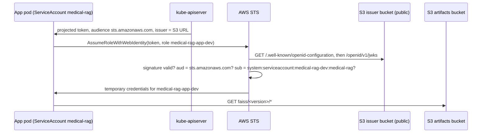

# App phase: architecture and decisions

How the chatbot runs on the cluster. The phase starts where the GitOps phase ended: Argo CD installs
everything from Git, and the platform (ingress, certificates, secrets, monitoring) is in place. The build
instructions are in [`guide.md`](guide.md).

This phase adds four things:

1. **An AWS identity for the app's own pods**, so the one workload that takes internet traffic no longer
   holds the node's permissions.
2. **An image and an index**, built once and pinned by digest and by version.
3. **A Helm chart**, deployed by Argo CD as `medical-rag-dev` and `medical-rag-prod`.
4. **The measurements** behind design criteria #6 and #7.

Jenkins comes after, and plugs into the same values files.

## 1. Why the app's pods need their own identity

The cluster runs on EC2 with no AWS cloud integration. Every process on a node, pods included, can ask the
instance metadata service (IMDS, `169.254.169.254`) for the node role's credentials. The node role holds
what the platform needs:

- read six secrets, one of them the wildcard certificate's private key;
- write the certificate backup;
- change the ACME TXT record;
- read and write several S3 buckets;
- push to ECR, and sign with the cosign KMS key.

The chatbot is the only pod reachable from the internet, and it loads a pickled index. If it were
compromised, all of that would be reachable from it.

A NetworkPolicy can block IMDS, but only for a whole pod. The app's pod has to download the index from S3
when it starts, and it had no other way to get credentials. The design's plan was to block IMDS for the
app namespaces while the pod still needed IMDS, and those two cannot both hold.

## 2. Workload identity without a webhook

This is the mechanism behind EKS's IRSA, built by hand:

| Piece | Where | Why it is built this way |
|---|---|---|
| Signing key | `medical-rag/sa-signer` in Secrets Manager; Ansible puts it on node 1 before `kubeadm init` | kubeadm would generate a new key on every rebuild, and AWS would stop trusting the tokens. kubeadm reuses a key it finds, and the other control planes receive it through `--upload-certs`. The node role cannot read this secret: whoever holds it can mint a token for any ServiceAccount |
| Issuer | S3 bucket `medical-rag-oidc-<account>`, shared stack, `prevent_destroy` | AWS must fetch the public key over HTTPS without credentials. The URL can never change: the tokens, the API server flags and every trust policy name it. A deleted bucket name could be claimed by someone else, so it is protected from deletion |
| Issuer documents | `make oidc-publish`, taken from the running API server | The value comes from the cluster, like secret values come from the CLI, and Terraform creates only the container. The script refuses to overwrite a document that differs, because that would mean the key changed |
| API server flags | kubeadm `extraArgs`: two `service-account-issuer`s, `service-account-jwks-uri`, explicit `api-audiences` | The S3 issuer is listed first, so it signs. `sts.amazonaws.com` is not an API audience, so a token minted for AWS is useless against the cluster |
| OIDC provider and roles | shared stack | Long-lived, like the bucket. Each trust policy requires `aud = sts.amazonaws.com` and one exact `sub` |
| The pod side | the chart, not a webhook | A projected ServiceAccount token plus `AWS_ROLE_ARN`, `AWS_WEB_IDENTITY_TOKEN_FILE`, `AWS_REGION` and `AWS_STS_REGIONAL_ENDPOINTS`. The AWS SDK exchanges the token before it ever tries IMDS. EKS injects the same lines with a mutating webhook, but a webhook that is down can block the creation of every pod in the cluster, and only our own chart needs it |

**Roles:**

| Role | Accepts | May |
|---|---|---|
| `medical-rag-app-dev` | `medical-rag-dev:medical-rag` | list and read `faiss/*` |
| `medical-rag-app-prod` | `medical-rag-prod:medical-rag` | list and read `faiss/*` |
| `medical-rag-index-builder` | `medical-rag-{dev,prod}:medical-rag-index-builder` | read `corpus/*` and `faiss/*`, write `faiss/*`, never delete |

Serving and building are separate ServiceAccounts, so the pod that faces the internet can only read.

**IMDS is closed to the app namespaces.** Their NetworkPolicy allows egress to DNS and to TCP 443, except
to `169.254.169.254`. Nothing in these namespaces needs IMDS any more, not even the build Job.

### What still uses the node role

External Secrets, cert-manager, the EBS CSI driver, the ECR credential provider (kubelet), and later
Jenkins. They are platform components, not internet-facing, and each permission names its resources.
Moving them to their own roles uses the same issuer and provider: a new role plus the same four lines in
their pods. This is listed as a later improvement, not done in this phase.

## 3. Image and index

| Artifact | Where | Identity |
|---|---|---|
| Image | ECR `medical-rag`, tags immutable | Tag = 12-character commit. The chart pins `tag@sha256:digest` |
| Corpus | `s3://medical-rag-artifacts-<account>/corpus/<file>.pdf` | The exact file in `data/`, checksum verified on upload |
| Index | `s3://medical-rag-artifacts-<account>/faiss/<version>/` | `version` = sha256 of file names, file bytes, chunk size, overlap and embedding model, first 12 hex |

- **The image is built on the workstation for now** (`make image`). The target refuses dirty or
  unpushed code and an existing tag. Jenkins takes this over.
- **The index version is pinned in the values files.** The build Job (Part 3) is told the version it
  must produce. It fails before any embedding call if the corpus hashes to something else. The pods'
  init container downloads exactly that version.
- **`faiss/LATEST` is for docker compose only.** In the cluster, builds never move it
  (`INDEX_UPDATE_LATEST=false`) and pulls refuse it (`INDEX_REQUIRE_PINNED=true`).

## 4. Deployment shape (Parts 3 and 4, written after Part 1 is proven)

| | dev | prod |
|---|---|---|
| Application | `medical-rag-dev`, last sync wave under `root` | `medical-rag-prod`, same wave, created after dev has built the index |
| Namespace | `medical-rag-dev` | `medical-rag-prod` |
| Host | `dev.recruitai.io.vn` (HTTP, public NLB) | `app.recruitai.io.vn` (HTTP, public NLB) |
| Secret | `medical-rag/app-dev` → ExternalSecret | `medical-rag/app-prod` → ExternalSecret |
| Replicas | 1, no PDB | 2, spread across nodes, PDB `minAvailable: 1` |

- **Hosts, not paths.** The design first planned `/dev` and `/` on the NLB's DNS name, because the
  project had no domain then. It has one now, so each environment gets its own name. That removes the
  URL-prefix handling the app would otherwise need. It also stops the two environments sharing the
  `session` cookie, and keeps the probe and metrics paths identical.
- **The index build is a Sync hook at wave 1, not a PreSync hook.** A PreSync hook runs before any
  normal resource on the first sync, so its ServiceAccount and the ExternalSecret holding its API key
  would not exist yet. At wave 1, the ServiceAccounts and the ExternalSecret (wave 0) are already applied, and
  Argo CD waits for the ExternalSecret to be healthy. This ordering is an assumption until step 15 shows
  it on the cluster.
- **Pods get the index from an init container that runs the app image** with `python -m app.index pull`.
  The image is the same one Kyverno will verify later, and the pull is pinned.

## 5. What is proven and what is assumed

| Claim | Status |
|---|---|
| kubeadm reuses an existing `sa.key` and distributes it to joining control planes | Read in the kubeadm v1.36 source; proven on this cluster by step 4 (same `sa.pub` on 3 nodes) |
| kubeadm replaces its default `service-account-issuer` with ours and keeps our order (S3 first) | Read in the kubeadm v1.36 source (`ArgumentsToCommand`); proven by step 4, checks 1 and 3 |
| The cluster never moves `faiss/LATEST` | Enforced by an explicit `Deny` in the builder role, besides `INDEX_UPDATE_LATEST=false` |
| AWS accepts the cluster's tokens, and each boundary holds | Proven by step 7 |
| A new cluster signs with the same key | Proven at the first rebuild after step 5 (`make oidc-check`) |
| The Sync hook at wave 1 runs after the ExternalSecret is ready | Assumed; proven by step 15 |
| The app pod reaches STS and S3 with IMDS blocked | Proven for a test pod by step 7; for the app by step 16 |

## 6. Known limits

| Limit | Why it is accepted | What would fix it |
|---|---|---|
| Platform pods still share the node role, which can sign with the cosign key | They are not internet-facing, and each permission names its resources | Their own roles through the same issuer |
| The signing key passes through the SSM transfer bucket while Ansible copies it to node 1, and the node role can read that bucket | It happens during `make cluster`, before Argo CD or any workload exists, so no pod is there to read it. Objects in that bucket expire after a day | Remove the transfer bucket from the node role (Ansible hands nodes presigned URLs and should not need it), proven by a `make cluster` run that still reports `changed=0` |
| App traffic is plain HTTP | Out of scope in the design; the internal UIs use TLS | A certificate for `dev.` and `app.` and an HTTPS listener on the public NLB |
| The image is built on the workstation | Jenkins is the next phase | Jenkins with rootless BuildKit |
| Both app secrets start with the same values | Your decision: replace them per environment later | `put-secret-value` per environment, the Flask key first |
