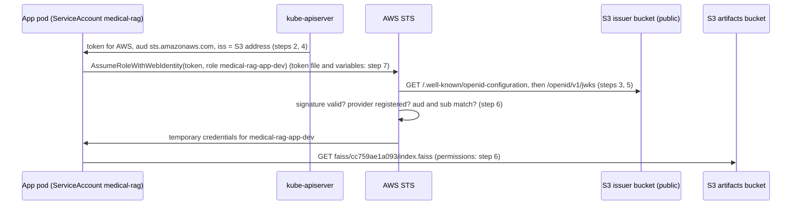

# App guide — Concepts

[Index](../guide.md) · [Part 1 →](1-pod-identity.md) · [Part 2](2-image-and-index.md) · [Part 3](3-dev.md) · [Part 4](4-prod-and-measure.md) · [Troubleshooting](troubleshooting.md)

This page explains the ideas that Parts 1–4 rely on, roughly in the order you need them. Each section
says what the thing is, where it appears in this project, and what breaks without it. Words in *italics*
in the steps are listed in the [glossary](#glossary) at the end.

**One example runs through the whole page.** The chatbot pod starts, and it needs to download
`faiss/cc759ae1a093/index.faiss` from the S3 bucket `medical-rag-artifacts-<account>`. To do that, it has to
prove to AWS who it is. How?

## The big picture

Today every pod borrows the node's AWS identity, which can do far more than the chatbot needs. We want the
chatbot pod to have its own, smaller identity.

Kubernetes already gives every pod a signed ID card: a *token*. Part 1 teaches AWS to read that card:

1. We keep the key that signs the cards the same on every rebuild.
2. We publish the matching public key on a public web page, so anyone can check a card's signature.
3. We tell AWS to trust cards checked against that page, and create one AWS role for each kind of pod.
4. The pod hands its card to AWS and gets back credentials for its own role.

On Amazon EKS this is built in, and it is called **IRSA**. This cluster is not EKS, so Part 1 builds it by
hand.

**What to read when.**

| Before step | Read |
|---|---|
| 1 | The big picture (this section), [1](#1-iam-roles-and-temporary-credentials), [2](#2-imds-and-the-hop-limit), [10](#10-irsa-and-what-this-project-does-differently): about 10 minutes |
| 2 | [4](#4-serviceaccounts-and-their-tokens), [5](#5-the-signing-key-pair) |
| 3 and 5 | [6](#6-issuer-discovery-document-and-jwks-oidc) |
| 4 | [7](#7-projected-tokens-and-audiences) |
| 6 | [8](#8-the-iam-oidc-provider-and-trust-policies), [9](#9-sts-assumerolewithwebidentity-the-exchange), [12](#12-scoping-s3-permissions) |
| 7 | [3](#3-how-the-aws-sdk-finds-credentials), [11](#11-networkpolicy-egress) |
| 8 | [13](#13-secrets-manager-and-external-secrets) |
| 10 and 12 | [15](#15-the-index-version) |
| 11 | [14](#14-image-tags-and-digests) |
| 14–21 | [16](#16-helm-charts-and-values-files), [17](#17-sync-waves-and-hooks), [18](#18-pod-security-standards), [19](#19-ingress), [20](#20-pods-that-start-and-stop-safely), [21](#21-measuring-with-prometheus) |

---

## 1. IAM roles and temporary credentials

**What it is.** In AWS, everything that calls an API must prove who it is. There are two main kinds of
identity:

- An **IAM user** has long-lived access keys: a key ID and a secret that work until someone deletes them.
  This project has none.
- An **IAM role** has no password and no key. To **assume** a role means to ask AWS for credentials that act
  as that role. AWS answers with **temporary credentials**: a key ID, a secret and a session token that
  expire. An assumed role's credentials last an hour by default; an instance's rotate every few hours.

A role has two policies. The **trust policy** says who may assume it. The **permissions policy** says what
it may do once assumed. Every AWS resource has a unique name called an **ARN** (Amazon Resource Name),
such as `arn:aws:iam::<account>:role/medical-rag-app-dev`.

**Analogy.** A role is a job title. Temporary credentials are today's visitor badge for that job: useful
for a while, then worthless.

**How an EC2 machine gets one.** A role is attached to an instance through an **instance profile**. The
three nodes use the role `medical-rag-nodes` (`infra/terraform/cluster/iam.tf`). This guide calls it
**the node role**. Everything running on a node can use it, including every pod; section 2 explains how.
Before Part 1, the node role could:

- read the platform's secrets, one of them the wildcard certificate's private key;
- write the certificate backup;
- change one DNS record;
- read, write and delete in S3 buckets, including the one that holds the index;
- push to ECR (the image registry), and sign with the cosign key (the key that signs images);
- manage EBS volumes and snapshots (the EBS CSI driver's policy), and register with Session Manager.

**What breaks without it.** Nothing on a node could call AWS at all. The problem is the opposite: *too
much* shares it.

---

## 2. IMDS and the hop limit

**What it is.** The **instance metadata service** (IMDS) is a small web server at the address
`169.254.169.254`, on port 80. It is reachable only from inside an EC2 instance. It answers questions such
as "which instance am I?", and it hands out the temporary credentials of the instance's role.

This project requires **IMDSv2**. A caller first sends a `PUT` to get a short-lived session token, then
uses that token on every `GET`.

**The hop limit.** The answer to that `PUT` carries a network *hop limit*.

- With **1**, the answer never gets past the host itself. An ordinary pod lives in its own network
  namespace, one step further away, so it never receives the answer.
- With **2**, the answer reaches pods too. The nodes use 2 (`infra/terraform/cluster/compute.tf`), so every
  pod can get the node role's credentials.
- Pods with `hostNetwork: true` share the host's network, so they reach IMDS even with 1.

The hop limit is **not** a permission system. It decides for every ordinary pod on the node at once.

**Why not set it to 1.** External Secrets, cert-manager and the EBS CSI driver are platform components that
run as pods, and they still need the node role through IMDS. So the fence around the app has to be per pod:
a NetworkPolicy (section 11).

**In our example.** Today the chatbot pod could simply ask IMDS and get the node role, with everything
section 1 lists. That is the risk Part 1 **prepares** to remove. Part 1 gives the app its own role, so that
the chart's NetworkPolicy (Part 3) can close IMDS without breaking the index download.

---

## 3. How the AWS SDK finds credentials

**What it is.** The **AWS SDK** is the library programs use to call AWS: boto3 in the app, and the `aws`
command line tool (the CLI) in the test pod. It looks for credentials in a fixed order and stops at the first
source that works. Simplified:

1. Access keys in environment variables.
2. **A web identity token**: set by the two variables `AWS_ROLE_ARN` (which role) and
   `AWS_WEB_IDENTITY_TOKEN_FILE` (where the token is).
3. Configuration files in the home directory.
4. …
5. **IMDS**, last.

The test pod in step 7, and later the chart, also set `AWS_REGION` and `AWS_STS_REGIONAL_ENDPOINTS`, so the
exchange uses the STS endpoint in Singapore. That is four `AWS_*` variables in total.

**Why it matters here.** Once a pod has the two web-identity variables, the SDK exchanges the token for
the role (section 9) and never reaches IMDS.

**Two ways it can go wrong.**

- **A variable is missing or misspelt.** The SDK quietly moves down the list and ends at IMDS. It still gets
  credentials, just the node's, so nothing fails and everything looks fine. That is why step 7.1 checks the
  **role name in the ARN**, not only that the call succeeded.
- **Both variables are set, but the token is refused** (or the file cannot be read). Then the call fails
  with an error; the SDK does **not** fall back. That is why step 7.5 prints `AccessDenied` and not the node
  role's ARN.

---

## 4. ServiceAccounts and their tokens

**What it is.** Every pod runs as a Kubernetes **ServiceAccount**: an identity for software, the way a user
account is an identity for a person. If a pod names none, it gets `default` in its namespace. The app will
run as the ServiceAccount `medical-rag` in the namespace `medical-rag-dev`.

The **API server**, the Kubernetes process every `kubectl` call goes to, gives each pod a **token** that
proves which ServiceAccount it runs as. The token is a **JWT** (JSON Web Token): three parts separated by
dots.

- **Header:** which algorithm and which key signed it (`kid`, the key ID).
- **Payload:** the *claims*. They are only encoded (base64), not encrypted, so anyone can read them.
- **Signature:** proves the payload was written by the key's owner and not changed since (section 5).

The payload of the token our pod will send to AWS looks like this (trimmed; real tokens also carry `iat`,
`nbf` and a `kubernetes.io` block):

```json
{
  "iss": "https://medical-rag-oidc-<account>.s3.ap-southeast-1.amazonaws.com",
  "sub": "system:serviceaccount:medical-rag-dev:medical-rag",
  "aud": ["sts.amazonaws.com"],
  "exp": 1790000000
}
```

| Claim | Meaning |
|---|---|
| `iss` (issuer) | Who issued the token: a web address where its public key can be found (section 6) |
| `sub` (subject) | Whom it is about: the namespace and ServiceAccount |
| `aud` (audience) | Who it is meant for (section 7) |
| `exp` (expiry) | When it stops being valid |

**Analogy.** An ID card. The payload is the printed text, which anyone can read. The signature is the
hologram: it cannot be copied without the issuer's equipment.

---

## 5. The signing key pair

**What it is.** **Signing** means computing a stamp from the data with a **private key**. Anyone with the
matching **public key** can check the stamp, but nobody can make a new stamp without the private key. So the
public key can be given to anyone. The API server signs tokens with the private key `sa.key`; the public key
is `sa.pub`. Here they are an RSA key pair, RSA being the most common algorithm for this.

**What must stay protected:**

1. **The private key.** Whoever holds it can write a token for any ServiceAccount, and so assume every role
   that trusts this cluster. It lives in Secrets Manager as `medical-rag/sa-signer` and, once the cluster is
   built, in `/etc/kubernetes/pki/sa.key` on the three control-plane nodes. The node role cannot read the
   secret. Only the workstation reads it, while Ansible builds the cluster (steps 2 and 4).
2. **Write access to the published key set.** If someone could add their own public key to the file AWS
   reads (section 6), AWS would accept tokens signed with their private key. Only admin identities can write
   to the issuer bucket.
3. **The bucket name.** A deleted bucket's name can be claimed by anyone. So the bucket has
   `prevent_destroy`, which makes Terraform refuse to delete it (step 3).

**Why the key must never change.** `kubeadm init`, the command that creates a new cluster, normally makes a
new key pair. The cluster is rebuilt often, so every rebuild would sign with a key AWS has never seen. Step 2
stores one pair, and step 4 makes every rebuild use it.

---

## 6. Issuer, discovery document and JWKS (OIDC)

**What it is.** **OIDC** (OpenID Connect) is a standard way for a stranger to check a token. It needs no
shared password, only a public web address: the **issuer**, the `iss` in the token. Under that address live
two public files, which this guide calls **the issuer documents**:

| Path under the issuer | Name | Contents |
|---|---|---|
| `/.well-known/openid-configuration` | Discovery document | "I am this issuer; my keys are at `jwks_uri`" |
| `/openid/v1/jwks` | **JWKS** (JSON Web Key Set) | The public keys, each labelled with its `kid` |

The steps call the JWKS **the key set**.

**How a checker uses them:**

1. Read `iss` from the token.
2. Download the discovery document, then the key set.
3. Take the key whose `kid` matches the token's header.
4. Check the signature.

It needs no login and no credentials, only HTTPS.

**Why the default issuer does not work.** kubeadm's default issuer is
`https://kubernetes.default.svc.cluster.local`. That name exists only inside the cluster, so AWS could never
download anything from it.

This project uses an S3 bucket's web address instead:

- Step 3 creates the bucket.
- Step 4 makes the API server write that address into every token.
- Step 5 copies the two issuer documents into it.

**Analogy.** The phone number of the office that issued an ID card, printed on the card itself. Anyone can
call it and ask whether the hologram is genuine.

---

## 7. Projected tokens and audiences

**What it is.** Besides its normal token, a pod can ask Kubernetes for extra tokens, each with its own
audience and lifetime. This is a **projected ServiceAccount token**: a file that the **kubelet** (the agent
on each node that starts pods) writes into the pod and refreshes before it expires. The steps call it
**the token for AWS**.

- **The pod's normal token** has an audience that the Kubernetes API accepts. The pod uses it to talk to the
  cluster.
- **The token for AWS** has `aud: sts.amazonaws.com` and lasts an hour. In the step 7 test pod it is the
  file `/var/run/secrets/aws/token`.

**Why separate tokens.** A token should be accepted only by the party it was made for.

- **On the AWS side:** IAM accepts only an audience listed in the OIDC provider, here `sts.amazonaws.com`
  (section 8), and each trust policy checks it again.
- **On the cluster side:** the API server's `--api-audiences` flag (step 4) deliberately leaves
  `sts.amazonaws.com` out. A token for AWS, if stolen, is useless against the cluster.

**Analogy.** A concert ticket is valid at one venue only, even though it has your name on it.

---

## 8. The IAM OIDC provider and trust policies

**What it is.** Being able to check a token's signature is not the same as trusting it. AWS accepts these
tokens only from issuers registered in IAM as an **OIDC provider**. Registering one says: "tokens from this
issuer, meant for the audience `sts.amazonaws.com`, may be used to assume roles in this account." Step 6
registers ours (`infra/terraform/shared/irsa.tf`).

Each role then says in its **trust policy** exactly which tokens it accepts. Below, `<issuer-host>` stands
for `medical-rag-oidc-<account>.s3.ap-southeast-1.amazonaws.com`. For `medical-rag-app-dev`:

```json
{
  "Effect": "Allow",
  "Principal": { "Federated": "arn:aws:iam::<account>:oidc-provider/<issuer-host>" },
  "Action": "sts:AssumeRoleWithWebIdentity",
  "Condition": {
    "StringEquals": {
      "<issuer-host>:aud": "sts.amazonaws.com",
      "<issuer-host>:sub": "system:serviceaccount:medical-rag-dev:medical-rag"
    }
  }
}
```

- **`Principal`** means "who is allowed". **`Federated`** means an outside identity system: here, our issuer,
  registered as the OIDC provider.
- **`aud` condition:** the token must be meant for AWS.
- **`sub` condition:** the token must belong to exactly this ServiceAccount in exactly this namespace. A pod
  in the same namespace with another ServiceAccount is refused, and step 7.5 proves it.

The **permissions policy** of the role is separate: it says what the role can do in S3 (section 12).

**Analogy.** The OIDC provider is AWS's list of ID offices it trusts. The trust policy is the guard at one
door, reading the name on the card.

---

## 9. STS AssumeRoleWithWebIdentity: the exchange

**What it is.** **STS** (Security Token Service) is the AWS service that hands out temporary credentials.
`AssumeRoleWithWebIdentity` is the call that exchanges a token for them. The pod sends two things, the token
and the role it wants. STS then:

1. checks the signature, by downloading the issuer documents (section 6);
2. checks that the issuer is a registered OIDC provider and that the trust policy's conditions match
   (section 8);
3. returns temporary credentials for the role, valid for an hour by default.

The call needs no AWS credentials: the token *is* the proof. The SDK repeats it before the credentials
expire.

**The whole flow, with the step that builds each part:**



---

## 10. IRSA, and what this project does differently

**What it is.** **IRSA** (IAM Roles for Service Accounts) is the name of sections 4–9 working together, as
Amazon EKS, AWS's managed Kubernetes, offers them. On EKS:

- **EKS hosts the issuer** for each cluster: EKS itself does what steps 2–5 do here.
- **A mutating webhook** edits every new pod whose ServiceAccount carries the annotation
  `eks.amazonaws.com/role-arn`. A mutating webhook is a component the API server calls to change an object
  as it is created. This one, `amazon-eks-pod-identity-webhook`, adds the token for AWS and the `AWS_*`
  variables. It does not exchange anything itself: the SDK inside the pod does that (section 3).

**What this project does.** The cluster is built with kubeadm, not EKS, so nothing hosts the issuer for us.
Part 1 builds it; this is often called **self-hosted IRSA**. It also leaves the webhook out:

| | EKS IRSA | This project |
|---|---|---|
| Issuer | Hosted by EKS | S3 bucket (steps 3 and 5), stable key (steps 2 and 4) |
| OIDC provider and roles | You create them | Same (step 6) |
| Token and variables in the pod | Added by the webhook | Written in our own chart (step 7 does it by hand) |

**Why no webhook.** Upstream ships the webhook with `failurePolicy: Ignore`. If the webhook is down when a pod
starts, Kubernetes creates the pod anyway, without the token and without the variables, and says nothing.
That pod would then fall back to the node role (section 3). Only our own chart needs these lines, so writing
them there removes a component and removes that silent failure.

**Aside: not the same as EKS Pod Identity.** EKS Pod Identity is a newer, separate EKS feature. An agent on
each node hands out credentials, and roles are linked to ServiceAccounts through the EKS API; there is no
OIDC issuer involved. It exists only on EKS. Interviewers sometimes ask about the difference.

---

## 11. NetworkPolicy egress

**What it is.** A **NetworkPolicy** is a firewall rule for pods. It selects pods by their labels. Its
**egress** rules list where those pods may connect to; everything else is dropped.

**It applies to a whole pod.** All containers in a pod share one network address. A policy cannot let the
*init container* (a container that runs once, before the main one) reach IMDS while it blocks the app
container: they have the same address.

**Something must enforce it.** Kubernetes only stores the policy. The network plugin applies it, and here
that is **Calico**. On a cluster whose plugin does not enforce policies, they silently do nothing.

**The rule the app will get:**

- DNS to **CoreDNS**, the cluster's name server;
- TCP 443 anywhere, except `169.254.169.254`.

IMDS listens on port 80, so the 443 rule alone would already miss it. The `except` states the intent in
writing.

**Why only after the pod has its own role.** Before Part 1, closing IMDS would take away the pod's only way
to get credentials, and it could not download the index. With its own role, the pod gets credentials from
STS over port 443 (section 9). Step 7.6 shows IMDS timing out while a fresh request to S3 still succeeds.

---

## 12. Scoping S3 permissions

**What it is.** S3 permissions are granted on two different kinds of resource:

- **Listing** (`s3:ListBucket`) is a permission on the *bucket*. It is narrowed with the condition
  `s3:prefix` on the request, for example "only listings under `faiss/`". A listing without a prefix is then
  refused.
- **Reading and writing** (`s3:GetObject`, `s3:PutObject`) are permissions on *object paths*, such as
  `medical-rag-artifacts-<account>/faiss/*`.

**The three pod roles** (two app roles and one index-builder role):

| Role | List | Read | Write |
|---|---|---|---|
| `medical-rag-app-dev`, `medical-rag-app-prod` | `faiss/` | `faiss/*` | nothing |
| `medical-rag-index-builder` | `faiss/`, `corpus/` | `faiss/*`, `corpus/*` | `faiss/*`, except `faiss/LATEST` |

**An explicit Deny always wins.** In IAM, a `Deny` beats any `Allow`. The builder may write `faiss/*`, but a
separate `Deny` on `faiss/LATEST` guarantees it can never move that pointer (section 15).

**Why two kinds of role.** The pod that faces the internet can only read. Writing belongs to a short-lived
**Job**, a Kubernetes object that runs a task to completion and then stops. It will build the index (Part 3)
and it takes no traffic.

---

## 13. Secrets Manager and External Secrets

**What it is.** API keys live in **AWS Secrets Manager**, never in Git. **External Secrets** is a controller in
the cluster that copies a Secrets Manager value into a Kubernetes Secret. The pod then reads it as
environment variables.

**Who reads what.**

- External Secrets reads Secrets Manager with the node role. It is a platform component, and its list of
  allowed secrets is in `infra/terraform/cluster/main.tf`.
- The app pod never calls Secrets Manager: it only sees the Kubernetes Secret.

Step 8 gives each environment its own secret, `medical-rag/app-dev` and `medical-rag/app-prod`. Replacing one
never touches the other.

---

## 14. Image tags and digests

**What it is.** An image in a registry has two kinds of name:

- **A tag**, like `medical-rag:3f2a9c1b7d4e`. It is a label that normally *can* move to another image.
- **A digest**, like `sha256:…`. It is the hash of the image's content, so it can never point to anything
  else.

**Immutable tags.** The ECR repository refuses to move a tag once it is pushed. Only cosign's `sha256-*` tags
and the `buildcache` tag are exempt. This project tags each image with the 12-character commit it was built
from, so a tag always means one commit (step 11).

**Pinning.** The chart will name both, `tag@sha256:digest`: the tag for people, the digest for machines.

---

## 15. The index version

**What it is.** The index is built from the PDF. Its **version** is the first 12 hex characters of a SHA-256
hash over:

- every `*.pdf` in the corpus folder, sorted by name: each file's name (not its path) and its bytes;
- the chunk size and overlap;
- the embedding model's name.

The same inputs always give the same version. Any change gives a new one.

**Why that helps.**

- **Skip.** If `faiss/<version>/manifest.json` already exists in S3, the build skips the 150 seconds of
  embedding calls.
- **Rollback.** A *values file* (the settings file the Helm chart reads for one environment) names an exact
  version, so a rollback is one line in Git.

**Pinned vs `LATEST`.** `faiss/LATEST` is a small file that says which version was built last. It suits a
laptop, where there is one environment. In the cluster, dev and prod could each move it, and each would then
read what the other built. So the cluster always names an exact version (steps 10 and 12).

---

## 16. Helm charts and values files

**What it is.** A **Helm chart** is a folder of Kubernetes manifests written as templates, plus a file of
default settings (`values.yaml`). `helm template` fills the templates with settings and prints plain
manifests. A **values file** overrides some of the defaults for one use of the chart.

**In this project.**
- One chart, `deploy/charts/medical-rag`, describes everything the app needs in one namespace.
- `deploy/envs/common.yaml` holds what both environments share.
- `deploy/envs/dev/values.yaml` and `deploy/envs/prod/values.yaml` hold what differs: the image, the index
  version, the number of replicas and the public name.
- Argo CD renders the chart itself, once per environment. The workstation renders it the same way to check a
  change before it reaches `main`.

**Why one chart.** Dev and prod stay the same by construction; only their values differ. Promoting a release
means copying two values (image and index version) from dev's file to prod's.

---

## 17. Sync waves and hooks

**What it is.** When Argo CD applies an Application (a **sync**), it applies the objects in **waves**, lowest
number first, and waits until each wave is healthy before it starts the next. A wave is set with the
annotation `argocd.argoproj.io/sync-wave`.

A **hook** is an object Argo CD creates at a given moment of a sync instead of keeping it like the others:
usually a Job that must run to completion. A **Sync hook** runs during the sync, in its wave. Argo CD
leaves hooks out of the Application's health, so a failed hook makes the *sync* fail, not the health.

**In this project.** Inside each app Application:

| Wave | Objects |
|---|---|
| 0 | ServiceAccounts, the ExternalSecret, the NetworkPolicies |
| 1 | The index build Job, as a Sync hook |
| 2 | The Deployment, Service, Ingress, ServiceMonitor, PodDisruptionBudget |

So the Job runs only once its Secret is ready, and the pods start only once their index exists. The Job has
the policy `BeforeHookCreation`: the previous run is deleted just before the next one starts.

Between Applications, the same idea orders the platform: waves -3 to 0 under `root`, then the app, dev at
wave 1 and prod at wave 2.

**Why step 15 exists.** Because hooks are left out of health, a failed index build would not show on
`root`. Step 15 makes the app's Applications report a failed sync as `Degraded`.

---

## 18. Pod Security Standards

**What it is.** Kubernetes defines three security levels for pods: `privileged`, `baseline` and
`restricted`. A label on a namespace makes the API server **enforce** a level: a pod that breaks it is
refused before it is created. `restricted` requires, among other things:

- not running as root;
- no way to gain privileges;
- all Linux capabilities dropped;
- the default seccomp profile, which limits the system calls a process may make.

A second label, **warn**, makes the API server print a warning instead. The difference matters: `enforce`
checks only Pods, while `warn` also checks the pod templates inside Deployments and Jobs. A dry run of a
Deployment therefore shows a problem only through `warn`.

**In this project.** Argo CD creates `medical-rag-dev` and `medical-rag-prod` with both labels at
`restricted`. The chart's pods meet it: user 10001, a read-only root filesystem, `drop: ["ALL"]`,
`RuntimeDefault`. A mistake in a later change shows as `Warning: would violate PodSecurity` in the check
before the push (steps 17–21 check dev in its real namespace), and `enforce` refuses the pods if it slips
through.

---

## 19. Ingress

**What it is.** An **Ingress** tells the ingress controller (ingress-nginx here) which requests go to which
Service: by host name, and by path. `pathType: Exact` matches one path only; `Prefix` matches a path and
everything below it.

**In this project.** The public load balancer sends every request on port 80 to ingress-nginx. Each
environment's Ingress claims its name, `dev.` or `app.recruitai.io.vn`. It routes exactly `/` and `/clear`,
so `/metrics`, `/healthz` and `/readyz` answer `404` from outside. Annotations set a longer read timeout (an
answer can take over a minute) and a per-client rate limit (`limit-rpm`, requests per minute from one address;
each question spends model quota). The limit sees each user's real address because the ingress-nginx
Service uses `externalTrafficPolicy: Local`.

---

## 20. Pods that start and stop safely

The Deployment's settings, in the order a pod meets them:

| Setting | What it does here |
|---|---|
| **Init container** | Runs once before the app container: `python -m app.index pull` downloads the pinned index. The pod starts only if it succeeds |
| **`emptyDir` at `/tmp`** | An empty folder that lives as long as the pod. The root filesystem is read-only, so everything the app writes (the index, gunicorn's files, metrics) goes here |
| **Startup probe** | The kubelet asks `/readyz` every 10 s, up to 5 minutes, while the app loads. Until it passes, the other probes wait |
| **Readiness probe** | `/readyz`: only a ready pod receives traffic from the Service |
| **Liveness probe** | `/healthz`: a pod that stops answering is restarted |
| **Requests and limits** | A request reserves CPU and memory on a node, so the scheduler only places the pod where it fits. A memory limit caps the pod; above it, the kernel kills the container (`OOMKilled`) |
| **Rolling update** (`maxSurge: 1`, `maxUnavailable: 0`) | A new pod starts and becomes ready before an old one stops |
| **`preStop` and `terminationGracePeriodSeconds`** | On shutdown, wait 5 s so ingress-nginx stops sending new requests, then let gunicorn finish (up to 45 s in total) |
| **Topology spread** (`maxSkew: 1`, `DoNotSchedule`) | Prod's two pods go to two different nodes, or one stays `Pending` rather than share |
| **PodDisruptionBudget** (`minAvailable: 1`) | `kubectl drain` evicts a prod pod only while the other one is available |
| **`automountServiceAccountToken: false`** | The pods get no Kubernetes API token; the token for AWS is a separate volume |

---

## 21. Measuring with Prometheus

**How the app is scraped.** A **ServiceMonitor** tells Prometheus to fetch `/metrics` from the pods behind a
Service, on the port named `http`, every 30 s. The app's own metrics (requests, retrieval and LLM latency,
the index version) arrive that way.

**How containers are measured.** The kubelet on every node reports each container's memory and CPU
(through its built-in **cAdvisor**), and Prometheus scrapes that too. **Working set** memory is what counts
against a memory limit.

**How to ask.** **PromQL** is Prometheus's query language. The guide uses a few forms:

| Query | Means |
|---|---|
| `up{namespace="medical-rag-dev"}` | 1 for each target Prometheus scraped successfully |
| `max_over_time(x[1h])` | The highest value of `x` in the last hour |
| `rate(counter[5m])` | How fast a counter grew, per second, over 5 minutes |
| `max_over_time(rate(…)[5m])[1h:1m])` | The highest 5-minute rate in the last hour, computed every minute |

The `promq` helper sends a query to Prometheus through the Kubernetes API server (`kubectl get --raw …/proxy`),
so it needs only the tunnel, not the VPN. The cluster has no metrics-server, so `kubectl top` does not work.

**Dry runs and admission webhooks.** `kubectl apply --dry-run=server` sends the objects to the API server,
which checks them fully, including through **admission webhooks** (for example ingress-nginx's, which rejects
a clashing Ingress) and Pod Security, and then stores nothing.

---

## Glossary

| Term | In one line | Section |
|---|---|---|
| API server | The Kubernetes process every `kubectl` call goes to; it also signs ServiceAccount tokens | 4 |
| ARN | Amazon Resource Name: the unique name of an AWS resource | 1 |
| Assume a role | Ask AWS for temporary credentials that act as the role | 1 |
| Bucket policy | A JSON rule on an S3 bucket saying who may do what with it | 12 |
| Calico | The network plugin that gives pods addresses and enforces NetworkPolicies | 11 |
| CLI / SDK | The `aws` command / the library (boto3) programs use to call AWS | 3 |
| CloudFront | AWS's content delivery network; it can serve a private bucket to the public | – |
| Credential chain | The order in which the SDK looks for credentials; IMDS comes last | 3 |
| Discovery document | `/.well-known/openid-configuration`: says where the key set is | 6 |
| ECR | AWS's container image registry | 14 |
| EKS / EKS Pod Identity | AWS's managed Kubernetes / a separate, agent-based EKS feature | 10 |
| External Secrets | Copies Secrets Manager values into Kubernetes Secrets | 13 |
| Helm chart | Templated manifests plus default settings | 16 |
| Hook, Sync hook | An object Argo CD creates during a sync, usually a Job; left out of health | 17 |
| Hop limit | Whether IMDS answers reach ordinary pods (2) or only the host (1) | 2 |
| IAM role | Permissions that something assumes to get temporary credentials | 1 |
| IMDS | `169.254.169.254`, where an EC2 machine gets its role's credentials | 2 |
| Index version | A hash of the corpus and settings that names one index | 15 |
| Ingress | Routes requests by host name and path to a Service | 19 |
| Init container | A container that runs once, before the pod's main container | 11 |
| IRSA | IAM Roles for ServiceAccounts: sections 4–9 working together | 10 |
| Issuer | The web address in `iss`, under which the issuer documents are published | 6 |
| `iss`, `sub`, `aud`, `exp`, `kid` | Issuer, subject, audience, expiry, key ID | 4 |
| Job | A Kubernetes object that runs a task to completion, then stops | 12 |
| JWT | A signed token: header, readable claims, signature | 4 |
| JWKS / key set | `/openid/v1/jwks`: the public keys that check token signatures | 6 |
| kubeadm init | The command that creates a new Kubernetes cluster | 5 |
| kubelet | The agent on each node that starts pods | 7 |
| Mutating webhook | A component that edits objects as they are created; not used here | 10 |
| NetworkPolicy | A firewall rule for pods, enforced by Calico | 11 |
| Node role | `medical-rag-nodes`, the role every process on a node can use | 1 |
| OIDC | A standard for checking tokens through a public issuer address | 6 |
| Pod Security (`restricted`) | A namespace label that makes the API server refuse unsafe pods | 18 |
| OIDC provider | IAM's record that tokens from one issuer may be trusted | 8 |
| PodDisruptionBudget (PDB) | Keeps a minimum of pods running through planned evictions such as a drain | 20 |
| Principal, Federated | Who a policy allows / an outside identity system | 8 |
| Probes (startup, readiness, liveness) | The kubelet's checks: started yet? ready for traffic? still alive? | 20 |
| PromQL | Prometheus's query language | 21 |
| Projected token / token for AWS | An extra token with its own audience, written into the pod as a file | 7 |
| `--api-audiences` | The audiences the API server itself accepts | 7 |
| `s3:prefix` | The condition that limits `ListBucket` to part of a bucket | 12 |
| ServiceMonitor | Tells Prometheus which Service to scrape, on which port and path | 21 |
| S3 Block Public Access | An account or bucket switch that forbids public bucket policies | – |
| Shared stack / cluster stack | `infra/terraform/shared` (kept) / `infra/terraform/cluster` (destroyed by `make down`) | – |
| Signing key pair | `sa.key` signs tokens, `sa.pub` checks them | 5 |
| STS `AssumeRoleWithWebIdentity` | Exchanges a token for temporary credentials | 9 |
| Sync wave | The order in which Argo CD applies objects; each wave waits for the previous one | 17 |
| Tag / digest | A movable name / a content hash for an image | 14 |
| Trust policy | Who may assume a role; here the `aud` and `sub` conditions | 8 |
| Values file | The settings file the Helm chart reads for one environment | 16 |

---

[Index](../guide.md) · [Part 1 →](1-pod-identity.md) · [Troubleshooting](troubleshooting.md)
