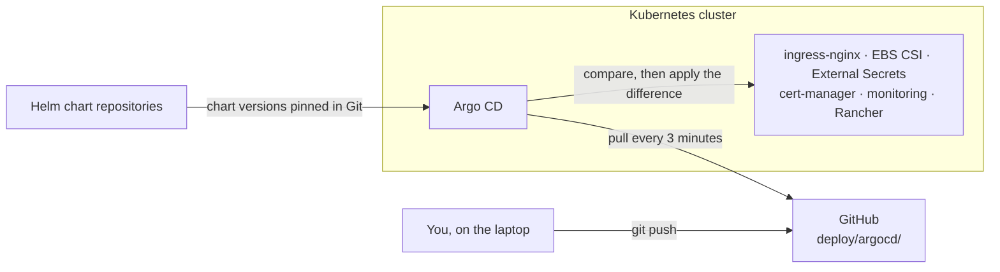
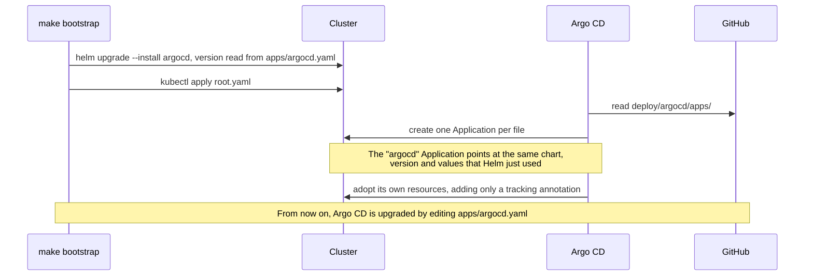
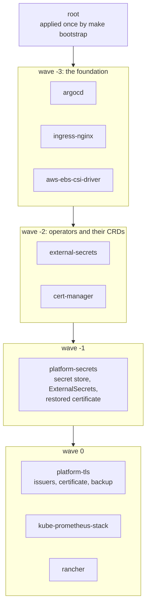
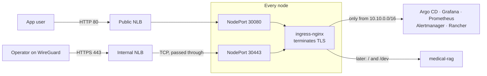
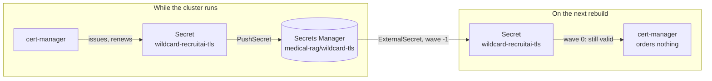
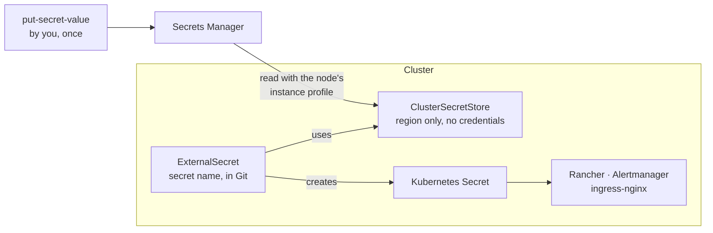
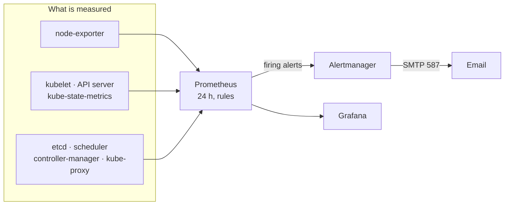
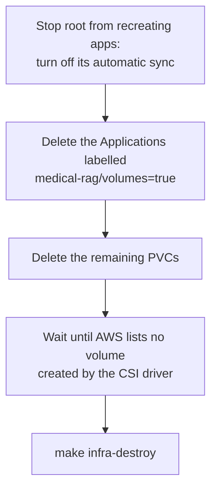

# GitOps architecture and folder structure

How Argo CD installs and keeps everything that runs inside the cluster, how the files under
`deploy/argocd/` are organised, and why the pieces start in the order they do. The build instructions
are in [`guide.md`](guide.md). Every file in the guide is commented, so the code explains each setting.

This phase covers Argo CD itself and the platform around the app: ingress-nginx, the EBS CSI driver,
External Secrets, cert-manager, monitoring with alert email, and Rancher. The app's Helm chart and
Jenkins come in the next phases and plug into the same structure.

**One rule for every internal tool:** its UI opens only through the VPN. Argo CD, Grafana, Prometheus,
Alertmanager and Rancher each have a name under `recruitai.io.vn` that points at the internal load
balancer (section 5).

## 1. The picture

Terraform built the machines and Ansible built the cluster. From here on, **Git is the only way to
change what runs in the cluster.** You do not run `helm install` or `kubectl apply` for an addon; you
commit a file, and Argo CD, which runs inside the cluster, notices and applies it.



Three properties follow from this:

- **Pull, not push.** No CI system or laptop needs access to the cluster to deploy. Argo CD reads a
  public repository from inside the cluster. The ops workstation keeps an admin kubeconfig, but uses
  it only to install Argo CD once, to check, and to tear down.
- **Git is the record.** What runs is what is committed. `git log deploy/` is the change history, and
  `git revert` is the rollback.
- **Drift is repaired.** If someone edits a Deployment by hand, Argo CD puts it back within minutes
  (`selfHeal`). A resource deleted from Git is deleted from the cluster (`prune`), except inside the
  `argocd` Application, where removals are left for a human to apply.

## 2. What Argo CD owns

| Tool | Owns | Lives in |
|---|---|---|
| Terraform | Network, machines, load balancers, IAM, buckets, registry, DNS names, secret *names* | `infra/terraform/` |
| Ansible | The operating system, containerd, the Kubernetes packages, `kubeadm`, Calico | `infra/ansible/` |
| **Argo CD** | **Everything running in the cluster: itself, the addons, Rancher, later Jenkins and the app** | `deploy/argocd/` |

**What Argo CD deliberately does not do**

- **It creates no AWS resource of its own.** The target groups for the two NodePorts, the DNS names,
  the IAM permissions and the secret names already exist in Terraform. Two things in the cluster touch
  AWS on its behalf, both within limits Terraform set: the EBS CSI driver creates volumes (which is why
  teardown has its own order, section 9), and cert-manager creates one temporary TXT record.
- **It holds no secret value.** Git contains the *name* of each secret in Secrets Manager, never the
  value. External Secrets copies the value into the cluster (section 7).
- **It needs no Git credential.** The repository is public, so Argo CD reads it anonymously and has
  no write access to it.

## 3. Bootstrap: who installs the installer?

Argo CD installs everything from Git, but something has to install Argo CD first. That happens once,
with `make bootstrap`, and then Argo CD takes over its own installation.



The takeover is safe because both installs render the same manifests from the same chart version and
the same values file. The only change Argo CD makes is to add its tracking annotation to each object,
so no pod restarts. `make bootstrap` reads the version from `apps/argocd.yaml` instead of repeating it,
so the two cannot drift apart. Running `make bootstrap` again later is harmless for the same reason.

## 4. App-of-apps and sync waves

`root.yaml` is an Application whose only job is to create the other Applications. Each file in
`deploy/argocd/apps/` describes one component: which chart, which version, which values file, which
namespace.



A wave starts only when every Application in the previous wave is **Healthy**. The order matters in
these places:

| Must come first | Before | Because |
|---|---|---|
| `aws-ebs-csi-driver` | `kube-prometheus-stack` | Prometheus asks for a volume; without the driver and the `gp3` StorageClass it stays `Pending` |
| `external-secrets`, `cert-manager` | `platform-secrets`, `platform-tls` | `ExternalSecret`, `Certificate` and `ClusterIssuer` are custom resources; applying one before its CRD exists fails |
| `platform-secrets` | `platform-tls` | The backed-up certificate must be back in the cluster before the `Certificate` exists, or cert-manager orders a new one (section 6) |
| `platform-secrets` | `rancher`, `kube-prometheus-stack` | Rancher's certificate and password, Grafana's password and Alertmanager's configuration must exist when they start |

The foundation has its own wave because nothing depends on it being late, and everything else runs
better once it is there: volumes bind at once, and the load balancer targets are healthy before any UI
is installed.

Argo CD stopped judging the health of an *Application* resource in version 1.8, so by default waves
between Applications do not wait for anything. The Argo CD values file adds the small health check that
restores this; without it, all waves would start at once.

## 5. Traffic into the cluster, and the internal UIs

The cluster has no AWS cloud controller, so a Service of type `LoadBalancer` would stay `Pending`
forever. Instead, Terraform already created both load balancers and pointed them at fixed NodePorts on
every node. ingress-nginx listens on exactly those ports.



An internal UI is protected in three layers:

| Layer | How |
|---|---|
| **DNS** | `argocd`, `grafana`, `prometheus`, `alertmanager` and `rancher` under `recruitai.io.vn` resolve to the internal load balancer's private addresses |
| **Network** | Those addresses are reachable only inside the VPC. From outside, that means the WireGuard gateway, which forwards nothing but DNS and TCP 443 |
| **ingress-nginx** | Every internal Ingress carries `allowlist-source-range: 10.10.0.0/16`. Through the public load balancer (port 80), even a forged `Host` header gets only a redirect to the unreachable HTTPS name; behind that, its internet source address would be refused |

The third layer depends on one setting: the ingress-nginx Service uses `externalTrafficPolicy: Local`.
With the default, kube-proxy replaces the source of every such connection with a node's VPC address, which the allowlist would accept. `Local` delivers it to the
controller on the node it arrived at, with the original address; that is also why the controller runs
on every node (a DaemonSet).

- **The load balancers work at TCP level.** The internal one passes TLS straight through; it never holds
  a private key.
- **Only Argo CD and Grafana have a login.** Prometheus and Alertmanager have none of their own; the VPN
  is their only protection (section 12).

## 6. Certificates

| Name | Certificate | Where it comes from | Renewal |
|---|---|---|---|
| `rancher.recruitai.io.vn` | Sectigo DV, bought | Secrets Manager → External Secrets → `tls-rancher-ingress` | By hand, before it expires (design §10) |
| Every other internal UI | Let's Encrypt wildcard `*.recruitai.io.vn` | cert-manager, DNS-01 through Route 53 | Automatic, about 30 days before expiry |

**Why DNS-01.** Let's Encrypt normally checks a domain by fetching a file over HTTP, which it cannot do
for names that point at private addresses. With DNS-01, cert-manager proves control of the domain by
creating the TXT record `_acme-challenge.recruitai.io.vn`. It is also the only method that allows a
wildcard. The node role may change exactly that record, and no other.

**One certificate, served by default.** A certificate Secret can be used only by Ingresses in its own
namespace, and the UIs that use it live in two (`argocd`, `monitoring`). Instead of copying it, ingress-nginx serves the wildcard
as its default certificate, and each internal Ingress lists its host under `tls` without a Secret.

**Keeping it across rebuilds.** Let's Encrypt issues at most five certificates for the same names in
seven days, and this cluster is rebuilt more often. So the certificate is backed up and restored:



cert-manager keeps a Secret it finds if the certificate is valid for the requested names and carries
annotations naming the same issuer, so the restore writes those annotations too. A renewal changes the
Secret, and the PushSecret backs up the new certificate.

## 7. Secrets flow



| Secrets Manager | Kubernetes Secret | Used by |
|---|---|---|
| `medical-rag/rancher-tls` | `cattle-system/tls-rancher-ingress` | Rancher's Ingress |
| `medical-rag/rancher` | `cattle-system/bootstrap-secret` | Rancher's first login |
| `medical-rag/alertmanager` | `monitoring/alertmanager-email`, rendered into a whole `alertmanager.yaml` | Alertmanager |
| `medical-rag/wildcard-tls` | `ingress-nginx/wildcard-recruitai-tls` (restored once, then backed up) | ingress-nginx |
| *(none, generated in the cluster)* | `monitoring/grafana-admin` | Grafana |

- **Git holds the name, Secrets Manager holds the value.** The value never passes through Git or
  Argo CD.
- **No credential is configured.** The ClusterSecretStore names only the region. External Secrets
  uses the AWS SDK's default chain, which finds the node's instance profile through the metadata service.
  Terraform limits that role to six named secrets, and to writing only `wildcard-tls`.
- **A whole config file can be a template.** Alertmanager wants its SMTP password inside its
  configuration. The routing rules are written in Git as an ExternalSecret template, and the account
  details are filled in from Secrets Manager.
- **Rotation is one command.** A new `put-secret-value` is picked up at the next refresh, with no commit.

## 8. Monitoring and alerting



- **The control plane is measured too.** kubeadm makes etcd, the scheduler, the controller manager and
  kube-proxy serve metrics on `127.0.0.1` only, where a pod cannot reach them. The Ansible kubeadm
  configuration moves them to the node address (Ansible guide step 11), which the node security group
  opens only to other nodes. On a cluster you build yourself, etcd's health is the thing most worth
  watching.
- **Prometheus decides that something is wrong; Alertmanager decides who hears about it.** Alerts are
  grouped by name and namespace, repeated every four hours while they fire, and followed by a resolved
  email. `Watchdog`, which always fires to prove the pipeline works, is routed nowhere.
- **Email through an app password, not Amazon SES.** SES accepts SMTP only with credentials derived
  from an IAM user access key, and this project has no access keys.
- **One rule of the project's own:** `NodeCpuHighSustained`. The `m7i-flex` nodes publish no CPU credit
  metric, so sustained high CPU is the only early sign they are about to be throttled.

## 9. Teardown

`make infra-destroy` removes the machines, but not EBS volumes the CSI driver created: Terraform never
knew about them, and they keep costing money after the cluster is gone. `make down` releases them first.



- **Why turn off root's sync first:** `root` would otherwise notice a missing Application and create it
  again.
- **Why delete PVCs separately:** a StatefulSet does not delete the PVCs made from its template when it
  is deleted.
- **Why the wait is a gate:** the `StorageClass` uses `reclaimPolicy: Delete`, so deleting a PVC makes
  the driver delete its EBS volume. `make down` asks AWS, not the cluster, whether any volume with the
  driver's tag is left. If one remains after five minutes, or AWS cannot be asked, it stops before
  destroying the cluster, while the driver still exists to finish the job.
- **Why the driver itself is not deleted:** without it, nothing can delete the volumes.
- **What survives:** everything in Secrets Manager, including the certificate backup. The PushSecret
  uses `deletionPolicy: None`, so neither teardown nor deleting it removes the backup.

## 10. Folder structure

```
deploy/argocd/
  root.yaml                          The app-of-apps; applied once by make bootstrap
  apps/                              One Application per component; root watches this folder
    argocd.yaml                      Argo CD managing its own chart, and its UI   wave -3
    ingress-nginx.yaml               NodePorts 30080 and 30443                    wave -3
    aws-ebs-csi-driver.yaml          Volumes, and the default gp3 StorageClass    wave -3
    external-secrets.yaml            The operator and its CRDs                    wave -2
    cert-manager.yaml                The operator and its CRDs                    wave -2
    platform-secrets.yaml            manifests/platform-secrets/                  wave -1
    platform-tls.yaml                manifests/platform-tls/                      wave 0
    kube-prometheus-stack.yaml       Prometheus, Alertmanager, Grafana            wave 0
    rancher.yaml                     Private management UI                        wave 0
  values/                            Helm values, one file per chart
    argocd.yaml
    ingress-nginx.yaml
    aws-ebs-csi-driver.yaml
    external-secrets.yaml
    cert-manager.yaml
    kube-prometheus-stack.yaml
    rancher.yaml
  manifests/
    platform-secrets/                Plain YAML, no chart
      namespaces.yaml                cattle-system and monitoring
      cluster-secret-store.yaml      How External Secrets reaches Secrets Manager
      rancher-secrets.yaml           tls-rancher-ingress and bootstrap-secret
      wildcard-tls-restore.yaml      Puts the backed-up certificate into a new cluster
      grafana-admin.yaml             A generated password for Grafana
      alertmanager-email.yaml        Alertmanager's configuration, with SMTP details filled in
    platform-tls/
      cluster-issuers.yaml           Let's Encrypt staging and production, DNS-01 via Route 53
      wildcard-certificate.yaml      *.recruitai.io.vn, in the ingress-nginx namespace
      wildcard-tls-backup.yaml       PushSecret: the certificate to Secrets Manager
```

Two details are easy to get wrong:

- **An Application for a chart has two sources.** The chart comes from its Helm repository; the values
  file comes from this Git repository, referenced as `$values/deploy/argocd/values/<name>.yaml`. That
  keeps the chart out of Git and the values in it.
- **Namespaces used by `platform-secrets` are created by `platform-secrets`.** Its ExternalSecrets
  land in `cattle-system` and `monitoring` before the Rancher and monitoring charts exist, so the
  namespaces cannot wait for those charts to create them.

## 11. Pinned versions

Checked on 2026-09-17 against each project's chart repository.

| Chart | Version | App version | Why this one |
|---|---|---|---|
| `argo-cd` | 10.9.2 | Argo CD v3.5.3 | The current release |
| `ingress-nginx` | 4.15.1 | controller 1.15.1 | The **final** release; the project is retired (section 12) |
| `aws-ebs-csi-driver` | 2.66.0 | driver 1.66.0 | The current release |
| `external-secrets` | 2.10.0 | v2.10.0 | The current release; serves the `external-secrets.io/v1` API |
| `cert-manager` | v1.21.2 | v1.21.2 | The current release |
| `kube-prometheus-stack` | 91.4.1 | operator v0.94.0 | The current release |
| `rancher` | 2.15.1 | Rancher 2.15.1 | Its `kubeVersion: < 1.37.0-0` accepts the cluster's 1.36.4 ([design §4.2.1](../selfmanaged-k8s-ops-design.md#421-rancher-gitops-contract-and-compatibility-gate)) |

Every version is written once, as `targetRevision` in `deploy/argocd/apps/<name>.yaml`. An upgrade is a
one-line pull request.

## 12. Known limits

| Limit | Why it is accepted here | What would fix it |
|---|---|---|
| **ingress-nginx is retired.** Maintenance ended in March 2026; there are no more security fixes, and Kubernetes 1.36 came after its last release | The design, the Terraform NodePorts and Rancher's `ingressClassName` are built around it, and the traffic reaching it is either the demo app or a VPN user | Move to a maintained controller or to Gateway API; the NodePorts stay the same |
| **Every pod on a node shares the node's IAM role**, which now also includes writing the certificate backup and the ACME TXT record | Self-managed clusters have no IRSA or Pod Identity; the hop limit of 2 lets any pod reach the metadata service. Each permission is limited to its exact resource | A NetworkPolicy blocking `169.254.169.254` for app namespaces (the app phase), then self-hosted IRSA, a later improvement the design lists as P2 |
| **Prometheus and Alertmanager have no login** | Only the VPN reaches them, and the VPN has a single operator | Basic authentication on their Ingresses, or an OAuth proxy in front of all UIs |
| **The wildcard certificate's private key is in Secrets Manager**, readable by the node role | Needed to survive rebuilds within Let's Encrypt's limits; the certificate only covers VPN-only names | Separate backup permissions from workloads once IRSA exists |
| **Alert email depends on one mailbox and an app password** | Enough for one operator | A team mail service or a chat receiver; a second receiver as fallback |
| **One replica** of Rancher, Alertmanager and each Argo CD component | Three 8 GB nodes also run Prometheus and, later, Jenkins | Raise replicas when the nodes grow |
| **etcd metrics use plain HTTP on port 2381** | They carry no data, and only other nodes (and pods) can reach the port | Scrape through TLS with etcd's client certificates |
| **The etcd backup bucket is destroyed with the cluster** | It lives in the cluster stack | Move it to the shared stack before relying on backups (day-2 phase) |
