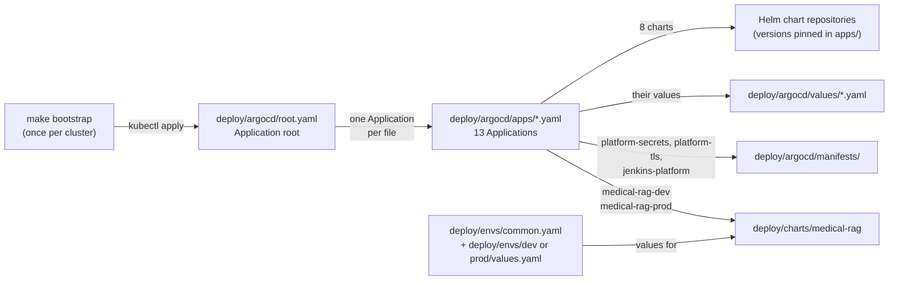
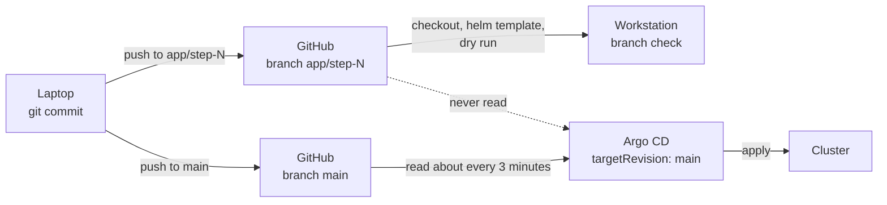
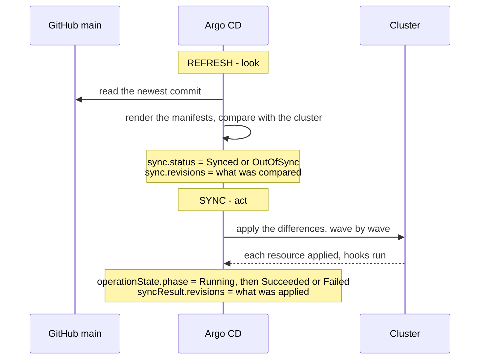
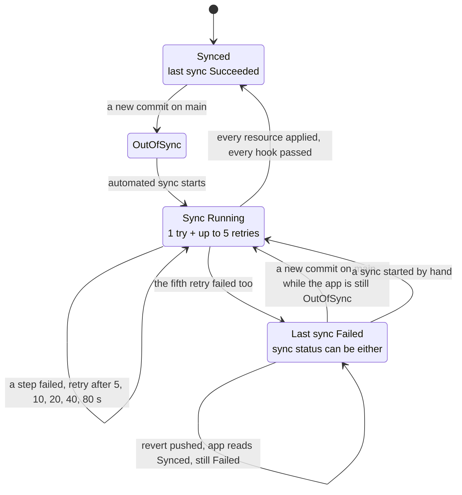
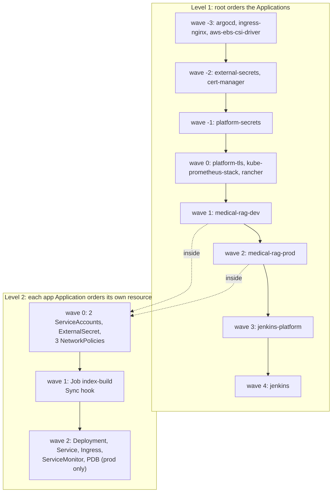
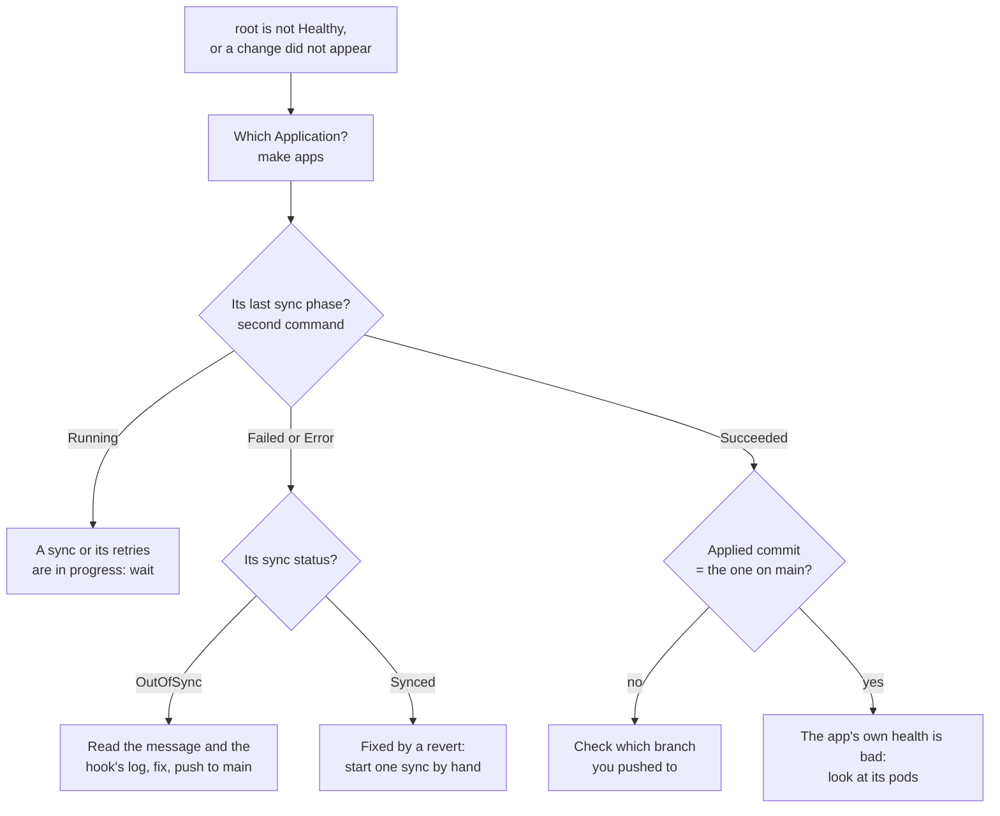

# Argo CD, explained in pictures

This page shows what Argo CD *does* and *when*: which files it reads, when it notices a commit, what its
status fields mean, and what happens when a sync fails. Why the setup is built this way is in the
[GitOps README](README.md) and the [app README](../app/README.md). There are no step-by-step instructions
here, and only three commands, at the end.

The diagrams render on GitHub. Each one is followed by a few lines that say the same thing in words.

**Words used on this page**

| Word | Meaning |
|---|---|
| Application | An Argo CD object that says "install *this* from Git or a chart into *that* namespace" |
| render | Turn a chart and its values files into plain Kubernetes YAML |
| `Synced` / `OutOfSync` | The cluster matches what Git renders / it does not |
| sync | Apply the rendered YAML to the cluster |
| hook | A Job that Argo CD runs during a sync. It is not counted in the Application's health |
| prune | Delete from the cluster what is no longer in Git |
| `$values` | A second source in an Application, used only to read values files from this repository |
| health check | A small Lua script in `deploy/argocd/values/argocd.yaml` that decides how healthy a child Application looks to `root` |

Contents:
1. [Who reads which file](#1-who-reads-which-file)
2. [From a Git branch to the cluster](#2-from-a-git-branch-to-the-cluster)
3. [Refresh and sync, and the status fields](#3-refresh-and-sync-and-the-status-fields)
4. [The life of an automated sync](#4-the-life-of-an-automated-sync)
5. [Two levels of waves](#5-two-levels-of-waves)
6. [Where to look when something is wrong](#6-where-to-look-when-something-is-wrong)

---

## 1. Who reads which file



Every arrow after `root.yaml` is followed by Argo CD, not by you.

- **You apply one file by hand, once: `root.yaml`.** `make bootstrap` does it. From then on, `root`
  creates one Application for every file in `deploy/argocd/apps/`. Each of those files says what to install
  and from where.
- **Platform components** come from a public Helm chart, with a values file from `deploy/argocd/values/`.
  Three of them, `platform-secrets`, `platform-tls` and `jenkins-platform`, are plain YAML from
  `deploy/argocd/manifests/`.
- **The app** comes from the chart in this repository, `deploy/charts/medical-rag`, with two values files:
  `common.yaml` first, then the environment's own. The files `apps/medical-rag-dev.yaml` and
  `apps/medical-rag-prod.yaml` list these values files, and read them through `$values`.
- **Nobody runs `helm install` for the app.** Argo CD renders the chart itself. The `helm template` you run
  on the workstation during a branch check only previews what Argo CD will render.

**Argo CD also manages itself.** `apps/argocd.yaml` points at the same chart, version and values file that
`make bootstrap` installed. So after the first install, Argo CD keeps its own installation up to date from
Git: to upgrade it, you change `targetRevision` in `apps/argocd.yaml` and push. How the takeover works is
in [README §3](README.md#3-bootstrap-who-installs-the-installer).

**A new cluster means a new `admin` password.** Argo CD generates it when it is installed. The password
from the old cluster no longer works; read the new one from the Secret `argocd-initial-admin-secret`.

## 2. From a Git branch to the cluster



Every Git source in `deploy/argocd/` has `targetRevision: main`. **A commit reaches the cluster only when
it is on `main`.** A temporary branch is for checking on the workstation; Argo CD never looks at it.

This happened on 2026-09-19. The step 19 commit (`822d377`) was pushed to `app/step-18` by mistake, and
`main` stayed at the step 18 commit. Argo CD did the right thing: it kept step 18 in the cluster. Nothing
looked broken; the new objects simply never appeared. So when a change does not appear, first check which
commit is on `main`.

## 3. Refresh and sync, and the status fields



Argo CD does two different things, and each one writes its own fields:

- **Refresh** only *looks*. Argo CD reads Git, renders the manifests, and compares them with the cluster.
  It does this by itself about every 3 minutes (the default), or at once when the
  `argocd.argoproj.io/refresh` annotation is set, which the guides do after each push.
- **Sync** *acts*: it applies the differences. The Applications here have `automated` sync, so a refresh
  that finds `OutOfSync` starts a sync by itself.

So `sync.revisions` changes as soon as Argo CD has *seen* a commit, and `syncResult.revisions` only once it
has *applied* it. To know that a change is really in the cluster, look at the second one, or at the phase.

All the fields live on the Application object, in the `argocd` namespace:

| Field | Values | Answers |
|---|---|---|
| `status.sync.status` | `Synced`, `OutOfSync` | Does the cluster match what Git renders? |
| `status.health.status` | `Healthy`, `Progressing`, `Degraded`, `Missing`, `Suspended`, `Unknown` | Do the live objects work? Hooks are not counted |
| `status.operationState.phase` | `Running`, `Succeeded`, `Failed`, `Error`, `Terminating` | How did the last sync go? |
| `status.sync.revisions` | one entry per source | What Argo CD compared last |
| `status.operationState.syncResult.revisions` | one entry per source | What the last sync applied |

Most Applications here have two sources: a chart, then this repository for `$values`. For a chart from a
Helm repository the entry is the chart version; for this repository it is a commit. So the commit is entry
`[1]` for a platform Application, while for the app, whose two sources are both this repository, entries
`[0]` and `[1]` are the same commit. `platform-secrets`, `platform-tls` and `jenkins-platform` have a single
source, and their fields are named `revision`, without the `s`.

## 4. The life of an automated sync



- **A failed sync is retried five times.** The Applications here set no `syncPolicy.retry`, so Argo CD
  gives each automated sync `retry: {limit: 5}` itself. The waits between tries add up to 155 s, and each try
  runs the hook Job again. In app step 17 the fifth retry was scheduled seven minutes after the test
  commit.
- **After the fifth retry, the phase is `Failed`, and it stays `Failed`.** Argo CD does not start another
  automated sync for the same commit. It also records the error in `status.conditions`.
- **A revert does not clear it by itself.** The failed sync stopped before wave 2, so after the revert, Git
  and the cluster match again: the app reads `Synced`, and automated sync has nothing to do. The last sync
  is still `Failed`. Start one sync by hand (step 17 of the app guide shows how); only a successful sync
  replaces the `Failed`.

**What `root` shows.** The health check in `deploy/argocd/values/argocd.yaml` looks at each child
Application, in this order:

| The child Application | `root` shows |
|---|---|
| Has the label `medical-rag/report-failed-sync` (the two app Applications, `jenkins-platform` and `jenkins`) and its last sync is `Failed` or `Error` | `Degraded`, with the sync's message |
| Health `Degraded` | `Degraded` |
| `Synced` and `Healthy`, but has no resources at all (a wrong `path:`) | `Degraded` |
| `Synced` and `Healthy` | `Healthy` |
| Anything else: `OutOfSync`, `Progressing`, `Missing`, `Suspended` | `Progressing`, until it changes |

So during the retries, `root` reads `Progressing` because the app is still `OutOfSync` (its wave 2 was not
applied), not because of the `Running` phase. A platform Application without that label — everything in waves
-3 to 0 — shows a failed sync on `root` only if it leaves the Application `OutOfSync` or `Degraded`; the two
Jenkins Applications carry the label and report it directly.

This is exactly what the failure test of app step 17 recorded: `root` read `Progressing` during the
retries, then `Degraded` with `… (retried 5 times)`, while the running pod stayed Ready
([evidence](../evidence/app.md)).

## 5. Two levels of waves



There are two unrelated sets of wave numbers:

- **Level 1**, in `deploy/argocd/apps/*.yaml`: `root` creates the Applications in this order, and starts a
  wave only when every Application of the previous one is `Synced` and `Healthy`. This matters when `root`
  itself syncs, for example on a new cluster. **For a normal release, each app Application syncs on its
  own:** prod does not wait for dev. The two Jenkins Applications are ordered against each other for a real
  reason: the chart in wave 4 mounts Secrets and a ServiceAccount that wave 3 creates.
- **Level 2**, in `deploy/charts/medical-rag/templates/*.yaml`: inside one Application, Argo CD applies wave
  0, waits for it to be healthy, runs the index Job, then applies wave 2. So the pods start only after
  their Secret exists and their index version is in S3.

**Hooks are left out of health.** Argo CD runs the index Job during the sync, but ignores it for health.
So a failed Job leaves the app `Healthy`. The `report-failed-sync` label from section 4 is what makes
`root` show the failure.

## 6. Where to look when something is wrong



The three commands, all read-only, on the workstation:

```bash
# 1. Every Application: sync and health
make apps

# 2. One Application: sync, health, phase, commit seen, commit applied
kubectl -n argocd get applications.argoproj.io medical-rag-dev \
  -o jsonpath='{.status.sync.status} {.status.health.status} {.status.operationState.phase} {.status.sync.revisions[1]} {.status.operationState.syncResult.revisions[1]}{"\n"}'

# 3. The commit on main, which Argo CD should reach
git ls-remote origin main
```

Replace `medical-rag-dev` in the second command with the Application you are looking at.

---

Wave numbers and file paths checked against `deploy/` on 2026-09-21, after the Jenkins phase. When you change
a `sync-wave` annotation, update section 5 here and the diagram in
[README §4](README.md#4-app-of-apps-and-sync-waves).
