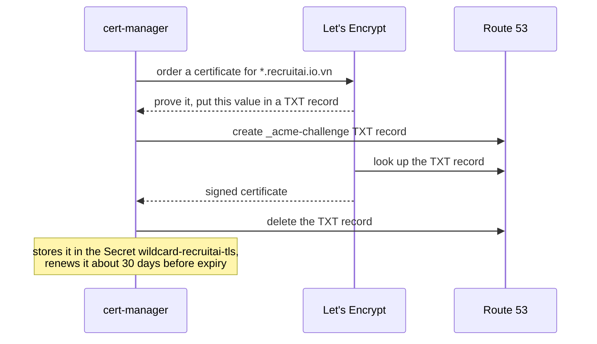
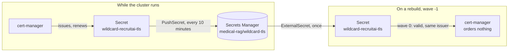
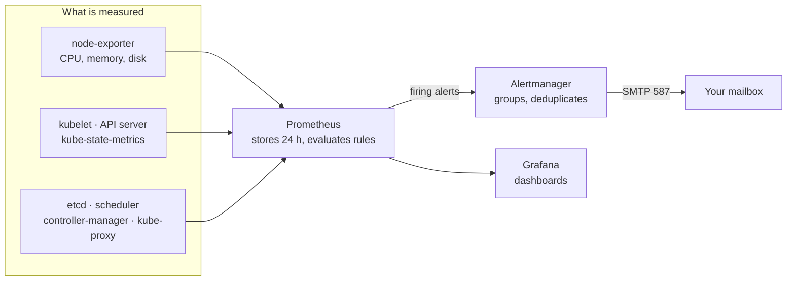

# GitOps guide

A step-by-step guide that installs Argo CD on the cluster Ansible built, and then lets Argo CD install
everything else from Git: ingress-nginx, the EBS CSI driver, External Secrets, cert-manager, monitoring
with alert email, and Rancher. Every internal UI (Argo CD, Grafana, Prometheus, Alertmanager, Rancher)
opens only through the VPN.
Every file is commented, so the code you copy explains itself. The architecture overview is in
[`README.md`](README.md) next to this file. Follow the steps in order: each one ends with a check, and
the next step assumes it passed.

## How this guide works

**Start here when:**

- [Ansible guide](../ansible/guide.md) steps 10 and 11 are done: a second `make cluster` changes
  nothing, and the control-plane metrics listen on the node address.
- [Terraform guide](../terraform/guide.md) Parts D and E (steps 16–19) are done: Secrets Manager holds
  the Rancher certificate and password and the SMTP settings, the internal UI names exist, and the
  WireGuard tunnel shows a handshake.

**Where commands run.** No ops tool is installed on your laptop.

| Where | What you do there |
|---|---|
| **Laptop:** editor + Git Bash | Write the files shown in each step, commit, push to GitHub |
| **Laptop:** PowerShell, browser, WireGuard app | Steps 9–11 and 13, to open the internal UIs through the VPN |
| **Ops workstation:** EC2 Ubuntu, opened with Session Manager | `git pull`, `make`, `kubectl`, checks |
| **WireGuard gateway:** a shell opened from the workstation with `aws ssm start-session` | Step 11 only, to test a certificate chain from inside the VPC |

**One idea to keep in mind.** After step 3 you never install an addon by hand again. You add a file
under `deploy/argocd/`, push it, and Argo CD installs it. **The push is the deploy.** The commands in
each step after that are **checks**, not installs.

**Every step has the same shape:** goal → files → why → commit and push → check.

**Commands are short on purpose.** Each line does one thing, and a value you need twice is saved in a
variable on its own line first. A long command is split over several lines with `\`, one option per
line. When something fails, you know exactly which part.

**References.** "Criterion #4" and "#5" are rows of the definition of done in
[design §6](../selfmanaged-k8s-ops-design.md#6-verification-and-evidence-definition-of-done); "§4.2.1"
is the [Rancher contract and compatibility gate](../selfmanaged-k8s-ops-design.md#421-rancher-gitops-contract-and-compatibility-gate).

**Versions** (checked 2026-09-17): Argo CD chart 10.9.2 (Argo CD v3.5.3), ingress-nginx 4.15.1,
aws-ebs-csi-driver 2.66.0, external-secrets 2.10.0, cert-manager v1.21.2, kube-prometheus-stack 91.4.1,
Rancher 2.15.1.
Region `ap-southeast-1`.

## Roadmap

| Step | Result | Done when |
|---|---|---|
| 1 | Cluster up, tunnel open, secrets present | 3 nodes `Ready`; the Rancher and alertmanager secrets have a current version |
| 2 | Argo CD installed by hand | Every Argo CD pod `Running`; the API answers `ok` |
| 3 | `root` app-of-apps, Argo CD manages itself, `make bootstrap` | `argocd` and `root` are `Synced` and `Healthy` |
| 4 | ingress-nginx | Both ingress target groups `healthy`; the public NLB answers `404` |
| 5 | EBS CSI driver + `gp3` StorageClass | A test volume is created, used and deleted |
| 6 | External Secrets + `platform-secrets` | `tls-rancher-ingress` exists, with the right certificate |
| 7 | cert-manager + wildcard certificate | `*.recruitai.io.vn` `READY True`, issued by Let's Encrypt production |
| 8 | Certificate backup and restore | The certificate is in Secrets Manager; the restore object is `SecretSynced` |
| 9 | Argo CD UI | `argocd.recruitai.io.vn`: no VPN → timeout; VPN → login works |
| 10 | Monitoring, alert email, 3 UIs | Every target `up` incl. etcd; a test alert arrives by email; Grafana, Prometheus, Alertmanager open through the VPN |
| 11 | Rancher | Criterion #4: no VPN → timeout; VPN → `pong`; the chain verifies; the UI loads |
| 12 | `make down` by hand, then as a target | No CSI volume left in EC2, cluster destroyed |
| 13 | Rebuild from nothing, evidence | Every Application `Synced` and `Healthy`; no new certificate ordered; times recorded |

## The loop for every step

1. **Laptop:** create or edit the files, then in Git Bash:
   ```bash
   git add deploy
   git commit -m "<the message given in the step>"
   git push
   ```
2. **Workstation:** open Session Manager, then:
   ```bash
   sudo su - ubuntu
   tmux new -As k8s                       # re-attaches if the session already exists
   cd ~/Medical-RAG-Chatbot
   git pull
   ```
3. **Workstation, from step 3 on** (before that, Argo CD does not exist yet): ask Argo CD to read Git
   now instead of within the next three minutes. `--all` matters: a changed file inside an existing
   Application is noticed only when that Application is refreshed, not just `root`.
   ```bash
   kubectl -n argocd annotate applications --all argocd.argoproj.io/refresh=normal --overwrite
   ```
4. **Workstation:** run the checks of the step.

**tmux windows.** tmux numbers its windows from 0, and the status bar at the bottom shows them. This
guide uses three:

| Window | Used for | How to get there |
|---|---|---|
| 0 | Everything else: `make`, `kubectl`, checks | `Ctrl-b 0` |
| 1 | `make tunnel`, open the whole time | `Ctrl-b c` the first time, then `Ctrl-b 1` |
| 2 | A short-lived port-forward, only in step 2 | `Ctrl-b c`; close it with `Ctrl-C`, then `exit` |

kubectl reaches the API through the tunnel. If window 1 closes, kubectl answers `connection refused`;
open it again and run `make tunnel`.

**Reading the Application list.** You will run this often:
```bash
kubectl -n argocd get applications
```
`SYNC STATUS` says whether the cluster matches Git (`Synced`) or not (`OutOfSync`). `HEALTH STATUS`
says whether what was applied actually works (`Healthy`), is still starting (`Progressing`), or is
broken (`Degraded`). A step is done when its new line shows `Synced` and `Healthy`.

---

## Step 1 — Cluster up, tunnel open, secrets present

**Goal:** a running cluster, kubectl working from the workstation, and the two Rancher secrets filled
in, before anything is installed.

No files in this step.

**Run** on the workstation, window 0:
```bash
make infra
make cluster
```
Open window 1 (`Ctrl-b c`) and start the tunnel there. If window 1 already exists from the Ansible
guide, switch to it with `Ctrl-b 1` instead, stop whatever runs there with `Ctrl-C`, and start the
tunnel again. Leave it running:
```bash
cd ~/Medical-RAG-Chatbot
make tunnel
```
Back to window 0 (`Ctrl-b 0`).

**Check:**
```bash
kubectl get nodes
```
Three nodes, all `Ready`.

```bash
helm version --short
```
`v4.3.0+g…`. Helm was installed on the workstation by cloud-init; it is needed only for the first
Argo CD install.

The secrets the addons read must have a value, or those steps wait forever. This shows only version
labels, never the value:
```bash
aws secretsmanager list-secret-version-ids \
  --secret-id medical-rag/rancher-tls \
  --query 'Versions[].VersionStages'
aws secretsmanager list-secret-version-ids \
  --secret-id medical-rag/rancher \
  --query 'Versions[].VersionStages'
aws secretsmanager list-secret-version-ids \
  --secret-id medical-rag/alertmanager \
  --query 'Versions[].VersionStages'
```
Each prints a list containing `"AWSCURRENT"`. An empty list `[]` means the value was never stored: go
back to [Terraform guide step 17](../terraform/guide.md#step-17--migrate-dns-and-store-the-keys) for the
two Rancher secrets, or step 19 for `alertmanager`.

`medical-rag/wildcard-tls` is expected to be **empty** the very first time; step 8 fills it.

Nothing to commit.

---

## Step 2 — Install Argo CD by hand

**Goal:** understand what `make bootstrap` will do, by doing it once yourself.

Create `deploy/argocd/values/argocd.yaml`:
```yaml
# Values for the argo-cd chart. The same file is used twice: by the first `helm install` (step 2,
# later `make bootstrap`), and by the argocd Application that makes Argo CD manage itself (step 3).
# Keeping one file is what lets that takeover leave the running pods alone.

# Single sign-on is not used; kubectl and the admin account are enough for one operator.
dex:
  enabled: false

# No notification channel exists yet. Disabled rather than running with nothing to send to.
notifications:
  enabled: false

configs:
  cm:
    # Argo CD 1.8 stopped computing the health of Application resources. Without this check, an
    # Application is "healthy" the moment it is created, so the sync waves in deploy/argocd/apps/
    # would not wait for each other and Rancher could start before its certificate exists.
    # The Lua below copies each child Application's own health status.
    resource.customizations.health.argoproj.io_Application: |
      hs = {}
      hs.status = "Progressing"
      hs.message = ""
      if obj.status ~= nil then
        if obj.status.health ~= nil then
          hs.status = obj.status.health.status
          if obj.status.health.message ~= nil then
            hs.message = obj.status.health.message
          end
        end
      end
      return hs

# Requests reserve room on the 8 GB nodes; limits stop one component from starving the others. These
# are starting points for a small cluster, not measured values.
controller:
  resources:
    requests:
      cpu: 250m
      memory: 512Mi
    limits:
      memory: 1Gi

server:
  resources:
    requests:
      cpu: 50m
      memory: 128Mi
    limits:
      memory: 256Mi

repoServer:
  resources:
    requests:
      cpu: 100m
      memory: 256Mi
    limits:
      memory: 512Mi

redis:
  resources:
    requests:
      cpu: 50m
      memory: 64Mi
    limits:
      memory: 128Mi

applicationSet:
  resources:
    requests:
      cpu: 25m
      memory: 64Mi
    limits:
      memory: 128Mi
```

**Why:**

- **Helm, not `kubectl apply` of the upstream manifest.** The chart takes a values file, and Argo CD
  can later install the exact same chart with the exact same file. That is what lets Argo CD take over
  its own installation without changing anything.
- **The health check.** Every later step depends on waves waiting for each other. Without these
  lines the problem is silent: everything starts at once, and a few Applications fail and retry until
  their dependencies happen to be ready.

**Commit and push** (the loop, message `Add the Argo CD values`), then `git pull` on the workstation.

**Run** on the workstation, one line at a time:
```bash
helm repo add argo https://argoproj.github.io/argo-helm      # where the chart comes from
helm repo update argo                                        # fetch its current index
helm show chart argo/argo-cd --version 10.9.2                # the version exists
```
The last command prints `version: 10.9.2` and `appVersion: v3.5.3`.

```bash
kubectl create namespace argocd
helm install argocd argo/argo-cd \
  --namespace argocd \
  --version 10.9.2 \
  --values deploy/argocd/values/argocd.yaml
```
`STATUS: deployed`. Helm returns before the pods are ready, so wait for them:
```bash
kubectl -n argocd rollout status deployment/argocd-server --timeout=5m
kubectl -n argocd rollout status statefulset/argocd-application-controller --timeout=5m
kubectl -n argocd get pods
```
Every pod `Running` and `READY 1/1`. No `dex` and no `notifications` pod.

**Check** that the API server answers. Open window 2 (`Ctrl-b c`) and start a port-forward:
```bash
kubectl -n argocd port-forward service/argocd-server 8080:443
```
In window 0 (`Ctrl-b 0`):
```bash
curl -sk https://127.0.0.1:8080/healthz
```
Prints `ok`. Go back to window 2, stop the port-forward with `Ctrl-C`, and close the window with `exit`.

This is the only time the Argo CD server is contacted through a port-forward; step 9 gives its UI an
internal name.

---

## Step 3 — The root Application, and Argo CD managing itself

**Goal:** Argo CD reads `deploy/argocd/apps/` from Git, and its own installation is one of the files
in there.

Create `deploy/argocd/root.yaml`:
```yaml
# The app-of-apps. Its only job is to create one Application for each file in deploy/argocd/apps/.
# It is applied once, by `make bootstrap`; everything else arrives by committing a file.
apiVersion: argoproj.io/v1alpha1
kind: Application
metadata:
  name: root
  namespace: argocd
  # No resources-finalizer on purpose. With one, deleting `root` would also delete every child
  # Application, and with them whatever those Applications cascade-delete. Without it, deleting
  # `root` deletes only `root`.
spec:
  project: default
  source:
    # The repository is public, so Argo CD reads it without any credential.
    repoURL: https://github.com/biabeogo147/Medical-RAG-Chatbot.git
    targetRevision: main
    path: deploy/argocd/apps
  destination:
    server: https://kubernetes.default.svc   # this cluster
    namespace: argocd                        # Application resources live next to Argo CD
  syncPolicy:
    automated:
      prune: true      # a file removed from apps/ removes its Application
      selfHeal: true   # an Application edited by hand is put back to what Git says
```

Create `deploy/argocd/apps/argocd.yaml`:
```yaml
# Argo CD managing its own chart. Same chart, same version, same values file as the first install,
# so adopting the running installation changes only Argo CD's tracking annotation. To upgrade Argo CD
# later, change targetRevision here and push; `make bootstrap` also reads the version from this line.
apiVersion: argoproj.io/v1alpha1
kind: Application
metadata:
  name: argocd
  namespace: argocd
  annotations:
    # The foundation starts first. Waves run from the lowest number up.
    argocd.argoproj.io/sync-wave: "-3"
  # No resources-finalizer: deleting this Application must never uninstall Argo CD.
spec:
  project: default
  # Two sources: the chart from its Helm repository, and the values file from this Git repository.
  sources:
    - repoURL: https://argoproj.github.io/argo-helm
      chart: argo-cd
      targetRevision: 10.9.2
      helm:
        releaseName: argocd   # the name used by `helm install`; resource names depend on it
        valueFiles:
          - $values/deploy/argocd/values/argocd.yaml
    - repoURL: https://github.com/biabeogo147/Medical-RAG-Chatbot.git
      targetRevision: main
      ref: values   # makes `$values` above mean "the root of this repository"
  destination:
    server: https://kubernetes.default.svc
    namespace: argocd
  syncPolicy:
    automated:
      # Not pruned automatically: a mistake in this chart's values could otherwise delete the
      # controller that is running the sync. Removals here are applied by hand, after a look.
      prune: false
      selfHeal: true
    syncOptions:
      # The Argo CD CRDs are too large for a client-side apply, which stores the whole object in an
      # annotation limited to 262 KB. Server-side apply has no such annotation.
      - ServerSideApply=true
```

**Why:**

- **`root` has no finalizer, `argocd` has no finalizer.** A finalizer turns "delete this Application"
  into "delete everything it installed". That is what you want for an addon during teardown (step 12),
  and never what you want for Argo CD itself or for the parent of everything.
- **`ServerSideApply=true`.** Large CRDs fail a client-side apply with `metadata.annotations: Too long`.
  Every Application below uses it, so the rule is simple. `root` does not need it: it applies only
  small Application objects.

**Commit and push** (message `Add the root Application`), `git pull` on the workstation.

**Run:**
```bash
kubectl apply -f deploy/argocd/root.yaml
```

**Check:**
```bash
kubectl -n argocd get applications
```
Within a minute or two:
```
NAME     SYNC STATUS   HEALTH STATUS
argocd   Synced        Healthy
root     Synced        Healthy
```
`argocd` may show `OutOfSync` briefly first. Argo CD marks what it manages with an annotation, and the
objects Helm created do not have it yet; the first automatic sync adds it. Prove that this was all it
changed: the pods were not restarted.
```bash
kubectl -n argocd get pods
```
The `AGE` column still counts from the `helm install` in step 2.

**Now the make target.** You have just done by hand everything `make bootstrap` needs to do on a fresh
cluster. Add to the `Makefile`. **Recipe lines start with a tab, not spaces**; spaces give
`missing separator`.
```makefile
# --- GitOps: Argo CD, then everything Argo CD installs from deploy/argocd/ ----------------------
ARGOCD_APP     := deploy/argocd/apps/argocd.yaml
ARGOCD_VALUES  := deploy/argocd/values/argocd.yaml
# The chart version is written once, in the Application Argo CD uses to manage itself. Reading it
# here means the first install and the self-managed one can never disagree.
ARGOCD_VERSION  = $(shell yq '.spec.sources[0].targetRevision' $(ARGOCD_APP))

.PHONY: bootstrap apps

# Install Argo CD and hand it the root Application. Needs `make tunnel` open in another window.
# Safe to run again: same chart, same version, same values.
bootstrap:
	helm repo add argo https://argoproj.github.io/argo-helm --force-update
	helm upgrade --install argocd argo/argo-cd \
	  --namespace argocd --create-namespace \
	  --version $(ARGOCD_VERSION) \
	  --values $(ARGOCD_VALUES) \
	  --wait --timeout 10m
	kubectl apply -f deploy/argocd/root.yaml

# Sync and health of everything Argo CD manages.
apps:
	kubectl -n argocd get applications
```

**Commit** on the laptop, then `git pull` on the workstation:
```bash
git add Makefile
git commit -m "Add make bootstrap"
git push
```

**Check the target** without changing anything:
```bash
make -n bootstrap
```
`-n` prints the commands instead of running them. The `helm upgrade` line must contain
`--version 10.9.2`. Then run it for real; it is harmless on a cluster that already has Argo CD:
```bash
make bootstrap
make apps
```
Still `argocd` and `root`, both `Synced` and `Healthy`.

---

## Step 4 — ingress-nginx

**Goal:** the two load balancers Terraform created find a controller behind their NodePorts.

Create `deploy/argocd/values/ingress-nginx.yaml`:
```yaml
controller:
  # One controller on every node. The load balancers send traffic to all three nodes, and each
  # node's health check passes only if something answers on its NodePort.
  kind: DaemonSet

  service:
    # The cluster has no AWS cloud controller, so a LoadBalancer Service would stay Pending forever.
    # Terraform created the load balancers instead and pointed them at these fixed ports.
    type: NodePort
    nodePorts:
      http: 30080    # public NLB, port 80   (infra/terraform/cluster/loadbalancers.tf)
      https: 30443   # internal NLB, port 443 (infra/terraform/cluster/rancher.tf)
    # Deliver each connection to the controller on the node it arrived at, keeping the caller's real
    # address. With the default ("Cluster"), kube-proxy replaces the source of every such connection
    # with a node's VPC address, and the VPC-only allowlist on the internal UIs (step 9)
    # would let internet traffic through. With one controller per node, every node has one to deliver to.
    externalTrafficPolicy: Local

  extraArgs:
    # The certificate served when an Ingress lists a TLS host without its own Secret: the wildcard
    # *.recruitai.io.vn from step 7. Until it exists, nginx serves a self-signed placeholder.
    default-ssl-certificate: ingress-nginx/wildcard-recruitai-tls

  ingressClassResource:
    name: nginx
    # Ingresses that name no class use this one.
    default: true

  resources:
    requests:
      cpu: 100m
      memory: 128Mi
    limits:
      memory: 256Mi
```

Create `deploy/argocd/apps/ingress-nginx.yaml`:
```yaml
# ingress-nginx: the single entry point for HTTP(S) traffic into the cluster.
# The project was retired upstream in March 2026 and 4.15.1 is its final release. It stays because the
# NodePorts and Rancher's ingressClassName depend on it; see "Known limits" in README.md.
apiVersion: argoproj.io/v1alpha1
kind: Application
metadata:
  name: ingress-nginx
  namespace: argocd
  annotations:
    argocd.argoproj.io/sync-wave: "-3"
spec:
  project: default
  sources:
    - repoURL: https://kubernetes.github.io/ingress-nginx
      chart: ingress-nginx
      targetRevision: 4.15.1
      helm:
        releaseName: ingress-nginx
        valueFiles:
          - $values/deploy/argocd/values/ingress-nginx.yaml
    - repoURL: https://github.com/biabeogo147/Medical-RAG-Chatbot.git
      targetRevision: main
      ref: values
  destination:
    server: https://kubernetes.default.svc
    namespace: ingress-nginx
  syncPolicy:
    automated:
      prune: true
      selfHeal: true
    syncOptions:
      - CreateNamespace=true
      - ServerSideApply=true
```

**Why:**

- **The port numbers are not a choice.** They must match Terraform's target groups exactly. A typo does
  not fail anything; the targets simply stay `unhealthy`.
- **DaemonSet rather than two replicas.** `externalTrafficPolicy: Local` delivers traffic only to a
  controller on the same node, so every node must have one, or its load balancer target fails its health
  check.
- **Why the real source address matters.** The public load balancer keeps the client's internet address;
  the internal one presents its own VPC address. Keeping them unchanged all the way to nginx is what lets
  a later Ingress say "only from `10.10.0.0/16`" and mean "only through the internal path".

**Commit and push** (message `Add ingress-nginx`), then on the workstation `git pull` and refresh (the loop above).

**Check:**
```bash
make apps
```
`ingress-nginx` `Synced` and `Healthy`.

```bash
kubectl -n ingress-nginx get pods -o wide
kubectl -n ingress-nginx get service ingress-nginx-controller
```
Three controller pods, one on each node. The Service shows `80:30080/TCP,443:30443/TCP`.

```bash
kubectl -n ingress-nginx get service ingress-nginx-controller \
  -o jsonpath='{.spec.externalTrafficPolicy}{"\n"}'
```
`Local`.

Both target groups turn healthy about 20 seconds after the pods start (two checks, ten seconds apart):
```bash
TG_HTTP=$(aws elbv2 describe-target-groups \
  --names medical-rag-ingress-http \
  --query 'TargetGroups[0].TargetGroupArn' \
  --output text)
aws elbv2 describe-target-health \
  --target-group-arn "$TG_HTTP" \
  --query 'TargetHealthDescriptions[].TargetHealth.State'
```
`["healthy", "healthy", "healthy"]`.

```bash
TG_HTTPS=$(aws elbv2 describe-target-groups \
  --names medical-rag-ingress-https \
  --query 'TargetGroups[0].TargetGroupArn' \
  --output text)
aws elbv2 describe-target-health \
  --target-group-arn "$TG_HTTPS" \
  --query 'TargetHealthDescriptions[].TargetHealth.State'
```
`["healthy", "healthy", "healthy"]`.

The public path works end to end:
```bash
NLB=$(terraform -chdir=infra/terraform/cluster output -raw public_nlb_dns)
curl -s -o /dev/null -w '%{http_code}\n' "http://$NLB/"
```
`404`. That is the right answer: the request crossed the load balancer and reached nginx, and no
Ingress exists yet to route it anywhere.

---

## Step 5 — EBS CSI driver and the gp3 StorageClass

**Goal:** a pod that asks for a volume gets an encrypted EBS volume in its own availability zone.

Create `deploy/argocd/values/aws-ebs-csi-driver.yaml`:
```yaml
controller:
  # Set the region directly instead of reading it from instance metadata at start-up.
  region: ap-southeast-1
  # Added to every EBS volume the driver creates. Terraform does not know these volumes, so this tag
  # is how teardown (step 12) and the bill find them.
  extraVolumeTags:
    project: medical-rag

storageClasses:
  - name: gp3
    annotations:
      # PVCs that name no StorageClass get this one.
      storageclass.kubernetes.io/is-default-class: "true"
    # Create the volume only once the pod is scheduled, in that pod's availability zone. An EBS volume
    # can be attached only in its own zone; "Immediate" would pick a zone first and could strand the pod.
    volumeBindingMode: WaitForFirstConsumer
    # Deleting the PVC deletes the EBS volume. Teardown relies on this.
    reclaimPolicy: Delete
    allowVolumeExpansion: true
    parameters:
      type: gp3
      encrypted: "true"
```

Create `deploy/argocd/apps/aws-ebs-csi-driver.yaml`:
```yaml
# The EBS CSI driver creates, attaches and deletes EBS volumes for PersistentVolumeClaims.
# Its AWS permissions come from the node's instance profile (AmazonEBSCSIDriverPolicy, attached by
# Terraform in infra/terraform/cluster/iam.tf); no credential is configured here.
apiVersion: argoproj.io/v1alpha1
kind: Application
metadata:
  name: aws-ebs-csi-driver
  namespace: argocd
  annotations:
    argocd.argoproj.io/sync-wave: "-3"
spec:
  project: default
  sources:
    - repoURL: https://kubernetes-sigs.github.io/aws-ebs-csi-driver
      chart: aws-ebs-csi-driver
      targetRevision: 2.66.0
      helm:
        releaseName: aws-ebs-csi-driver
        valueFiles:
          - $values/deploy/argocd/values/aws-ebs-csi-driver.yaml
    - repoURL: https://github.com/biabeogo147/Medical-RAG-Chatbot.git
      targetRevision: main
      ref: values
  destination:
    server: https://kubernetes.default.svc
    namespace: kube-system
  syncPolicy:
    automated:
      prune: true
      selfHeal: true
    syncOptions:
      - ServerSideApply=true
```

**Why:**

- **No credentials.** The driver's pods ask the metadata service for the node's role. Terraform set the
  metadata hop limit to 2 on the nodes for exactly this: a pod is one network hop further away than
  the node itself.
- **`kube-system`.** The driver is part of the node's plumbing, like kube-proxy and CoreDNS.

**Commit and push** (message `Add the EBS CSI driver and the gp3 StorageClass`), then on the workstation `git pull` and refresh (the loop above).

**Check:**
```bash
make apps
kubectl get storageclass
```
`aws-ebs-csi-driver` `Synced` and `Healthy`. The StorageClass list shows `gp3 (default)` with
provisioner `ebs.csi.aws.com`, `Delete` and `WaitForFirstConsumer`.

Now prove a volume really works. On the workstation, create a throwaway file **outside the repository**:
```bash
cat > ~/pvc-test.yaml <<'EOF'
# A 1 GiB claim and a pod that writes to it. Deleted at the end of this check.
apiVersion: v1
kind: PersistentVolumeClaim
metadata:
  name: pvc-test
  namespace: default
spec:
  accessModes: ["ReadWriteOnce"]
  resources:
    requests:
      storage: 1Gi
---
apiVersion: v1
kind: Pod
metadata:
  name: pvc-test
  namespace: default
spec:
  containers:
    - name: writer
      image: busybox:1.36
      command: ["sh", "-c", "echo ok > /data/probe && sleep 3600"]
      volumeMounts:
        - name: data
          mountPath: /data
  volumes:
    - name: data
      persistentVolumeClaim:
        claimName: pvc-test
EOF
```

```bash
kubectl apply -f ~/pvc-test.yaml
kubectl wait --for=condition=Ready pod/pvc-test --timeout=3m
kubectl get pvc pvc-test
```
`STATUS Bound`, `CAPACITY 1Gi`, `STORAGECLASS gp3`.

```bash
kubectl exec pvc-test -- cat /data/probe
```
`ok`: the pod wrote to the volume and read it back.

The volume exists in EC2, encrypted, with the tag from the values file:
```bash
aws ec2 describe-volumes \
  --filters Name=tag:project,Values=medical-rag Name=tag-key,Values=ebs.csi.aws.com/cluster \
  --query 'Volumes[].[VolumeId,Size,State,Encrypted]' \
  --output table
```
One row: `1`, `in-use`, `True`.

Clean up, and prove the volume goes with it:
```bash
kubectl delete -f ~/pvc-test.yaml
kubectl get pv
```
`No resources found` (repeat for up to a minute). Then:
```bash
aws ec2 describe-volumes \
  --filters Name=tag:project,Values=medical-rag Name=tag-key,Values=ebs.csi.aws.com/cluster \
  --query 'Volumes[].VolumeId'
```
`[]`. This is the behaviour teardown depends on.

---

## Step 6 — External Secrets and the platform secrets

**Goal:** the Rancher certificate and password exist as Kubernetes Secrets, copied from Secrets
Manager, without their values ever passing through Git.

This step adds two Applications: the operator (wave -2), and a folder of plain manifests that uses it
(wave -1).

Create `deploy/argocd/values/external-secrets.yaml`:
```yaml
# The chart installs its CRDs (ExternalSecret, ClusterSecretStore, the generators). This is why the
# Application runs one wave before anything that creates those resources.
installCRDs: true

resources:
  requests:
    cpu: 50m
    memory: 128Mi
  limits:
    memory: 256Mi

webhook:
  resources:
    requests:
      cpu: 25m
      memory: 64Mi
    limits:
      memory: 128Mi

certController:
  resources:
    requests:
      cpu: 25m
      memory: 64Mi
    limits:
      memory: 128Mi
```

Create `deploy/argocd/apps/external-secrets.yaml`:
```yaml
# External Secrets Operator: copies values from AWS Secrets Manager into Kubernetes Secrets.
apiVersion: argoproj.io/v1alpha1
kind: Application
metadata:
  name: external-secrets
  namespace: argocd
  annotations:
    argocd.argoproj.io/sync-wave: "-2"
spec:
  project: default
  sources:
    - repoURL: https://charts.external-secrets.io
      chart: external-secrets
      targetRevision: 2.10.0
      helm:
        releaseName: external-secrets
        valueFiles:
          - $values/deploy/argocd/values/external-secrets.yaml
    - repoURL: https://github.com/biabeogo147/Medical-RAG-Chatbot.git
      targetRevision: main
      ref: values
  destination:
    server: https://kubernetes.default.svc
    namespace: external-secrets
  syncPolicy:
    automated:
      prune: true
      selfHeal: true
    syncOptions:
      - CreateNamespace=true
      - ServerSideApply=true
```

Create `deploy/argocd/apps/platform-secrets.yaml`:
```yaml
# Plain manifests, no chart: the namespaces, the secret store, and the ExternalSecrets the platform
# charts need before they start.
apiVersion: argoproj.io/v1alpha1
kind: Application
metadata:
  name: platform-secrets
  namespace: argocd
  annotations:
    # After external-secrets (its CRDs must exist), before rancher and monitoring (they read these).
    argocd.argoproj.io/sync-wave: "-1"
spec:
  project: default
  source:
    repoURL: https://github.com/biabeogo147/Medical-RAG-Chatbot.git
    targetRevision: main
    path: deploy/argocd/manifests/platform-secrets
  destination:
    server: https://kubernetes.default.svc
    # Every manifest in the folder names its own namespace, so none is set here.
  syncPolicy:
    automated:
      prune: true
      selfHeal: true
    syncOptions:
      # Not strictly needed for these small manifests; kept so every Application follows one rule.
      - ServerSideApply=true
```

Create `deploy/argocd/manifests/platform-secrets/namespaces.yaml`:
```yaml
# Created here, not by the Rancher or monitoring charts, because the Secrets below must exist in these
# namespaces before those charts are installed. Waves inside one Application work like waves between
# Applications: lowest first.
apiVersion: v1
kind: Namespace
metadata:
  name: cattle-system   # the namespace the Rancher chart requires
  annotations:
    argocd.argoproj.io/sync-wave: "-1"
---
apiVersion: v1
kind: Namespace
metadata:
  name: monitoring
  annotations:
    argocd.argoproj.io/sync-wave: "-1"
```

Create `deploy/argocd/manifests/platform-secrets/cluster-secret-store.yaml`:
```yaml
# How External Secrets reaches AWS Secrets Manager, for every namespace.
#
# There is no `auth` block, and that is deliberate: External Secrets then uses the AWS SDK's default
# credential chain, which finds the node's instance profile through the metadata service. The node role
# may read six secrets (llm, github, rancher, rancher-tls, alertmanager, wildcard-tls) and write only
# wildcard-tls: the names are listed in infra/terraform/cluster/main.tf, the permissions in iam.tf.
apiVersion: external-secrets.io/v1
kind: ClusterSecretStore
metadata:
  name: aws-secrets-manager
  annotations:
    argocd.argoproj.io/sync-wave: "0"
spec:
  provider:
    aws:
      service: SecretsManager
      region: ap-southeast-1
```

Create `deploy/argocd/manifests/platform-secrets/rancher-secrets.yaml`:
```yaml
# The two Secrets Rancher expects, copied from Secrets Manager. Git holds only the secret names.
#
# `dataFrom.extract` turns each JSON key of the secret into a key of the Kubernetes Secret, unchanged:
#   medical-rag/rancher-tls  {"tls.crt": ..., "tls.key": ...}  -> tls.crt, tls.key
#   medical-rag/rancher      {"bootstrapPassword": ...}        -> bootstrapPassword
# (The JSON shapes were set in Terraform guide step 17.)
apiVersion: external-secrets.io/v1
kind: ExternalSecret
metadata:
  name: tls-rancher-ingress
  namespace: cattle-system
  annotations:
    argocd.argoproj.io/sync-wave: "1"   # after the store and the namespace
spec:
  # A renewed certificate stored with put-secret-value reaches the cluster within an hour.
  refreshInterval: 1h
  secretStoreRef:
    kind: ClusterSecretStore
    name: aws-secrets-manager
  target:
    name: tls-rancher-ingress   # the exact name Rancher's `ingress.tls.source: secret` looks for
    template:
      type: kubernetes.io/tls   # what an Ingress needs for TLS
  dataFrom:
    - extract:
        key: medical-rag/rancher-tls
---
apiVersion: external-secrets.io/v1
kind: ExternalSecret
metadata:
  name: bootstrap-secret
  namespace: cattle-system
  annotations:
    argocd.argoproj.io/sync-wave: "1"
spec:
  refreshInterval: 1h
  secretStoreRef:
    kind: ClusterSecretStore
    name: aws-secrets-manager
  target:
    name: bootstrap-secret   # read by Rancher through extraEnv (step 11)
  dataFrom:
    - extract:
        key: medical-rag/rancher
```

**Why:**

- **Keys with a dot.** `tls.crt` contains a dot, and the single-key form (`remoteRef.property`) reads a
  dot as "go one level deeper into the JSON". `dataFrom.extract` copies all keys as they are, so the
  problem never comes up.
- **`ClusterSecretStore`, not `SecretStore`.** One store for every namespace; the app and Jenkins will
  use it too. The node role, not the store, limits which secrets can be read.

**Commit and push** (message `Add External Secrets and the platform secrets`), then on the workstation `git pull` and refresh (the loop above).

**Check:**
```bash
make apps
```
`external-secrets` and `platform-secrets`, both `Synced` and `Healthy`. `platform-secrets` may show
`Progressing` for a minute while the operator starts.

```bash
kubectl get clustersecretstore
```
`aws-secrets-manager` with `STATUS Valid` and `READY True`. `False` here almost always means the pod
could not reach the metadata service or the role lacks permission; see Troubleshooting.

```bash
kubectl -n cattle-system get externalsecret
kubectl -n cattle-system get secret tls-rancher-ingress bootstrap-secret
```
Both ExternalSecrets `SecretSynced` / `True`. The Secrets: `tls-rancher-ingress` type
`kubernetes.io/tls` with `DATA 2`, `bootstrap-secret` type `Opaque` with `DATA 1`. These commands show
counts, not values.

Confirm it is the right certificate. A certificate is public, so printing its subject is fine; the key
is never printed:
```bash
kubectl -n cattle-system get secret tls-rancher-ingress \
  -o jsonpath='{.data.tls\.crt}' > /tmp/rancher-crt.b64
base64 -d /tmp/rancher-crt.b64 > /tmp/rancher.crt
openssl x509 -in /tmp/rancher.crt -noout -subject -issuer -enddate
grep -c 'BEGIN CERTIFICATE' /tmp/rancher.crt
rm /tmp/rancher-crt.b64 /tmp/rancher.crt
```
`subject=CN = rancher.recruitai.io.vn`, an issuer from Sectigo, and the expiry date of your order.
`openssl x509` reads only the first certificate in the file, so the `grep` counts them all: **2 or
more**. `1` means only the server certificate was stored, without the Sectigo intermediates; Rancher's
agents would then reject it. Store the full chain again (Terraform guide step 17).

---

## Step 7 — cert-manager and the wildcard certificate

**Goal:** a trusted certificate for `*.recruitai.io.vn`, renewed automatically, which ingress-nginx
serves for every internal UI.

**How it works.** Let's Encrypt gives a certificate to whoever can prove they control the domain. With
the DNS-01 method, cert-manager creates a TXT record `_acme-challenge.recruitai.io.vn` holding a value
Let's Encrypt chose; Let's Encrypt looks it up, and issues the certificate. DNS-01 is the only method
that allows a wildcard, and it needs no inbound connection, so it works for names that point at private
addresses. Terraform step 19 gave the node role permission to change exactly that one TXT record.



Create `deploy/argocd/values/cert-manager.yaml`:
```yaml
# The chart installs its CRDs (Certificate, ClusterIssuer), which is why the Application runs a wave
# before the manifests that use them.
crds:
  enabled: true

# Before telling Let's Encrypt "check now", cert-manager looks the TXT record up itself. Asking public
# resolvers, not the VPC's, means it sees what Let's Encrypt will see.
extraArgs:
  - --dns01-recursive-nameservers-only
  - --dns01-recursive-nameservers=1.1.1.1:53,8.8.8.8:53

resources:
  requests:
    cpu: 25m
    memory: 96Mi
  limits:
    memory: 256Mi

webhook:
  resources:
    requests:
      cpu: 10m
      memory: 32Mi
    limits:
      memory: 96Mi

cainjector:
  resources:
    requests:
      cpu: 10m
      memory: 64Mi
    limits:
      memory: 256Mi
```

Create `deploy/argocd/apps/cert-manager.yaml`:
```yaml
# cert-manager: obtains and renews certificates. Its AWS permission (the one TXT record) comes from the
# node's instance profile; a ClusterIssuer may use those "ambient" credentials by default.
apiVersion: argoproj.io/v1alpha1
kind: Application
metadata:
  name: cert-manager
  namespace: argocd
  annotations:
    argocd.argoproj.io/sync-wave: "-2"
spec:
  project: default
  sources:
    - repoURL: https://charts.jetstack.io
      chart: cert-manager
      targetRevision: v1.21.2
      helm:
        releaseName: cert-manager
        valueFiles:
          - $values/deploy/argocd/values/cert-manager.yaml
    - repoURL: https://github.com/biabeogo147/Medical-RAG-Chatbot.git
      targetRevision: main
      ref: values
  destination:
    server: https://kubernetes.default.svc
    namespace: cert-manager
  syncPolicy:
    automated:
      prune: true
      selfHeal: true
    syncOptions:
      - CreateNamespace=true
      - ServerSideApply=true
```

Create `deploy/argocd/apps/platform-tls.yaml`:
```yaml
# Plain manifests: the issuers, the wildcard certificate, and (step 8) its backup.
apiVersion: argoproj.io/v1alpha1
kind: Application
metadata:
  name: platform-tls
  namespace: argocd
  annotations:
    # After cert-manager and External Secrets (their CRDs), and after platform-secrets (step 8 puts
    # the restored certificate there).
    argocd.argoproj.io/sync-wave: "0"
spec:
  project: default
  source:
    repoURL: https://github.com/biabeogo147/Medical-RAG-Chatbot.git
    targetRevision: main
    path: deploy/argocd/manifests/platform-tls
  destination:
    server: https://kubernetes.default.svc
  syncPolicy:
    automated:
      prune: true
      selfHeal: true
    syncOptions:
      - ServerSideApply=true
```

Create `deploy/argocd/manifests/platform-tls/cluster-issuers.yaml`:
```yaml
# Two issuers for the same Let's Encrypt account type. Staging issues certificates browsers do not
# trust, but with far higher limits: use it to prove the setup works. Production issues trusted
# certificates, at most 5 for the same names in 7 days.
#
# No email is set: Let's Encrypt no longer sends expiry mail, and cert-manager renews on its own.
apiVersion: cert-manager.io/v1
kind: ClusterIssuer
metadata:
  name: letsencrypt-staging
  annotations:
    argocd.argoproj.io/sync-wave: "0"
spec:
  acme:
    server: https://acme-staging-v02.api.letsencrypt.org/directory
    privateKeySecretRef:
      name: letsencrypt-staging-account   # the ACME account key, created by cert-manager
    solvers:
      - dns01:
          route53:
            region: ap-southeast-1   # Route 53 is global, but the AWS SDK still needs a region
        selector:
          dnsZones:
            - recruitai.io.vn
---
apiVersion: cert-manager.io/v1
kind: ClusterIssuer
metadata:
  name: letsencrypt-production
  annotations:
    argocd.argoproj.io/sync-wave: "0"
spec:
  acme:
    server: https://acme-v02.api.letsencrypt.org/directory
    privateKeySecretRef:
      name: letsencrypt-production-account
    solvers:
      - dns01:
          route53:
            region: ap-southeast-1
        selector:
          dnsZones:
            - recruitai.io.vn
```

Create `deploy/argocd/manifests/platform-tls/wildcard-certificate.yaml`:
```yaml
# One certificate for every internal UI name. It lives in the ingress-nginx namespace because
# ingress-nginx serves it as its default certificate (values/ingress-nginx.yaml), so no other namespace
# needs a copy.
apiVersion: cert-manager.io/v1
kind: Certificate
metadata:
  name: wildcard-recruitai
  namespace: ingress-nginx
  annotations:
    argocd.argoproj.io/sync-wave: "1"   # after the issuers
spec:
  secretName: wildcard-recruitai-tls
  dnsNames:
    - "*.recruitai.io.vn"
  issuerRef:
    group: cert-manager.io
    kind: ClusterIssuer
    # Start with staging. Change to letsencrypt-production once the staging certificate is Ready.
    name: letsencrypt-staging
```

**Why:**

- **Staging first.** A mistake in the IAM policy or the DNS setup makes cert-manager retry, and every
  failed attempt against production counts towards Let's Encrypt's failure limits. Staging has much
  higher ones.
- **One wildcard, served as nginx's default.** A certificate `Secret` can be used only by an Ingress in
  the same namespace. Argo CD, Grafana and Rancher live in different namespaces; making the wildcard the
  controller's default certificate avoids copying it into each one.

**Commit and push** (message `Add cert-manager and the wildcard certificate`), then on the workstation
`git pull` and refresh.

**Check:**
```bash
make apps
kubectl get clusterissuer
```
`cert-manager` and `platform-tls` `Synced` and `Healthy`. Both issuers `READY True`: each has
registered an ACME account.

```bash
kubectl -n ingress-nginx get certificate wildcard-recruitai
```
`READY True` within about two minutes. While it is `False`, follow the progress:
```bash
kubectl -n ingress-nginx describe certificate wildcard-recruitai
kubectl get challenges --all-namespaces
```
A challenge that stays `pending` names its problem in `describe challenge`; see Troubleshooting.

**Switch to production.** In `wildcard-certificate.yaml`, change `name: letsencrypt-staging` to
`name: letsencrypt-production`. Commit and push (message `Use the production issuer`), pull, refresh.
cert-manager notices the different issuer and replaces the certificate.

```bash
kubectl -n ingress-nginx get certificate wildcard-recruitai
```
`READY True` again. Confirm who issued it:
```bash
kubectl -n ingress-nginx get secret wildcard-recruitai-tls \
  -o jsonpath='{.data.tls\.crt}' > /tmp/wildcard.b64
base64 -d /tmp/wildcard.b64 > /tmp/wildcard.crt
openssl x509 -in /tmp/wildcard.crt -noout -subject -issuer -enddate
rm /tmp/wildcard.b64 /tmp/wildcard.crt
```
`subject=CN = *.recruitai.io.vn`, an issuer from Let's Encrypt **without** `(STAGING)` in its name, and
an expiry about 90 days away. **Write down the `notAfter` date:** step 13 compares it after a rebuild.

---

## Step 8 — Keep the certificate across rebuilds

**Goal:** a rebuilt cluster gets the existing certificate back instead of asking Let's Encrypt for a new
one.

**The problem.** Let's Encrypt issues at most **5 certificates for the same set of names in 7 days**.
Every `make down` deletes the certificate with the cluster, and every rebuild would order a new one. A
few rebuilds in one week, and the next one fails with `too many certificates already issued`.

**The fix: back it up, put it back.**



Two objects, in two Applications, because they must run at different times: the restore before the
`Certificate` exists (wave -1), the backup after it is issued (wave 0).

### Part 1: the backup

Create `deploy/argocd/manifests/platform-tls/wildcard-tls-backup.yaml`:
```yaml
# Copies the certificate Secret to Secrets Manager whenever it changes, so a renewal is backed up too.
apiVersion: external-secrets.io/v1alpha1
kind: PushSecret
metadata:
  name: wildcard-recruitai-tls-backup
  namespace: ingress-nginx
  annotations:
    argocd.argoproj.io/sync-wave: "2"   # after the Certificate is Ready
spec:
  refreshInterval: 10m
  # Deleting this object, or the whole cluster, must never delete the backup.
  deletionPolicy: None
  secretStoreRefs:
    - kind: ClusterSecretStore
      name: aws-secrets-manager
  selector:
    secret:
      name: wildcard-recruitai-tls
  data:
    # No secretKey: push the whole Secret as one JSON object {"tls.crt": ..., "tls.key": ...}.
    - match:
        remoteRef:
          remoteKey: medical-rag/wildcard-tls
      metadata:
        apiVersion: kubernetes.external-secrets.io/v1alpha1
        kind: PushSecretMetadata
        spec:
          # Store it as readable text (SecretString), which the restore below reads.
          secretPushFormat: string
```

**Commit and push** this file on its own first (message `Back up the wildcard certificate`), pull,
refresh. **Check:**
```bash
kubectl -n ingress-nginx get pushsecret
```
`READY True`, `STATUS Synced`.

The backup holds a usable certificate. The pipeline passes it straight from AWS to `openssl` without
writing anything to disk, and only the certificate, never the key, is read:
```bash
aws secretsmanager get-secret-value \
  --secret-id medical-rag/wildcard-tls \
  --query SecretString \
  --output text | jq -r '."tls.crt"' | openssl x509 -noout -subject -enddate
```
`subject=CN = *.recruitai.io.vn` and the same `notAfter` date as in step 7.

### Part 2: the restore

Create `deploy/argocd/manifests/platform-secrets/wildcard-tls-restore.yaml`:
```yaml
# Puts the backed-up certificate into a new cluster before the Certificate object exists.
#
# cert-manager keeps a Secret it finds when the certificate inside is valid, matches the requested
# names and key type, and carries annotations naming the same issuer. So the annotations below are what
# stop it from ordering a new certificate.
#
# Add this file only after the backup exists in Secrets Manager. Against an empty secret it would fail,
# and platform-secrets would stay Degraded.
apiVersion: external-secrets.io/v1
kind: ExternalSecret
metadata:
  name: wildcard-recruitai-tls-restore
  namespace: ingress-nginx
  annotations:
    argocd.argoproj.io/sync-wave: "1"
spec:
  # Create the Secret only if it does not exist, and never update it afterwards. cert-manager owns it
  # from then on; any later copy would overwrite a renewed certificate with the older backup.
  refreshPolicy: CreatedOnce
  secretStoreRef:
    kind: ClusterSecretStore
    name: aws-secrets-manager
  target:
    name: wildcard-recruitai-tls
    # Orphan: External Secrets creates the Secret but does not own it, so deleting this object never
    # deletes the certificate.
    creationPolicy: Orphan
    template:
      type: kubernetes.io/tls
      metadata:
        annotations:
          cert-manager.io/certificate-name: wildcard-recruitai
          cert-manager.io/issuer-name: letsencrypt-production
          cert-manager.io/issuer-kind: ClusterIssuer
          cert-manager.io/issuer-group: cert-manager.io
  dataFrom:
    - extract:
        key: medical-rag/wildcard-tls
```

**Why:**

- **The backup is readable by the nodes.** The certificate's private key now also sits in Secrets
  Manager, readable by the node role, like the Rancher key. It opens only the internal UIs, which are
  unreachable without the VPN anyway.
- **Why not simply use Let's Encrypt staging all the time.** Browsers do not trust staging
  certificates. A UI that opens behind a certificate warning teaches you to click through warnings.

**Commit and push** (message `Restore the wildcard certificate on rebuild`), pull, refresh.

**Check:**
```bash
make apps
kubectl -n ingress-nginx get externalsecret wildcard-recruitai-tls-restore
kubectl -n ingress-nginx get certificate wildcard-recruitai
```
`platform-secrets` `Healthy`; the ExternalSecret `SecretSynced`; the certificate still `READY True`. On
this cluster the restore only rewrote the same certificate. The real proof comes in step 13: after a
rebuild, `kubectl -n ingress-nginx get certificaterequests` finds **no** request, because nothing was
ordered.

---

## Step 9 — The Argo CD UI, through the VPN

**Goal:** `https://argocd.recruitai.io.vn` opens in the laptop's browser with the VPN on, and times out
without it.

**How an internal UI is protected.** Three layers, the same for every UI in this project:

| Layer | What it does |
|---|---|
| DNS | The name resolves to the internal NLB's private addresses (Terraform step 19) |
| Network | Only the VPN, the nodes and the VPC can reach those addresses; the WireGuard gateway forwards only DNS and TCP 443 |
| ingress-nginx | `allowlist-source-range: 10.10.0.0/16`. Through the public load balancer (port 80 only), even a forged `Host` header gets only a redirect to the unreachable HTTPS name; if it ever got past the redirect, its internet source address would be refused |

Three things change in `deploy/argocd/values/argocd.yaml`: a new top-level `global:`, a `params:` block
under the existing `configs:`, and an `ingress:` block under the existing `server:`. YAML does not allow
the same top-level key twice (a second `configs:` or `server:` would silently replace the first), so
**replace the whole file** with this final version. The new parts are marked `# NEW (step 9)`:
```yaml
# Values for the argo-cd chart. The same file is used twice: by the first `helm install` (step 2,
# later `make bootstrap`), and by the argocd Application that makes Argo CD manage itself (step 3).
# Keeping one file is what lets that takeover leave the running pods alone.

# NEW (step 9): the internal name of the UI and API.
global:
  domain: argocd.recruitai.io.vn

# Single sign-on is not used; the admin account is enough for one operator.
dex:
  enabled: false

# No notification channel exists yet. Disabled rather than running with nothing to send to.
notifications:
  enabled: false

configs:
  cm:
    # Argo CD 1.8 stopped computing the health of Application resources. Without this check, an
    # Application is "healthy" the moment it is created, so the sync waves in deploy/argocd/apps/
    # would not wait for each other and Rancher could start before its certificate exists.
    # The Lua below copies each child Application's own health status.
    resource.customizations.health.argoproj.io_Application: |
      hs = {}
      hs.status = "Progressing"
      hs.message = ""
      if obj.status ~= nil then
        if obj.status.health ~= nil then
          hs.status = obj.status.health.status
          if obj.status.health.message ~= nil then
            hs.message = obj.status.health.message
          end
        end
      end
      return hs
  # NEW (step 9)
  params:
    # TLS ends at ingress-nginx, which talks to argocd-server over plain HTTP inside the cluster.
    # Without this, argocd-server would redirect that plain HTTP to HTTPS, and every request would loop.
    server.insecure: true

# Requests reserve room on the 8 GB nodes; limits stop one component from starving the others. These
# are starting points for a small cluster, not measured values.
controller:
  resources:
    requests:
      cpu: 250m
      memory: 512Mi
    limits:
      memory: 1Gi

server:
  resources:
    requests:
      cpu: 50m
      memory: 128Mi
    limits:
      memory: 256Mi
  # NEW (step 9): the UI and API through ingress-nginx, VPN only.
  ingress:
    enabled: true
    ingressClassName: nginx
    annotations:
      nginx.ingress.kubernetes.io/allowlist-source-range: "10.10.0.0/16"
    # A TLS entry with no secretName: ingress-nginx serves its default certificate, the wildcard.
    # Listing the host here is still what turns on the HTTP-to-HTTPS redirect.
    extraTls:
      - hosts:
          - argocd.recruitai.io.vn

repoServer:
  resources:
    requests:
      cpu: 100m
      memory: 256Mi
    limits:
      memory: 512Mi

redis:
  resources:
    requests:
      cpu: 50m
      memory: 64Mi
    limits:
      memory: 128Mi

applicationSet:
  resources:
    requests:
      cpu: 25m
      memory: 64Mi
    limits:
      memory: 128Mi
```

**Why:**

- **This changes Argo CD through Git.** Argo CD manages itself since step 3, so pushing this file is
  the upgrade. No `helm upgrade` is run. On a rebuild, `make bootstrap` installs with this file already
  complete.

**Commit and push** (message `Expose the Argo CD UI internally`), pull, refresh.

**Check on the workstation:**
```bash
make apps
kubectl -n argocd get ingress
```
`argocd` `Synced` and `Healthy`; an Ingress with host `argocd.recruitai.io.vn`, class `nginx`.

The public load balancer does not serve it:
```bash
NLB=$(terraform -chdir=infra/terraform/cluster output -raw public_nlb_dns)
curl -sI -H 'Host: argocd.recruitai.io.vn' "http://$NLB/"
```
First line `HTTP/1.1 308 Permanent Redirect`: a redirect to an HTTPS address the internet cannot reach.
nginx sends this redirect before it looks at the allowlist, so the `308` proves the first two layers,
not the third; the `403` for a non-VPC source is the backstop behind it.

**Check on the laptop.** VPN off, in PowerShell:
```powershell
curl.exe -sS -m 10 https://argocd.recruitai.io.vn/
```
`curl: (28) … timed out`.

VPN on:
```powershell
curl.exe -sS -o NUL -w "%{http_code}\n" https://argocd.recruitai.io.vn/
```
`200`, with no certificate error.

**Log in.** Print the initial admin password on the workstation:
```bash
kubectl -n argocd get secret argocd-initial-admin-secret \
  -o jsonpath='{.data.password}' | base64 -d
echo
```
Open `https://argocd.recruitai.io.vn` in the laptop's browser, user `admin`, that password. The
Applications page shows every component with its sync and health state, and the tree view of `root`
shows the app-of-apps.

---

## Step 10 — Monitoring: the whole cluster, alert email, three UIs

**Goal:** Prometheus collects metrics from every part of the cluster including etcd and the control
plane, alerts reach your mailbox, and Grafana, Prometheus and Alertmanager open through the VPN.

**Before you start:** [Ansible guide step 11](../ansible/guide.md#step-11--let-prometheus-reach-the-control-plane-metrics)
is done on this cluster (control-plane metrics on the node address), and `medical-rag/alertmanager`
holds the SMTP settings (Terraform guide step 19).

**What the pieces do:**



Prometheus decides **that** something is wrong (a rule is true for long enough). Alertmanager decides
**who hears about it and how often**: it groups related alerts into one email, repeats unresolved ones
every few hours, and sends a second email when the problem is resolved.

Create `deploy/argocd/manifests/platform-secrets/grafana-admin.yaml`:
```yaml
# Grafana's admin password, generated inside the cluster. It is not in Git, not in Secrets Manager,
# and not typed by anyone. A rebuilt cluster gets a new one; step 10 shows how to read it.
apiVersion: generators.external-secrets.io/v1alpha1
kind: Password
metadata:
  name: grafana-admin
  namespace: monitoring
  annotations:
    argocd.argoproj.io/sync-wave: "1"
spec:
  length: 32
  digits: 6
  symbols: 0
  noUpper: false
  allowRepeat: true
---
apiVersion: external-secrets.io/v1
kind: ExternalSecret
metadata:
  name: grafana-admin
  namespace: monitoring
  annotations:
    argocd.argoproj.io/sync-wave: "1"
spec:
  # "0" means generate once and never refresh. Any other interval would change the password every time.
  refreshInterval: "0"
  target:
    name: grafana-admin
    template:
      data:
        admin-user: admin
        admin-password: "{{ .password }}"
  dataFrom:
    - sourceRef:
        generatorRef:
          apiVersion: generators.external-secrets.io/v1alpha1
          kind: Password
          name: grafana-admin
```

Create `deploy/argocd/manifests/platform-secrets/alertmanager-email.yaml`:
```yaml
# Alertmanager's whole configuration, rendered by External Secrets. The structure is here in Git; the
# SMTP account, its app password and the recipient come from medical-rag/alertmanager
# (Terraform guide step 19). Each {{ .name }} is replaced with that key of the secret.
apiVersion: external-secrets.io/v1
kind: ExternalSecret
metadata:
  name: alertmanager-email
  namespace: monitoring
  annotations:
    argocd.argoproj.io/sync-wave: "1"
spec:
  # A changed app password or recipient reaches Alertmanager within an hour, without a commit.
  refreshInterval: 1h
  secretStoreRef:
    kind: ClusterSecretStore
    name: aws-secrets-manager
  target:
    name: alertmanager-email   # values/kube-prometheus-stack.yaml points Alertmanager at this Secret
    template:
      data:
        alertmanager.yaml: |
          global:
            smtp_smarthost: '{{ .smtp_smarthost }}'
            smtp_from: '{{ .smtp_from }}'
            smtp_auth_username: '{{ .smtp_username }}'
            smtp_auth_password: '{{ .smtp_password }}'
            smtp_require_tls: true
            # An alert that stops being sent is considered resolved after this long.
            resolve_timeout: 5m

          route:
            receiver: email
            # One email per alert name and namespace, not one per pod.
            group_by: ["alertname", "namespace"]
            group_wait: 30s        # wait for related alerts before the first email
            group_interval: 5m     # new alerts joining an existing group
            repeat_interval: 4h    # remind while it is still firing
            routes:
              # Watchdog always fires, on purpose: it proves the alert pipeline is alive. It is not news.
              - receiver: "null"
                matchers: ['alertname = "Watchdog"']
              # InfoInhibitor exists only to mute info-level alerts, never to be read.
              - receiver: "null"
                matchers: ['alertname = "InfoInhibitor"']

          # When a critical alert fires, the warning with the same name in the same namespace is noise.
          inhibit_rules:
            - source_matchers: ['severity = "critical"']
              target_matchers: ['severity =~ "warning|info"']
              equal: ["namespace", "alertname"]
            - source_matchers: ['severity = "warning"']
              target_matchers: ['severity = "info"']
              equal: ["namespace", "alertname"]

          receivers:
            - name: "null"
            - name: email
              email_configs:
                - to: '{{ .email_to }}'
                  send_resolved: true
  dataFrom:
    - extract:
        key: medical-rag/alertmanager
```

Create `deploy/argocd/values/kube-prometheus-stack.yaml`:
```yaml
# --- Alertmanager ------------------------------------------------------------------------------------
alertmanager:
  alertmanagerSpec:
    # Use the Secret External Secrets renders (manifests/platform-secrets/alertmanager-email.yaml)
    # instead of a configuration written in this file, which would have to contain the SMTP password.
    useExistingSecret: true
    configSecret: alertmanager-email
    # Links in the emails point here.
    externalUrl: https://alertmanager.recruitai.io.vn
    resources:
      requests:
        cpu: 25m
        memory: 64Mi
      limits:
        memory: 128Mi
  ingress:
    enabled: true
    ingressClassName: nginx
    annotations:
      nginx.ingress.kubernetes.io/allowlist-source-range: "10.10.0.0/16"
    hosts:
      - alertmanager.recruitai.io.vn
    # No secretName: ingress-nginx serves the wildcard as its default certificate.
    tls:
      - hosts:
          - alertmanager.recruitai.io.vn

# --- The control plane --------------------------------------------------------------------------------
# Scraped on the node addresses since Ansible guide step 11. The chart finds the static pods by their
# `component` label, so nothing else needs configuring.
kubeControllerManager:
  enabled: true
kubeScheduler:
  enabled: true
kubeEtcd:
  enabled: true
kubeProxy:
  enabled: true

# --- Prometheus -------------------------------------------------------------------------------------
prometheus:
  prometheusSpec:
    externalUrl: https://prometheus.recruitai.io.vn
    # Enough to look at a working session; keeps the volume and the memory small.
    retention: 24h
    # By default Prometheus only picks up ServiceMonitors labelled for this Helm release. The app's
    # chart adds its own ServiceMonitor later, so select all of them.
    serviceMonitorSelectorNilUsesHelmValues: false
    podMonitorSelectorNilUsesHelmValues: false
    ruleSelectorNilUsesHelmValues: false
    resources:
      requests:
        cpu: 200m
        memory: 1Gi
      limits:
        memory: 2Gi
    storageSpec:
      volumeClaimTemplate:
        spec:
          storageClassName: gp3
          accessModes: ["ReadWriteOnce"]
          resources:
            requests:
              storage: 10Gi
  ingress:
    enabled: true
    ingressClassName: nginx
    annotations:
      nginx.ingress.kubernetes.io/allowlist-source-range: "10.10.0.0/16"
    hosts:
      - prometheus.recruitai.io.vn
    tls:
      - hosts:
          - prometheus.recruitai.io.vn

# --- A rule of this project's own ---------------------------------------------------------------------
# m7i-flex instances publish no CPU credit metric, so running out of burst capacity is silent (design
# §10). Sustained high CPU is the earliest visible sign.
additionalPrometheusRulesMap:
  medical-rag-nodes:
    groups:
      - name: medical-rag.nodes
        rules:
          - alert: NodeCpuHighSustained
            expr: 1 - avg by (instance) (rate(node_cpu_seconds_total{mode="idle"}[5m])) > 0.8
            for: 15m
            labels:
              severity: warning
            annotations:
              summary: "CPU above 80% for 15 minutes on {{ $labels.instance }}"
              description: "m7i-flex nodes throttle silently when their burst capacity runs out."

# --- Grafana ----------------------------------------------------------------------------------------
grafana:
  # The password comes from the generated Secret instead of the chart's well-known default.
  admin:
    existingSecret: grafana-admin
    userKey: admin-user
    passwordKey: admin-password
  grafana.ini:
    server:
      root_url: https://grafana.recruitai.io.vn
  # Dashboards come from the chart on every start; there is nothing worth a volume.
  persistence:
    enabled: false
  resources:
    requests:
      cpu: 50m
      memory: 128Mi
    limits:
      memory: 256Mi
  ingress:
    enabled: true
    ingressClassName: nginx
    annotations:
      nginx.ingress.kubernetes.io/allowlist-source-range: "10.10.0.0/16"
    hosts:
      - grafana.recruitai.io.vn
    tls:
      - hosts:
          - grafana.recruitai.io.vn
```

Create `deploy/argocd/apps/kube-prometheus-stack.yaml`:
```yaml
# Prometheus, Alertmanager, the Prometheus Operator, node-exporter, kube-state-metrics and Grafana.
apiVersion: argoproj.io/v1alpha1
kind: Application
metadata:
  name: kube-prometheus-stack
  namespace: argocd
  annotations:
    argocd.argoproj.io/sync-wave: "0"   # after the gp3 StorageClass and the two Secrets above
  labels:
    # This Application owns an EBS volume. `make down` deletes Applications with this label before
    # destroying the cluster, so the volume is released instead of left behind (step 12).
    medical-rag/volumes: "true"
  finalizers:
    # Deleting this Application also deletes what it installed. Only the volume-owning Applications
    # have it, because only they need to be removed on purpose during teardown.
    - resources-finalizer.argocd.argoproj.io
spec:
  project: default
  sources:
    - repoURL: https://prometheus-community.github.io/helm-charts
      chart: kube-prometheus-stack
      targetRevision: 91.4.1
      helm:
        releaseName: kube-prometheus-stack
        valueFiles:
          - $values/deploy/argocd/values/kube-prometheus-stack.yaml
    - repoURL: https://github.com/biabeogo147/Medical-RAG-Chatbot.git
      targetRevision: main
      ref: values
  destination:
    server: https://kubernetes.default.svc
    namespace: monitoring   # created by platform-secrets
  syncPolicy:
    automated:
      prune: true
      selfHeal: true
    syncOptions:
      # Required here: the Prometheus Operator CRDs are far larger than a client-side apply allows.
      - ServerSideApply=true
```

**Why:**

- **The configuration is a template, not a file with a password.** Alertmanager needs the SMTP password
  inside its configuration file. Rendering that file from Secrets Manager keeps the routing rules
  reviewable in Git and the password out of it.
- **Watchdog goes nowhere.** It is an alert that always fires. Its point is the reverse: if it ever stops
  arriving at Alertmanager, the pipeline itself is broken. Emailing it every four hours would train you
  to ignore alert email.
- **Prometheus and Alertmanager have no login of their own.** The VPN is their only protection; see
  "Known limits" in the README. Grafana has a password.

**Commit and push** (message `Add monitoring with alert email and internal UIs`), pull, refresh.

**Check the stack:**
```bash
make apps
kubectl -n monitoring get pods
kubectl -n monitoring get pvc
kubectl -n monitoring get externalsecret
```
`kube-prometheus-stack` `Synced` and `Healthy` (the first sync takes a few minutes). Every pod
`Running`, one `node-exporter` per node, one `alertmanager-…-0`. One PVC `Bound`, `10Gi`, `gp3`. Both
ExternalSecrets `SecretSynced`.

**Check every target is up**, through the API server's proxy:
```bash
PROM=/api/v1/namespaces/monitoring/services/kube-prometheus-stack-prometheus:http-web/proxy
kubectl get --raw "$PROM/api/v1/targets?state=active" > /tmp/targets.json
jq -r '.data.activeTargets[] | .health + "  " + .labels.job' /tmp/targets.json
```
Every line starts with `up`. The job names now include ones for etcd, the scheduler, the controller
manager and kube-proxy, three lines each, one per node. A `down` line for one of
those four means Ansible guide step 11 is not in effect on this cluster.

**Check nothing is firing that should not be:**
```bash
AM=alertmanager-kube-prometheus-stack-alertmanager-0
kubectl -n monitoring exec "$AM" -c alertmanager -- \
  amtool alert query \
  --alertmanager.url=http://127.0.0.1:9093
```
Only `Watchdog` (and possibly `InfoInhibitor`). Anything else is a real finding: read its `summary`.

**Check an email arrives.** Send a test alert straight to Alertmanager:
```bash
kubectl -n monitoring exec "$AM" -c alertmanager -- \
  amtool alert add GuideTestAlert severity=warning \
  --annotation=summary="Test alert from the GitOps guide" \
  --alertmanager.url=http://127.0.0.1:9093
```
Within about a minute an email titled `[FIRING:1] GuideTestAlert (warning)` arrives. About five minutes later a
second one, `[RESOLVED]`, because nothing keeps sending that alert. No email: see Troubleshooting.

**Check the UIs on the laptop**, VPN on, in PowerShell:
```powershell
curl.exe -sS -m 10 https://grafana.recruitai.io.vn/api/health
curl.exe -sS -m 10 https://prometheus.recruitai.io.vn/-/ready
curl.exe -sS -m 10 https://alertmanager.recruitai.io.vn/-/ready
```
Grafana: JSON containing `"database": "ok"`. Prometheus: `Prometheus Server is Ready.`. Alertmanager:
`OK`. With the VPN off, each of the three ends in `curl: (28) … timed out`.

**Log in to Grafana.** The password, on the workstation:
```bash
kubectl -n monitoring get secret grafana-admin \
  -o jsonpath='{.data.admin-password}' | base64 -d
echo
```
Open `https://grafana.recruitai.io.vn`, user `admin`. Under **Dashboards** the chart provides, among
others, **etcd**, **Kubernetes / Scheduler**, **Kubernetes / Controller Manager** and **Node Exporter /
Nodes**. The etcd dashboard showing three members with a leader is worth a screenshot for the evidence.

---

## Step 11 — Rancher

**Goal:** Rancher runs in the cluster and answers only through the VPN, with the Sectigo certificate.
This is criterion #4 of the design. Rancher is the one internal UI that keeps its own purchased
certificate (design §4.2.1); the others use the wildcard from step 7.

Create `deploy/argocd/values/rancher.yaml`:
```yaml
# Values from design §4.2.1.

# Rancher serves only this name. It resolves to the internal NLB's private addresses.
hostname: rancher.recruitai.io.vn

# The chart defaults to 3; three 8 GB nodes also run Prometheus and, later, Jenkins.
replicas: 1

ingress:
  ingressClassName: nginx
  tls:
    # Use the Secret named tls-rancher-ingress (created by platform-secrets), not cert-manager.
    source: secret
  # The same VPC-only rule as every internal UI (step 9). Rancher's own agents connect through the
  # internal load balancer, which presents a VPC address, so they are allowed.
  extraAnnotations:
    nginx.ingress.kubernetes.io/allowlist-source-range: "10.10.0.0/16"

# The default, "strict", makes agents trust only the CA in Rancher's own settings. A certificate from a
# public CA like Sectigo is checked against the system trust store instead.
agentTLSMode: system-store

# The first-login password, from the bootstrap-secret that External Secrets created.
extraEnv:
  - name: CATTLE_BOOTSTRAP_PASSWORD
    valueFrom:
      secretKeyRef:
        name: bootstrap-secret
        key: bootstrapPassword

# Do NOT set `bootstrapPassword`. In chart 2.15.1 that value renders a second bootstrap-secret and a
# second CATTLE_BOOTSTRAP_PASSWORD, and Argo CD and External Secrets would overwrite each other forever.

resources:
  requests:
    cpu: 250m
    memory: 1Gi
```

Create `deploy/argocd/apps/rancher.yaml`:
```yaml
# Rancher, the private management UI.
apiVersion: argoproj.io/v1alpha1
kind: Application
metadata:
  name: rancher
  namespace: argocd
  annotations:
    argocd.argoproj.io/sync-wave: "0"   # after platform-secrets: the certificate and password exist
spec:
  project: default
  sources:
    - repoURL: https://releases.rancher.com/server-charts/stable
      chart: rancher
      # This chart declares kubeVersion "< 1.37.0-0". Argo CD passes the cluster's version to Helm, so
      # after a Kubernetes upgrade to 1.37 this Application would fail to render: the compatibility
      # gate in design §4.2.1, enforced by the chart itself.
      targetRevision: 2.15.1
      helm:
        releaseName: rancher
        valueFiles:
          - $values/deploy/argocd/values/rancher.yaml
    - repoURL: https://github.com/biabeogo147/Medical-RAG-Chatbot.git
      targetRevision: main
      ref: values
  destination:
    server: https://kubernetes.default.svc
    namespace: cattle-system   # created by platform-secrets
  syncPolicy:
    automated:
      prune: true
      selfHeal: true
    syncOptions:
      - ServerSideApply=true
```

**Why:**

- **Nothing about the network is configured here.** The private path already exists: Route 53 name →
  internal NLB → NodePort 30443 → ingress-nginx. Rancher only adds an Ingress for its hostname.
- **The password never appears in a value.** It goes from Secrets Manager to `bootstrap-secret` to an
  environment variable, so neither Git nor the Argo CD UI can show it.

**Commit and push** (message `Add Rancher`), then on the workstation `git pull` and refresh (the loop above).

**Check in the cluster** (workstation). First wait until Argo CD has created the Application:
```bash
make apps
```
Repeat until a `rancher` line appears. Rancher then takes several minutes to start the first time:
```bash
kubectl -n cattle-system rollout status deployment/rancher --timeout=15m
make apps
kubectl -n cattle-system get ingress rancher
```
`rancher` `Synced` and `Healthy`. The Ingress shows class `nginx`, host `rancher.recruitai.io.vn`,
ports `80, 443`.

**Check from the internet side** (workstation). No security group allows 443 from anywhere:
```bash
aws ec2 describe-security-groups \
  --filters Name=ip-permission.from-port,Values=443 Name=ip-permission.cidr,Values=0.0.0.0/0 \
  --query 'SecurityGroups[].GroupId'
```
`[]`.

Asking the **public** load balancer for Rancher gets only a redirect to HTTPS, which leads to a private
address:
```bash
NLB=$(terraform -chdir=infra/terraform/cluster output -raw public_nlb_dns)
curl -sI -H 'Host: rancher.recruitai.io.vn' "http://$NLB/"
```
The first line is `HTTP/1.1 308 Permanent Redirect`, and `Location:` is
`https://rancher.recruitai.io.vn/`. As in step 9, the redirect comes before the allowlist.

**Check the certificate chain from inside the VPC.** The workstation has no route into the cluster VPC,
but the WireGuard gateway has, and its `openssl` does not fill in missing intermediate certificates the
way Windows does. So this is the strict test. On the workstation, open a shell on the gateway:
```bash
WG_ID=$(terraform -chdir=infra/terraform/cluster output -raw wireguard_instance_id)
aws ssm start-session --target "$WG_ID"
```
On the gateway:
```bash
openssl s_client \
  -connect rancher.recruitai.io.vn:443 \
  -servername rancher.recruitai.io.vn \
  -brief </dev/null
exit
```
A `Peer certificate:` line naming `rancher.recruitai.io.vn`, and `Verification: OK`. This replaces the
check the Terraform guide deferred to this phase ("Later, after `make bootstrap`" in step 18).

**Check from the laptop, VPN off.** In the WireGuard app, **Deactivate** `medical-rag`. Open
PowerShell:
```powershell
curl.exe -sS -m 10 https://rancher.recruitai.io.vn/ping
```
`curl: (28) … timed out`. The name resolves, but to private addresses the laptop cannot reach.

**Check from the laptop, VPN on.** **Activate** `medical-rag`. **Latest handshake** must show a recent
time. Then:
```powershell
curl.exe -sS https://rancher.recruitai.io.vn/ping
```
`pong`: Rancher answers through the tunnel, over HTTPS with a certificate Windows accepts for that name.

```powershell
Test-NetConnection rancher.recruitai.io.vn -Port 443
Test-NetConnection rancher.recruitai.io.vn -Port 6443
```
`TcpTestSucceeded : True` for 443 and `False` for 6443. The same load balancer carries the Kubernetes
API on 6443, and the gateway forwards only DNS and 443, so the API stays out of reach of the VPN.

**Log in.** Print the first-login password on the workstation (the same command as Terraform guide
step 17):
```bash
aws secretsmanager get-secret-value \
  --secret-id medical-rag/rancher \
  --query SecretString --output text | jq -r '.bootstrapPassword'
```
Open `https://rancher.recruitai.io.vn` in the laptop's browser with the VPN on, and log in with it.
Rancher asks you to set a new password straight away. The UI loading is the last part of criterion #4.

---

## Step 12 — `make down`

**Goal:** destroying the cluster leaves no EBS volume behind.

`make infra-destroy` alone would terminate the nodes and leave Prometheus's volume in EC2, still
billed, and unknown to Terraform. Do the teardown by hand once to see each part, then turn it into a
target.

**Run by hand** in window 0 (the tunnel must be open in window 1).

Stop `root` from putting Applications back:
```bash
kubectl -n argocd patch application root \
  --type merge \
  --patch '{"spec":{"syncPolicy":{"automated":null}}}'
```
`application.argoproj.io/root patched`.

See which Applications own volumes, then delete them:
```bash
kubectl -n argocd get applications --selector medical-rag/volumes=true
kubectl -n argocd delete applications --selector medical-rag/volumes=true --timeout=10m
```
`kube-prometheus-stack` is listed, then deleted. The command returns only after Argo CD has removed what
the Application installed, because of its finalizer.

A StatefulSet leaves its PVCs behind when deleted. Delete them:
```bash
kubectl get pvc --all-namespaces
kubectl delete pvc --all --all-namespaces --timeout=15m
```

Wait until the PersistentVolumes are gone; each one disappears only after its EBS volume is deleted:
```bash
kubectl get pv
```
Repeat until `No resources found`. Then confirm on the AWS side:
```bash
aws ec2 describe-volumes \
  --filters Name=tag:project,Values=medical-rag Name=tag-key,Values=ebs.csi.aws.com/cluster \
  --query 'length(Volumes)'
```
`0`. Only now:
```bash
make infra-destroy
```
Terraform shows the plan and waits for you to type `yes`; `make down` below does the same at the end.

**Now the target.** Add to the `Makefile`, and add `down` to the `.PHONY` line of the GitOps block.
Recipe lines start with a tab.
```makefile
# The CSI volumes that still exist. Terraform does not know them, so they are found by the tags the
# driver adds (ebs.csi.aws.com/cluster) and the one from values/aws-ebs-csi-driver.yaml (project).
CSI_VOLUMES = aws ec2 describe-volumes --region $(REGION) --query 'length(Volumes)' --output text \
  --filters Name=tag:project,Values=$(PROJECT) Name=tag-key,Values=ebs.csi.aws.com/cluster

# Release the EBS volumes the cluster created, then destroy the cluster stack. Needs `make tunnel`.
# The order matters: the CSI driver must still be running while the volumes are deleted.
down: init
	@# The leading "-" lets make continue when root does not exist, e.g. after a failed bootstrap.
	-kubectl -n argocd patch application root --type merge --patch '{"spec":{"syncPolicy":{"automated":null}}}'
	kubectl -n argocd delete applications --selector medical-rag/volumes=true --timeout=10m
	kubectl delete pvc --all --all-namespaces --timeout=15m
	@for i in $$(seq 30); do \
	  n=$$($(CSI_VOLUMES)) || exit 1; \
	  test "$$n" = 0 && break; \
	  echo "$$n EBS volume(s) still exist, waiting"; \
	  sleep 10; \
	done
	@test "$$($(CSI_VOLUMES))" = 0 || { echo "EBS volumes remain; not destroying the cluster"; exit 1; }
	$(MAKE) infra-destroy
```

**Why:**

- **The gate asks AWS, not the cluster.** An empty answer from kubectl can also mean the tunnel just
  dropped. `aws ec2 describe-volumes` either returns a number or fails, and `|| exit 1` stops `make` on
  a failure. The last `test` stops `make` if a volume is still there after five minutes, so the cluster
  is never destroyed while it still owns one.
- **Deleting the PVCs, not the Applications, releases the volumes.** A StatefulSet keeps its PVCs, and
  with `reclaimPolicy: Delete` the driver deletes the EBS volume only when its PVC is gone.
- **`$$` in a Makefile** is a plain `$` for the shell; a single `$` would be read by make itself. A `\`
  at the end of a recipe line continues the same shell command on the next line.

**Commit and push** (message `Add make down`, with `git add Makefile`), then `git pull` on the
workstation. **Check** that the target is what you expect without running it:
```bash
make -n down
```
The printed commands match the ones you ran by hand above. The target itself runs in step 13, where it is
also timed.

---

## Step 13 — Rebuild from nothing, and the evidence

**Goal:** prove the whole platform comes back from Git alone, and measure how long it takes.

Start from a destroyed cluster (step 12 left it that way). Window 0:
```bash
time make infra
time make cluster
```
Window 1:
```bash
make tunnel
```
Window 0:
```bash
time make bootstrap
```
`make bootstrap` returns once Argo CD itself is running. The rest installs in waves; time that part
separately:
```bash
time kubectl -n argocd wait application/root \
  --for=jsonpath='{.status.health.status}'=Healthy \
  --timeout=30m
```
This waits on `root` alone, and that is enough: right after `make bootstrap` the child Applications do
not exist yet, and `root` turns `Healthy` only when every one of them is, thanks to the health check in
`values/argocd.yaml`.

**Check:**
```bash
make apps
```
```
NAME                    SYNC STATUS   HEALTH STATUS
argocd                  Synced        Healthy
aws-ebs-csi-driver      Synced        Healthy
cert-manager            Synced        Healthy
external-secrets        Synced        Healthy
ingress-nginx           Synced        Healthy
kube-prometheus-stack   Synced        Healthy
platform-secrets        Synced        Healthy
platform-tls            Synced        Healthy
rancher                 Synced        Healthy
root                    Synced        Healthy
```

**The certificate came back instead of being ordered again:**
```bash
kubectl -n ingress-nginx get certificate wildcard-recruitai
kubectl -n ingress-nginx get certificaterequests
```
The certificate `READY True`, and `No resources found` for certificate requests: cert-manager found the
restored certificate valid and asked Let's Encrypt for nothing. Its expiry is the `notAfter` date you wrote
down in step 7; run that step's `openssl x509` check to compare.

Repeat the checks of steps 9, 10 and 11. On the laptop, deactivate and activate the tunnel first: a
rebuild gives the gateway a new public address.

Then tear it down, timed:
```bash
time make down
```

**Record** in `docs/evidence/gitops.md`:

- the `real` times of `make infra`, `make cluster`, `make bootstrap`, the wait for `root`, and
  `make down`
- the `make apps` table above, and a screenshot of the Argo CD Applications page (criterion #5)
- the `certificaterequests` result `No resources found` after the rebuild
- from step 11 (criterion #4): the security group query `[]`, the `308` line, `Verification: OK` from
  the gateway, the timeout without VPN, the WireGuard handshake time, `pong` with VPN, the two
  `Test-NetConnection` results, and that the Rancher UI loaded
- from step 9: the Argo CD timeout without VPN and `200` with it
- from step 10: the Prometheus target list including etcd, the `amtool alert query` output, the test
  alert email (a screenshot with the address blurred), and a screenshot of the Grafana etcd dashboard
- the last line `make down` printed before `infra-destroy`, and `Destroy complete!`

**Commit** on the laptop:
```bash
git add docs/evidence/gitops.md
git commit -m "docs: record the GitOps phase evidence"
git push
```

**End of the session:** stop the workstation (EC2 → Instances → Instance state → Stop).

---

## Troubleshooting

| Symptom | Cause and fix |
|---|---|
| `connection refused` on `127.0.0.1:6443` | The tunnel window (1) closed, or node 1 is stopped. Run `make tunnel` again in window 1 |
| An Application stays `OutOfSync` right after a push | Argo CD has not looked at Git yet. Run the refresh command from "The loop", or wait three minutes |
| `Unknown` sync status with `authentication required` or `repository not found` | The `repoURL` is misspelt, or the repository was made private |
| `metadata.annotations: Too long` | `ServerSideApply=true` is missing from that Application's `syncOptions` |
| All Applications start at once; `platform-secrets` fails with `no matches for kind ExternalSecret` | The Application health check is missing from `values/argocd.yaml`. Fix it and run `make bootstrap`; the failed Application retries by itself |
| `argocd` stays `OutOfSync` after `make bootstrap` | The values file or the version differs between Helm and Git. Both must come from the same files; do not pass extra `--set` to Helm |
| `missing separator` from make | A recipe line starts with spaces instead of a tab |
| ingress target groups stay `unhealthy` | The NodePorts in `values/ingress-nginx.yaml` do not match Terraform (30080, 30443), or the controller pods are not on every node |
| A PVC stays `Pending` with `waiting for first consumer` | Normal until a pod uses it. With a pod: `kubectl describe pvc` shows the driver's error |
| A PVC stays `Pending` with `UnauthorizedOperation` or `no EC2 IMDS role found` | The driver cannot use the node role: check the `AmazonEBSCSIDriverPolicy` attachment in Terraform and the metadata hop limit of 2 on the nodes |
| `ClusterSecretStore` not `Valid` | Same two causes. `kubectl -n external-secrets logs deployment/external-secrets` shows the AWS error |
| ExternalSecret `SecretSyncedError` with `AccessDeniedException` | The secret name is not one of the six the node role may read (names in `infra/terraform/cluster/main.tf`, permission in `iam.tf`) |
| ExternalSecret `SecretSyncedError` with `ResourceNotFoundException` or no current version | The value was never stored: Terraform guide step 17 |
| Grafana pod in `CreateContainerConfigError` | The `grafana-admin` Secret does not exist yet. Refresh all Applications (the loop), then check `kubectl -n monitoring get externalsecret` |
| `rancher` fails with `chart requires kubeVersion` | The cluster was upgraded past what chart 2.15.1 accepts. Follow the compatibility gate in design §4.2.1 |
| `rancher` keeps flipping between synced and out of sync around `bootstrap-secret` | `bootstrapPassword` was set in `values/rancher.yaml`. Remove it |
| `Verification error: unable to get local issuer certificate` from the gateway | `tls.crt` holds only the server certificate. Store the full chain again (Terraform guide step 17); External Secrets picks it up within the hour |
| An internal UI with VPN: timeout | No recent handshake, or the laptop is not using `10.10.0.2` for DNS. See Terraform guide step 18 |
| `make down`: the Application delete runs into its 10-minute timeout | Something it installed is stuck in `Terminating`. `kubectl -n monitoring get prometheus -o yaml` and look at `metadata.finalizers`; a finalizer whose operator was already deleted must be removed by hand |
| `make down`: the PVC delete runs into its 15-minute timeout | A pod still mounts the PVC (`kubectl describe pvc` lists it under `Used By`). Delete that workload, then run `make down` again |
| `make down` stops with `EBS volumes remain` | `kubectl get pv` and `kubectl describe pv <name>` show why; the driver must still be running. Fix it, then run `make down` again |
| cert-manager: `Certificate` stays `READY False`, challenge `pending` with `AccessDenied` | The node role cannot change the TXT record: Terraform guide step 19 not applied to this cluster (`make infra`), or the record name in the IAM condition does not match the domain |
| cert-manager: challenge waits with `propagation check failed` | Normal for up to a few minutes while Route 53 publishes the record. If it lasts longer, check that the registrar still points at the Route 53 name servers (Terraform guide step 17) |
| cert-manager: `too many certificates already issued` | The Let's Encrypt limit of 5 per week for these names. Wait (the error says until when), and make sure step 8 is in place so rebuilds stop ordering new ones. Meanwhile, switch `issuerRef` to `letsencrypt-staging` |
| The browser shows `Kubernetes Ingress Controller Fake Certificate` | The wildcard Secret does not exist yet, so nginx serves its placeholder. `kubectl -n ingress-nginx get certificate` shows why |
| After a rebuild, `certificaterequests` lists a new request | The restore did not satisfy cert-manager. `kubectl -n ingress-nginx describe certificate wildcard-recruitai` names the reason in its events; compare the restored Secret's `cert-manager.io/*` annotations with the Certificate |
| `platform-secrets` `Degraded` on the very first bootstrap, `wildcard-recruitai-tls-restore` failing | The backup in Secrets Manager is still empty, which is expected before step 8 has ever run. Remove `wildcard-tls-restore.yaml`, let the certificate be issued and backed up, then add the file back |
| PushSecret `SecretSyncedError` with `AccessDeniedException` on `DeleteResourcePolicy` or `PutSecretValue` | External Secrets calls both on every push. The `BackupWildcardCertificate` statement in `iam.tf` must allow both (Terraform guide step 19) |
| PushSecret `SecretSyncedError` mentioning `managed-by` | The secret lacks the tag `managed-by=external-secrets`. Terraform guide step 19 sets it; run `make shared` |
| The internal UI answers `403 Forbidden` through the VPN | The request did not arrive with a VPC source address. Check that `externalTrafficPolicy` is `Local` on the ingress-nginx Service (step 4) |
| No test alert email | `kubectl -n monitoring logs alertmanager-kube-prometheus-stack-alertmanager-0 -c alertmanager` shows the SMTP error. `535 … Username and Password not accepted`: wrong app password, or 2-Step Verification is off. Fix the value with `put-secret-value`; it arrives within the hour, or at once after `kubectl -n monitoring annotate externalsecret alertmanager-email force-sync=$(date +%s) --overwrite` |
| A target `kube-etcd`, `kube-scheduler`, `kube-controller-manager` or `kube-proxy` is `down` | Ansible guide step 11 is not in effect: this cluster was built before it. Rebuild |
| `make down` destroyed the cluster but a volume is left (for example after a manual `make infra-destroy`) | Find it with the `describe-volumes` command of step 12 and delete it with `aws ec2 delete-volume --volume-id <id>` |
