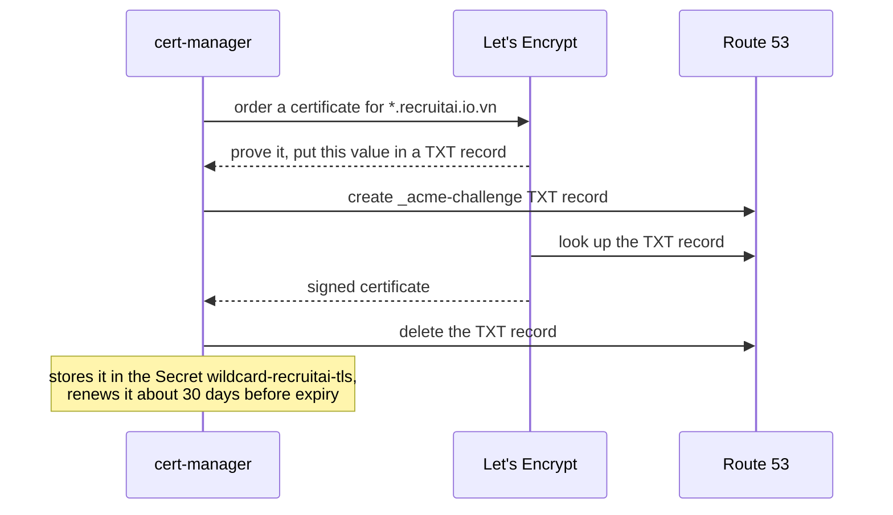
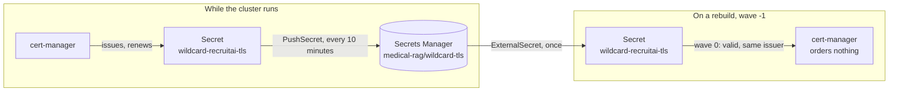

# GitOps guide — Part 3: Certificates and the first internal UI (steps 7–9)

[← Part 2](2-foundation.md) · [Index](../guide.md) · [Part 4 →](4-monitoring-and-rancher.md) · [Troubleshooting](troubleshooting.md)

**Before you start:** Part 2 done. The WireGuard tunnel connects from the laptop.

**Done when:** steps 7–9 — a Let's Encrypt production wildcard certificate, backed up in Secrets Manager, and `argocd.recruitai.io.vn` opens only with the VPN.

**Every step here follows [the loop](../guide.md#the-loop-for-every-step):** push on the laptop; on the workstation `sudo su - ubuntu`, `tmux new -As k8s`, `cd ~/Medical-RAG-Chatbot && git pull`, then refresh Argo CD with `kubectl -n argocd annotate applications --all argocd.argoproj.io/refresh=normal --overwrite` and run the checks. [tmux windows](../guide.md#tmux-windows): 0 for work, 1 for `make tunnel`.

---

## Step 7 — cert-manager and the wildcard certificate

**Goal:** a trusted certificate for `*.recruitai.io.vn`, renewed automatically, which ingress-nginx
serves for every internal UI.

**How it works.** Let's Encrypt gives a certificate to whoever can prove they control the domain. With
the DNS-01 method, cert-manager creates a TXT record `_acme-challenge.recruitai.io.vn` holding a value
Let's Encrypt chose; Let's Encrypt looks it up, and issues the certificate. DNS-01 is the only method
that allows a wildcard, and it needs no inbound connection, so it works for names that point at private
addresses. Terraform step 19 gave the node role permission to change exactly that one TXT record.



Create `deploy/argocd/values/cert-manager.yaml`:
```yaml
# The chart installs its CRDs (Certificate, ClusterIssuer), which is why the Application runs a wave
# before the manifests that use them.
crds:
  enabled: true

# Before telling Let's Encrypt "check now", cert-manager looks the TXT record up itself. Asking public
# resolvers, not the VPC's, means it sees what Let's Encrypt will see.
extraArgs:
  - --dns01-recursive-nameservers-only
  - --dns01-recursive-nameservers=1.1.1.1:53,8.8.8.8:53

resources:
  requests:
    cpu: 25m
    memory: 96Mi
  limits:
    memory: 256Mi

webhook:
  resources:
    requests:
      cpu: 10m
      memory: 32Mi
    limits:
      memory: 96Mi

cainjector:
  resources:
    requests:
      cpu: 10m
      memory: 64Mi
    limits:
      memory: 256Mi
```

Create `deploy/argocd/apps/cert-manager.yaml`:
```yaml
# cert-manager: obtains and renews certificates. Its AWS permission (the one TXT record) comes from the
# node's instance profile; a ClusterIssuer may use those "ambient" credentials by default.
apiVersion: argoproj.io/v1alpha1
kind: Application
metadata:
  name: cert-manager
  namespace: argocd
  annotations:
    argocd.argoproj.io/sync-wave: "-2"
spec:
  project: default
  sources:
    - repoURL: https://charts.jetstack.io
      chart: cert-manager
      targetRevision: v1.21.2
      helm:
        releaseName: cert-manager
        valueFiles:
          - $values/deploy/argocd/values/cert-manager.yaml
    - repoURL: https://github.com/biabeogo147/Medical-RAG-Chatbot.git
      targetRevision: main
      ref: values
  destination:
    server: https://kubernetes.default.svc
    namespace: cert-manager
  syncPolicy:
    automated:
      prune: true
      selfHeal: true
    syncOptions:
      - CreateNamespace=true
      - ServerSideApply=true
```

Create `deploy/argocd/apps/platform-tls.yaml`:
```yaml
# Plain manifests: the issuers, the wildcard certificate, and (step 8) its backup.
apiVersion: argoproj.io/v1alpha1
kind: Application
metadata:
  name: platform-tls
  namespace: argocd
  annotations:
    # After cert-manager and External Secrets (their CRDs), and after platform-secrets (step 8 puts
    # the restored certificate there).
    argocd.argoproj.io/sync-wave: "0"
spec:
  project: default
  source:
    repoURL: https://github.com/biabeogo147/Medical-RAG-Chatbot.git
    targetRevision: main
    path: deploy/argocd/manifests/platform-tls
  destination:
    server: https://kubernetes.default.svc
  syncPolicy:
    automated:
      prune: true
      selfHeal: true
    syncOptions:
      - ServerSideApply=true
```

Create `deploy/argocd/manifests/platform-tls/cluster-issuers.yaml`:
```yaml
# Two issuers for the same Let's Encrypt account type. Staging issues certificates browsers do not
# trust, but with far higher limits: use it to prove the setup works. Production issues trusted
# certificates, at most 5 for the same names in 7 days.
#
# No email is set: Let's Encrypt no longer sends expiry mail, and cert-manager renews on its own.
apiVersion: cert-manager.io/v1
kind: ClusterIssuer
metadata:
  name: letsencrypt-staging
  annotations:
    argocd.argoproj.io/sync-wave: "0"
spec:
  acme:
    server: https://acme-staging-v02.api.letsencrypt.org/directory
    privateKeySecretRef:
      name: letsencrypt-staging-account   # the ACME account key, created by cert-manager
    solvers:
      - dns01:
          route53:
            region: ap-southeast-1   # Route 53 is global, but the AWS SDK still needs a region
        selector:
          dnsZones:
            - recruitai.io.vn
---
apiVersion: cert-manager.io/v1
kind: ClusterIssuer
metadata:
  name: letsencrypt-production
  annotations:
    argocd.argoproj.io/sync-wave: "0"
spec:
  acme:
    server: https://acme-v02.api.letsencrypt.org/directory
    privateKeySecretRef:
      name: letsencrypt-production-account
    solvers:
      - dns01:
          route53:
            region: ap-southeast-1
        selector:
          dnsZones:
            - recruitai.io.vn
```

Create `deploy/argocd/manifests/platform-tls/wildcard-certificate.yaml`:
```yaml
# One certificate for every internal UI name. It lives in the ingress-nginx namespace because
# ingress-nginx serves it as its default certificate (values/ingress-nginx.yaml), so no other namespace
# needs a copy.
apiVersion: cert-manager.io/v1
kind: Certificate
metadata:
  name: wildcard-recruitai
  namespace: ingress-nginx
  annotations:
    argocd.argoproj.io/sync-wave: "1"   # after the issuers
spec:
  secretName: wildcard-recruitai-tls
  dnsNames:
    - "*.recruitai.io.vn"
  issuerRef:
    group: cert-manager.io
    kind: ClusterIssuer
    # Start with staging. Change to letsencrypt-production once the staging certificate is Ready.
    name: letsencrypt-staging
```

**Why:**

- **Staging first.** A mistake in the IAM policy or the DNS setup makes cert-manager retry, and every
  failed attempt against production counts towards Let's Encrypt's failure limits. Staging has much
  higher ones.
- **One wildcard, served as nginx's default.** A certificate `Secret` can be used only by an Ingress in
  the same namespace. Argo CD, Grafana and Rancher live in different namespaces; making the wildcard the
  controller's default certificate avoids copying it into each one.

**Commit and push** (message `Add cert-manager and the wildcard certificate`), then on the workstation
`git pull` and refresh.

**Check:**
```bash
make apps
kubectl get clusterissuer
```
`cert-manager` and `platform-tls` `Synced` and `Healthy`. Both issuers `READY True`: each has
registered an ACME account.

```bash
kubectl -n ingress-nginx get certificate wildcard-recruitai
```
`READY True` within about two minutes. While it is `False`, follow the progress:
```bash
kubectl -n ingress-nginx describe certificate wildcard-recruitai
kubectl get challenges --all-namespaces
```
A challenge that stays `pending` names its problem in `describe challenge`; see [Troubleshooting](troubleshooting.md).

**Switch to production.** In `wildcard-certificate.yaml`, change `name: letsencrypt-staging` to
`name: letsencrypt-production`. Commit and push (message `Use the production issuer`), pull, refresh.
cert-manager notices the different issuer and replaces the certificate.

```bash
kubectl -n ingress-nginx get certificate wildcard-recruitai
```
`READY True` again. Confirm who issued it:
```bash
kubectl -n ingress-nginx get secret wildcard-recruitai-tls \
  -o jsonpath='{.data.tls\.crt}' > /tmp/wildcard.b64
base64 -d /tmp/wildcard.b64 > /tmp/wildcard.crt
openssl x509 -in /tmp/wildcard.crt -noout -subject -issuer -enddate
rm /tmp/wildcard.b64 /tmp/wildcard.crt
```
`subject=CN = *.recruitai.io.vn`, an issuer from Let's Encrypt **without** `(STAGING)` in its name, and
an expiry about 90 days away. **Write down the `notAfter` date:** [step 13](5-teardown-and-rebuild.md#step-13--rebuild-from-nothing-and-the-evidence) compares it after a rebuild.

---

## Step 8 — Keep the certificate across rebuilds

**Goal:** a rebuilt cluster gets the existing certificate back instead of asking Let's Encrypt for a new
one.

**The problem.** Let's Encrypt issues at most **5 certificates for the same set of names in 7 days**.
Every `make down` deletes the certificate with the cluster, and every rebuild would order a new one. A
few rebuilds in one week, and the next one fails with `too many certificates already issued`.

**The fix: back it up, put it back.**



Two objects, in two Applications, because they must run at different times: the restore before the
`Certificate` exists (wave -1), the backup after it is issued (wave 0).

### 8.1 The backup

Create `deploy/argocd/manifests/platform-tls/wildcard-tls-backup.yaml`:
```yaml
# Copies the certificate Secret to Secrets Manager whenever it changes, so a renewal is backed up too.
apiVersion: external-secrets.io/v1alpha1
kind: PushSecret
metadata:
  name: wildcard-recruitai-tls-backup
  namespace: ingress-nginx
  annotations:
    argocd.argoproj.io/sync-wave: "2"   # after the Certificate is Ready
spec:
  refreshInterval: 10m
  # Deleting this object, or the whole cluster, must never delete the backup.
  deletionPolicy: None
  secretStoreRefs:
    - kind: ClusterSecretStore
      name: aws-secrets-manager
  selector:
    secret:
      name: wildcard-recruitai-tls
  data:
    # No secretKey: push the whole Secret as one JSON object {"tls.crt": ..., "tls.key": ...}.
    - match:
        remoteRef:
          remoteKey: medical-rag/wildcard-tls
      metadata:
        apiVersion: kubernetes.external-secrets.io/v1alpha1
        kind: PushSecretMetadata
        spec:
          # Store it as readable text (SecretString), which the restore below reads.
          secretPushFormat: string
```

**Commit and push** this file on its own first (message `Back up the wildcard certificate`), pull,
refresh. **Check:**
```bash
kubectl -n ingress-nginx get pushsecret
```
`READY True`, `STATUS Synced`.

The backup holds a usable certificate. The pipeline passes it straight from AWS to `openssl` without
writing anything to disk, and only the certificate, never the key, is read:
```bash
aws secretsmanager get-secret-value \
  --secret-id medical-rag/wildcard-tls \
  --query SecretString \
  --output text | jq -r '."tls.crt"' | openssl x509 -noout -subject -enddate
```
`subject=CN = *.recruitai.io.vn` and the same `notAfter` date as in step 7.

### 8.2 The restore

Create `deploy/argocd/manifests/platform-secrets/wildcard-tls-restore.yaml`:
```yaml
# Puts the backed-up certificate into a new cluster before the Certificate object exists.
#
# cert-manager keeps a Secret it finds when the certificate inside is valid, matches the requested
# names and key type, and carries annotations naming the same issuer. So the annotations below are what
# stop it from ordering a new certificate.
#
# Add this file only after the backup exists in Secrets Manager. Against an empty secret it would fail,
# and platform-secrets would stay Degraded.
apiVersion: external-secrets.io/v1
kind: ExternalSecret
metadata:
  name: wildcard-recruitai-tls-restore
  namespace: ingress-nginx
  annotations:
    argocd.argoproj.io/sync-wave: "1"
spec:
  # Create the Secret only if it does not exist, and never update it afterwards. cert-manager owns it
  # from then on; any later copy would overwrite a renewed certificate with the older backup.
  refreshPolicy: CreatedOnce
  secretStoreRef:
    kind: ClusterSecretStore
    name: aws-secrets-manager
  target:
    name: wildcard-recruitai-tls
    # Orphan: External Secrets creates the Secret but does not own it, so deleting this object never
    # deletes the certificate.
    creationPolicy: Orphan
    template:
      type: kubernetes.io/tls
      metadata:
        annotations:
          cert-manager.io/certificate-name: wildcard-recruitai
          cert-manager.io/issuer-name: letsencrypt-production
          cert-manager.io/issuer-kind: ClusterIssuer
          cert-manager.io/issuer-group: cert-manager.io
  dataFrom:
    - extract:
        key: medical-rag/wildcard-tls
```

**Why:**

- **The backup is readable by the nodes.** The certificate's private key now also sits in Secrets
  Manager, readable by the node role, like the Rancher key. It opens only the internal UIs, which are
  unreachable without the VPN anyway.
- **Why not simply use Let's Encrypt staging all the time.** Browsers do not trust staging
  certificates. A UI that opens behind a certificate warning teaches you to click through warnings.

**Commit and push** (message `Restore the wildcard certificate on rebuild`), pull, refresh.

**Check:**
```bash
make apps
kubectl -n ingress-nginx get externalsecret wildcard-recruitai-tls-restore
kubectl -n ingress-nginx get certificate wildcard-recruitai
```
`platform-secrets` `Healthy`; the ExternalSecret `SecretSynced`; the certificate still `READY True`. On
this cluster the restore only rewrote the same certificate. The real proof comes in [step 13](5-teardown-and-rebuild.md#step-13--rebuild-from-nothing-and-the-evidence): after a
rebuild, `kubectl -n ingress-nginx get certificaterequests` finds **no** request, because nothing was
ordered.

---

## Step 9 — The Argo CD UI, through the VPN

**Goal:** `https://argocd.recruitai.io.vn` opens in the laptop's browser with the VPN on, and times out
without it.

**How an internal UI is protected.** Three layers, the same for every UI in this project:

| Layer | What it does |
|---|---|
| DNS | The name resolves to the internal NLB's private addresses (Terraform step 19) |
| Network | Only the VPN, the nodes and the VPC can reach those addresses; the WireGuard gateway forwards only DNS and TCP 443 |
| ingress-nginx | `allowlist-source-range: 10.10.0.0/16`. Through the public load balancer (port 80 only), even a forged `Host` header gets only a redirect to the unreachable HTTPS name; if it ever got past the redirect, its internet source address would be refused |

Three things change in `deploy/argocd/values/argocd.yaml`: a new top-level `global:`, a `params:` block
under the existing `configs:`, and an `ingress:` block under the existing `server:`. YAML does not allow
the same top-level key twice (a second `configs:` or `server:` would silently replace the first), so
**replace the whole file** with this final version. The new parts are marked `# NEW (step 9)`:
```yaml
# Values for the argo-cd chart. The same file is used twice: by the first `helm install` (step 2,
# later `make bootstrap`), and by the argocd Application that makes Argo CD manage itself (step 3).
# Keeping one file is what lets that takeover leave the running pods alone.

# NEW (step 9): the internal name of the UI and API.
global:
  domain: argocd.recruitai.io.vn

# Single sign-on is not used; the admin account is enough for one operator.
dex:
  enabled: false

# No notification channel exists yet. Disabled rather than running with nothing to send to.
notifications:
  enabled: false

configs:
  cm:
    # Argo CD 1.8 stopped computing the health of Application resources. Without this check, an
    # Application is "healthy" the moment it is created, so the sync waves in deploy/argocd/apps/
    # would not wait for each other and Rancher could start before its certificate exists.
    # The Lua below copies each child Application's own health status.
    resource.customizations.health.argoproj.io_Application: |
      hs = {}
      hs.status = "Progressing"
      hs.message = ""
      if obj.status ~= nil then
        if obj.status.health ~= nil then
          hs.status = obj.status.health.status
          if obj.status.health.message ~= nil then
            hs.message = obj.status.health.message
          end
        end
      end
      return hs
  # NEW (step 9)
  params:
    # TLS ends at ingress-nginx, which talks to argocd-server over plain HTTP inside the cluster.
    # Without this, argocd-server would redirect that plain HTTP to HTTPS, and every request would loop.
    server.insecure: true

# Requests reserve room on the 8 GB nodes; limits stop one component from starving the others. These
# are starting points for a small cluster, not measured values.
controller:
  resources:
    requests:
      cpu: 250m
      memory: 512Mi
    limits:
      memory: 1Gi

server:
  resources:
    requests:
      cpu: 50m
      memory: 128Mi
    limits:
      memory: 256Mi
  # NEW (step 9): the UI and API through ingress-nginx, VPN only.
  ingress:
    enabled: true
    ingressClassName: nginx
    annotations:
      nginx.ingress.kubernetes.io/allowlist-source-range: "10.10.0.0/16"
    # A TLS entry with no secretName: ingress-nginx serves its default certificate, the wildcard.
    # Listing the host here is still what turns on the HTTP-to-HTTPS redirect.
    extraTls:
      - hosts:
          - argocd.recruitai.io.vn

repoServer:
  resources:
    requests:
      cpu: 100m
      memory: 256Mi
    limits:
      memory: 512Mi

redis:
  resources:
    requests:
      cpu: 50m
      memory: 64Mi
    limits:
      memory: 128Mi

applicationSet:
  resources:
    requests:
      cpu: 25m
      memory: 64Mi
    limits:
      memory: 128Mi
```

**Why:**

- **This changes Argo CD through Git.** Argo CD manages itself since [step 3](1-argocd.md#step-3--the-root-application-and-argo-cd-managing-itself), so pushing this file is
  the upgrade. No `helm upgrade` is run. On a rebuild, `make bootstrap` installs with this file already
  complete.

**Commit and push** (message `Expose the Argo CD UI internally`), pull, refresh.

**Check on the workstation:**
```bash
make apps
kubectl -n argocd get ingress
```
`argocd` `Synced` and `Healthy`; an Ingress with host `argocd.recruitai.io.vn`, class `nginx`.

The public load balancer does not serve it:
```bash
NLB=$(terraform -chdir=infra/terraform/cluster output -raw public_nlb_dns)
curl -sI -H 'Host: argocd.recruitai.io.vn' "http://$NLB/"
```
First line `HTTP/1.1 308 Permanent Redirect`: a redirect to an HTTPS address the internet cannot reach.
nginx sends this redirect before it looks at the allowlist, so the `308` proves the first two layers,
not the third; the `403` for a non-VPC source is the backstop behind it.

**Check on the laptop.** VPN off, in PowerShell:
```powershell
curl.exe -sS -m 10 https://argocd.recruitai.io.vn/
```
`curl: (28) … timed out`.

VPN on:
```powershell
curl.exe -sS -o NUL -w "%{http_code}\n" https://argocd.recruitai.io.vn/
```
`200`, with no certificate error.

**Log in.** Print the initial admin password on the workstation:
```bash
kubectl -n argocd get secret argocd-initial-admin-secret \
  -o jsonpath='{.data.password}' | base64 -d
echo
```
Open `https://argocd.recruitai.io.vn` in the laptop's browser, user `admin`, that password. The
Applications page shows every component with its sync and health state, and the tree view of `root`
shows the app-of-apps.

---

[← Part 2](2-foundation.md) · [Index](../guide.md) · [Part 4 →](4-monitoring-and-rancher.md) · [Troubleshooting](troubleshooting.md)
