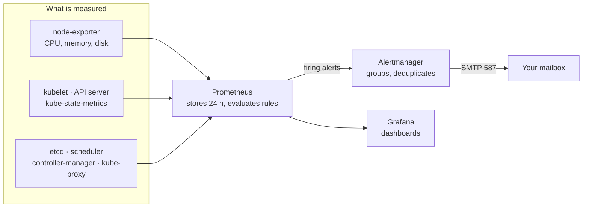

# GitOps guide — Part 4: Monitoring, alert email and Rancher (steps 10–11)

[← Part 3](3-certificates-and-argocd-ui.md) · [Index](../guide.md) · [Part 5 →](5-teardown-and-rebuild.md) · [Troubleshooting](troubleshooting.md)

**Before you start:** Part 3 done; [Ansible guide step 11](../../ansible/guide/5-prove-and-extend.md#step-11--let-prometheus-reach-the-control-plane-metrics) in effect on this cluster; `medical-rag/alertmanager` holds the SMTP settings ([Terraform guide step 19](../../terraform/guide/7-internal-uis.md#step-19--internal-ui-names-dns-permission-for-cert-manager-two-secrets)).

**Done when:** steps 10–11 — every Prometheus target `up`, a test alert email arrives, the Rancher chain gives `Verification: OK`, and Grafana, Prometheus, Alertmanager and Rancher open only through the VPN.

**Every step here follows [the loop](../guide.md#the-loop-for-every-step):** push on the laptop; on the workstation `sudo su - ubuntu`, `tmux new -As k8s`, `cd ~/Medical-RAG-Chatbot && git pull`, then refresh Argo CD with `kubectl -n argocd annotate applications --all argocd.argoproj.io/refresh=normal --overwrite` and run the checks. [tmux windows](../guide.md#tmux-windows): 0 for work, 1 for `make tunnel`.

---

## Step 10 — Monitoring: the whole cluster, alert email, three UIs

**Goal:** Prometheus collects metrics from every part of the cluster including etcd and the control
plane, alerts reach your mailbox, and Grafana, Prometheus and Alertmanager open through the VPN.

**Before you start:** [Ansible guide step 11](../../ansible/guide/5-prove-and-extend.md#step-11--let-prometheus-reach-the-control-plane-metrics)
is done on this cluster (control-plane metrics on the node address), and `medical-rag/alertmanager`
holds the SMTP settings (Terraform guide step 19).

**What the pieces do:**



Prometheus decides **that** something is wrong (a rule is true for long enough). Alertmanager decides
**who hears about it and how often**: it groups related alerts into one email, repeats unresolved ones
every few hours, and sends a second email when the problem is resolved.

The next two files go into `manifests/platform-secrets/`, which the `platform-secrets` Application from [step 6](2-foundation.md#step-6--external-secrets-and-the-platform-secrets) already syncs; no new Application is needed.

Create `deploy/argocd/manifests/platform-secrets/grafana-admin.yaml`:
```yaml
# Grafana's admin password, generated inside the cluster. It is not in Git, not in Secrets Manager,
# and not typed by anyone. A rebuilt cluster gets a new one; step 10 shows how to read it.
apiVersion: generators.external-secrets.io/v1alpha1
kind: Password
metadata:
  name: grafana-admin
  namespace: monitoring
  annotations:
    argocd.argoproj.io/sync-wave: "1"
spec:
  length: 32
  digits: 6
  symbols: 0
  noUpper: false
  allowRepeat: true
---
apiVersion: external-secrets.io/v1
kind: ExternalSecret
metadata:
  name: grafana-admin
  namespace: monitoring
  annotations:
    argocd.argoproj.io/sync-wave: "1"
spec:
  # "0" means generate once and never refresh. Any other interval would change the password every time.
  refreshInterval: "0"
  target:
    name: grafana-admin
    template:
      data:
        admin-user: admin
        admin-password: "{{ .password }}"
  dataFrom:
    - sourceRef:
        generatorRef:
          apiVersion: generators.external-secrets.io/v1alpha1
          kind: Password
          name: grafana-admin
```

Create `deploy/argocd/manifests/platform-secrets/alertmanager-email.yaml`:
```yaml
# Alertmanager's whole configuration, rendered by External Secrets. The structure is here in Git; the
# SMTP account, its app password and the recipient come from medical-rag/alertmanager
# (Terraform guide step 19). Each {{ .name }} is replaced with that key of the secret.
apiVersion: external-secrets.io/v1
kind: ExternalSecret
metadata:
  name: alertmanager-email
  namespace: monitoring
  annotations:
    argocd.argoproj.io/sync-wave: "1"
spec:
  # A changed app password or recipient reaches Alertmanager within an hour, without a commit.
  refreshInterval: 1h
  secretStoreRef:
    kind: ClusterSecretStore
    name: aws-secrets-manager
  target:
    name: alertmanager-email   # values/kube-prometheus-stack.yaml points Alertmanager at this Secret
    template:
      data:
        alertmanager.yaml: |
          global:
            smtp_smarthost: '{{ .smtp_smarthost }}'
            smtp_from: '{{ .smtp_from }}'
            smtp_auth_username: '{{ .smtp_username }}'
            smtp_auth_password: '{{ .smtp_password }}'
            smtp_require_tls: true
            # An alert that stops being sent is considered resolved after this long.
            resolve_timeout: 5m

          route:
            receiver: email
            # One email per alert name and namespace, not one per pod.
            group_by: ["alertname", "namespace"]
            group_wait: 30s        # wait for related alerts before the first email
            group_interval: 5m     # new alerts joining an existing group
            repeat_interval: 4h    # remind while it is still firing
            routes:
              # Watchdog always fires, on purpose: it proves the alert pipeline is alive. It is not news.
              - receiver: "null"
                matchers: ['alertname = "Watchdog"']
              # InfoInhibitor exists only to mute info-level alerts, never to be read.
              - receiver: "null"
                matchers: ['alertname = "InfoInhibitor"']

          # When a critical alert fires, the warning with the same name in the same namespace is noise.
          inhibit_rules:
            - source_matchers: ['severity = "critical"']
              target_matchers: ['severity =~ "warning|info"']
              equal: ["namespace", "alertname"]
            - source_matchers: ['severity = "warning"']
              target_matchers: ['severity = "info"']
              equal: ["namespace", "alertname"]

          receivers:
            - name: "null"
            - name: email
              email_configs:
                - to: '{{ .email_to }}'
                  send_resolved: true
  dataFrom:
    - extract:
        key: medical-rag/alertmanager
```

Create `deploy/argocd/values/kube-prometheus-stack.yaml`:
```yaml
# --- Alertmanager ------------------------------------------------------------------------------------
alertmanager:
  alertmanagerSpec:
    # Use the Secret External Secrets renders (manifests/platform-secrets/alertmanager-email.yaml)
    # instead of a configuration written in this file, which would have to contain the SMTP password.
    useExistingSecret: true
    configSecret: alertmanager-email
    # Links in the emails point here.
    externalUrl: https://alertmanager.recruitai.io.vn
    resources:
      requests:
        cpu: 25m
        memory: 64Mi
      limits:
        memory: 128Mi
  ingress:
    enabled: true
    ingressClassName: nginx
    annotations:
      nginx.ingress.kubernetes.io/allowlist-source-range: "10.10.0.0/16"
    hosts:
      - alertmanager.recruitai.io.vn
    # No secretName: ingress-nginx serves the wildcard as its default certificate.
    tls:
      - hosts:
          - alertmanager.recruitai.io.vn

# --- The control plane --------------------------------------------------------------------------------
# Scraped on the node addresses since Ansible guide step 11. The chart finds the static pods by their
# `component` label, so nothing else needs configuring.
kubeControllerManager:
  enabled: true
kubeScheduler:
  enabled: true
kubeEtcd:
  enabled: true
kubeProxy:
  enabled: true

# --- Prometheus -------------------------------------------------------------------------------------
prometheus:
  prometheusSpec:
    externalUrl: https://prometheus.recruitai.io.vn
    # Enough to look at a working session; keeps the volume and the memory small.
    retention: 24h
    # By default Prometheus only picks up ServiceMonitors labelled for this Helm release. The app's
    # chart adds its own ServiceMonitor later, so select all of them.
    serviceMonitorSelectorNilUsesHelmValues: false
    podMonitorSelectorNilUsesHelmValues: false
    ruleSelectorNilUsesHelmValues: false
    resources:
      requests:
        cpu: 200m
        memory: 1Gi
      limits:
        memory: 2Gi
    storageSpec:
      volumeClaimTemplate:
        spec:
          storageClassName: gp3
          accessModes: ["ReadWriteOnce"]
          resources:
            requests:
              storage: 10Gi
  ingress:
    enabled: true
    ingressClassName: nginx
    annotations:
      nginx.ingress.kubernetes.io/allowlist-source-range: "10.10.0.0/16"
    hosts:
      - prometheus.recruitai.io.vn
    tls:
      - hosts:
          - prometheus.recruitai.io.vn

# --- A rule of this project's own ---------------------------------------------------------------------
# m7i-flex instances publish no CPU credit metric, so running out of burst capacity is silent (design
# §10). Sustained high CPU is the earliest visible sign.
additionalPrometheusRulesMap:
  medical-rag-nodes:
    groups:
      - name: medical-rag.nodes
        rules:
          - alert: NodeCpuHighSustained
            expr: 1 - avg by (instance) (rate(node_cpu_seconds_total{mode="idle"}[5m])) > 0.8
            for: 15m
            labels:
              severity: warning
            annotations:
              summary: "CPU above 80% for 15 minutes on {{ $labels.instance }}"
              description: "m7i-flex nodes throttle silently when their burst capacity runs out."

# --- Grafana ----------------------------------------------------------------------------------------
grafana:
  # The password comes from the generated Secret instead of the chart's well-known default.
  admin:
    existingSecret: grafana-admin
    userKey: admin-user
    passwordKey: admin-password
  grafana.ini:
    server:
      root_url: https://grafana.recruitai.io.vn
  # Dashboards come from the chart on every start; there is nothing worth a volume.
  persistence:
    enabled: false
  resources:
    requests:
      cpu: 50m
      memory: 128Mi
    limits:
      memory: 256Mi
  ingress:
    enabled: true
    ingressClassName: nginx
    annotations:
      nginx.ingress.kubernetes.io/allowlist-source-range: "10.10.0.0/16"
    hosts:
      - grafana.recruitai.io.vn
    tls:
      - hosts:
          - grafana.recruitai.io.vn
```

Create `deploy/argocd/apps/kube-prometheus-stack.yaml`:
```yaml
# Prometheus, Alertmanager, the Prometheus Operator, node-exporter, kube-state-metrics and Grafana.
apiVersion: argoproj.io/v1alpha1
kind: Application
metadata:
  name: kube-prometheus-stack
  namespace: argocd
  annotations:
    argocd.argoproj.io/sync-wave: "0"   # after the gp3 StorageClass and the two Secrets above
  labels:
    # This Application owns an EBS volume. `make down` deletes Applications with this label before
    # destroying the cluster, so the volume is released instead of left behind (step 12).
    medical-rag/volumes: "true"
  finalizers:
    # Deleting this Application also deletes what it installed. Only the volume-owning Applications
    # have it, because only they need to be removed on purpose during teardown.
    - resources-finalizer.argocd.argoproj.io
spec:
  project: default
  sources:
    - repoURL: https://prometheus-community.github.io/helm-charts
      chart: kube-prometheus-stack
      targetRevision: 91.4.1
      helm:
        releaseName: kube-prometheus-stack
        valueFiles:
          - $values/deploy/argocd/values/kube-prometheus-stack.yaml
    - repoURL: https://github.com/biabeogo147/Medical-RAG-Chatbot.git
      targetRevision: main
      ref: values
  destination:
    server: https://kubernetes.default.svc
    namespace: monitoring   # created by platform-secrets
  syncPolicy:
    automated:
      prune: true
      selfHeal: true
    syncOptions:
      # Required here: the Prometheus Operator CRDs are far larger than a client-side apply allows.
      - ServerSideApply=true
```

**Why:**

- **The configuration is a template, not a file with a password.** Alertmanager needs the SMTP password
  inside its configuration file. Rendering that file from Secrets Manager keeps the routing rules
  reviewable in Git and the password out of it.
- **Watchdog goes nowhere.** It is an alert that always fires. Its point is the reverse: if it ever stops
  arriving at Alertmanager, the pipeline itself is broken. Emailing it every four hours would train you
  to ignore alert email.
- **Prometheus and Alertmanager have no login of their own.** The VPN is their only protection; see
  ["Known limits" in the README](../README.md#12-known-limits). Grafana has a password.

**Commit and push** (message `Add monitoring with alert email and internal UIs`), pull, refresh.

**Check the stack:**
```bash
make apps
kubectl -n monitoring get pods
kubectl -n monitoring get pvc
kubectl -n monitoring get externalsecret
```
`kube-prometheus-stack` `Synced` and `Healthy` (the first sync takes a few minutes). Every pod
`Running`, one `node-exporter` per node, one `alertmanager-…-0`. One PVC `Bound`, `10Gi`, `gp3`. Both
ExternalSecrets `SecretSynced`.

**Check every target is up**, through the API server's proxy:
```bash
PROM=/api/v1/namespaces/monitoring/services/kube-prometheus-stack-prometheus:http-web/proxy
kubectl get --raw "$PROM/api/v1/targets?state=active" > /tmp/targets.json
jq -r '.data.activeTargets[] | .health + "  " + .labels.job' /tmp/targets.json
```
Every line starts with `up`. The job names now include ones for etcd, the scheduler, the controller
manager and kube-proxy, three lines each, one per node. A `down` line for one of
those four means Ansible guide step 11 is not in effect on this cluster.

**Check nothing is firing that should not be:**
```bash
AM=alertmanager-kube-prometheus-stack-alertmanager-0
kubectl -n monitoring exec "$AM" -c alertmanager -- \
  amtool alert query \
  --alertmanager.url=http://127.0.0.1:9093
```
Only `Watchdog` (and possibly `InfoInhibitor`). Anything else is a real finding: read its `summary`.

**Check an email arrives.** Send a test alert straight to Alertmanager:
```bash
kubectl -n monitoring exec "$AM" -c alertmanager -- \
  amtool alert add GuideTestAlert severity=warning \
  --annotation=summary="Test alert from the GitOps guide" \
  --alertmanager.url=http://127.0.0.1:9093
```
Within about a minute an email titled `[FIRING:1] GuideTestAlert (warning)` arrives. About five minutes later a
second one, `[RESOLVED]`, because nothing keeps sending that alert. No email: see [Troubleshooting](troubleshooting.md).

**Check the UIs on the laptop**, VPN on, in PowerShell:
```powershell
curl.exe -sS -m 10 https://grafana.recruitai.io.vn/api/health
curl.exe -sS -m 10 https://prometheus.recruitai.io.vn/-/ready
curl.exe -sS -m 10 https://alertmanager.recruitai.io.vn/-/ready
```
Grafana: JSON containing `"database": "ok"`. Prometheus: `Prometheus Server is Ready.`. Alertmanager:
`OK`. With the VPN off, each of the three ends in `curl: (28) … timed out`.

**Log in to Grafana.** The password, on the workstation:
```bash
kubectl -n monitoring get secret grafana-admin \
  -o jsonpath='{.data.admin-password}' | base64 -d
echo
```
Open `https://grafana.recruitai.io.vn`, user `admin`. Under **Dashboards** the chart provides, among
others, **etcd**, **Kubernetes / Scheduler**, **Kubernetes / Controller Manager** and **Node Exporter /
Nodes**. The etcd dashboard showing three members with a leader is worth a screenshot for the evidence.

---

## Step 11 — Rancher

**Goal:** Rancher runs in the cluster and answers only through the VPN, with the Sectigo certificate.
This is criterion #4 of the design. Rancher is the one internal UI that keeps its own purchased
certificate (design §4.2.1); the others use the wildcard from [step 7](3-certificates-and-argocd-ui.md#step-7--cert-manager-and-the-wildcard-certificate).

Create `deploy/argocd/values/rancher.yaml`:
```yaml
# Values from design §4.2.1.

# Rancher serves only this name. It resolves to the internal NLB's private addresses.
hostname: rancher.recruitai.io.vn

# The chart defaults to 3; three 8 GB nodes also run Prometheus and, later, Jenkins.
replicas: 1

ingress:
  ingressClassName: nginx
  tls:
    # Use the Secret named tls-rancher-ingress (created by platform-secrets), not cert-manager.
    source: secret
  # The same VPC-only rule as every internal UI (step 9). Rancher's own agents connect through the
  # internal load balancer, which presents a VPC address, so they are allowed.
  extraAnnotations:
    nginx.ingress.kubernetes.io/allowlist-source-range: "10.10.0.0/16"

# The default, "strict", makes agents trust only the CA in Rancher's own settings. A certificate from a
# public CA like Sectigo is checked against the system trust store instead.
agentTLSMode: system-store

# The first-login password, from the bootstrap-secret that External Secrets created.
extraEnv:
  - name: CATTLE_BOOTSTRAP_PASSWORD
    valueFrom:
      secretKeyRef:
        name: bootstrap-secret
        key: bootstrapPassword

# Do NOT set `bootstrapPassword`. In chart 2.15.1 that value renders a second bootstrap-secret and a
# second CATTLE_BOOTSTRAP_PASSWORD, and Argo CD and External Secrets would overwrite each other forever.

resources:
  requests:
    cpu: 250m
    memory: 1Gi
```

Create `deploy/argocd/apps/rancher.yaml`:
```yaml
# Rancher, the private management UI.
apiVersion: argoproj.io/v1alpha1
kind: Application
metadata:
  name: rancher
  namespace: argocd
  annotations:
    argocd.argoproj.io/sync-wave: "0"   # after platform-secrets: the certificate and password exist
spec:
  project: default
  sources:
    - repoURL: https://releases.rancher.com/server-charts/stable
      chart: rancher
      # This chart declares kubeVersion "< 1.37.0-0". Argo CD passes the cluster's version to Helm, so
      # after a Kubernetes upgrade to 1.37 this Application would fail to render: the compatibility
      # gate in design §4.2.1, enforced by the chart itself.
      targetRevision: 2.15.1
      helm:
        releaseName: rancher
        valueFiles:
          - $values/deploy/argocd/values/rancher.yaml
    - repoURL: https://github.com/biabeogo147/Medical-RAG-Chatbot.git
      targetRevision: main
      ref: values
  destination:
    server: https://kubernetes.default.svc
    namespace: cattle-system   # created by platform-secrets
  syncPolicy:
    automated:
      prune: true
      selfHeal: true
    syncOptions:
      - ServerSideApply=true
```

**Why:**

- **Nothing about the network is configured here.** The private path already exists: Route 53 name →
  internal NLB → NodePort 30443 → ingress-nginx. Rancher only adds an Ingress for its hostname.
- **The password never appears in a value.** It goes from Secrets Manager to `bootstrap-secret` to an
  environment variable, so neither Git nor the Argo CD UI can show it.

**Commit and push** (message `Add Rancher`), then on the workstation `git pull` and refresh ([the loop](../guide.md#the-loop-for-every-step)).

**Check in the cluster** (workstation). First wait until Argo CD has created the Application:
```bash
make apps
```
Repeat until a `rancher` line appears. Rancher then takes several minutes to start the first time:
```bash
kubectl -n cattle-system rollout status deployment/rancher --timeout=15m
make apps
kubectl -n cattle-system get ingress rancher
```
`rancher` `Synced` and `Healthy`. The Ingress shows class `nginx`, host `rancher.recruitai.io.vn`,
ports `80, 443`.

**Check from the internet side** (workstation). No security group allows 443 from anywhere:
```bash
aws ec2 describe-security-groups \
  --filters Name=ip-permission.from-port,Values=443 Name=ip-permission.cidr,Values=0.0.0.0/0 \
  --query 'SecurityGroups[].GroupId'
```
`[]`.

Asking the **public** load balancer for Rancher gets only a redirect to HTTPS, which leads to a private
address:
```bash
NLB=$(terraform -chdir=infra/terraform/cluster output -raw public_nlb_dns)
curl -sI -H 'Host: rancher.recruitai.io.vn' "http://$NLB/"
```
The first line is `HTTP/1.1 308 Permanent Redirect`, and `Location:` is
`https://rancher.recruitai.io.vn/`. As in [step 9](3-certificates-and-argocd-ui.md#step-9--the-argo-cd-ui-through-the-vpn), the redirect comes before the allowlist.

**Check the certificate chain from inside the VPC.** The workstation has no route into the cluster VPC,
but the WireGuard gateway has, and its `openssl` does not fill in missing intermediate certificates the
way Windows does. So this is the strict test. On the workstation, open a shell on the gateway:
```bash
WG_ID=$(terraform -chdir=infra/terraform/cluster output -raw wireguard_instance_id)
aws ssm start-session --target "$WG_ID"
```
On the gateway:
```bash
openssl s_client \
  -connect rancher.recruitai.io.vn:443 \
  -servername rancher.recruitai.io.vn \
  -brief </dev/null
exit
```
A `Peer certificate:` line naming `rancher.recruitai.io.vn`, and `Verification: OK`. This replaces the
check the Terraform guide deferred to this phase ("Later, after `make bootstrap`" in step 18).

**Check from the laptop, VPN off.** In the WireGuard app, **Deactivate** `medical-rag`. Open
PowerShell:
```powershell
curl.exe -sS -m 10 https://rancher.recruitai.io.vn/ping
```
`curl: (28) … timed out`. The name resolves, but to private addresses the laptop cannot reach.

**Check from the laptop, VPN on.** **Activate** `medical-rag`. **Latest handshake** must show a recent
time. Then:
```powershell
curl.exe -sS https://rancher.recruitai.io.vn/ping
```
`pong`: Rancher answers through the tunnel, over HTTPS with a certificate Windows accepts for that name.

```powershell
Test-NetConnection rancher.recruitai.io.vn -Port 443
Test-NetConnection rancher.recruitai.io.vn -Port 6443
```
`TcpTestSucceeded : True` for 443 and `False` for 6443. The same load balancer carries the Kubernetes
API on 6443, and the gateway forwards only DNS and 443, so the API stays out of reach of the VPN.

**Log in.** Print the first-login password on the workstation (the same command as Terraform guide
step 17):
```bash
aws secretsmanager get-secret-value \
  --secret-id medical-rag/rancher \
  --query SecretString --output text | jq -r '.bootstrapPassword'
```
Open `https://rancher.recruitai.io.vn` in the laptop's browser with the VPN on, and log in with it.
Rancher asks you to set a new password straight away. The UI loading is the last part of criterion #4.

---

[← Part 3](3-certificates-and-argocd-ui.md) · [Index](../guide.md) · [Part 5 →](5-teardown-and-rebuild.md) · [Troubleshooting](troubleshooting.md)
