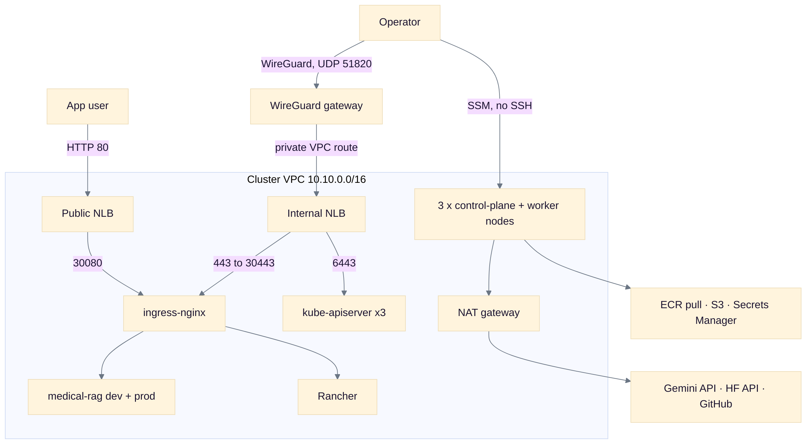
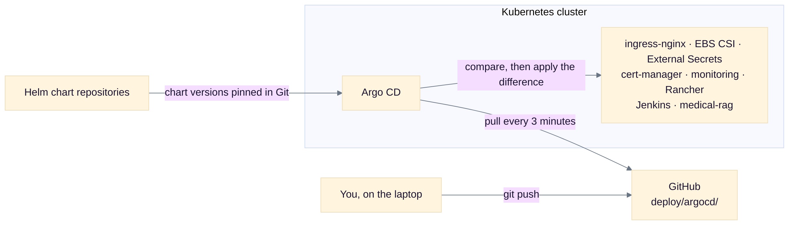
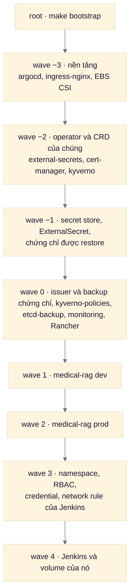
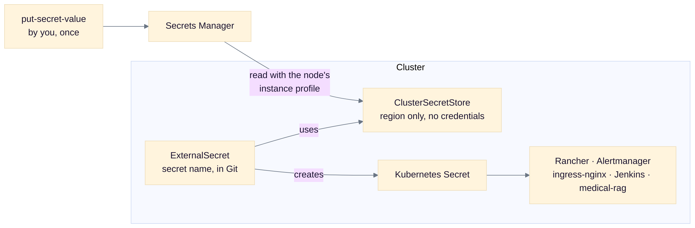
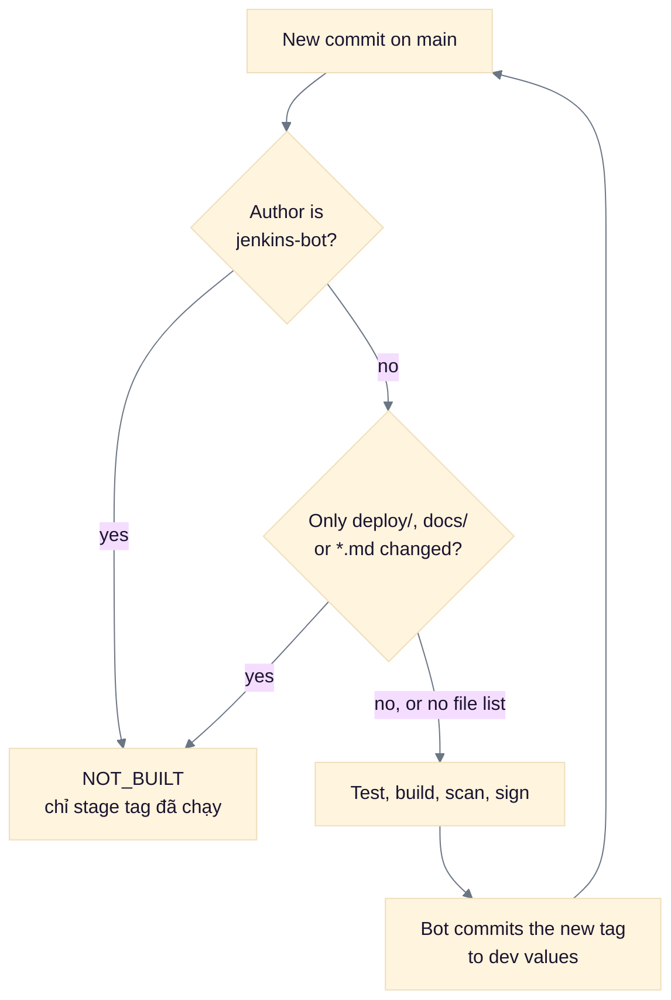

# Kiến trúc — năm sơ đồ

Để mở ra khi bị nói "vẽ hệ thống của anh ra". Mỗi sơ đồ có một dòng tóm tắt bằng chữ ở trên, để đọc trên điện
thoại vẫn hiểu mà không cần phóng to.

Bốn sơ đồ đầu lấy nguyên từ repo — nguồn ghi ở cuối mỗi mục — nên chúng không lệch khỏi tài liệu. Sơ đồ thứ năm
được **vẽ lại cho điện thoại**: bản gốc có 14 node nằm trong 8 subgraph, rộng nhất repo.

Không có màu: bản trong repo không tô màu, nên thứ phân biệt các hộp là **nhãn chữ** — tên component, và số wave.

---

## 1. Hai đường vào, và cái gì ở trong VPC

**Bằng chữ:** người dùng app đi HTTP 80 vào public NLB. Tôi đi bằng WireGuard (UDP 51820) tới gateway, hoặc bằng
SSM để vào máy — **không có SSH**. Bên trong VPC: ingress-nginx nhận traffic app, internal NLB nhận `6443` tới
kube-apiserver và `443` tới các UI nội bộ. Pod ra internet qua NAT.

Ba điều đáng nói kèm: **node không có địa chỉ public** — chỉ gateway WireGuard có Elastic IP, vì bắt tay VPN
phải có chỗ để tới. **Cổng vào từ internet chỉ có hai**: TCP 80 trên public NLB và UDP 51820. Và **etcd nằm
trên chính ba node control plane** (stacked), nên mất một node còn quorum, mất hai là hết.

*Nguồn: `selfmanaged-k8s-ops-design.md` §3.*

---

## 2. Argo CD kéo, không ai đẩy

**Bằng chữ:** tôi push vào GitHub. Argo CD **ở trong cụm** đọc repo đó mỗi 3 phút, so sánh, rồi áp dụng phần
khác biệt. Không CI nào và không laptop nào cần quyền vào cụm để deploy.

**Đọc chiều mũi tên:** `ARGO --> GH` nghĩa là *Argo CD là bên chủ động đi lấy* — nó gọi ra GitHub, GitHub không
bao giờ gọi vào cụm. Đó đúng là điều cần nói: **không có cổng nào mở vào cụm cho việc deploy**.

Đây là tính chất trả lời được câu "ai deploy được lên prod": **không ai**, theo nghĩa không có credential nào của
cụm nằm ngoài cụm. Ops workstation giữ một kubeconfig admin, nhưng chỉ dùng để cài Argo CD lần đầu, để kiểm, và
để teardown.

*Nguồn: `gitops/README.md` §1.*

---

## 3. Sync wave — tám bước, mỗi bước chờ bước trước

**Bằng chữ:** `root` là một Application mà việc duy nhất của nó là tạo ra 16 Application còn lại. Chúng chạy theo
**8 wave, từ −3 tới 4**. Một wave chỉ bắt đầu khi mọi Application của wave trước đã `Healthy` **và** `Synced`.

**Vì sao `Synced` mới là cái làm việc.** Argo CD cố ý **không tính** resource chưa tồn tại vào tổng health, nên
một Application đang nửa đường áp manifest vẫn báo `Healthy`. `status.sync` thì chỉ hết `OutOfSync` khi mọi
resource đã tồn tại. Health check cũ chỉ đọc `Healthy` → wave sau chạy sớm → chứng chỉ chưa được restore →
cert-manager đi xin bản mới và **tiêu một trong năm quota Let's Encrypt mỗi tuần**. Bản sửa là đòi cả hai.

**Vì sao Jenkins nằm cuối.** Không gì phụ thuộc vào nó, nên một lần tải plugin chậm không làm app lên muộn khi
rebuild.

**Và Kyverno ở wave −2 là một điểm lỗi đơn mới của mọi lần rebuild.** Evidence ghi thẳng: nó không lên
`Healthy`+`Synced` thì từ wave −1 trở đi **không sync gì cả** (`drills.md:299`). Đó là cái giá của việc đặt admission
control trước mọi thứ nó phải canh.

Còn một tầng wave nữa **bên trong** chart của từng app (0, 1, 2) — bộ số khác, đừng trộn hai bộ.

*Vẽ lại cho điện thoại từ `gitops/README.md` §4 (bản gốc: 14 node trong 8 subgraph) — và sửa theo
`deploy/argocd/apps/*.yaml`, vì bản trong README thiếu `kyverno`, `etcd-backup` và `kyverno-policies`.*

---

## 4. Secret: không có credential nào trong Git

**Bằng chữ:** tôi đặt giá trị vào Secrets Manager **một lần bằng tay**. Trong cụm, External Secrets đọc nó bằng
instance profile của node và tạo ra Kubernetes Secret. Git chỉ giữ **tên** secret, không giữ giá trị.

**Đọc chiều mũi tên:** `ExternalSecret` đặt *tên* secret và trỏ vào `ClusterSecretStore`; store dùng **vai của
node** để đọc Secrets Manager; rồi giá trị được ghi vào Kubernetes Secret. Trong sơ đồ, `ES --> KS` là cạnh mang
giá trị đi — `CSS` chỉ nói *đọc ở đâu và bằng quyền gì*.

Chi tiết đáng nói: `ClusterSecretStore` **chỉ có region, không có credential** — nó dựa vào vai của node. Nên
câu trả lời cho "secret của anh nằm ở đâu trong Git" là: **tên thì có, giá trị thì không, và không bao giờ có**.

Cùng đường này là chỗ chứng chỉ wildcard được backup và restore qua PushSecret, tức là nửa sau của dòng CV thứ
ba.

*Nguồn: `gitops/README.md` §7.*

---

## 5. Một commit đi tới đâu, và chỗ nào nó dừng

**Bằng chữ:** commit mới trên `main` đi qua hai cổng chặn trước khi build. Nếu tác giả là bot → dừng. Nếu chỉ
`deploy/`, `docs/` hay `*.md` đổi → dừng. Còn lại thì test, build, scan, ký; rồi **bot commit tag mới vào values
của dev**, và commit đó lại bị cổng thứ nhất chặn — nên nó không thành vòng lặp.

**Một sửa so với sơ đồ trong guide.** Stage `Tag the image prod runs` nằm **trước** skip guard —
`Jenkinsfile:126` so với `:153` — và cố ý: commit merge prod chỉ đổi `deploy/`, nên nếu tag chạy sau guard thì
`release-…` không bao giờ được viết. Build sau merge vẫn `NOT_BUILT`, nhưng tag đã ra (`jenkins.md:939`).

Hai chi tiết nữa tôi tìm ra khi chạy. **Một danh sách file rỗng được tính là "build"** — bỏ qua khi
không chắc thì có thể che một thay đổi thật. Và **trên một merge vào prod, phép kiểm tác giả không bao giờ nổ**:
squash merge được ghi tác giả là người bấm nút, nên cái thật sự chặn build sau merge là cổng `onlyDocs`.

Prod thì không đi đường này: nó đi qua **pull request do bot mở**, người duyệt và merge.

**Nói kèm, đừng để bị hỏi ra.** Trên một repo một người, **token của bot là token của tôi**, nên GitHub không phân
biệt được bot với tôi — "prod chỉ đổi qua PR" ở đây là **quy ước**, không phải enforcement
(`jenkins/guide/0-concepts.md:541`). Thứ enforce được là ruleset chặn force-push và xoá nhánh; chỗ đúng để enforce là
code-owner review trên `deploy/envs/prod/`.

*Nguồn: `jenkins/guide/0-concepts.md` §18.*

---

## Ba câu hay bị hỏi ngay sau khi vẽ

**"Mất một node thì sao?"** → Còn quorum (2/3 etcd), API vẫn trả lời qua internal NLB, đã thử bằng cách dừng êm
node 2. Mất hai là hết quorum, cụm **ngừng nhận ghi**. Không đếm request bị mất.

**"Ai vào được cụm?"** → Không ai từ internet. Tôi vào qua WireGuard hoặc SSM; API server chỉ nghe trên internal
NLB. Nhưng nói cho đúng: phép kiểm đó chứng minh **khả năng tới được**, không chứng minh phân quyền.

**"Rebuild mất bao lâu?"** → **21 phút 47 giây** treo tường, unattended, tới khi cả 17 Application `Synced` và
`Healthy` và vẫn vậy một phút sau. Đừng so với con số 14 phút trong repo — lần đó 9 Application, không có
Jenkins, và vòng chờ trả về sớm.

---

[Điều kiện đo](modes.md) · [Dòng CV](cv-lines.md) · [Thuật ngữ](glossary.md) ·
[Bộ đề](../common/questions.md) · [Evidence](../evidence/)
