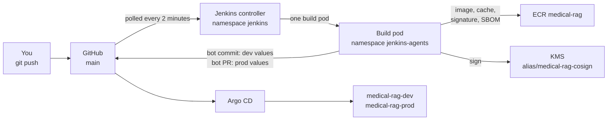

# Jenkins phase: architecture and decisions

How images are built, checked and promoted once Jenkins runs in the cluster. The phase starts where the app phase
ended: dev and prod run from the chart, but you build the image by hand with `make image` and edit the values
files yourself. The build instructions are in [`guide.md`](guide.md). Every idea used here is explained, with
diagrams, in [`guide/0-concepts.md`](guide/0-concepts.md); this page records the decisions.

This phase adds five things:

1. **A pipeline from commit to image:** tests, a rootless build, a vulnerability gate, an SBOM and a signature
   made with the KMS key.
2. **Promotion through Git:** a bot commit updates dev, and a bot pull request proposes prod. Argo CD stays the only
   thing that changes the cluster.
3. **Least privilege for the build:** the build pods get their own AWS role, and the node role loses the right to
   push and sign.
4. **Protection for the images prod runs** against ECR's automatic clean-up.
5. **The measurements** behind design criteria #8, #9 and #10.

## 1. The picture

- **Pull, as before.** Jenkins has no kubeconfig and no cluster role beyond starting its own build pods. It changes
  values files in Git; Argo CD deploys them.
- **One build pod at a time.** Jenkins' Kubernetes cloud is capped at one pod, across all branches. The nodes have
  little CPU left, and a second build would only queue for it.
- **Polling, not a webhook.** Jenkins opens only through the VPN, so GitHub cannot call it.
- **Two Applications, two waves.** `jenkins-platform` (wave 3) and `jenkins` (wave 4) are ordinary Applications
  under `root`, like the app's. What Argo CD does with them — which file it reads, when it notices a commit, what
  each status field means and how a failed sync is retried — is drawn in
  [argocd-explained](../gitops/argocd-explained.md).

## 2. Two namespaces

| Namespace | Runs | Pod Security | Why |
|---|---|---|---|
| `jenkins` | The controller, with its home on an EBS volume | `baseline` enforced, `restricted` warned and audited | It runs no build and needs no special rights. The upstream chart does not set a seccomp profile on every container, which `restricted` requires, so the gap is warned about rather than hidden |
| `jenkins-agents` | One build pod per build, deleted afterwards | `privileged` enforced, `baseline` warned and audited, narrowed by a ValidatingAdmissionPolicy | Step 1 measured that rootless BuildKit needs `Unconfined` seccomp and AppArmor, which `baseline` refuses ([concepts §8](guide/0-concepts.md#8-pod-security-levels-and-admission-policies)). The policy then refuses host access and privileged containers, which BuildKit does not need |

A NetworkPolicy blocks the metadata service (`169.254.169.254`) in both, so no Jenkins pod falls back to the node
role.

## 3. The build pod and its identity

| Container | Does | AWS token |
|---|---|---|
| `jnlp` | Talks to the controller | No |
| `buildkit` | Runs the tests in a build with no registry login; then builds the `runtime` image and pushes it with the cache | No. It holds the ECR login only for the push, after the tests have passed |
| `trivy` | The report and the SBOM, both by digest from ECR | No; it reads the registry login the tools container wrote |
| `tools` | ECR login, the gate, cosign sign and attest, corpus checksum, git, yq, gh | Yes: role `medical-rag-ci` |

**`medical-rag-ci`** trusts only the ServiceAccount `jenkins-agent` in `jenkins-agents`. It may push and pull on the
one repository, ask KMS to sign with the one key, and read objects under `corpus/`. It reads no secret: the GitHub
token reaches Jenkins through External Secrets. Step 18 then removes push and sign from the node role.

**What a malicious test could still do.** It runs inside BuildKit, which shares its process space with the build
steps (`--oci-worker-no-process-sandbox`). That is why the tests run in a build that holds no registry login, and
why only builds on `main` write the shared cache.

## 4. Building without root

Kaniko was archived upstream, and the node's container socket would give a build the node. The build uses
**rootless BuildKit** ([concepts §6–7](guide/0-concepts.md#6-building-images-without-a-docker-daemon)). Ubuntu 24.04
limits what an unconfined program can do inside a user namespace, so step 1 tested BuildKit's own example on the real
nodes first. It worked, with `Unconfined` seccomp and AppArmor and Ubuntu's restriction still on, so no node was
changed ([evidence](../evidence/jenkins.md)).

## 5. The gate, the SBOM and the signature

- **Gate:** the build fails on a CRITICAL vulnerability that has a fix, before anything is signed or promoted.
  Trivy scans **once**, into `trivy-report.json`; the gate then counts that report with `jq`. Scanning first and
  failing second is the only order that keeps the record when the gate goes red. The count is done in `jq`
  because `trivy convert` has no `--ignore-unfixed` — that flag belongs to the scan commands — and `--severity`
  with `--exit-code` would instead fail every build on findings nobody can act on.
- **Criterion #9 compares like with like.** The earlier "before" came from ECR's scanner. Step 1 measures the same
  image with Trivy 0.74.0; step 13 measures the hardened image with the same version.
- **SBOM:** Trivy, SPDX JSON, archived and attached as a signed attestation. Syft publishes no image with a shell, and Trivy writes the same format from the scan it already runs.
- **Signature:** cosign with `awskms:///alias/medical-rag-cosign`, on the digest BuildKit reports for the image it
  pushed. The private key never leaves KMS. No upload to the public Rekor log.

## 6. Writing back to Git

| Stage | On `main` | On `jenkins/step-N` |
|---|---|---|
| Skip guard, tests, build, scan | Yes | Yes |
| Write the build cache | Yes | No: branches only read it |
| SBOM, sign, attest | Yes | No: one stage, `when { branch 'main' }` |
| Index version check | Yes | Yes, without writing anything |
| Commit the new tag to dev's values | Yes, as `jenkins-bot`, with `git pull --rebase` and up to 3 tries | No |
| Open the prod pull request | Yes | No |
| Tag the image prod's values name `release-…` | Yes, when a change to prod's values reaches `main` | No |

The skip guard, the token's path and the limit of a one-person repository are explained in
[concepts §18–19](guide/0-concepts.md#18-writing-back-to-git).

## 7. The index version

The pipeline recomputes the index version. A new version is written to the values files only when the PDF in Git
has the same SHA-256 as the corpus in S3; otherwise the pipeline stops before writing anything. It never uploads the
corpus ([concepts §20](guide/0-concepts.md#20-the-index-version-in-ci)).

## 8. ECR clean-up

Two rules, in priority order: keep the last 10 images tagged `release-*`, then keep 30 tagged images in total. The
first rule's images can never be expired by the second, which still counts them. Signatures and attestations are
untagged and never counted. Old build cache manifests are untagged too and accumulate; step 19 would have measured the
repository's size and the number of untagged images, which is the input for deciding whether the cache needs a
repository of its own.

## 9. Capacity

The nodes are `m7i-flex.large`: 2 vCPU, 8 GB. With the app running, 61%, 64% and 72% of the three nodes' CPU was
already requested before this phase, leaving 775m, 720m and 560m free. The controller runs no build steps, and only
one build pod exists at a time. A pod runs on one node, so the budget is the smallest gap, 560m: the controller
asks for 250m, and the build pod declares 400m across its three containers, plus whatever the plugin's own `jnlp`
container asks for, which step 10 reads from the running pod. Part 3 checks the build pod's real use in
Prometheus. Jenkins comes last:
`jenkins-platform` at wave 3 and `jenkins` at wave 4, so a slow plugin download cannot delay the app on a rebuild.

## 10. Known limits and what is out of scope

| Limit | Why it is accepted | What would fix it |
|---|---|---|
| **Nothing has shown the phase survives a rebuild** | Step 19's teardown and rebuild were not run (2026-09-21); the phase was closed on the cluster it grew into. The GitOps phase measured a rebuild at 14 m 11 s, but that cluster had no Jenkins in it | Run step 19: tear down, rebuild from Git, and take one release through the rebuilt cluster |
| The bot's token is yours, so GitHub cannot enforce "prod only by pull request" | One-person repository | A separate bot account or GitHub App, and a rule requiring a code owner for `deploy/envs/prod/` |
| Polling adds up to two minutes | Jenkins is reachable only through the VPN | A webhook relay or a GitHub App |
| Build steps share BuildKit's process space | Rootless BuildKit in a pod cannot create its own PID namespace | Build nodes or VMs kept away from the application nodes |
| Old cache manifests are never deleted | No rule may count untagged images without risking signatures | A separate cache repository with its own clean-up rule |
| External Secrets, cert-manager and the EBS CSI driver still use the node role | Outside this phase | Their own roles through the same issuer |
| No Kyverno: nothing refuses an unsigned image yet | A later, optional phase | `verifyImages` with the KMS public key, `Enforce` in prod |
| App traffic is plain HTTP | Out of scope in the design | An ACM certificate on the public load balancer |
| No backup of the Jenkins home | Everything in it is rebuilt from Git; only build history is lost | A snapshot schedule for its volume |
| The pipeline's tools live in an image this repository builds (`ci/Dockerfile`), pushed by hand with `make ci-image` | cosign and `gh` publish images without a shell, and Jenkins runs every step through one; downloading them on each build would add time and a network dependency | A pipeline of its own for that image, once there is more than one |

## 11. Where this phase changes the design

The design (`docs/selfmanaged-k8s-ops-design.md` §4.5) is followed except for these points:

| Design | This phase | Why |
|---|---|---|
| Build pods use the node role | Their own role, `medical-rag-ci` | The node role can do far more than a build needs |
| One Jenkins namespace | `jenkins` (`restricted`) and `jenkins-agents` (level set by step 1) | BuildKit needs rights the controller does not |
| Multibranch on `main` | Multibranch on `main` and `jenkins/step-N` | Pipeline changes are proven on a branch before `main` |
| At most one concurrent build | One build pod at a time, through the Kubernetes cloud's cap | A per-job setting would let two branches build at once |
| Wave 3, one Application | `jenkins-platform` at wave 3 and `jenkins` at wave 4, after the app | Nothing depends on Jenkins, and the chart in wave 4 needs the namespace and credentials wave 3 creates |
| One Application for Jenkins | Two: `jenkins-platform` (manifests in this repo) and `jenkins` (upstream chart + values) | An Application renders one kind of source, so a directory of manifests and a remote chart cannot share one. It also keeps the credentials and the admission policy alive across a chart reinstall, and only the chart Application owns a volume |
| Keep the last 20 images | Keep 10 `release-*` images first, then 30 in total | A count alone can delete the image prod runs |
| A `python:3.12` agent container for lint and tests | Tests in the Dockerfile's `test` target, inside BuildKit | One place defines how tests run, locally and in CI |
| Syft writes the SBOM | Trivy writes it, in the same SPDX format | One container fewer, and the SBOM comes from the scan of the same digest |
| hadolint in the lint stage | Not used | It needs another image with a shell; the Dockerfile is reviewed in pull requests instead |
