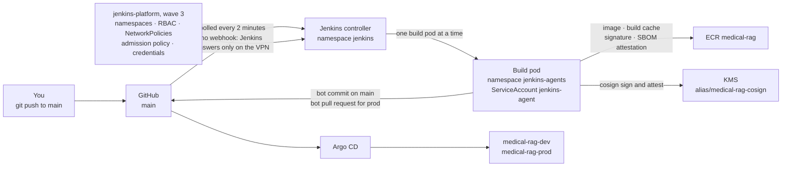
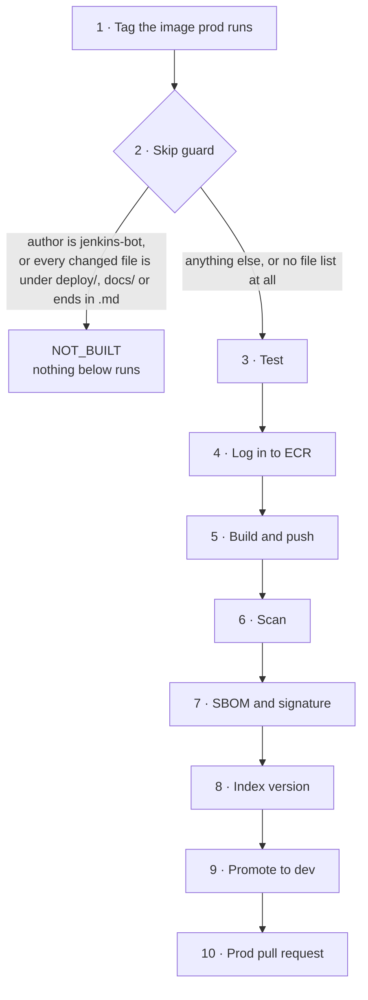
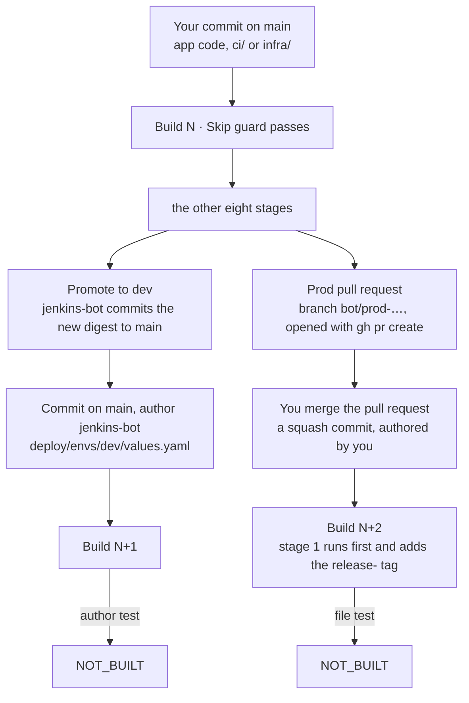

# Jenkins phase: architecture and decisions

How images are built, checked and promoted once Jenkins runs in the cluster. The phase starts where the app phase
ended: dev and prod run from the chart, but you build the image by hand with `make image` and edit the values
files yourself. The build instructions are in [`guide.md`](guide.md), and when something breaks there is
[`guide/troubleshooting.md`](guide/troubleshooting.md). Every idea used here is explained, with diagrams, in
[`guide/0-concepts.md`](guide/0-concepts.md); this page records the decisions and what they cost. Self-check and
interview questions (Vietnamese) are in [`questions.md`](questions.md), with answers in [`answers.md`](answers.md).

This phase adds five things:

1. **A pipeline from commit to image:** tests, a rootless build, a vulnerability gate, an SBOM and a signature
   made with the KMS key.
2. **Promotion through Git:** a bot commit updates dev, and a bot pull request proposes prod. Argo CD stays the only
   thing that changes the cluster.
3. **Least privilege for the build:** the build pods get their own AWS role, and the node role loses the right to
   push and sign.
4. **Protection for the images prod runs** against ECR's automatic clean-up.
5. **The measurements** behind design criteria #8 (commit → dev running), #9 (supply chain) and #10 (promotion
   by pull request). The criteria are listed in the
   [design's §6](../selfmanaged-k8s-ops-design.md#6-verification-and-evidence-definition-of-done).

Two conventions used throughout. **"Step N"** is the numbered step of [`guide.md`](guide.md), where that change
was made and checked. **`jenkins/step-N`** is the temporary branch the guide asks you to push a pipeline change
to before it reaches `main`; the Multibranch job builds both.

Every measurement on this page comes from [`../evidence/jenkins.md`](../evidence/jenkins.md); the pod's declared
resources, tool versions and intervals come from the `Jenkinsfile` and `deploy/argocd/values/jenkins.yaml`.

## 1. The picture



- **Pull, as before.** Jenkins has no kubeconfig and no cluster role beyond starting its own build pods. It changes
  values files in Git; Argo CD deploys them.
- **One build pod at a time.** `containerCap: 1` caps Jenkins' Kubernetes cloud across all branches. The nodes have
  little CPU left (§13), and a second build would only queue for it.
- **Polling, not a webhook.** Jenkins opens only through the VPN, so GitHub cannot call it. The cost is up to two
  minutes of latency, inside the 14 m 20 s pipeline leg of criterion #8; how much of that leg was waiting rather
  than working was never separated (§12).
- **Two Applications, two waves.** `jenkins-platform` (wave 3) and `jenkins` (wave 4) are ordinary Applications
  under `root`, like the app's. One Application renders one kind of source, so a directory of manifests and a
  remote chart cannot share one — and the split has a second benefit: the credentials and the admission policy
  survive a chart reinstall, because only the chart Application owns the volume. What Argo CD does with them is
  drawn in [argocd-explained](../gitops/argocd-explained.md).

## 2. Two namespaces

| Namespace | Runs | Pod Security | Why |
|---|---|---|---|
| `jenkins` | The controller, with its home on an EBS volume | `baseline` enforced, `restricted` warned and audited ([concepts §8](guide/0-concepts.md#8-pod-security-levels-and-admission-policies)) | It runs no build and needs no special rights. The upstream chart does not set a seccomp profile on every container, which `restricted` requires, so the gap is warned about rather than hidden |
| `jenkins-agents` | One build pod per build, deleted afterwards | `privileged` enforced, `baseline` warned and audited, narrowed by a ValidatingAdmissionPolicy | Step 1 measured that rootless BuildKit runs with `Unconfined` seccomp and AppArmor, which `baseline` refuses. The policy then refuses host access and privileged containers, which BuildKit does not need |

A NetworkPolicy blocks the metadata service (`169.254.169.254`) in both, so no Jenkins pod falls back to the node
role. The hop limit is not the fence — the NetworkPolicy is; the same argument the app phase makes in
[app README §2](../app/README.md#2-workload-identity-without-a-webhook).

## 3. The build pod and its identity

| Container | Does | CPU · memory requested | AWS token |
|---|---|---|---|
| `jnlp` | Talks to the controller | 100m · plugin default | No |
| `buildkit` | Runs the tests in a build with no registry login; then builds the `runtime` target and pushes it with the cache | 300m · 1Gi | No. It holds the ECR login only for the push, after the tests have passed |
| `trivy` | The report and the SBOM, both by digest from ECR | 50m · 384Mi | No; it reads the registry login the tools container wrote |
| `tools` | ECR login, the gate, cosign sign and attest, corpus checksum, git, yq, gh | 50m · 192Mi | Yes: role `medical-rag-ci` |

**How `tools` gets that role.** The same exchange the app's pods use
([app README §2](../app/README.md#2-workload-identity-without-a-webhook)), with role `medical-rag-ci` and
`sub = system:serviceaccount:jenkins-agents:jenkins-agent`. The token is a projected `serviceAccountToken`,
audience `sts.amazonaws.com`, one hour, and it is mounted into `tools` and nowhere else —
`automountServiceAccountToken: false` on the pod makes sure of it.

**What the role may do.** Push and pull on the app repository, ask KMS to sign with the one key, and read objects
under `corpus/`. It reads no secret: the GitHub token reaches Jenkins through External Secrets. Step 18 then took
push and signing away from the node role, so this is now the only path to either.

**What a malicious test could still do.** It runs inside BuildKit, which shares its process space with the build
steps (`--oci-worker-no-process-sandbox`). That is why the tests run in a build that holds no registry login, and
why only builds on `main` write the shared cache.

## 4. How Jenkins is configured

Nothing about this controller is clicked into existence. `deploy/argocd/values/jenkins.yaml` carries the whole of
it: the plugin list, the Multibranch job under `controller.JCasC.configScripts`, the credentials it reads, and the
pod template's cap. A rebuild reproduces the controller because Argo CD applies that file, not because anyone
remembers what was set.

`installLatestPlugins: false` is the important line, and §11 is the story of what it cost. With it, each
dependency resolves to the **highest of the minimums its dependents demand** — not to the latest release — so a
plugin list is a set of floors, not a set of versions. Three plugins had to be raised by hand because the startup
log demanded them by name.

## 5. The ten stages, and what a branch build skips



| # | Stage | Container | On `main` | On `jenkins/step-N` |
|---|---|---|---|---|
| 1 | Tag the image prod runs | `tools` | Only when `deploy/envs/prod/values.yaml` changed | No |
| 2 | Skip guard | — | Yes | Yes |
| 3 | Test | `buildkit` | Yes | Yes |
| 4 | Log in to ECR | `tools` | Yes | Yes |
| 5 | Build and push | `buildkit` | Yes, and **exports** the cache | Yes, but only **imports** it |
| 6 | Scan, then the gate | `trivy`, then `tools` | Yes | Yes |
| 7 | SBOM and signature | `trivy`, then `tools` | Yes | **No** — one stage, `when { branch 'main' }` |
| 8 | Index version | `buildkit`, then `tools` | Yes | Yes, without writing anything |
| 9 | Promote to dev | `tools` | Yes, as `jenkins-bot`, with `git pull --rebase` and up to 3 tries | No |
| 10 | Prod pull request | `tools` | Yes | No |

**Stage 1 sits above the guard on purpose.** The commit that merges a prod pull request changes only
`deploy/envs/prod/values.yaml`, so the guard ends that build — and the `release-…` tag would never be written if
the tagging stage ran after it. Everything else is ordered by dependency; this one is ordered around the guard.

**Only `main` exports the build cache**, so a branch cannot poison what `main` builds from. On a branch, stages
1, 7, 9 and 10 do not run — six of the ten do — and the build finishes in about a tenth of the time (§12).

**The tests run before any credential exists.** Stage 3 is a BuildKit build of the Dockerfile's `test` target, and
stage 4 is the first AWS call on any build that reaches the tests. Stage 1 does touch AWS, but only on a prod
merge — which the guard then ends before stage 3 ever runs.

## 6. Building without root

A build needs to produce an image, and the two obvious ways to do that in a cluster both hand the build too much.
Mounting the node's container socket gives the build the node: anything it can ask the daemon to do, it does as
root outside its own container. Docker-in-Docker needs a privileged container, which is the same grant wearing a
different hat. Kaniko was the usual third answer and was archived upstream.

So the build uses **rootless BuildKit** ([concepts §6–7](guide/0-concepts.md#6-building-images-without-a-docker-daemon)),
which builds inside a user namespace with no daemon and no root on the host. Ubuntu 24.04 limits what an
unconfined program may do inside a user namespace, so step 1 tested BuildKit's own example on the real nodes
before anything was built around it. It ran, with `Unconfined` seccomp and AppArmor and Ubuntu's restriction still
on, so no node was changed.

What it costs: the namespace `jenkins-agents` has to be Pod Security `privileged`, because `baseline` refuses
`Unconfined`. That is the trade this phase makes, and the ValidatingAdmissionPolicy in §2 is what buys it back —
it refuses host paths, host networking and privileged containers, none of which BuildKit needs.

## 7. The gate, the SBOM and the signature

- **Gate:** the build fails on a CRITICAL vulnerability that has a fix, before anything is signed or promoted.
  Trivy scans **once**, into `trivy-report.json`; the gate then counts that report with `jq`. Scanning first and
  failing second is the only order that keeps the record when the gate goes red. The count is done in `jq`
  because `trivy convert` has no `--ignore-unfixed` — that flag belongs to the scan commands — and `--severity`
  with `--exit-code` would instead fail every build on findings nobody can act on.
- **The gate has never gone red on a real CRITICAL.** All five CRITICAL findings in the original image were
  unfixed, so it returned `0` both before and after step 13's base-image change. Its failure path was exercised
  later, in the drills phase: a positive-control build on a temporary branch, with the filter widened to fixable
  findings of any severity, printed `Fixable, any severity: 6` and failed (`../evidence/drills.md`, M4).
- **Criterion #9 compares like with like.** The earlier "before" came from ECR's scanner. Step 1 measures the same
  image with Trivy 0.74.0; step 13 measures the hardened image with the same version: CRITICAL **5 → 0**, total
  findings 269 → 158, by moving both base images to Debian 13.
- **SBOM:** Trivy, SPDX JSON, archived and attached as a signed attestation. Trivy writes the same format from the
  scan it already runs, so the pipeline needs no second tool for it.
- **Signature:** cosign with `awskms:///alias/medical-rag-cosign`, on the digest BuildKit reports for the image it
  pushed. The private key never leaves KMS. Nothing is uploaded to Rekor, the public transparency log: these
  images are private, so their digests, repository name and account id have no business in one.

## 8. The index version

The pipeline recomputes the index version. A new version is written to the values files only when the PDF in Git
has the same SHA-256 as the corpus in S3; otherwise the pipeline stops before writing anything. It never uploads
the corpus — that is a deliberate manual write, never automated
([concepts §20](guide/0-concepts.md#20-the-index-version-in-ci)). The index itself is built by a Job inside the
cluster at the app chart's wave 1, not by Jenkins.

This stage was Part 3's only **positive control**: renaming the PDF without uploading it made the stage go red,
the one place in this phase where the *pipeline* was shown to stop something rather than merely allow it. Part 2 has
one of its own — the admission policy refusing a `hostPath` pod. The Trivy gate got its positive control later, in the
drills phase (`../evidence/drills.md`, M4).

## 9. One commit, three builds

One push to `main` produces one green build and then one or two grey ones. That is the design working, not a
fault. For a single code commit, the job's history shows:

| Build | Result | Why |
|---|---|---|
| N | green, nine of the ten stages | your commit; stage 1 fires only on a prod merge |
| N+1 | `NOT_BUILT` | the bot's commit that promoted build N to dev |
| N+2, whenever you merge | `NOT_BUILT` | the squash merge of the prod pull request |

Build N+2 arrives only when you act on the pull request — minutes later, days later, or never if you close it. A
build on `jenkins/step-N` is a fourth kind of run in the same list: green, but deliberately six stages of ten.

**Both grey builds print the same line**, and this is the part worth remembering:

```
Nothing to build: author=<the commit's author>, only docs or deploy files changed
```

**Read the name.** `jenkins-bot` means build N+1, stopped by the author test. Your own name means a merge,
stopped by the *file* test — a squash merge is authored by whoever pressed the button, so the author test never
fires on a prod merge. The message names an author either way; that it does is not evidence that the author test
is what caught it.



`NOT_BUILT` is its own Jenkins result, distinct from failure — Jenkins renders it grey, not red. Seeing two of
them after a release is the anti-loop mechanism working.

**Why the guard treats an empty file list as "build".** `git show --pretty= --name-only HEAD` prints nothing at
all on a merge commit — measured at zero bytes. An empty list makes "every changed file is under `deploy/`"
vacuously true, which would skip the build. The guard therefore treats unknown as "must build": skipping on doubt
hides changes. The consequence is that it can only ever skip a single-parent commit, so a `git pull` that creates
a merge always costs one build.

## 10. One digest, many tags, and what the lifecycle rules count

```
sha256:f5b6789a…  →  a5a04d8c2e71, 0f3586e8c8fb, b79a4531d5cb, da86f9a711c6, 03a094343291,
                     release-b79a4531d5cb, a0c71e643a75, 8efe125bbf62, 02d44eff3b6e, ee9ae14b4efe
```

Ten tags, one image. Every commit since the base moved to Debian 13 that *reached* `Build and push` touched only
files outside the runtime image — the `Jenkinsfile` itself, `ci/`, `infra/` — so BuildKit reproduced identical
content and each build simply added a tag. Commits under `docs/` or `deploy/` produced no tag at all, because the
guard ended them first.

Two things follow that are easy to get wrong. **A tag records which commit *built* an image, not which commit
*changed* it**; reading it as provenance for the contents is wrong here. And **the lifecycle rules count images,
not tags**: those ten consume one of the thirty places, not ten.

The rules, in priority order: keep the last 10 images tagged `release-*`, then keep 30 tagged images in total.
Rule 1's images cannot be expired by rule 2, which still counts them — that follows from AWS's rule-priority
semantics and has not been exercised here, because fewer than 30 tagged images exist (§15). Signatures and
attestations are untagged and never counted, which is also why no rule may sweep untagged images: it would sweep
the signatures of the images that are running. Old build cache manifests are untagged too, and accumulate.

## 11. Twenty-three defects, and the shape they kept taking

Two different things get called "many builds".

**While the pipeline was being written, every change cost a build.** There is no way to test a `Jenkinsfile`
except to push it and wait for the poll, so steps 10 to 18 are largely the pipeline iterating on itself. Builds 11
to 17 all ran on `main`, against the guide's own instruction to use a `jenkins/step-N` branch — the first branch
build in the phase was step 12's, which is also what finally tested the claim that branches never export the cache.

**Twenty-three defects were found and recorded, all but one in the guide rather than in the AWS account.** Fifteen
fall into five shapes; the rest are one-offs, mostly a step that omits a prerequisite or misstates its own
expected output.

| Shape | Count | The worst example |
|---|---|---|
| A check that passed while the thing it guarded was broken | 5 | A placeholder grep, added to fix an earlier defect of the same kind, could not see the very next placeholder — its character class was missing a space |
| A command that cannot do what the step says | 5 | `trivy convert --ignore-unfixed`: the flag belongs to the scan commands, so the gate could never pass, on any image, in any cluster |
| Failed loudly but pointed away from the cause | 2 | `jq: Invalid numeric literal at line 1, column 10` — column 10 of `<!DOCTYPE HTML PUBLIC …`, which is to say a 307 redirect |
| A fix in one step that undoes another | 1 | Step 18's replacement ECR statement would have put the `tools` container back into `ImagePullBackOff`, three steps away from the change that caused it |
| A disclosed credential | 1 | Jenkins runs every `sh` as `/bin/sh -xe`, which echoed the ECR token into build 14's log; it was valid for twelve hours and allowed push and pull across the registry |

**The most expensive single defect was a plugin suite that split.** Four `pipeline-model-*` plugins ship together
from one repository and must share a version string; the resolver left two of them at 2.2218 while the other two
moved to 2.2277. The mixed set **loaded without any error**, and the next real build failed with
`NullPointerException: Cannot invoke method call() on null object`. The link between the two is inferred from the
symptom and from the fix working — the controller log carrying the stack trace was rotated away by a pod restart
before it was captured. It cost four builds and two wrong diagnoses.

The check that should have caught it — `grep -cE "Failed Loading plugin|Failed to load:"`, anchored on
`Jenkins is fully up and running` — returned 0, correctly. It reads declared minimum versions and is structurally
blind to a suite whose members disagree. A check that cannot fail is worse than no check, because it buys
confidence that was never earned. Five of the twenty-three are of that shape.

## 12. How long a release takes

Criterion #8, commit to running: **19 minutes 8 seconds**, on 2026-09-20.

| Leg | Time |
|---|---|
| Your commit → the bot's dev commit | **14 m 20 s** |
| The bot's dev commit → the dev pod `Ready` | **4 m 48 s** |

Both halves are soft, and it is worth saying how:

- **The second leg was nudged.** `argocd.argoproj.io/refresh=normal` was annotated by hand while waiting, and that
  is very likely what triggered the sync. Argo CD's own poll would have taken up to its interval. So 4 m 48 s is
  not the number a release gets when nobody is watching.
- **The first leg was never decomposed.** 14 m 20 s is far above the **1 m 32 s** a branch build took at step 15.
  Three stages run only on `main`, and `containerCap: 1` means a build can queue behind another. How much of the
  fourteen minutes was waiting rather than working was not separated; the build's Stage View would split it and
  was not captured.

## 13. Capacity

The nodes are `m7i-flex.large`, 2 vCPU and 8 GB. With the app running, this much CPU was already requested before
the phase began:

| Node | Requested | Free |
|---|---|---|
| node 1 | 72% | 560m |
| node 2 | 61% | 775m |
| node 3 | 64% | 720m |

A pod runs on one node, so the budget is the smallest gap. The controller takes 250m and landed on node 1,
leaving 310m there — too little for a build pod, which asks for **500m**: 300m `buildkit`, 50m `tools`, 50m
`trivy`, and 100m for the plugin's own `jnlp` container, which step 10 read from Prometheus because the
`Jenkinsfile` does not declare it. Build pods can therefore land only on nodes 2 and 3.

Jenkins comes last, at waves 3 and 4, so a slow plugin download cannot delay the app on a rebuild — the same
argument [gitops README §4](../gitops/README.md#4-app-of-apps-and-sync-waves) makes for the wave order generally.

## 14. What is proven, and what is assumed

| Claim | Status |
|---|---|
| A commit reaches a running dev pod with no manual step | **Measured**, 19 m 8 s, with the two caveats in §12 |
| The image prod runs was scanned, signed and reviewed | **Measured**: `cosign verify` accepted it and refused the unsigned app-phase image |
| The build pods use `medical-rag-ci`, not the node role | **Measured** twice: the simulator, and a pod in `default` that assumed the node role and was refused `kms:Sign` |
| The anti-loop guard catches both the bot commit and the prod merge | **Measured**, by two different conditions (§9) |
| Base-image hardening reduces findings | **Measured**: CRITICAL 5 → 0, total 269 → 158 |
| The gate can fail a build | **Measured** in the drills phase, by a positive control: 6 fixable findings, build red at Scan |
| The gate blocks a fixable CRITICAL | **Assumed.** No fixable CRITICAL has appeared |
| `release-*` images survive the second lifecycle rule | **Assumed.** Fewer than 30 tagged images exist, so no preview has exercised it |
| The phase comes back from Git after a teardown | **Half measured** in the drills phase (`../evidence/drills.md`, M3): a timed rebuild brought all 17 Applications, `jenkins-platform` and `jenkins` included, back Synced and Healthy in 21 m 47 s. Nobody logged in, and no commit has yet gone through the rebuilt pipeline |
| The split plugin suite caused that `NullPointerException` | **Inferred** from the symptom and from the fix working; the stack trace was rotated away |

## 15. Known limits and what is out of scope

| Limit | Why it is accepted | What would fix it |
|---|---|---|
| **No release has gone through a rebuilt cluster** | The drills phase's timed rebuild brought the Jenkins Applications back Synced and Healthy (21 m 47 s for all 17, `../evidence/drills.md` M3), but no commit has been pushed through the rebuilt pipeline | Push one small code change after a rebuild and follow it to the dev pod |
| **Signatures are checked only for the app, in two namespaces** | Closed for the app in the drills phase: Kyverno `ImageValidatingPolicy`, `Deny` in prod and `Audit` in dev, refused an unsigned image at admission | Widen the policy to the addons' images, which are not signed by this pipeline |
| **The gate has never caught a real fixable CRITICAL** | None has appeared. Its failure path was proven by a positive control (drills phase, M4) | Nothing to fix; keep the positive control as a periodic check |
| The bot's token is yours, so GitHub cannot enforce "prod only by pull request" | One-person repository | A separate bot account or GitHub App, and a rule requiring a code owner for `deploy/envs/prod/` |
| Polling adds up to two minutes | Jenkins is reachable only through the VPN | A webhook relay or a GitHub App |
| The skip guard cannot read a merge commit's files, so every merge costs a build | Treating unknown as "must build" is the safe direction | Nothing worth doing; squash merges, which this repository is set to use, are single-parent |
| Build steps share BuildKit's process space | Rootless BuildKit in a pod cannot create its own PID namespace | Build nodes or VMs kept away from the application nodes |
| Old cache manifests are never deleted | No rule may count untagged images without sweeping the signatures with them | A separate cache repository with its own clean-up rule |
| Trivy re-downloads its 114.8 MiB database every build | `TRIVY_CACHE_DIR` sits on the pod's `emptyDir`, which dies with the pod | A volume that outlives the pod, or a mirror inside the cluster |
| External Secrets, cert-manager and the EBS CSI driver still use the node role | Outside this phase | Their own roles through the same issuer |
| App traffic is plain HTTP | Out of scope in the design | An ACM certificate on the public load balancer |
| No backup of the Jenkins home | Everything in it is rebuilt from Git; only build history is lost | A snapshot schedule for its volume |
| The pipeline's tools live in an image this repository builds (`ci/Dockerfile`), pushed by hand with `make ci-image` | cosign and `gh` publish images without a shell, and Jenkins runs every step through one; downloading them on each build would add time and a network dependency | A pipeline of its own for that image, once there is more than one |

## 16. Where this phase changes the design

The design (`../selfmanaged-k8s-ops-design.md` §4.5) is followed except for these points:

| Design | This phase | Why |
|---|---|---|
| Build pods use the node role | Their own role, `medical-rag-ci` | The node role can do far more than a build needs |
| One Jenkins namespace, `restricted` | `jenkins` (`baseline` enforced, `restricted` warned) and `jenkins-agents` (`privileged`, set by step 1) | BuildKit needs rights the controller does not, and the upstream chart does not set a seccomp profile on every container, which `restricted` requires |
| Multibranch on `main` | Multibranch on `main` and `jenkins/step-N` | Pipeline changes are proven on a branch before `main` |
| At most one concurrent build | One build pod at a time, through the Kubernetes cloud's cap | A per-job setting would let two branches build at once |
| Wave 3, one Application | `jenkins-platform` at wave 3 and `jenkins` at wave 4, after the app | Nothing depends on Jenkins, and the chart in wave 4 needs the namespace and credentials wave 3 creates |
| Keep the last 20 images | Keep 10 `release-*` images first, then 30 in total | A count alone can delete the image prod runs |
| A `python:3.12` agent container for lint and tests | Tests in the Dockerfile's `test` target, inside BuildKit | One place defines how tests run, locally and in CI |
| Syft writes the SBOM | Trivy writes it, in the same SPDX format | One container fewer, and the SBOM comes from the scan of the same digest |
| hadolint in the lint stage | Not used | It needs another image with a shell; the Dockerfile is reviewed in pull requests instead |
| The design's plain `cosign sign` would upload to Rekor by default | No transparency log: a signing config with no services at all | The images are private, and cosign v3 removed the flags that used to say so |
