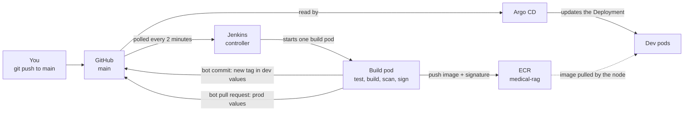
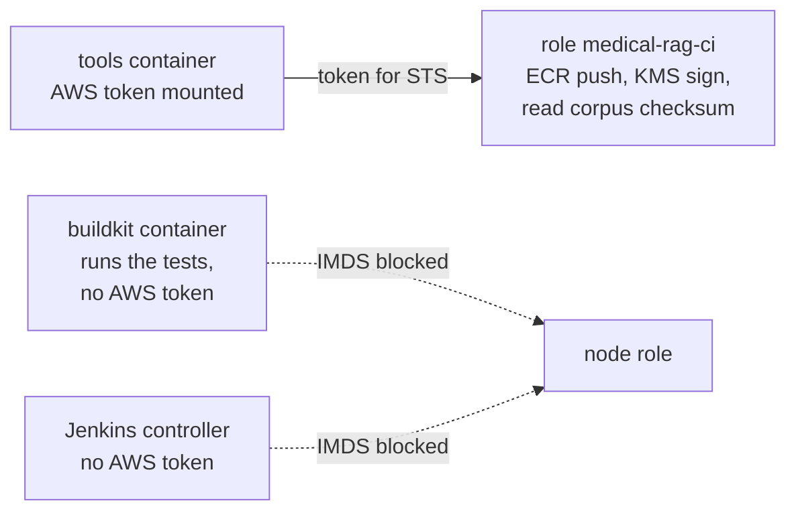
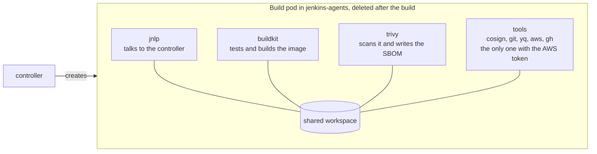
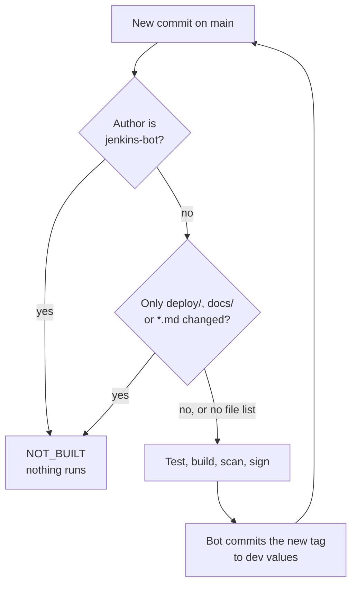

# Jenkins guide — Concepts

[Index](../guide.md) · [Part 1 →](1-measure-and-foundations.md) · [Troubleshooting](troubleshooting.md)

This page explains every idea the Jenkins guide relies on, before you run any step. Each section says what
the thing is, where it appears in this project, what breaks without it, and how companies usually do it. The
sections come in three groups, in the order the parts need them. The diagrams render on GitHub. Every term
is also in the [glossary](#glossary) at the end.

**One example runs through the whole page.** You fix a bug in `src/app/application.py`, commit, and push to
`main`. About fifteen minutes later, a dev pod runs a new image built from that commit. Nobody ran a command.
The image was tested, scanned for known vulnerabilities and signed before any pod could use it, and a pull
request for prod is waiting for you. How?

## The big picture

Today, you build the image by hand with `make image`, then edit `deploy/envs/dev/values.yaml` yourself. This
phase hands both jobs to Jenkins, and keeps Argo CD as the only thing that changes the cluster.



1. Jenkins notices the new commit on `main`.
2. It starts a *build pod* that tests the code, builds the image, scans it and signs it.
3. The image goes to ECR. The build pod then commits the new image tag into the dev values file, as a bot.
4. Argo CD sees that commit and deploys it, exactly as when you edited the file by hand.
5. For prod, the bot opens a pull request instead. You merge it when dev looks good.

**What to read when.**

The left column is a step of the guide, the right one a section of this page.

| Before step | Read sections |
|---|---|
| 1 | The big picture, then [1](#1-ci-and-cd-and-why-they-are-separate), [2](#2-cves-scanners-and-trivy), [6](#6-building-images-without-a-docker-daemon), [7](#7-rootless-user-namespaces-seccomp-and-apparmor), [8](#8-pod-security-levels-and-admission-policies): about 20 minutes |
| 2 | [3](#3-images-layers-registries-and-the-build-cache), [4](#4-ecr-lifecycle-policies) |
| 3 | [5](#5-the-pipelines-aws-identity) |
| 4 | No new idea: the name works like the other internal UI names ([GitOps README §5](../../gitops/README.md#5-traffic-into-the-cluster-and-the-internal-uis)) |
| 5 | [7](#7-rootless-user-namespaces-seccomp-and-apparmor), [8](#8-pod-security-levels-and-admission-policies) |
| 6 and 7 | [8](#8-pod-security-levels-and-admission-policies), [14](#14-credentials) |
| 8 and 9 | [9](#9-jenkins-controller-build-pods-executors-plugins) to [13](#13-configuration-as-code-jcasc) |
| 10 and 11 | [10](#10-pipeline-as-code-the-jenkinsfile), [3](#3-images-layers-registries-and-the-build-cache), [6](#6-building-images-without-a-docker-daemon) |
| 12 and 13 | [2](#2-cves-scanners-and-trivy), [15](#15-base-images-and-hardening) |
| 14 | [16](#16-sbom), [17](#17-signing-images-with-cosign) |
| 15 | [20](#20-the-index-version-in-ci) |
| 16 and 17 | [18](#18-writing-back-to-git), [19](#19-promotion-by-pull-request), [21](#21-measuring-the-pipeline) |
| 18 and 19 | [5](#5-the-pipelines-aws-identity), [21](#21-measuring-the-pipeline) |

---

## A. Before Part 1: images, vulnerabilities, identity, building without root

### 1. CI and CD, and why they are separate

**What it is.** *CI* (continuous integration) turns a commit into a tested, packaged artifact: here, an image in
ECR. *CD* (continuous delivery) puts an artifact into an environment. In this project Jenkins does CI and Argo CD
does CD, and the only thing they share is Git.

**Where it appears.** Jenkins never talks to the Kubernetes API to deploy. It has no kubeconfig. It changes one
line in a values file, and Argo CD, which already watches Git, does the rest. This is the *pull* model of the
[GitOps README](../../gitops/README.md#1-the-picture).

**Without it.** The old `Jenkinsfile` in this repository ran `kubectl apply` with an admin kubeconfig. Anyone
who could change the pipeline could do anything in the cluster, and a deploy left no record in Git.

**In companies.** The same split is common: a CI system (Jenkins, GitHub Actions, GitLab CI) builds and
publishes, and a GitOps tool (Argo CD, Flux) deploys. The CI system's power over production is limited to
opening a pull request.

### 2. CVEs, scanners and Trivy

**What it is.**
- A **CVE** is a published, numbered vulnerability in a package, such as `CVE-YYYY-NNNNN` in `openssl`. Each has
  a severity: `CRITICAL`, `HIGH`, `MEDIUM`, `LOW`, or `UNKNOWN` when none is assigned yet.
- A vulnerability is **fixed** when the distribution has released a patched package version, and **unfixed**
  when no patch exists yet. You can act on a fixed one (update the package); an unfixed one you can only accept
  or avoid.
- A **scanner** lists the packages in an image and looks each one up in a vulnerability database. Two scanners
  use different databases and rules, so they give different numbers for the same image.
- **Trivy** is an open-source scanner. `--ignore-unfixed` leaves out unfixed findings; `--exit-code 1` makes it
  fail when it finds something at the chosen `--severity`.

**Where it appears.** The pipeline has a *gate*: Trivy with `--severity CRITICAL --ignore-unfixed --exit-code 1`,
so a fixable CRITICAL stops the build before the image is signed or promoted. A second Trivy run writes the full
report, HIGH included, without failing. The project's "before" numbers for criterion #9 (4 CRITICAL, 14 HIGH,
8 MEDIUM) came from ECR's own scanner. Step 1 measures the same image with Trivy, so the "before" and "after"
come from the same tool.

**Without it.** A known, fixable vulnerability reaches prod, and nobody knows until someone reads a report.

### 3. Images, layers, registries and the build cache

**What it is.** An image is a list of *layers* (the `RUN`, `COPY` and `ADD` instructions of a Dockerfile each
make one) plus a *manifest* that lists them. A *tag* is a movable name for a manifest, and a *digest* is the
manifest's hash ([App concepts §14](../../app/guide/0-concepts.md#14-image-tags-and-digests)). A build tool keeps
a *cache* of layers: when an instruction and its inputs have not changed, it reuses the layer instead of running
the instruction again.

**Analogy.** The cache is yesterday's prepared ingredients: if the recipe step and the ingredients are the same,
you take them from the fridge instead of cooking again.

**Where it appears.** Build pods are deleted after every build, so their local cache is lost. BuildKit can store
the cache in the registry itself, as a special image tagged `buildcache`, and read it back at the next build.
Dependencies (`uv sync`) change rarely, so most builds reuse those layers and only rebuild the application code.

The ECR repository is *immutable*: a tag, once set, cannot be moved to another image. Two tag patterns are
exceptions, because tools must overwrite them: `buildcache*`, which each build replaces, and `sha256-*`, the tags
older cosign versions used for signatures.

**Without it.** Every build would download and install every Python package again, for several minutes.

### 4. ECR lifecycle policies

**What it is.** A *lifecycle policy* deletes images automatically. It is a list of *rules*. Each rule selects
images by tag pattern and *expires* (deletes) those beyond a count or an age. Each rule has a `rulePriority`
number, and a **lower number is applied first**. Once a rule selects an image, no later rule can expire it; a
later rule still *counts* it, though.

**Where it appears.** Today one rule keeps the last 20 tagged images. Each pipeline build pushes one image,
temporary branches included, so about 20 builds later the image prod runs would be deleted while prod still
uses it. A pod started on another node would then fail with `ImagePullBackOff`. Step 2 adds a first rule that
keeps the last 10 images tagged `release-*`, and the image prod runs always carries that tag
([19](#19-promotion-by-pull-request)).

**Why only tagged images count.** Cosign v3 stores signatures as *untagged* artifacts attached to the image
(*OCI referrers*). A rule that counted untagged images could delete the signature of an image that still runs.

**In companies.** Rules by tag prefix: release images kept for months, branch images for days, caches kept at
one, often with the cache in a separate repository.

### 5. The pipeline's AWS identity

**Recap from the app phase.** A pod can prove who it is with a token that Kubernetes signs. Its `sub` field is
`system:serviceaccount:<namespace>:<name>`, and its `aud` field is `sts.amazonaws.com`. AWS STS exchanges it for
a role's temporary credentials, but only if the role's *trust policy* names that exact `sub` and `aud`. This is
*IRSA* ([App concepts §10](../../app/guide/0-concepts.md#10-irsa-and-what-this-project-does-differently)).
*IMDS* (`169.254.169.254`) is the node's own credential service: any pod that reaches it gets the node's role.

**Where it appears.** The build pods get their own role, `medical-rag-ci`, which trusts only the ServiceAccount
`jenkins-agent` in the namespace `jenkins-agents`. It may push to one ECR repository, ask KMS to sign with one
key, and read the corpus checksum. Nothing else.


A dotted arrow is a path that is blocked.

- Only the `tools` container mounts the token. The tests run in the `buildkit` container, which has no AWS
  token, so a malicious test cannot sign anything.
- A NetworkPolicy blocks IMDS in both Jenkins namespaces, so no container falls back to the node role.
- Step 18 removes ECR push and KMS sign from the node role, so no other pod on the node can use them.

**The limit.** To push, the `buildkit` container needs the ECR login that `tools` produces. So the tests must
run in a build that has no registry login at all, and only the image build that follows gets it; Part 3 does
this.

**Without it.** The design first gave the pipeline the node role. Any pod on any node could then sign an image
and read eight secrets.

**In companies.** IRSA or EKS Pod Identity per build ServiceAccount, or OIDC federation from a hosted CI (GitHub
Actions assumes an AWS role without any stored key).

### 6. Building images without a Docker daemon

**What it is.** `docker build` asks a *daemon* (`dockerd`) to build. In Kubernetes there is no Docker daemon: the
nodes run containerd. Mounting the node's container socket into a build pod would give that pod control of every
container on the node. So builders that need no daemon exist:
- **Kaniko** built images inside a normal container. It was archived upstream, so it no longer gets fixes.
- **BuildKit** is Docker's own build engine. `buildkitd` is the builder; `buildctl` is its client.
  `buildctl-daemonless.sh` starts `buildkitd`, runs one build, and stops it, which suits a pod that lives for one
  build.

**The options you will see.** `buildctl-daemonless.sh build` takes the build's inputs as options:
`--frontend dockerfile.v0` (read a Dockerfile), `--local context=.` and `--local dockerfile=.` (where the files
are), `--opt target=test` (which stage of a multi-stage Dockerfile to build), `--output type=image,name=...,push=true`
(what to do with the result; `type=local,dest=...` writes files out instead), `--import-cache` and `--export-cache`
(the registry cache), and `--metadata-file` (where to write the digest it produced).

**Where it appears.** The build pod's `buildkit` container runs BuildKit v0.33.0. It builds the Dockerfile's
`test` target (ruff and pytest), then the `runtime` target, and pushes the result to ECR with the cache. The
registry login it uses is a file the tools container writes, named by the variable `DOCKER_CONFIG`, which BuildKit,
Trivy and cosign all read.

**Without it.** The alternatives are a privileged Docker-in-Docker container or the node's socket; both give the
build root on the node.

### 7. Rootless, user namespaces, seccomp and AppArmor

**What it is.**
- A process that is **root inside a container** is root on the node too, unless something maps it to an
  ordinary user. If it escapes the container, it owns the node.
- A **user namespace** gives a process its own list of users. Inside, it can be user 0 and install packages; on
  the node, it is an ordinary user (here UID 1000). This is how BuildKit runs **rootless**: when `buildkitd`
  starts, `rootlesskit` creates the user namespace, and the setuid helpers `newuidmap` and `newgidmap` (programs
  allowed to act with extra rights) map the user IDs.
- **seccomp** is a filter on system calls. The container runtime's profile, `RuntimeDefault`, blocks the calls
  that create namespaces and mount file systems. A pod gets it only when it asks for it, and Pod Security
  `restricted` requires asking. Rootless BuildKit needs those calls, so its container asks for `Unconfined` (no
  filter) instead.
- **AppArmor** is a Linux security module that confines programs by *profile*. A program with no profile is
  *unconfined*. Ubuntu 24.04 adds a rule (`kernel.apparmor_restrict_unprivileged_userns=1`): an unconfined
  program may still create a user namespace, but gets no special rights inside it, so `mount` and `newuidmap`
  fail. A profile that allows user namespaces (`userns,`) lifts this for one program only.

**Analogy.** A user namespace is a company badge that says "director" inside the building and "visitor" at the
front gate. Ubuntu's rule lets anyone print such a badge, but it opens no doors unless AppArmor lists the program.

**Where it appears.** BuildKit's own Kubernetes example runs rootless with seccomp and AppArmor set to
`Unconfined`. The nodes run Ubuntu 24.04, so Ubuntu may still refuse BuildKit those rights. Step 1 tests it on
the real nodes with a throwaway Job. If it is refused, step 5 gives BuildKit an AppArmor profile of its own,
installed on the nodes, instead of switching the rule off for every program.

**Without it.** A root build container with a relaxed seccomp filter: a single kernel bug would give the build
root on a node that also runs etcd.

**In companies.** Builds on dedicated build nodes or VMs, rootless BuildKit, or managed builders (AWS CodeBuild,
Cloud Build) that keep builds off the application cluster.

### 8. Pod Security levels and admission policies

**What it is.** Pod Security has three levels ([App concepts §18](../../app/guide/0-concepts.md#18-pod-security-standards)):
`restricted` (non-root, no privilege escalation, `RuntimeDefault` seccomp), `baseline` (blocks the known ways
to break out, but allows more), and `privileged` (checks nothing). A namespace label sets the level for three
modes: `enforce` refuses a pod that breaks it, `warn` accepts the pod and prints a warning, `audit` accepts it and
writes an audit-log entry.

**Two different things are called "privileged".**
- The Pod Security **level** `privileged` means *the namespace checks nothing*.
- The container setting **`privileged: true`** gives a container every Linux capability and the node's devices:
  it is root on the node.

A namespace can be at the level `privileged` and still refuse `privileged: true` containers, with an admission
policy.

**Which level the build pods need.** `baseline` refuses `Unconfined` seccomp and AppArmor, but accepts a
*Localhost* profile: a named profile installed on the node. So:
- If BuildKit runs with `Unconfined` profiles, its namespace must be at the level `privileged`.
- If step 5 installs BuildKit's own profiles on the nodes, its namespace can stay at `baseline`.

Step 1's result decides which, before Part 2 is written.

**A ValidatingAdmissionPolicy** is a rule the API server checks before it stores an object. It is written in
*CEL*, a small expression language (for example `!has(object.spec.hostNetwork) || !object.spec.hostNetwork`),
and a *ValidatingAdmissionPolicyBinding* applies it to chosen namespaces. It is built into Kubernetes; nothing is
installed. If the build pods' namespace has to be `privileged`, such a policy refuses what BuildKit does not
need: `privileged: true`, host paths, the host network, PID and IPC namespaces, host ports and added
capabilities.

**Where it appears.** Two namespaces: `jenkins` for the controller, at `restricted` like the app, and
`jenkins-agents` for build pods, at the level step 1 decides. Argo CD installs both, in sync waves 3 and 4, that
is after the app.

**Without it.** One namespace at `privileged` for everything would let any pod the controller creates mount the
node's disk.

---

## B. Before Part 2: Jenkins itself

### 9. Jenkins: controller, build pods, executors, plugins

**What it is.**
- The **controller** is the Jenkins server: the web UI, the job definitions, the build history, the schedule. It
  keeps them in its *home* directory, here on an EBS volume (a PersistentVolumeClaim).
- An **agent** is where a build actually runs. In this project an agent is a pod created for one build, so this
  guide calls it the **build pod**.
- An **executor** is one build slot. With `numExecutors: 0`, the controller runs no build steps itself. It still
  runs the pipeline's own logic, the Groovy code that decides which stage comes next, which is light.
- Almost every feature is a **plugin**: Git support, Kubernetes build pods, pipelines, credentials. Plugins have
  versions and depend on each other.

**Analogy.** The controller is a dispatcher with a logbook; each build pod is a worker hired for one job and let
go when it is done.

**Where it appears.** One controller Pod in the namespace `jenkins`, with `numExecutors: 0`. Builds run only in
build pods in `jenkins-agents` ([12](#12-build-pods)). The plugin list is pinned in the Jenkins values file.

**Without it.** A build on the controller runs repository code next to every stored credential and the build
history. A broken test could fill the controller's disk and stop Jenkins for everyone.

**In companies.** Controllers never run builds; agents are ephemeral containers or VMs. Plugin versions are pinned
and upgraded on purpose, because an unpinned plugin update is a common cause of a Jenkins outage.

### 10. Pipeline as code: the Jenkinsfile

**What it is.** A `Jenkinsfile` at the root of the repository describes the build. The *declarative* syntax looks
like this:

```groovy
pipeline {
  agent { kubernetes { yaml '...pod definition...' } }
  stages {
    stage('Test')  { steps { sh 'echo run the tests' } }
    stage('Sign')  {
      when { branch 'main' }            // only on main
      steps { sh 'echo sign the image' }
    }
  }
  post { always { echo 'runs whatever happened' } }
}
```

- A **stage** is a named phase that appears as a column in the UI, with its own duration.
- A **step** is one action inside a stage, such as `sh`.
- **`when`** skips a stage unless a condition holds, for example "only on `main`".
- **`post`** runs after the stages, for example to archive reports.
- A build ends as `SUCCESS`, `UNSTABLE` (finished, but with warnings such as failed tests reported as
  warnings), `FAILURE`, `ABORTED` or `NOT_BUILT`. This project uses `NOT_BUILT` for a commit that deliberately
  needs no build ([18](#18-writing-back-to-git)).

**The steps this project's pipeline uses.** Part 3 introduces them one at a time; this is the whole list:

| Step | What it does |
|---|---|
| `sh 'cmd'` | Runs a shell command in the current container |
| `container('trivy') { ... }` | Runs the steps inside it in that container of the build pod |
| `script { ... }` | A block of plain Groovy, for a decision a stage cannot express |
| `env.X = '...'` | A variable later stages can read |
| `sh(returnStdout: true, script: '...')` | Runs a command and gives its output back to Groovy |
| `readFile` / `readYaml` | Reads a file from the workspace into Groovy |
| `withCredentials([...]) { ... }` | Puts a credential into the environment for that block only |
| `archiveArtifacts` | Keeps a file with the build, downloadable from its page |
| `when { branch 'main' }` | Runs the stage only on that branch |
| `when { changeset '...' }` | Runs the stage only when the commit touched that path |
| `options { ... }` | Settings for the whole pipeline, such as one build at a time |
| `currentBuild.result = '...'` | Sets how the build is reported |

**Two kinds of quotes.** Groovy fills in `${...}` inside double quotes (`"..."`, `"""..."""`) and leaves them
alone inside single quotes (`'...'`, `'''...'''`). A `sh """..."""` block is therefore filled in by Groovy
first and by the shell second, so anything the *shell* must expand is written `\${...}`. A `sh '''...'''` block
reaches the shell untouched, which is right when no Groovy value is needed.

**Where it appears.** The new `Jenkinsfile` replaces the old one. Every change to the pipeline is a commit,
reviewed like code.

**Without it.** A pipeline clicked together in the UI has no history and cannot be rebuilt after the controller's
disk is lost.

### 11. Multibranch jobs and polling

**What it is.** A *Multibranch* job scans a repository and creates one pipeline per branch that has a
`Jenkinsfile`. *Polling* means Jenkins asks GitHub for new commits on a schedule. The alternative is a *webhook*:
GitHub calls Jenkins on every push.

**Where it appears.** One Multibranch job on this repository, scanning every 2 minutes, for `main` and for
temporary branches named `jenkins/step-N`. A temporary branch gets the test, build and scan stages, so a change to
the pipeline is proven before it reaches `main`. Only `main` signs and promotes.

**Why polling.** A webhook needs an address GitHub can reach from the internet. Jenkins is reachable only through
the VPN, like every other internal UI, so GitHub cannot call it. Polling costs up to two minutes of delay and one
small request every two minutes.

**In companies.** Webhooks, usually through a public relay or a GitHub App, so builds start at once.

### 12. Build pods

**What it is.** The Kubernetes plugin creates one pod per build, from a *pod template*, and deletes it when the
build ends. The pod always has a container named `jnlp`: the Jenkins agent program, which connects back to the
controller. The other containers hold the tools. A step runs inside a chosen container with
`container('trivy') { sh '...' }`. All containers share the pod's workspace directory.



**Where it appears.** Parts 2 and 3. Only one build pod may exist at a time: the Kubernetes cloud in Jenkins'
configuration is capped at one pod (`containerCap: 1`). A cap on the job alone would not be enough: in a
Multibranch job each branch is its own job, so `main` and a temporary branch could build at the same time.

**Without it.** A long-lived agent keeps files, caches and credentials from one build to the next, and one build
can leave something behind that changes the next one.

### 13. Configuration as Code (JCasC)

**What it is.** The *JCasC* plugin reads Jenkins' whole configuration from YAML at start-up: who may log in, the
credentials, the Kubernetes cloud, and, with the `job-dsl` plugin, the job definitions. The Helm chart puts that
YAML in a ConfigMap, and the controller reloads it.

**Where it appears.** Everything about Jenkins lives in `deploy/argocd/values/jenkins.yaml`, in Git. Changing
Jenkins means a commit, which Argo CD applies. Nobody configures Jenkins in the UI.

**Without it.** A setting changed in the UI lives only on the controller's disk. A rebuilt cluster would come back
with a different Jenkins, and nobody would know what changed.

### 14. Credentials

**What it is.** A Jenkins *credential* is a named secret, such as a token, that a pipeline can use without seeing
its value in the code. `withCredentials([...]) { sh '...' }` puts it into environment variables for that block
only, and Jenkins masks the value if it appears in the log.

**Where it appears.** The GitHub token travels the same road as every other secret in this project:

1. Its value lives in Secrets Manager, `medical-rag/github`, as `{"token": "..."}`. You put it there once
   (Jenkins guide step 6 checks it first).
2. External Secrets copies it into a Kubernetes Secret in the `jenkins` namespace.
3. JCasC turns that Secret into a Jenkins credential.
4. Only the two stages that write to GitHub use it, inside `withCredentials`.

**What the token may do.** Derived from what the pipeline actually runs, not from "give it `repo` to be safe".
A fine-grained token, scoped to this repository alone:

| Permission | Level | Used by |
|---|---|---|
| Contents | Read and write | `git push … HEAD:main` (step 16) and `git push … "$BRANCH"` (step 17) |
| Pull requests | Read and write | `gh pr list`, `gh pr create`, `gh pr edit` (step 17) |
| Metadata | Read | Mandatory; GitHub enables it with any other permission |

Nothing else: this repository has no GitHub Actions workflows, and the Multibranch job polls every two minutes
rather than using a webhook, so no permission to create hooks is needed. A classic token would need the `repo`
scope, which applies to *every* repository the account can reach — prefer the fine-grained one.

Two things the token cannot fix. The `username` in the credential is cosmetic: GitHub ignores it for an HTTPS
push, and the commit author comes from `git config user.name jenkins-bot`, which is what the skip guard reads. And
a ruleset on `main` that requires a pull request blocks step 16's direct push with a `403` even when the token
carries every permission above.

The Jenkins admin password is generated inside the cluster, like Grafana's, and never written anywhere.

**Without it.** A token in the Jenkinsfile or in values would be in Git forever. A token set in the UI would
disappear with the controller's disk.

---

## C. Before Part 3: the pipeline's stages

### 15. Base images and hardening

**What it is.** The *base image* is the `FROM` line: here `python:3.12-slim-bookworm`, a Debian 12 ("bookworm")
system with Python. Most CVEs in an application image come from the base, not from the application. Ways to
reduce them:
- **Update:** rebuild on a newer base, or a newer Debian (13, "trixie").
- **Remove:** a smaller base has fewer packages. *Distroless* images have no shell and no package manager.
- **Pin:** `FROM python:3.12-slim-trixie@sha256:…` fixes the exact base, so a rebuild is reproducible; the base is
  then updated on purpose.

Some packages are *essential* in Debian (`perl-base` is one) and cannot be removed from any Debian-based image.

**Where it appears.** Step 13, after the gate has measured the "before". The app needs `/bin/sh` for its start
script and Python 3.12 wheels for FAISS and numpy, which rules out the current distroless Python image.

### 16. SBOM

**What it is.** A *software bill of materials* lists every package in an image, with versions and licences. Trivy
writes one from the scan it already runs, in the *SPDX* JSON format. (Syft is the usual tool for this, but its image
has no shell, and Jenkins runs every step through one.)

**Where it appears.** The pipeline archives the SBOM with each build, and attaches it to the image as a signed
*attestation* ([17](#17-signing-images-with-cosign)). When a new CVE is published next month, the SBOM answers
"which of our images contain that package?" without rebuilding or rescanning anything.

### 17. Signing images with cosign

**What it is.** A signature proves that a specific digest was produced by whoever holds the key. *cosign* signs
image digests and stores the signature in the same registry. `cosign verify` checks it.
- **Key in KMS.** `--key awskms:///alias/medical-rag-cosign` asks AWS KMS to sign. The private key never leaves
  KMS, so it cannot be copied; the pipeline only has permission to ask for a signature.
- **Attestation.** `cosign attest` signs a statement about the image, here its SBOM.
- **Rekor** is a public *transparency log* that records signatures. This project turns the upload off: the images
  are private, and verification then uses the public key alone.
- **Sign the digest the build produced.** The pipeline signs the digest BuildKit reports for the image it just
  pushed, never a tag, which could have been pushed by something else in between.

**Where it appears.** Step 14 signs every image built on `main`, and `cosign verify` on the workstation must pass.
Kyverno, later, can refuse unsigned images in prod.

**Without it.** A digest in the values file says *which* image runs, but not *who built it*. Anyone with push
access to ECR could have produced it.

### 18. Writing back to Git

**What it is.** The pipeline ends by committing a change to Git: the new `image.tag` in
`deploy/envs/dev/values.yaml`, written with `yq`, committed as `jenkins-bot`, pushed to `main`.

That commit is itself a new commit on `main`, which Jenkins would notice and build, forever. The *skip guard*, the
first stage, stops the loop:



An empty change list, as on a branch's first build, counts as "build": skipping when unsure could hide a real
change.

**Race.** If you push while the pipeline runs, its push is rejected. It then runs `git pull --rebase` and tries
again, up to three times.

### 19. Promotion by pull request

**What it is.** For prod, the bot does not push. It commits the same two values to `deploy/envs/prod/values.yaml`
on a new branch and opens a pull request with `gh pr create`, including the image digest and the Trivy summary. A
person merges it. Argo CD then deploys prod.

**The `release-` tag.** When a change to prod's values reaches `main`, that is, when you merge the pull request,
the pipeline gives the image prod now names an extra tag, `release-<tag>`. ECR keeps the last 10 such images
([4](#4-ecr-lifecycle-policies)), so prod's image and the nine before it survive any number of builds. Tagging at
merge rather than when the pull request opens means that pull requests you close without merging never push a
real release out of those 10.

**Limit on a one-person repository.** The bot's token belongs to your account, so GitHub cannot tell the bot from
you. "Prod changes only through a pull request" is a convention here. A repository *ruleset* can still block
force-pushes and branch deletion on `main`. In a company, the bot is a separate account or GitHub App, and a rule
requires a reviewer from a code-owner team for `deploy/envs/prod/`.

### 20. The index version in CI

**What it is.** The index version is a hash of the corpus and the chunk settings
([App concepts §15](../../app/guide/0-concepts.md#15-the-index-version)). The pipeline computes it from the same
code and files that built the image.

**Where it appears.** Step 15. If the version is the one dev already runs, nothing more happens. If it differs, the
corpus or the chunk settings changed:
- The pipeline compares the PDF in Git with the corpus in S3 by their SHA-256 checksums.
- If they match, it writes the new version into the values file together with the new image tag. The index Job
  builds it on the next sync.
- If they differ, or the PDF is not in S3 at all, it stops before writing to Git, and asks you to upload the corpus
  (app guide step 13). Its role cannot list the bucket, so a missing PDF answers `403`, not `404`: the pipeline
  treats both as "not there".
- The pipeline never uploads the corpus itself: that write stays a deliberate, manual step.

### 21. Measuring the pipeline

**What it is.** Two numbers answer "is the pipeline good enough?":
- **Stage durations**, from Jenkins' own API (`/wfapi/describe` on a build, from the pipeline stage view plugin):
  which stage takes the time.
- **Commit to running** (criterion #8): from the commit's timestamp to the moment the new dev pod is Ready.

The build pod's CPU and memory come from Prometheus, as in app step 21: the cluster still has no metrics-server.

**Where it appears.** CPU is the tight resource: with the app running, 61%, 64% and 72% of the three nodes' CPU
was already requested before this phase. Step 1 measures the free room, the build pod's requests are sized to fit
in the smallest gap, and Part 3 measures the real use.

---

## Glossary

| Word | Meaning | Section |
|---|---|---|
| Agent / build pod | Where a build runs; here a pod created for one build | 9, 12 |
| Attestation | A signed statement about an image, such as its SBOM | 16, 17 |
| BuildKit | Docker's build engine, which can run without a daemon and without root | 6 |
| CEL | The small expression language of admission policies | 8 |
| Controller | The Jenkins server: UI, jobs, history | 9 |
| cosign | The tool that signs and verifies images | 17 |
| CVE | A published, numbered vulnerability | 2 |
| Declarative pipeline | The `pipeline { stages { ... } }` form of a Jenkinsfile | 10 |
| Digest | The hash of an image's manifest; it never changes | 3 |
| ECR | AWS's container registry; here the repository `medical-rag` | 3, 4 |
| Executor | One build slot | 9 |
| Fixed / unfixed | A patched package exists / does not exist yet | 2 |
| Free room | CPU or memory a node can still promise to new pods: its capacity minus the requests already made | 21 |
| Gate | A pipeline check that stops the build when it fails | 2 |
| IMDS | The node's credential service at `169.254.169.254` | 5 |
| IRSA | A pod's own AWS role, obtained with its ServiceAccount token | 5 |
| JCasC | Jenkins Configuration as Code: Jenkins configured from YAML | 13 |
| KMS | AWS's key service; it signs without ever releasing the private key | 17 |
| Lifecycle policy | ECR rules that delete old images | 4 |
| Localhost profile | A seccomp or AppArmor profile installed on the node, used by name | 8 |
| Multibranch | One pipeline per branch, found by scanning the repository | 11 |
| `NOT_BUILT` | The result of a build that deliberately did nothing | 10, 18 |
| OCI referrer | An artifact, such as a signature, attached to an image without a tag | 4 |
| Pod template | The pod definition Jenkins uses for each build | 12 |
| Rekor | Sigstore's public log of signatures, not used here | 17 |
| Rootless | A container whose root user is an ordinary user on the node | 7 |
| SBOM | Software bill of materials: the list of packages in an image | 16 |
| setuid | A program that runs with its owner's rights, whoever starts it | 7 |
| Skip guard | The first stage, which ends bot and docs-only builds | 18 |
| Trivy | The vulnerability scanner used by the pipeline | 2 |
| Unconfined | With no seccomp filter or no AppArmor profile | 7 |
| User namespace | A process's own list of users, mapped to ordinary users on the node | 7 |
| ValidatingAdmissionPolicy | A built-in API server rule, written in CEL | 8 |
