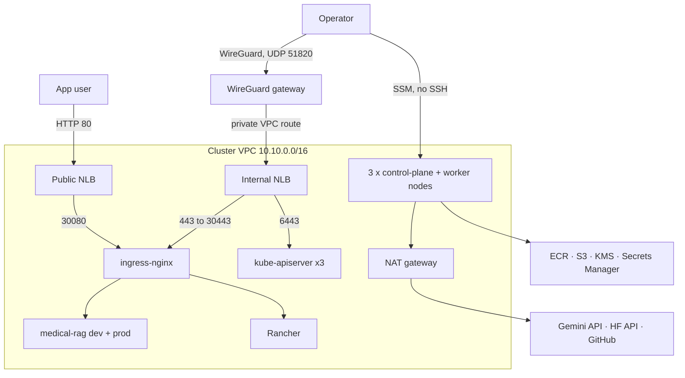

# Medical RAG Chatbot — Self-Managed Kubernetes on AWS (Ops Upgrade Design)

- **Date:** 2026-09-15
- **Timebox:** Days 1–3 of a 7-day plan shared with Anime-Recommender (EKS)
- **Budget envelope:** about 0.53 USD/hour while the cluster and WireGuard gateway run, plus about 0.03 USD/hour for the ops workstation; roughly 7.70 USD/month remains with the cluster destroyed (KMS key, 7 secrets, Route 53, buckets and the stopped workstation disk). Domain and Sectigo renewal are yearly costs outside AWS.
- **Target role:** DevOps / Platform / SRE (LLMOps as a bonus)

## 1. Goal

Rebuild this project's operations the way a company running Kubernetes itself would. The four pillars:

- **Reproducible infrastructure:** Terraform + Ansible for repeatable builds, with the unavoidable bootstrap, DNS delegation and secret-entry steps documented and verified.
- **GitOps delivery:** Jenkins does CI and Argo CD does CD, with dev → prod promotion by pull request.
- **Supply-chain security:** scan, SBOM, KMS-backed signing, and admission verification.
- **Day-2 operations:** etcd backup/restore and cluster upgrades.

Every P0 item must leave measurable evidence in `docs/evidence/` for the CV and for interviews.

This project is the **self-managed** counterpart to Anime-Recommender, which runs on **EKS**. Features are split deliberately so the two projects tell different stories:

| Concern | Medical (this repo) | Anime (EKS) |
|---|---|---|
| Cluster | kubeadm on EC2, HA control plane | EKS managed |
| CI | Jenkins in-cluster | GitHub Actions |
| Image signing | Cosign with AWS KMS key | Cosign keyless (GitHub OIDC) |
| Focus | Cluster ops, delivery, supply chain | SLOs, canary, autoscaling, LLM observability |

### Non-goals
- TLS for the application. The app has its own names (`dev.` and `app.recruitai.io.vn`), served over HTTP on the public NLB. Rancher uses a dedicated hostname and a purchased Sectigo DV certificate; the other internal UIs use a Let's Encrypt wildcard.
- Multi-region operation or disaster recovery of AWS resources beyond etcd.
- A service mesh.
- Canary rollouts and SLO burn-rate alerting (these belong to Anime).

## 2. Baseline before the upgrade (verified 2026-09-15)

The app used the Flask development server on port 8000,
rebuilt a 7,079-chunk FAISS index at startup, and called Gemini plus the HF Inference API directly.

**Delivery and infrastructure:**
- `docker-entrypoint.sh` rebuilds the whole index on **every pod start**, before Flask listens.
- A 6-stage Jenkinsfile on a separate VM pushes to Docker Hub and runs `kubectl apply` with a raw admin kubeconfig.
- Cluster setup scripts live in the `MLops-Common` submodule: bash, manual, on-prem IPs.

**Known issues this design fixes:**
1. The index is rebuilt at each start. Startup is slow, costs HF API quota, and the liveness probe can kill the pod mid-build.
2. `create_qa_chain()` reloads FAISS and the LLM client on every request.
3. The Flask dev server runs in production, and the only health check is `/`.
4. The Secret name in the README (`medical-rag-chatbot-secret`) does not match the Deployment (`...-secrets`). The Ingress is still named `streamlit-ingress`.
5. CI deploys by push with cluster-admin credentials, there is no image scanning or signing, and the image tag is `sed`-replaced.
6. `embed_documents` sends all chunks in one request, with no batching and no retry.

### Prerequisites
- An AWS account and an identity with admin access, used once from **AWS CloudShell** to apply the bootstrap stack.
- The laptop needs only an editor, git and a WireGuard client. Terraform, Ansible, kubectl, Helm,
  cosign and every other ops command run on the **ops workstation**, an EC2 Ubuntu 24.04 instance
  created by the bootstrap stack (see §4.0).
- An HF token with the **Inference Providers** permission and a Gemini API key.
- Control of `recruitai.io.vn` and a Sectigo DV order for `rancher.recruitai.io.vn`.

## 3. Architecture



### In-cluster components
All components except Argo CD are installed **by Argo CD** from `deploy/argocd/`. **Every internal UI is
reachable only through the VPN:** its name resolves to the internal NLB, and its Ingress allows only VPC
source addresses. Architecture and build steps: `docs/gitops/`.

| Component | Purpose |
|---|---|
| Argo CD | GitOps controller. Bootstrapped once by `make bootstrap`, then self-managed. UI at `argocd.recruitai.io.vn`, VPN only. |
| ingress-nginx | NodePort 30080 from the public NLB and 30443 from the internal NLB. DaemonSet with `externalTrafficPolicy: Local`, so internal Ingresses can allow only `10.10.0.0/16`. Serves the Let's Encrypt wildcard as its default certificate |
| cert-manager | Let's Encrypt wildcard `*.recruitai.io.vn` through DNS-01 on Route 53 (instance-profile auth, one TXT record). The certificate is backed up to and restored from Secrets Manager, because Let's Encrypt issues at most 5 per identical name set per 7 days |
| aws-ebs-csi-driver | PersistentVolumes for Jenkins and Prometheus (IAM via instance profile) |
| external-secrets | Syncs Secrets Manager into K8s Secrets (instance-profile auth) |
| kube-prometheus-stack | Cluster, control-plane (etcd, scheduler, controller manager, kube-proxy) and app metrics; Alertmanager sends email over SMTP; Grafana, Prometheus and Alertmanager UIs at internal names, VPN only |
| Jenkins (Helm, JCasC) | CI controller. Agents are ephemeral pods. |
| medical-rag (Helm chart) | The app, as 2 Argo CD Applications: `medical-rag-dev`, `medical-rag-prod`. Its pods get their own IAM roles through a self-hosted OIDC issuer, not the node role (app guide Part 1, `docs/app/`) |
| kyverno (P1) | Image signature verification + baseline pod policies |
| Rancher (Helm) | Private management UI at `https://rancher.recruitai.io.vn`, reachable only through WireGuard. It runs one replica and uses `ingress.tls.source: secret` with the Sectigo certificate, so cert-manager is not needed. The cluster remains on Kubernetes 1.36 until the compatibility gate passes. |

## 4. Components

### 4.0 Ops workstation (`infra/terraform/bootstrap/`)
The bootstrap stack is applied once from AWS CloudShell and creates the two things every other stack depends on:
- **State bucket:** versioned, encrypted, Block Public Access, TLS-only policy, `prevent_destroy`. After the first apply, the bootstrap stack's own state is migrated into this bucket (key `bootstrap/terraform.tfstate`).
- **Ops workstation:**
  - `t3.small` Ubuntu 24.04 in its own small VPC (`10.20.0.0/24`, one public subnet, no NAT), so it does not depend on the default VPC; 30 GB gp3 encrypted.
  - No inbound rules, no key pair, IMDSv2 required.
  - Reached only with SSM Session Manager from the AWS Console.
  - IAM role with `AdministratorAccess` (lab trade-off, documented) and `AmazonSSMManagedInstanceCore`, so no access keys exist anywhere.
  - cloud-init (`workstation-init.sh`) installs pinned versions of Terraform, Ansible, kubectl, Helm, Docker, make, AWS CLI v2, the Session Manager plugin, cosign, yq and gh.
  - Stopped when idle; `make down` never touches it.

**Workflow:** edit on the laptop → push to GitHub → `git pull` on the workstation → run `make`.


### 4.1 Terraform (`infra/terraform/`)
- **Stacks split by lifetime,** all with state in the bootstrap bucket (native S3 lockfile, `use_lockfile = true`):
  - `bootstrap/` (§4.0): state bucket and ops workstation. Applied from CloudShell only.
  - `shared/`: ECR, the index artifacts bucket, the cosign KMS key, Secrets Manager secrets, budgets. Kept, so a daily cluster teardown never loses the index, secret values, the signing key or images.
  - `cluster/`: everything below except those. Looks up shared resources with data sources by name; destroyed when idle.
- Architecture and file-by-file notes are in `docs/terraform/README.md`; the step-by-step build guide is `docs/terraform/guide.md`. Ansible has the same pair in `docs/ansible/`.
- **Network:** VPC with 3 public and 3 private subnets and 1 NAT gateway (cost choice, documented as a single point of failure).
- **DNS, VPN and the Rancher entry point:** the shared stack keeps the Route 53 public zone and the
  `rancher`, `rancher-tls` and `wireguard` secrets. The cluster stack creates a small WireGuard
  gateway, `vpn.recruitai.io.vn`, and a TCP 443 listener on the existing internal NLB.
  `rancher.recruitai.io.vn` resolves publicly to that internal NLB's private addresses, so it works
  only for a client with a route into the VPC. ingress-nginx terminates TLS; the load balancer
  passes it through and never sees the key. The key lives in Secrets Manager, the
  `tls-rancher-ingress` Secret, and a mode-700 directory on the ops workstation.
- **Compute:**
  - 3× `m7i-flex.large` (2 vCPU, 8 GB) Ubuntu 24.04 across 3 AZs, gp3 encrypted root volumes.
    The account is on the **AWS Free plan**, which refuses to launch instance types that are not
    free-tier eligible, so `t3.large` and `t3.medium` cannot be used.
  - IMDSv2 required, no public IPs, no key pair.
  - The SSM agent is present on the Ubuntu AMI.
  - One `t3.small` WireGuard gateway in a public subnet, with an encrypted 8 GiB root volume, an EIP,
    no SSH key and no application IAM permissions. Its role can register with SSM and read only
    `medical-rag/wireguard`. Its firewall forwards only DNS to the VPC resolver and TCP 443 from the
    tunnel; everything else, including the Kubernetes API on 6443, is dropped.
- **Load balancers:**
  - Internal NLB TCP 6443 → the Kubernetes API and TCP 443 → ingress-nginx NodePort 30443.
  - Public NLB TCP 80 → NodePort 30080 on the 3 nodes.
- **Security groups:**
  - 6443 only from inside the VPC.
  - 443 only from inside the VPC. No public HTTPS rule exists.
  - UDP 51820 from the internet to the WireGuard gateway; unauthenticated packets are discarded by
    WireGuard before a tunnel is established.
  - NodePorts only from the corresponding NLB security groups.
  - Node-to-node traffic for Calico (BGP 179 or VXLAN 4789, per the chosen mode), etcd 2379–2380, and kubelet 10250.
- **IAM instance profile:**
  - `AmazonSSMManagedInstanceCore`
  - ECR read + write, the latter scoped to the repository for Jenkins BuildKit pushes
  - S3 read/write on the cluster's own buckets (etcd backups, SSM transfer). The artifacts bucket is
    reached only through the app's IRSA roles (app guide step 9)
  - `secretsmanager:GetSecretValue` only for the eight named secrets other than `medical-rag/wireguard`
    and `medical-rag/sa-signer`; no wildcard includes either of those two
  - `kms:Sign` and `kms:GetPublicKey` on the cosign key
  - The EBS CSI policy
- **Registry, storage and keys:**
  - ECR `medical-rag` with scan on push and a lifecycle policy keeping the last 20 images.
  - S3 buckets `*-artifacts` (versioned), `*-etcd-backups` (lifecycle 14 days) and `*-ssm-transfer`, all with Block Public Access and TLS-only policies.
  - KMS asymmetric key `ECC_NIST_P256` / `SIGN_VERIFY`, alias `alias/medical-rag-cosign`.
- **Internal UI names and certificate (Terraform guide step 19):** `argocd`, `grafana`, `prometheus` and
  `alertmanager` alias records to the internal NLB. The node role may change only the TXT record
  `_acme-challenge.recruitai.io.vn` (IAM conditions on record name and type), plus read-only Route 53
  lookups, for cert-manager's DNS-01.
- **Secrets Manager:** ten empty secrets: `medical-rag/llm`, `medical-rag/github`,
  `medical-rag/rancher`, `medical-rag/rancher-tls`, `medical-rag/wireguard`, `medical-rag/alertmanager`
  (SMTP settings), `medical-rag/wildcard-tls` (certificate backup, tagged `managed-by=external-secrets`,
  the only secret the node role may write), `medical-rag/app-dev` and `medical-rag/app-prod` (the app's
  keys per environment), and `medical-rag/sa-signer` (the service-account signing key). Values are set
  with the AWS CLI (or, for `wildcard-tls`, by External Secrets), never in Terraform. Nodes can read the
  eight that are neither `medical-rag/wireguard` nor `medical-rag/sa-signer`. Of the cluster machines, only
  the gateway can read `medical-rag/wireguard`, and none can read `medical-rag/sa-signer`: Ansible reads it
  on the workstation. Admin identities, including the workstation role, can read all ten.
- **Workload identity (app guide Part 1):** an S3 bucket `medical-rag-oidc-<account>` serving the
  cluster's issuer documents publicly (`prevent_destroy`), an IAM OIDC provider for it, and three roles:
  `medical-rag-app-dev` and `medical-rag-app-prod` read `faiss/*`; `medical-rag-index-builder` reads
  `corpus/*` and `faiss/*` and writes `faiss/*`. Each trusts one exact ServiceAccount. The node role no
  longer has the artifacts bucket.
- **Budgets:** alarms at 50 and 100 USD.
- **Tagging:** default tags `project`, `env`, `owner`, `managed-by=terraform`.
- **Inputs:** `shared/terraform.tfvars` (from the `.example`): budget email. Everything else has defaults.
- **Outputs:** instance IDs, NLB DNS names, bucket names, ECR URL, and KMS ARN. Ansible and Helm values consume these outputs; nothing is hard-coded.

**WireGuard data flow:** the client routes only `10.10.0.0/16` through
`vpn.recruitai.io.vn:51820` and resolves names with the VPC resolver `10.10.0.2` (the VPC CIDR base
plus two) through the tunnel. The gateway (`10.99.0.1/24`) and client (`10.99.0.2/32`) addresses
are derived from `wireguard_cidr` (`10.99.0.0/24` by default). The gateway enables IPv4 forwarding
and SNATs VPN traffic to its VPC address, forwarding only DNS and TCP 443; replies return, but
nothing in the VPC can open a connection towards the client. Its cloud-init fetches `serverPrivateKey` and
`operatorPublicKey` from the dedicated secret. The client private key never leaves the operator's
device. A cluster rebuild replaces the gateway and its EIP: the `vpn` record follows the new address
and the server key comes back from Secrets Manager, so the client profile stays the same — reconnect
to pick up the new address.

### 4.2 Ansible (`infra/ansible/`)
These roles replace the `MLops-Common` bash scripts and must be idempotent: a second run reports `changed=0`.

- **Inventory:** `amazon.aws.aws_ec2` filtered by tag. Connection plugin `amazon.aws.aws_ssm`, using the SSM transfer bucket. No SSH.
- **Roles:**
  - `common`: swap off, kernel modules, sysctl, time sync.
  - `containerd`: `SystemdCgroup=true`, pinned version.
  - `kubernetes_packages`: kubelet, kubeadm and kubectl from pkgs.k8s.io, pinned to 1.36.4 and held.
    A later minor is allowed only after the Rancher compatibility gate passes.
  - `ecr_credential_provider`:
    - Installs `ecr-credential-provider` v1.37.0 from kubernetes/cloud-provider-aws
      (`artifacts.k8s.io`), verified against its published SHA256.
    - Sets kubelet `--image-credential-provider-config`.
    - Result: nodes pull from ECR with the instance profile and no imagePullSecrets.
  - `kubeadm_init`: first node, with a `kubeadm-config.yaml` (v1beta4) setting `controlPlaneEndpoint = internal NLB DNS:6443` and `--upload-certs`. `apiServer.certSANs` also lists `127.0.0.1`, because kubectl reaches the API through an SSM port-forward. Controller manager and scheduler `bind-address`, etcd `listen-metrics-urls` (port 2381) and kube-proxy `metricsBindAddress` use `0.0.0.0`, so Prometheus can scrape them; the node security group admits these ports only from other nodes.
  - `kubeadm_join`: the remaining control planes, with the join token and certificate key passed via facts, never written to the repo.
  - `cni_calico`: operator install (v3.32.2), **VXLAN** encapsulation to match the UDP 4789 rule in the node security group, pod CIDR `192.168.0.0/16` so it overlaps neither VPC nor the Service range.
  - `untaint_control_plane`: all 3 nodes schedule workloads, matching the current design.
- **Playbooks:**
  - `site.yml`: full cluster.
  - `upgrade.yml` (P1): after the §4.2.1 gate passes, `serial: 1`, drain, `kubeadm upgrade apply|node`,
    upgrade kubelet, uncordon, and wait for Ready plus Argo CD health before the next node.

### 4.2.1 Rancher GitOps contract and compatibility gate

The Rancher Argo CD Application installs chart **2.15.1** from the `stable` channel
(`https://releases.rancher.com/server-charts/stable`) into namespace `cattle-system`. That chart
declares `kubeVersion: < 1.37.0-0`, so it accepts this cluster's 1.36.4 and refuses 1.37.

**Values:**

| Value | Setting | Why |
|---|---|---|
| `hostname` | `rancher.recruitai.io.vn` | Rancher serves only its own hostname |
| `replicas` | `1` | The chart defaults to 3; three 8 GB nodes also run Jenkins and Prometheus |
| `ingress.ingressClassName` | `nginx` | Unless ingress-nginx is the default IngressClass |
| `ingress.tls.source` | `secret` | Uses the Sectigo certificate; no cert-manager |
| `agentTLSMode` | `system-store` | The default since 2.9 is `strict`, which trusts only the CA in Rancher's `cacerts` setting; a public-CA certificate needs `system-store` |
| `extraEnv` | `CATTLE_BOOTSTRAP_PASSWORD` from `bootstrap-secret/bootstrapPassword` | The password comes from Secrets Manager |
| `bootstrapPassword` | **never set** | In chart 2.15.1, setting it renders its own `bootstrap-secret` hook and a second `CATTLE_BOOTSTRAP_PASSWORD`, which fight External Secrets |

**Sync waves:** `-2` installs External Secrets, `-1` creates two `ExternalSecret` resources —
`tls-rancher-ingress` (type `kubernetes.io/tls`) and `bootstrap-secret` (key `bootstrapPassword`) — and
`0` installs Rancher. No password or private key appears in Git or an Argo CD value.

**Compatibility gate.** Before any Kubernetes minor changes, check the candidate chart on the ops
workstation and record the result in the upgrade evidence:

```bash
RANCHER_CHART_VERSION=2.15.1   # the candidate chart being evaluated
helm show chart rancher --repo https://releases.rancher.com/server-charts/stable --version "$RANCHER_CHART_VERSION" | yq '.version, .kubeVersion'
```

The candidate's `kubeVersion` must accept the target minor, and that Kubernetes release must appear in
Rancher's [official support matrix](https://www.suse.com/suse-rancher/support-matrix/all-supported-versions)
for the candidate Rancher release. Upgrade Rancher first and wait until every Argo CD Application is
`Synced` and `Healthy`. Only then change the Kubernetes package pin and run `upgrade.yml`. If either
check fails, keep Kubernetes at `1.36.4`.

### 4.3 App changes (`src/app/`, `tests/`)

**Serving and health**
- **Server:** gunicorn (2 workers, gthread, timeout 60s) replaces `app.run`. The Dockerfile `CMD` runs gunicorn, and `docker-entrypoint.sh` is removed.
- **Chain caching:** the QA chain is built **once per worker** at startup. `create_qa_chain()` is cached.
- **Endpoints:**
  - `GET /healthz`: process alive, no dependencies checked.
  - `GET /readyz`: FAISS index loaded and LLM client constructed. Returns 503 until ready.
  - `GET /metrics`: `prometheus_client` with `http_requests_total{route,status}`, `http_request_duration_seconds` (buckets up to 30s), `rag_retrieval_duration_seconds`, `llm_request_duration_seconds` and `rag_index_info{version}`.
- **Probes:** startupProbe on `/readyz` (failureThreshold × period = 5 min), readinessProbe on `/readyz`, livenessProbe on `/healthz`.

**Index as a versioned artifact**
- **CLI:** new `python -m app.index build` command.
- **Version hash:** `sha256(pdf file names + pdf bytes + chunk_size + chunk_overlap + embedding model id)`, truncated to 12 hex characters. `python -m app.index version` prints it without building.
- **Idempotent upload:** if `s3://<artifacts>/faiss/<version>/manifest.json` already exists (it is uploaded last), exit 0 without re-embedding. Otherwise embed in **batches of 64 with exponential-backoff retry on 429/5xx**, then upload `index.faiss`, `index.pkl` and `manifest.json` (version, chunk count, model, build time, duration).
- **Kubernetes Job:** the build runs as a Job defined as an Argo CD **Sync hook at wave 1** in the chart, after the ServiceAccounts and the ExternalSecret at wave 0 and before the Deployment at wave 2. A PreSync hook would run before the ExternalSecret exists on the first sync. The Job reads the corpus from `s3://<artifacts>/corpus/`, uses the `medical-rag-index-builder` role, and fails before embedding if the corpus does not hash to the pinned `index.version`.
- **Pinned in values:** `index.version` in `deploy/envs/<env>/values.yaml`. An initContainer running the app image (`python -m app.index pull`, `INDEX_REQUIRE_PINNED=true`) downloads that version into an `emptyDir`, with the environment's own role. The cluster never reads or moves `faiss/LATEST`, which stays for docker compose. **Rolling back the index = reverting one line in Git.**

**Container hardening**
- Multi-stage build.
- Non-root UID 10001, `readOnlyRootFilesystem: true`, drop ALL capabilities, `seccompProfile: RuntimeDefault`.
- Writable `emptyDir` for `/tmp` and the index.
- `.dockerignore` excludes `.git`, `data/` (the PDF comes from `s3://<artifacts>/corpus/` in the Job), `infra/`, `deploy/`, logs and vectorstore.

**Tests (pytest)**
- Chunking parameters.
- Index version hashing is deterministic.
- `/healthz` and `/readyz` status codes with a stubbed chain.
- Batch embedding retry logic with a fake client.

### 4.4 Helm chart and environments (`deploy/`)

```
deploy/
  charts/medical-rag/        Deployment, Service, Ingress, index-build Job (Sync hook, wave 1), ExternalSecret,
                             ServiceMonitor, PDB, NetworkPolicy, ServiceAccount
  envs/dev/values.yaml       1 replica, image.tag, index.version, host dev.recruitai.io.vn
  envs/prod/values.yaml      2 replicas, topologySpreadConstraints (hostname), PDB minAvailable 1, host app.recruitai.io.vn
  argocd/root.yaml           app-of-apps
  argocd/apps/*.yaml         addons + medical-rag-dev + medical-rag-prod
```

- **Ingress routing:** by host on the public NLB, HTTP: `dev.recruitai.io.vn` → dev and `app.recruitai.io.vn` → prod (two alias records in the cluster stack). Path routing (`/dev`, `/`) was dropped once the project had a domain: it needed URL-prefix handling in the app, and it made the two environments share one `session` cookie.
- **NetworkPolicy:** default deny ingress in the app namespaces; allow from the `ingress-nginx` and `monitoring` namespaces; allow egress DNS + TCP 443, except `169.254.169.254/32`. No pod in these namespaces needs IMDS: they use their own roles.
- **Sync policies:** Argo CD automated sync with prune and selfHeal for dev. **prod syncs automatically, but its values file changes only through a reviewed PR.**

### 4.5 CI pipeline (Jenkins, `Jenkinsfile`)

**Jenkins setup**
- Jenkins is installed by Argo CD with the Helm chart and JCasC.
- **Job:** a Multibranch Pipeline on this repo polls SCM every 2 minutes, because there's no public webhook endpoint.
- **Agents:** pod templates run `python:3.12`, `moby/buildkit:rootless`, `aquasec/trivy`, `anchore/syft`, `cosign` and `alpine/git`.
- **Why not Kaniko:** Kaniko was archived upstream, so the design uses rootless BuildKit.
- **Kubernetes RBAC:** the Jenkins service account has **no cluster RBAC beyond its own namespace**. CI never talks to the Kubernetes API for deploys.

**Stages**
1. **Skip guard:** abort the build as NOT_BUILT if the commit author is `jenkins-bot` or the change set touches only `deploy/**`. This prevents a loop.
2. **Lint & test:** `ruff check`, `pytest -q`, `hadolint Dockerfile`.
3. **Build & push:** BuildKit → ECR `medical-rag:<git-sha>`, with registry cache in ECR.
4. **Scan:** `trivy image --severity CRITICAL --ignore-unfixed --exit-code 1`. The HIGH count is recorded in the report but does not fail the build. The JSON report is archived.
5. **SBOM:** `syft` → SPDX JSON, archived.
6. **Sign & attest:**
   - `cosign sign --key awskms:///alias/medical-rag-cosign <digest>`
   - `cosign attest --type spdxjson` with the same KMS key
   - The instance profile provides the KMS permission.
7. **Promote to dev:**
   - Clone the repo using a GitHub token from ExternalSecret.
   - `yq` sets `image.tag` (and `index.version` if the corpus or chunk config changed) in `deploy/envs/dev/values.yaml`.
   - Commit as `jenkins-bot`, push to `main`.
8. **Open prod PR:**
   - `gh pr create` with the same change applied to `deploy/envs/prod/values.yaml`.
   - The body includes the Trivy summary and the image digest.
   - A human merges.

Images are referenced **by digest** in values as `tag@sha256:...`, so what was signed is exactly what runs.

### 4.6 Day-2 operations (P1)
- **etcd backup:**
  - A CronJob on control-plane nodes (nodeSelector + toleration, hostPath `/etc/kubernetes/pki/etcd`).
  - Runs `etcdctl snapshot save` every 6h and uploads to S3. `snapshot status` is verified before upload.
- **Restore drill:**
  1. Delete a test namespace.
  2. Restore the latest snapshot on all 3 members.
  3. Verify the namespace is back.
  4. **Record the RTO** from the start of restore to all Argo CD apps Healthy.
- **Kyverno:**
  - `verifyImages` for `*.dkr.ecr.*/medical-rag*` with the KMS public key. Mode `Enforce` in prod and `Audit` in dev.
  - Baseline Pod Security policies.
  - Demo: deploying an unsigned image to prod is rejected, with the admission error captured as evidence.
- **Upgrade drill:** after the §4.2.1 gate passes, run `ansible-playbook upgrade.yml` one node at a
  time while a curl loop records failed requests.

## 5. Error handling and failure modes

| Failure | Behavior |
|---|---|
| HF API 429/5xx during index build | Batched retry with backoff (max 6 attempts). After that the Job fails, the Argo CD sync fails, and **the old Deployment keeps serving the old index**. |
| Index version missing in S3 at pod start | The initContainer fails, the pod never becomes Ready, and the rolling update stalls because old pods stay up (maxUnavailable 0). |
| Gemini API error at request time | 502 with a JSON error; counted in `http_requests_total{status="502"}`. No retry storm: 1 retry with jitter. |
| Trivy finds a fixable CRITICAL | Pipeline fails before signing or promotion, and nothing reaches Git. |
| One node lost | 2 remaining etcd members keep quorum; prod stays available via PDB and the topology spread. |
| Jenkins down | Nothing running breaks. Deploys pause, and Argo CD still reconciles the cluster from Git. |

## 6. Verification and evidence (definition of done)

Each P0 item is done only when its check passes and the evidence is saved under `docs/evidence/`.

| # | Item | Verification | Evidence for CV |
|---|---|---|---|
| 1 | Terraform | `terraform apply` from empty, then `plan` shows no changes | resource count, apply duration |
| 2 | Ansible | `site.yml` builds the cluster; a second run gives `changed=0` | playbook recap, cluster build time |
| 3 | HA API | Stop node-1: `kubectl get nodes` still works through the NLB | terminal capture |
| 4 | Private Rancher | No public 443 rule; without VPN the URL times out; with VPN the Sectigo chain verifies and the UI loads; the public NLB answers the Rancher host only with a 308 redirect | SG query, `wg show`, TLS check, `curl -I` |
| 5 | Argo CD bootstrap | All addon apps Synced and Healthy; after a rebuild, no new certificate request | Argo CD UI screenshot through the VPN, `certificaterequests` empty |
| 5a | Monitoring and alerting | Every Prometheus target up, including etcd and the control plane; a test alert arrives by email; Grafana, Prometheus and Alertmanager load only with the VPN | target list, email screenshot, Grafana etcd dashboard |
| 6 | Index artifact | First Job embeds 7,079 chunks; a second sync skips the build | Job logs, build duration |
| 7 | App readiness | Pod Ready in N seconds (vs rebuild-at-start before) | before/after startup time |
| 8 | Pipeline | Commit → dev running | end-to-end minutes, stage durations |
| 9 | Supply chain | `cosign verify --key awskms://...` passes; Trivy report archived | CRITICAL/HIGH counts before vs after base-image hardening |
| 10 | Promotion | Prod PR opened by the bot, merged, prod synced | PR link |
| 11 | Image size | `docker image ls` before vs after the multi-stage build | MB before/after |
| 12 (P1) | etcd restore | Restore drill (§4.6) | RTO |
| 13 (P1) | Kyverno | Unsigned image rejected in prod | admission error |
| 14 (P1) | Upgrade | Compatibility-gated minor upgrade under load | Rancher chart constraint and failed-request count |

## 7. Repo layout (after)

```
src/app/ ...                 app (gunicorn, /healthz, /readyz, /metrics, index CLI)
tests/
Dockerfile  .dockerignore  Jenkinsfile  Makefile
infra/terraform/{bootstrap/, shared/, cluster/}
infra/ansible/{requirements.yml, ansible.cfg, inventory/aws_ec2.yml, roles/, site.yml, upgrade.yml}
deploy/{charts/medical-rag/, envs/{dev,prod}/, argocd/}
docs/{evidence/, terraform/, ansible/}
```

The `MLops-Common` submodule is kept for the on-prem history; the new Ansible roles supersede it. The README gains an architecture section and an "Evidence" table.

## 8. Make targets and teardown

| Target | What it does |
|---|---|
| `make shared` | `terraform apply` of the shared stack (kept) |
| `make infra` | `terraform apply` of the cluster stack |
| `make cluster` | Ansible `site.yml` |
| `make tunnel` | SSM port-forward to the internal API NLB (the kubeconfig is written by `make cluster`) |
| `make bootstrap` | Install Argo CD, apply `deploy/argocd/root.yaml` |
| `make up` | infra + cluster + bootstrap, after DNS, certificate and WireGuard secrets exist |
| `make down` | Delete Argo CD apps (releases PVs), then `terraform destroy` of the cluster stack (`make infra-destroy`). The shared and bootstrap stacks are kept. |
| `make cost` | Print hours up × hourly estimate |

## 9. Schedule (days 1–3)

| Day | Work |
|---|---|
| 1 | Terraform (including bootstrap state, KMS, ECR, budgets and WireGuard), the ops workstation, and the Ansible roles. **Cluster up with the HA check.** |
| 2 | Argo CD bootstrap + addons, Helm chart, app changes (gunicorn, probes, metrics, index CLI + Job), dev env serving. |
| 3 | Jenkins + full pipeline (scan, SBOM, KMS sign, dev bump, prod PR), prod env. Capture P0 evidence. P1 items only if time remains. |

## 10. Risks

| Risk | Mitigation |
|---|---|
| HF Inference API quota for 7,079 chunks | Batching + backoff; index built once and reused via S3. Fallback: build the index locally and upload with the same CLI. |
| Ansible over SSM is slow or flaky | Run from the ops workstation in the same region; pin collection versions in `requirements.yml`. |
| Ops workstation holds `AdministratorAccess` | Anyone in the account allowed to `ssm:StartSession` on it gets admin rights. Mitigations: no inbound ports, SSM-only access, IMDSv2, stopped when idle, GitHub access through a fine-grained token limited to this repo, tool downloads verified by checksum. P2: scope the role down. |
| `m7i-flex.large` gives about 40% of 2 vCPU as baseline and bursts above it, and unlike T instances it publishes no CPU credit metric, so exhaustion is silent | Nodes idle far below the baseline and Jenkins builds are short. Alert on `node_cpu_seconds_total` sustained above 80% instead of on credits. |
| Account credits run out or expire, which may suspend the account | Track the live balance and expiry in `docs/evidence/`. The state bucket has `prevent_destroy`, and the cosign KMS key cannot be recreated without invalidating every signature. P1: copy the state bucket and record the key ARN off-account before expiry. |
| Node memory pressure (Jenkins + Prometheus + builds) | Resource requests on all addons; Prometheus retention 24h; at most 1 concurrent Jenkins build. |
| App traffic is plain HTTP | Host-based routing on the public NLB (`dev.` and `app.recruitai.io.vn`); TLS for app traffic is out of scope. Rancher and the internal UIs use their own certificates. |
| The Sectigo certificate is a Domain Validation certificate with a fixed expiry, and nothing renews it automatically | Calendar reminder before expiry, and the replacement goes in with one `put-secret-value`; External Secrets pushes it to the cluster without a redeploy. If manual renewal becomes a nuisance, move Rancher to the cert-manager wildcard that already serves the other internal UIs. |
| Delegating the whole domain can interrupt existing web or mail records | Lower TTLs early, copy every record except the apex SOA and NS, compare answers from both providers, and remove any parent DS record before changing name servers. Keep the old provider for at least 48 hours; enable Route 53 signing and publish a new DS only after the unsigned delegation is stable. |
| WireGuard exposes UDP 51820 to the internet | WireGuard silently drops unauthenticated packets; the gateway has no SSH key, no application permissions, and reads only its own secret. If a client is lost, replace its public key in Secrets Manager and replace the gateway instance (or let the next rebuild pick it up), then verify only the new peer handshakes. |
| Rancher controls the whole cluster | TCP 443 exists only on the internal NLB, open to the whole cluster VPC because Rancher's own agents connect to it from inside. From outside the VPC, access requires a valid WireGuard peer and Rancher credentials. Configure an MFA-enforcing external identity provider before treating MFA as a control. Disconnect the VPN and destroy the cluster when idle. |
| A Kubernetes minor exceeds Rancher's chart constraint | The §4.2.1 gate: keep 1.36.4 until a candidate chart accepts the target, upgrade Rancher first, and require Argo CD health. |
| The internal NLB is open to the whole VPC, including the Kubernetes API on 6443, and the VPN peer arrives with a VPC address | The gateway firewall forwards only DNS to the VPC resolver and TCP 443 from the tunnel, drops everything else, and blocks connections from the VPC towards the client. The API stays reachable only through the SSM tunnel from the workstation. |
| **Node instance profile is shared by every pod.** Self-managed clusters have no IRSA or Pod Identity out of the box, so any pod able to reach IMDS could use the KMS sign and S3 permissions. | Self-hosted IRSA for the app, built before its chart (app guide Part 1): a stable signing key, an S3-hosted issuer, an IAM OIDC provider and per-ServiceAccount roles. The chart mounts the token itself, with no pod-identity webhook. App namespaces block `169.254.169.254/32`, and the node role loses the artifacts bucket. Platform pods (External Secrets, cert-manager, EBS CSI, later Jenkins) stay on the node role for now; moving them uses the same issuer. |
| ingress-nginx was retired upstream in March 2026: no further releases or security fixes, and Kubernetes 1.36 postdates its last release | Kept because the NodePorts and Rancher's `ingressClassName` depend on it; traffic reaching it is the demo app or a VPN user. Migrate to a maintained controller or Gateway API; the NodePorts stay the same. |
| Let's Encrypt allows 5 certificates per identical name set per 7 days, and the cluster is rebuilt more often | The wildcard certificate is pushed to `medical-rag/wildcard-tls` and restored in wave -1, before its `Certificate` exists; cert-manager keeps a valid restored certificate. Test changes against the staging issuer. |
| Prometheus and Alertmanager UIs have no authentication | VPN-only names plus a VPC-only allowlist on their Ingresses; single VPN peer. P2: an OAuth proxy in front of all internal UIs. |
| Alert email relies on one mailbox's app password | Stored only in Secrets Manager and rendered into Alertmanager's config by External Secrets. Amazon SES is not used because its SMTP credentials derive from an IAM user access key. |
| Day 1–3 overrun | Cut order: P1 items → prod PR automation (promote manually) → SBOM attestation. Never cut scan + sign + GitOps. |

## 11. Resolved decisions

| Decision | Choice |
|---|---|
| Cluster | kubeadm on EC2 (Anime uses EKS) |
| Repo layout | Everything in this repo |
| CI | Jenkins in-cluster |
| CD | Argo CD |
| Builds | BuildKit rootless (not Kaniko) |
| Signing | Cosign + AWS KMS |
| Secrets | External Secrets + Secrets Manager |
| Ops tooling | EC2 Ubuntu ops workstation via SSM; only editor, git and WireGuard client are local |
| Management UI | Rancher, installed by Argo CD, at `rancher.recruitai.io.vn` |
| DNS | Route 53 public zone for `recruitai.io.vn`, delegated from the registrar |
| TLS for Rancher | Purchased Sectigo DV certificate in Secrets Manager (no cert-manager) |
| Rancher access | WireGuard gateway EC2 → internal NLB TCP 443 → ingress-nginx NodePort 30443 |
| Ansible runtime | Native on the ops workstation |
| Kubernetes version | Start at 1.36.4; change minor only after the Rancher compatibility gate passes |
| Internal UIs | Argo CD, Grafana, Prometheus, Alertmanager and Rancher only through WireGuard, each at its own name under `recruitai.io.vn` |
| TLS for other internal UIs | cert-manager + Let's Encrypt wildcard via DNS-01, backed up in Secrets Manager |
| Alert delivery | Alertmanager email over SMTP with an app password (not SES) |
| Control-plane metrics | Exposed on node addresses by the kubeadm config and scraped |
| AWS identity for the app's pods | Self-hosted IRSA without a webhook: S3-hosted issuer, stable signing key in Secrets Manager, one role per ServiceAccount |
| App routing | Hosts `dev.` and `app.recruitai.io.vn` on the public NLB, HTTP |
| App secrets | One Secrets Manager secret per environment (`medical-rag/app-dev`, `medical-rag/app-prod`) |
