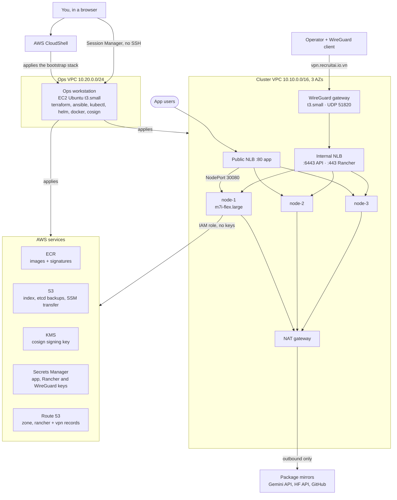
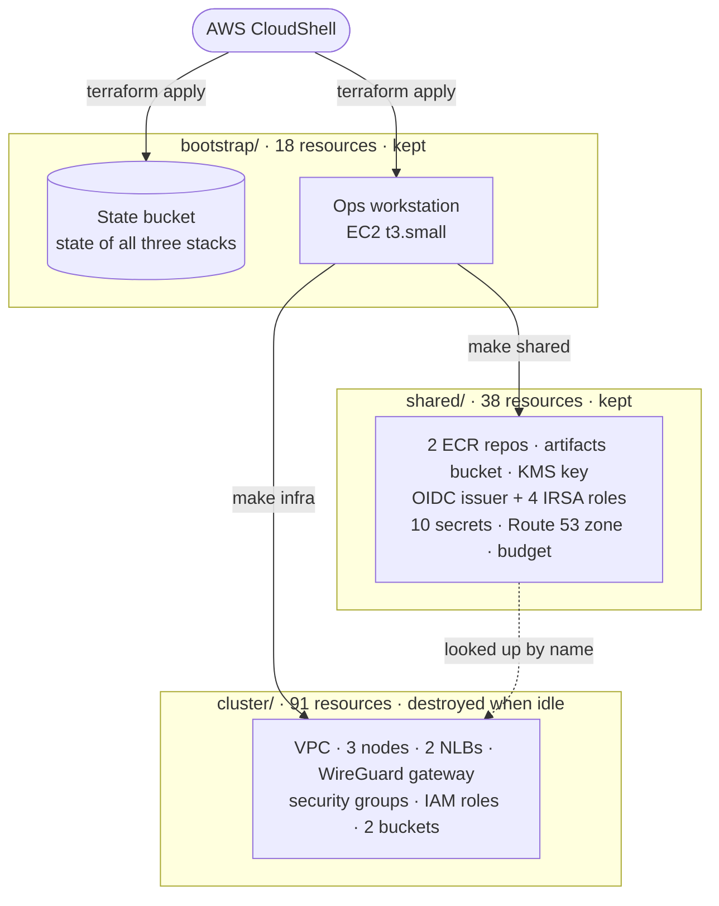
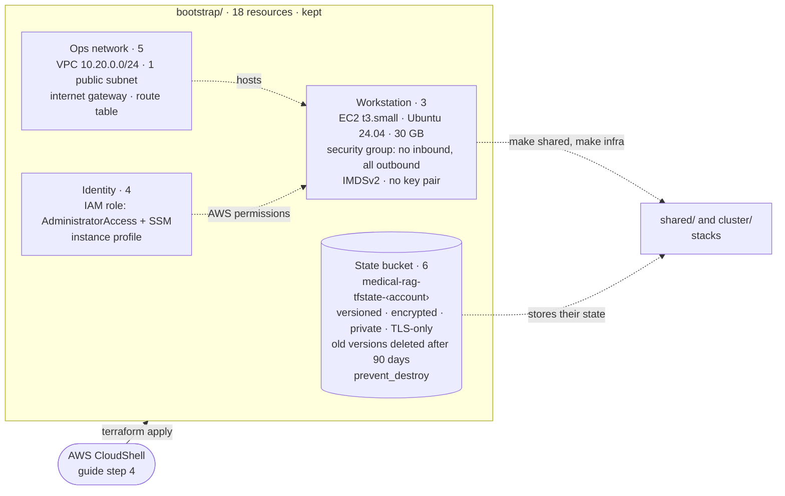
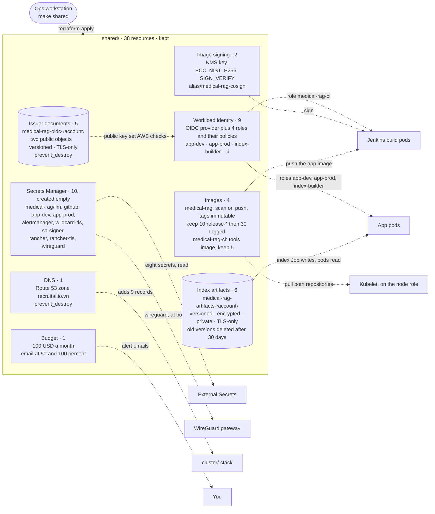
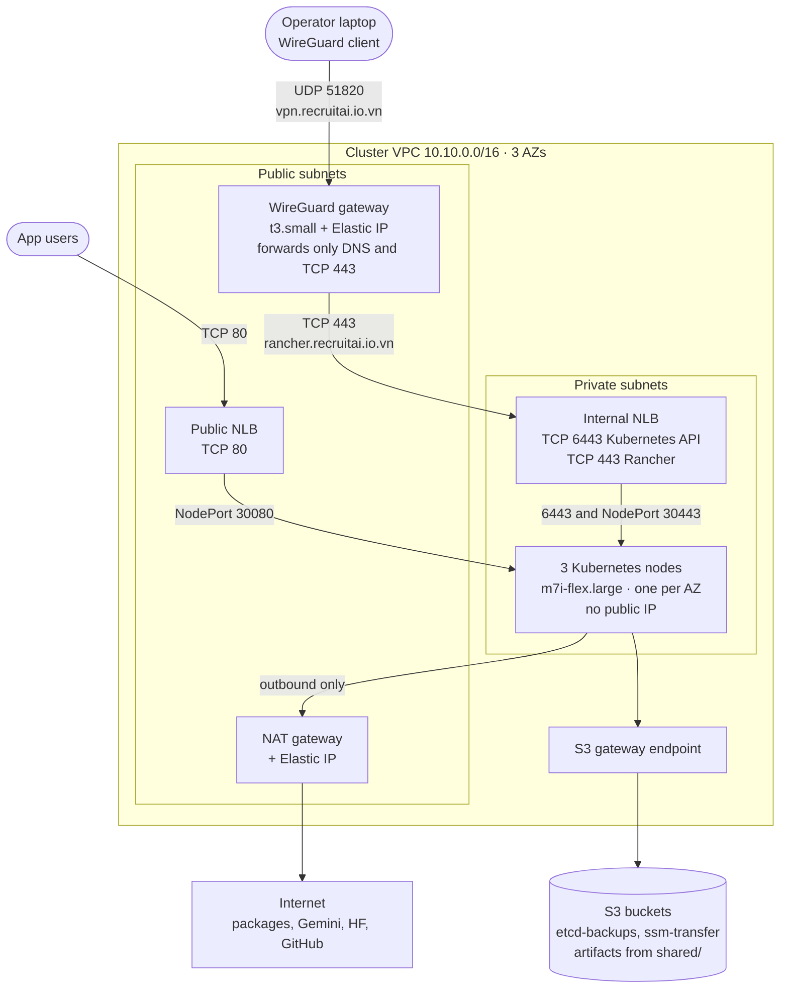
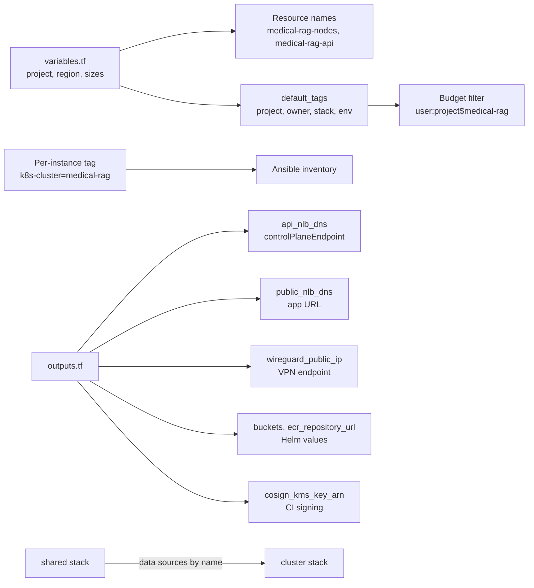

# Terraform architecture and folder structure

What the Terraform code builds, how the files are organised, and what each one is responsible for.
The build instructions are in [`guide.md`](guide.md). Every `.tf` file is commented, so the code
itself explains what each block does and why.
Self-check and interview questions (Vietnamese) are in [`questions.md`](questions.md), with answers in
[`answers.md`](answers.md).

## 1. The picture

Terraform builds the AWS layer only: machines, network, storage, identity and the entry points.
Kubernetes and everything inside it is installed later by Ansible and Argo CD.



Separately, **AWS Budgets** emails you at 50 % and 100 % of the 100 USD monthly limit. It is account
level and nothing in the cluster talks to it.

## 2. Three stacks, split by lifetime

A stack is one folder with its own state file. The split exists so the daily teardown never deletes
anything that is slow or expensive to rebuild.

| Stack | Applied from | Lifetime | Why |
|---|---|---|---|
| `bootstrap/` | CloudShell | Kept | It creates the state bucket the other stacks need, and the workstation they run on. Applying it from the workstation could destroy the machine you are sitting on. |
| `shared/` | Workstation | Kept | The FAISS index costs Hugging Face quota to build, secret values are typed by hand, a new KMS key invalidates every existing signature, and images would have to be rebuilt. |
| `cluster/` | Workstation | **Destroyed when idle** (end of every session) | About 0.53 USD/hour including WireGuard; everything in it is rebuilt from code. |

All three write their state to the same bucket, under different keys:

```
s3://medical-rag-tfstate-<account-id>/
  ├── bootstrap/terraform.tfstate
  ├── shared/terraform.tfstate
  └── cluster/terraform.tfstate
```

**How the stacks connect.** They never share a state file. The cluster stack looks up the shared
resources by name with `data` sources. If the shared stack is missing, `terraform plan` fails
immediately instead of building half a cluster.



### Inside each stack

| | `bootstrap/` | `shared/` | `cluster/` |
|---|---|---|---|
| Job | The state bucket and the machine you work from | What must survive a teardown | The Kubernetes machines, their network and entry points |
| Applied from | AWS CloudShell ([guide step 4](guide/1-bootstrap.md#step-4--apply-the-bootstrap-stack-cloudshell)) | Ops workstation, `make shared` | Ops workstation, `make infra` |
| State key | `bootstrap/terraform.tfstate` | `shared/terraform.tfstate` | `cluster/terraform.tfstate` |
| Resources | 18 | 38 | 91 |
| Lifetime | Kept | Kept | **Destroyed when idle** (`make infra-destroy`) |
| Cost | Workstation 0.03 USD/hour while running, 2.90 USD/month for its disk | ≈ 6 USD/month for everything kept, state bucket included | ≈ 0.53 USD/hour while it exists |
| Needs | Nothing but CloudShell | `bootstrap/`: state bucket, workstation | `bootstrap/`, and `shared/` looked up by name |
| Needed by | `shared/`, `cluster/` | `cluster/`, Jenkins, pods, External Secrets | Ansible, Argo CD, the app |
| Protection | `prevent_destroy` on the state bucket | `prevent_destroy` on the zone and on the OIDC issuer bucket; a 7-day wait before a secret or the KMS key is really deleted | None needed: `force_destroy` empties its buckets on destroy |

#### `bootstrap/` — the foundation

It creates the two things everything else stands on: the bucket that stores every stack's state, and
the machine that runs every later command. Losing the bucket means losing track of what exists in
AWS, so it has `prevent_destroy`. The workstation has a public IP but no inbound rule: the only way in
is Session Manager.

Numbers after `·` are resource counts. Solid arrow: runs Terraform. Dotted arrow: is used by.



#### `shared/` — what must survive a teardown

Everything here is slow, costly or impossible to recreate: the index costs Hugging Face quota to
build, secret values are typed in by hand, a new KMS key would invalidate every image signature, and a
new DNS zone would get new name servers that must be entered at the registrar again. Terraform creates
the secrets **empty**; their values are added with the AWS CLI, so they never reach the state file.

The cluster stack looks up by name only what its own resources need: both ECR repositories, nine secrets and
the Route 53 zone. It never looks up the budget, the artifacts bucket, the KMS key, the issuer bucket or the
IRSA roles — the pods that use those reach them with their own roles, not through anything the cluster stack
creates. The access shown on the right is granted by the cluster's node role; the WireGuard gateway has its
own role, which reads only `wireguard`.

Solid arrow: runs Terraform. Dotted arrow: is used by.



#### `cluster/` — rebuilt every session

Nothing here holds data worth keeping, so it is destroyed at the end of every session and rebuilt from
code. It finds the shared resources by name with `data` lookups; if the shared stack is missing, the
plan fails at once.

The diagram shows **where things sit and how traffic enters**. Every arrow is traffic, pointing from
whoever opens the connection. Only two ports are open to the internet: TCP 80 on the public NLB and UDP
51820 on the WireGuard gateway.



**What the 91 resources are:**

| Group | Count | Contents |
|---|---|---|
| Network | 24 | VPC module (23): VPC, 3 public + 3 private subnets, internet gateway, NAT gateway + Elastic IP, 2 route tables with their routes and 6 associations, and the adopted default security group, route table and NACL. Plus the S3 gateway endpoint |
| Entry points | 26 | Public NLB :80 with listener, target group and 3 attachments (6) · internal NLB :6443, the same set (6) · :443 listener, target group and 3 attachments (5) · Route 53 records: `rancher`, `vpn`, the 5 internal UI names and the 2 app names (9) |
| Machines | 5 | 3 nodes (40 GB gp3) · WireGuard gateway (8 GB gp3) · its Elastic IP |
| Security groups | 17 | 4 groups: `nodes`, `api-nlb` (internal NLB), `ingress-nlb` (public NLB), `wireguard`; 13 rules |
| Identity | 9 | Node role (5): SSM and EBS CSI managed policies; the instance profile; an inline policy with ECR **pull only** on both repositories, the 2 cluster buckets, read on 8 secrets, write on `wildcard-tls` alone, and the `_acme-challenge` TXT record. No ECR push and no KMS: the Jenkins build pods sign with their own role (`shared/irsa.tf`) · Gateway role (4): SSM, read `wireguard` only, the instance profile |
| Cluster buckets | 10 | `etcd-backups` and `ssm-transfer`, each with a public access block, encryption, a TLS-only policy and a lifecycle rule deleting objects after 14 days and 1 day. `force_destroy` is on, so destroy empties them |

## 3. Folder structure

```
Makefile                                  make shared | infra | plan | infra-destroy
infra/terraform/
├── bootstrap/          state bucket + ops workstation      (CloudShell, kept)
├── shared/             registry, artifacts, key, secrets   (kept)
└── cluster/            network, nodes, load balancers      (destroyed when idle)
```

Inside a stack, the file name says what it builds. Terraform reads every `.tf` file in the folder and
works out the order itself from the references between resources, so the split is purely for humans.

### Files every stack has

| File | Role |
|---|---|
| `versions.tf` | Minimum Terraform version and the AWS provider version (`~> 6.64`) |
| `providers.tf` | Region and `default_tags` (`project`, `owner`, `stack`, `managed-by`, plus `env=lab` in `shared/` and `cluster/`) |
| `variables.tf` | The inputs, with defaults. Nothing else in the stack hard-codes a name or a size |
| `backend.tf` | Where the state lives. The bucket name is passed by the Makefile, so the account ID stays out of Git |
| `outputs.tf` | Values that other stacks, Ansible, Helm or you need later |
| `main.tf` | Account and AZ lookups, plus the `locals` that build names and CIDRs |

`bootstrap/` is the exception twice over: its `backend.tf` is added only in step 6, once the bucket it
creates exists, and it has no `main.tf` — its account lookup sits in `state.tf` and its AZ lookup in
`workstation.tf`. The shared stack also retains the historical filename `bugdets.tf`; Terraform loads it normally
because every `.tf` file in the folder is equivalent.

### `bootstrap/` — 18 resources

| File | Creates |
|---|---|
| `state.tf` | The state bucket, with versioning, encryption, public access block, TLS-only policy, `prevent_destroy`, and a lifecycle rule that expires old versions after 90 days |
| `workstation.tf` | The ops VPC (`10.20.0.0/24`, one public subnet, internet gateway, route table), the workstation security group, its IAM role with `AdministratorAccess` + SSM, and the EC2 instance |
| `workstation-init.sh` | cloud-init: Docker and Ansible from Ubuntu packages; Terraform, kubectl, Helm, cosign, yq and gh downloaded and checked against their published checksums; AWS CLI v2 and the Session Manager plugin from their vendor URLs |
| `install-terraform.sh` | Installs Terraform into `~/bin` inside CloudShell, so the very first apply can run |

### `shared/` — 38 resources

| File | Creates | Used later by |
|---|---|---|
| `registry.tf` | Two ECR repositories. `medical-rag`: scan on push, immutable tags except `sha256-*` and `buildcache*`, keep the last 10 `release-*` images and then 30 tagged in total. `medical-rag-ci`: the pipeline's tools image, fully immutable, keep the last 5 | Jenkins build pods push the app image; the kubelet pulls both |
| `storage.tf` | Bucket `medical-rag-artifacts-<account>`: versioned, encrypted, private, TLS-only, old versions expire after 30 days | The index build Job writes the FAISS index; pods pull the pinned version |
| `kms.tf` | Asymmetric signing key (`ECC_NIST_P256`) + alias `alias/medical-rag-cosign` | The Jenkins build pods sign images with it, through their own role. Nothing verifies signatures yet: Kyverno is not installed |
| `oidc.tf` | Bucket `medical-rag-oidc-<account>`: two public objects (the discovery document and the key set), versioned, encrypted, TLS-only, `prevent_destroy`. Terraform creates the container only; `make oidc-publish` uploads the documents | AWS fetches them on every token exchange |
| `irsa.tf` | The IAM OIDC provider for that issuer, plus 4 roles with their policies: `app-dev` and `app-prod` read `faiss/*`; `index-builder` reads `corpus/*` and `faiss/*` and writes `faiss/*` but is denied `faiss/LATEST`; `ci` pushes to `medical-rag`, signs with the KMS key and reads `corpus/*`. Each trusts one exact `namespace:serviceaccount` | The app's pods and the Jenkins build pods, instead of the node role |
| `secrets.tf` | Seven empty secrets: `medical-rag/llm`, `github`, `app-dev`, `app-prod`, `alertmanager` (SMTP settings), `wildcard-tls` (certificate backup, tagged `managed-by=external-secrets`) and `sa-signer` (the service-account signing key, which no cluster role may read). Values are set with the AWS CLI or by External Secrets, never by Terraform | External Secrets syncs them into Kubernetes; only `wildcard-tls` is written back; Ansible reads `sa-signer` on the workstation |
| `bugdets.tf` | Monthly budget with email alerts at 50 % and 100 %, filtered to `project=medical-rag` | You |
| `rancher.tf` | Route 53 zone plus empty `medical-rag/rancher`, `medical-rag/rancher-tls` and `medical-rag/wireguard` secrets | Rancher, External Secrets and the VPN gateway |
| `outputs.tf` | The app repository URL, the artifacts bucket, the KMS alias and ARN, and nine of the ten secret names (`sa-signer` is left out on purpose); never secret values. `oidc.tf`, `irsa.tf` and `rancher.tf` add outputs beside their own resources | Cluster stack, Ansible, Helm and operator checks |

### `cluster/` — 91 resources, with the default node count and host lists

| File | Creates | Notes |
|---|---|---|
| `network.tf` | VPC `10.10.0.0/16`, 3 private + 3 public subnets, internet gateway, 1 NAT gateway with its Elastic IP, route tables, S3 gateway endpoint | The community `terraform-aws-modules/vpc` module also adopts the VPC's default security group and route table (leaving both empty) and its default NACL (reset to allow-all): 3 of this step's 24 resources |
| `security.tf` | 3 security groups (nodes, API NLB, ingress NLB) and 8 rules | Rules reference security groups where possible. Three use CIDRs: HTTP from the internet, the API from the VPC, node egress. `rancher.tf` and `wireguard.tf` add the rest (end state: 4 groups, 13 rules) |
| `storage.tf` | Buckets `etcd-backups` (14 days) and `ssm-transfer` (1 day) | Cluster-scoped: useless once the cluster is gone, so `force_destroy` is on |
| `iam.tf` | The node role, instance profile and its inline policy | Least privilege: ECR pull on both repositories, the 2 cluster buckets, 8 workload secrets, write on `wildcard-tls` and the ACME TXT record. The cosign key, the artifacts bucket, `sa-signer` and the WireGuard credentials are deliberately excluded |
| `compute.tf` | 3 × `m7i-flex.large` Ubuntu 24.04, one per AZ, no public IP, no key pair, IMDSv2 required | Tagged `k8s-cluster=medical-rag`, which is how Ansible finds them |
| `loadbalancers.tf` | Internal NLB :6443 and public NLB :80, with their target groups, listeners and 3 attachments each | The internal one is kubeadm's `controlPlaneEndpoint` |
| `rancher.tf` | Internal NLB :443 target group/listener, 3 attachments, 3 firewall rules and the `rancher.<domain>` alias | Nine resources. The target group disables client-IP preservation to support Rancher agent hairpin connections |
| `internal-ui.tf` | `argocd`, `grafana`, `prometheus`, `alertmanager` and `jenkins` alias records to the internal NLB | Five resources, one per label in `var.internal_ui_hosts`. The internal UIs are VPN-only, like Rancher. `iam.tf` lets cert-manager change only the `_acme-challenge` TXT record for their wildcard certificate |
| `app-dns.tf` | `dev` and `app` alias records to the **public** NLB | Two resources, one per label in `var.app_hosts`. ingress-nginx routes by name: `dev.<domain>` to `medical-rag-dev`, `app.<domain>` to prod. HTTP only — the public NLB has no 443 listener |
| `wireguard.tf` | Gateway SG, minimal IAM role/profile, EIP, `t3.small` instance and `vpn.<domain>` record | Ten resources. No SSH; only UDP 51820 is public. The gateway's own firewall lets the tunnel reach only DNS and TCP 443, not the API on 6443 |
| `main.tf` | Also holds the `data` lookups of the shared stack | A missing shared stack fails the plan here |

## 4. Everything Terraform creates, by service

| Service | Resources | Purpose |
|---|---|---|
| **EC2** | 3 nodes + 1 WireGuard gateway + 1 ops workstation | Cluster compute, private UI access and the machine you run commands from |
| **VPC** | 2 VPCs, 7 subnets, 2 internet gateways, 1 NAT gateway + EIP, WireGuard EIP, route tables, S3 endpoint | Private nodes plus a small, isolated ops network |
| **Security groups** | 5 created, plus the emptied cluster default group | Public ingress is app HTTP 80 and WireGuard UDP 51820; Rancher TCP 443 is private |
| **ELB** | 2 NLBs, 3 target groups, 3 listeners, 9 attachments | Public app entry point plus private Kubernetes API and Rancher entry point |
| **IAM** | 7 roles, 3 instance profiles, 6 inline policies, 5 managed-policy attachments, 1 OIDC provider | Nodes, gateway and workstation use separate roles; the app's pods and the build pods have their own, through the cluster's issuer |
| **S3** | 5 buckets: tfstate, artifacts, oidc, etcd-backups, ssm-transfer | State, the FAISS index, the cluster's public issuer documents, backups, and Ansible's file transfer over SSM |
| **ECR** | 2 repositories + 2 lifecycle policies | Signed application images, and the pipeline's own tools image |
| **KMS** | 1 signing key + alias | Cosign signs images with a key that never leaves AWS |
| **Secrets Manager** | 10 secrets | App keys per environment, GitHub token, Rancher password/TLS, WireGuard keys, alert email settings, the wildcard certificate backup and the service-account signing key |
| **Route 53** | 1 hosted zone, 9 records | The 5 internal UI names and `rancher` follow the internal NLB; `dev` and `app` follow the public NLB; `vpn` follows the gateway EIP |
| **Budgets** | 1 budget | Email at 50 and 100 USD |
| **SSM** | Nothing to create | Session Manager works through the IAM role and the agent that ships with Ubuntu |

## 5. What Terraform does not create

| Layer | Built by | Phase |
|---|---|---|
| kubeadm cluster, containerd, Calico, kubelet | Ansible (`infra/ansible/`) | After Terraform |
| Argo CD, ingress-nginx, External Secrets, EBS CSI, Prometheus, Grafana, Jenkins, Kyverno, **Rancher** | Argo CD, from `deploy/argocd/` | After the cluster is up |
| The app, its index build Job, ServiceMonitor and NetworkPolicy | Helm chart `deploy/charts/medical-rag` | Last |

That boundary is deliberate: Terraform owns what AWS charges for, and Kubernetes owns what runs inside
the cluster. Rebuilding the cluster stack therefore never touches an image, a signature or the index.

## 6. How values travel



- **Variables → resources.** `var.project` builds every name, and `default_tags` puts `project`, `owner`, `stack`, `managed-by` (and `env=lab`) on everything.
- **Tags → tooling.** The budget filters on the `project` tag. Ansible instead selects nodes on the separate `k8s-cluster` tag set in `compute.tf`, so it never picks up the workstation.
- **Outputs → the next phase.** `api_nlb_dns` becomes kubeadm's `controlPlaneEndpoint`, `public_nlb_dns` is the app URL, `buckets` and `ecr_repository_url` end up in Helm values, and `cosign_kms_key_arn` is what CI signs with.
- **VPN → the private UI.** `vpn.recruitai.io.vn` follows the gateway EIP. The client routes only
  `10.10.0.0/16`; `rancher.recruitai.io.vn` resolves to the internal NLB's private addresses.
- **Data sources → across stacks and into AWS.** The cluster reads the shared registry, bucket, key and secrets by name, and reads the account ID, the Availability Zones and the Ubuntu AMI from AWS itself. No ID is ever copied by hand.

## 7. Sizing and cost

| Piece | Choice | Why |
|---|---|---|
| Node type | `m7i-flex.large` (2 vCPU, 8 GB) × 3 | kubeadm needs 2 vCPU minimum; the rest runs Jenkins, Prometheus and the app. It is also one of the types an AWS Free plan account may launch |
| Node disks | 40 GB gp3, encrypted | Images, logs and Prometheus data |
| NAT gateways | 1, not 3 | Saves about 0.12 USD/hour. If that AZ fails, nodes lose outbound internet but the cluster keeps serving |
| Workstation | `t3.small`, 30 GB + 2 GB swap | Enough for Terraform, Ansible and kubectl; application images are built by Jenkins in the cluster |
| WireGuard | `t3.small`, 8 GB gp3 + one public IPv4 | Free-tier eligible, like the workstation; destroyed with the cluster |
| Cluster total | **≈ 0.53 USD/hour** | Destroyed with `make infra-destroy` when idle |
| Kept always | ≈ 6.00 USD/month, plus 2.90 USD/month for the stopped workstation disk | KMS key, 10 secrets, Route 53, buckets and images |
| Domain + Sectigo DV | Yearly, outside AWS | Record the invoice amount; do not mix it into AWS hourly estimates |

**AWS Free plan.** This account runs on the Free plan, which refuses to launch any instance type
that is not free-tier eligible, whatever your credits. `t3.small` and `m7i-flex.large` are on that
list; `t3.medium` and `t3.large` are not. Check with:

```bash
aws freetier get-account-plan-state
aws ec2 describe-instance-types --filters Name=free-tier-eligible,Values=true \
  --query 'InstanceTypes[].[InstanceType,VCpuInfo.DefaultVCpus,MemoryInfo.SizeInMiB]' --output table
```
